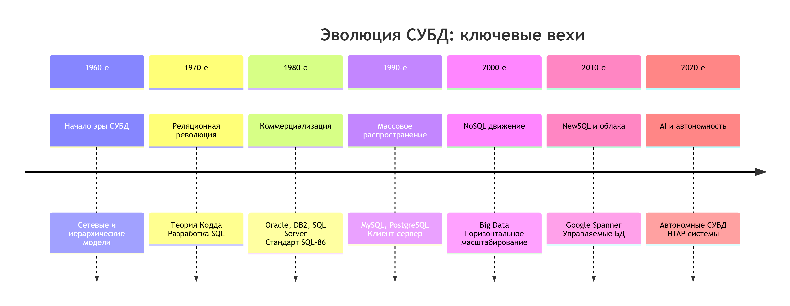
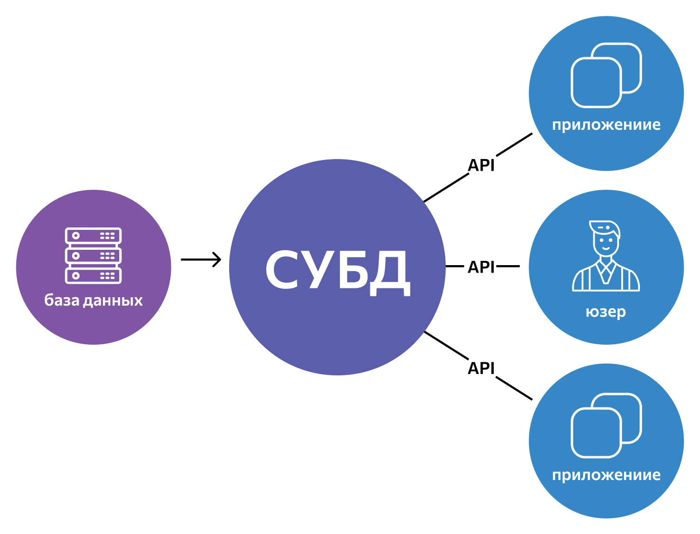

### 🔙 📚 🔜 Навигация по курсу

| [Предыдущее занятие](../LESSONS/LESSON5.MD) | &nbsp; | [Следующее занятие](../LESSONS/LESSON2.MD) |
|:------------------------------------------:|:------:|:----------------------------------------:|
| 🏠 [В начало](../README.MD) | 📖 [Содержание](../README.MD) | 📚 [Лекция 2](../LESSONS/LESSON2.MD) |

---

# Лекция 1: Основные понятия теории баз данных

**Дисциплина:** МДК.07.01. Управление и автоматизация баз данных  
**Целевая аудитория:** Студенты СПО  
**Продолжительность:** 1,5 часа (1 пара)

## Оглавление
1.  [Введение](#введение)
2.  [Данные и информация](#данные-и-информация)
3.  [Что такое база данных?](#что-такое-база-данных)
4.  [Эволюция хранения данных](#эволюция-хранения-данных)
5.  [Система управления базами данных (СУБД)](#система-управления-базами-данных-субд)
6.  [Классификация СУБД](#классификация-субд)
7.  [Объекты реляционной базы данных](#объекты-реляционной-базы-данных)
8.  [Роль администратора базы данных](#роль-администратора-базы-данных)
9.  [Заключение](#заключение)
10. [Вопросы для самопроверки](#вопросы-для-самопроверки)
11. [Домашнее задание](#домашнее-задание)
12. [Тест по лекции 1](https://forms.gle/hZSRqMJPRuxSecgXA)

---

## Введение

В современном мире мы постоянно сталкиваемся с обработкой больших объемов информации: социальные сети, онлайн-банкинг, электронные журналы, интернет-магазины. Во всех этих системах ключевым компонентом является упорядоченное и надежное хранилище информации — **база данных (БД)**. От ее корректной работы зависит функционирование всего сервиса. Данная лекция заложит фундамент для понимания принципов работы и управления базами данных.

## Данные и информация

Важно различать два понятия:
*   **Данные** — это сырые, необработанные факты, числа или символы. Сами по себе они не несут законченного смысла.
    *   *Пример:* `"Иван"`, `"Петров"`, `"1995"`, `"5"`.
*   **Информация** — это данные, обработанные и организованные в понятную для человека форму, несущие смысл и полезность.
    *   *Пример:* `"Студент Иван Петров родился в 1995 году и получил оценку 5 по экзамену."`

**Задача базы данных** — хранить *данные* таким образом, чтобы их можно было легко преобразовать в ценную *информацию*.

## Что такое база данных?

**База данных (БД)** — это организованная совокупность структурированных данных, хранящихся в электронном виде и отражающих состояние некоторой предметной области (например, предприятия, учебного заведения, интернет-магазина).

**Ключевые свойства БД:**
*   **Структурированность:** Данные организованы по определенным правилам и моделям.
*   **Постоянство:** Данные сохраняются между сеансами работы.
*   **Накопление:** Данные можно добавлять, изменять и хранить длительное время.
*   **Совместный доступ:** Многие пользователи и приложения могут работать с данными одновременно.

**Аналогия:** БД — это **цифровая картотека**. Если обычная картотека хранит карточки с книгами или клиентами, то электронная БД хранит «записи» о студентах, товарах, заказах.


# Краткий исторический обзор развития СУБД

## Эволюция систем управления данными

### Доисторическая эра (до 1960-х)
**Бумажные носители и ручная обработка**
- Картотеки и архивные системы
- Бухгалтерские книги и журналы учета
- Ручной поиск и обработка информации
- Высокая избыточность и низкая скорость доступа

### 1960-е: Зарождение концепции БД
**Эра мейнфреймов**
- Появление первых коммерческих компьютеров
- Разработка специализированных систем управления данными
- **NIMS** (1966) - одна из первых СУБД от General Electric
- **IDS** (Integrated Data Store) - сетевая модель данных от Чарльза Бахмана

### 1970-е: Реляционная революция
**Научный прорыв**
- **1970** - Эдгар Кодд публикует работу "A Relational Model of Data for Large Shared Data Banks"
- Формализация реляционной алгебры и теории нормализации
- Разработка языка **SQL** (Structured Query Language)
- Появление первых прототипов реляционных СУБД:
  - **System R** (IBM)
  - **Ingres** (Калифорнийский университет в Беркли)

### 1980-е: Коммерциализация и стандартизация
**Рынок СУБД**
- **1986** - Стандарт SQL-86 (ANSI/ISO)
- Расцвет коммерческих реляционных СУБД:
  - **Oracle** (1979) - лидер рынка
  - **DB2** (1983) - IBM для мейнфреймов
  - **SQL Server** (1989) - Microsoft и Sybase
  - **Informix**, **Sybase**
- Появление персональных СУБД: **dBase**, **Paradox**, **Access**

### 1990-е: Массовое распространение
**Клиент-серверная архитектура**
- Развитие интернет-технологий
- Появление объектно-реляционных СУБД
- Бесплатные СУБД с открытым кодом:
  - **MySQL** (1995)
  - **PostgreSQL** (1996)
- Усовершенствование стандарта SQL (SQL-92, SQL:1999)

### 2000-е: Эра больших данных и NoSQL
**Парадигмальный сдвиг**
- Кризис реляционной модели для web-масштабирования
- Появление NoSQL-систем:
  - **Key-value**: Redis, DynamoDB
  - **Document-oriented**: MongoDB, Couchbase
  - **Column-family**: Cassandra, HBase
  - **Graph**: Neo4j, OrientDB
- Развитие облачных БД: Amazon RDS, Google Cloud SQL

### 2010-е: NewSQL и облачные технологии
**Конвергенция технологий**
- **NewSQL** - сочетание ACID-гарантий и горизонтального масштабирования:
  - **Google Spanner**
  - **CockroachDB**
  - **VoltDB**
- Полностью управляемые облачные СУБД (DBaaS)
- Интеграция с Big Data-экосистемами (Hadoop, Spark)

### 2020-е: AI/ML и автономные БД
**Автоматизация и искусственный интеллект**
- Автономные СУБД с самонастройкой и самолечением
- Встроенная поддержка машинного обучения
- Гибридные транзакционно-аналитические системы (HTAP)
- Edge computing и распределенные БД

## Ключевые технологические вехи



## Влияние на индустрию

**Экономическое impact:**
- Формирование многомиллиардного рынка СУБД
- Создание новых профессий (DBA, data engineer)
- Стандартизация подходов к управлению данными

**Технологическое наследие:**
- Стандарт SQL как lingua franca мира данных
- Принципы ACID и согласованности данных
- Модели распределенных систем

## Современные тренды

1. **Полная автоматизация** управления БД
2. **Конвергенция** SQL и NoSQL подходов
3. **Геораспределенность** и глобальная согласованность
4. **Безопасность** и compliance встроенные функции
5. **Экосистемная интеграция** с платформами данных

История СУБД продолжает писаться, с фокусом на автономности, глобальном масштабировании и глубокой интеграции с искусственным интеллектом.

## Эволюция хранения данных


Почему БД — это лучший способ хранения по сравнению с простыми файлами?

1.  **Файловые системы:**
    Данные хранятся в отдельных файлах (например, в Excel или txt-файлах).
    *   **Проблемы:**
        *   **Избыточность:** Одни и те же данные дублируются в разных файлах.
        *   **Несогласованность:** Обновили данные в одном файле, но забыли в другом.
        *   **Сложность доступа:** Трудно организовать одновременную работу нескольких пользователей без потерь данных.

2.  **Базы данных:**
    Данные хранятся централизованно и управляются специальной программой — **СУБД**, которая решает все перечисленные проблемы файловых систем.

## Система управления базами данных (СУБД)

**СУБД (DBMS — Database Management System)** — это программный комплекс, предназначенный для создания, ведения и совместного использования БД многими пользователями.

**СУБД является посредником** между физической базой данных на сервере и пользователями или приложениями.



**Основные функции СУБД:**

1.  **Управление данными:** Создание, чтение, обновление и удаление данных (операции CRUD).
2.  **Поддержка языка запросов (SQL):** Предоставление высокоуровневого языка для работы с данными.
3.  **Обеспечение целостности данных:** Проверка корректности данных по заданным правилам (например, возраст не может быть отрицательным).
4.  **Управление параллельным доступом:** Обеспечение согласованной работы множества пользователей без конфликтов (чтобы два кассира не продали один и тот же последний билет).
5.  **Восстановление после сбоев:** Самая важная функция! Реализуется через **механизм резервного копирования и восстановления** и **журнализацию транзакций**.
6.  **Разграничение прав доступа:** Настройка безопасности: кто может только смотреть данные, кто может их изменять, а кто — не может получить доступ вообще.

## Классификация СУБД

СУБД можно классифицировать по разным признакам:

**1. По модели данных:**
*   **Реляционные (SQL):** Данные организованы в виде таблиц, связанных между собой. Используют язык SQL для запросов.
    *   *Примеры:* MySQL, PostgreSQL, Microsoft SQL Server, Oracle Database.
    *   *Изучать будем в основном их.*
*   **Нереляционные (NoSQL):** Данные хранятся в виде документов, ключ-значений, графов или колонок. Подходят для специфических задач (Big Data, социальные графы).
    *   *Примеры:* MongoDB, Redis, Cassandra.

**2. По способу доступа:**
*   **Файл-серверные (например, Microsoft Access):** Просты в использовании, но подходят только для малых нагрузок и малых рабочих групп.
*   **Клиент-серверные (например, PostgreSQL, MS SQL Server):** Мощные, производительные системы, где сервер БД обрабатывает запросы от множества клиентов. Именно такие системы администрируют профессионалы.

## Объекты реляционной базы данных

Рассмотрим основные объекты на примере базы данных «Колледж».

| Объект | Описание | Пример из БД "Колледж" |
| :--- | :--- | :--- |
| **Таблица (Table)** | Основной объект для хранения данных. Состоит из строк и столбцов. | Таблица `Студенты`. |
| **Поле (Column/Field)** | Столбец таблицы. Имеет имя и строго определенный тип данных (число, текст, дата). | В таблице `Студенты` есть поля: <br> `ФИО` (текст), <br> `Дата_рождения` (дата), <br> `Стипендия` (число). |
| **Запись (Row/Record)** | Строка таблицы. Содержит данные об одном конкретном объекте. | Одна запись в таблице `Студенты` — это один конкретный студент. |
| **Первичный ключ (Primary Key, PK)** | Поле (или набор полей), однозначно идентифицирующее каждую запись в таблице. **Не может быть `NULL` и должен быть уникальным.** | Поле `ID_Студента` — уникальный номер зачетки. |
| **Внешний ключ (Foreign Key, FK)** | Поле в одной таблице, которое ссылается на первичный ключ в другой таблице. Нужен для связи таблиц и обеспечения целостности данных. | В таблице `Оценки` поле `ID_Студента` ссылается на `ID_Студента` в таблице `Студенты`. Это не даст удалить студента, у которого есть оценки. |
| **Индекс (Index)** | Специальная структура для ускорения поиска данных в таблице. **Аналогия:** Алфавитный указатель в конце книги. | Создание индекса по полю `ФИО` ускорит поиск студента по фамилии. |

**Визуализация связи между таблицами:**

```sql
-- Таблица "Студенты"
+------------+-----------------+---------------+-------------+
| ID_Студента| ФИО             | Дата_рождения | Группа      |  <-- Поля
+------------+-----------------+---------------+-------------+
| 1          | Иванов Иван     | 2000-05-12    | ИСП-401     |  <-- Запись
| 2          | Петрова Мария   | 2001-11-03    | ИСП-401     |  <-- Запись
+------------+-----------------+---------------+-------------+
      ↑
      | Ссылка по PK-FK
      |
-- Таблица "Оценки"
+---------+------------+-----------+-------+
| ID_Оценки| ID_Студента| Дисциплина| Оценка|
+---------+------------+-----------+-------+
| 100     | 1          | Базы данных| 5     |
| 101     | 2          | Базы данных| 4     |
+---------+------------+-----------+-------+
```

## Роль администратора базы данных

**Администратор базы данных (АБД, DBA — Database Administrator)** — это специалист, отвечающий за проектирование, внедрение, обслуживание и бесперебойную работу баз данных.

**Главный принцип DBA:** *«Не важно, КАК вы сделали резервную копию, важно, что вы можете ее ВОССТАНОВИТЬ в нужный момент».*

**Ключевые обязанности администратора БД:**

1.  **Проектирование и создание:** Участие в проектировании структуры новых баз данных.
2.  **Установка и настройка:** Развертывание СУБД и настройка серверов для достижения максимальной производительности и надежности.
3.  **Обеспечение безопасности:** Создание учетных записей пользователей, настройка прав доступа и ролей, шифрование данных.
4.  **Резервное копирование и восстановление:** Разработка и отработка стратегии резервного копирования для гарантии сохранности данных в любых ситуациях (авария, человеческая ошибка).
5.  **Мониторинг и оптимизация:** Постоянное наблюдение за состоянием БД, выявление и устранение «узких мест» для повышения скорости работы.
6.  **Техническая поддержка:** Решение проблем, возникающих у разработчиков и пользователей, работа с инцидентами 24/7.

## Заключение

Мы рассмотрели фундаментальные понятия теории баз данных: чем данные отличаются от информации, что такое БД и СУБД, каковы их основные функции и виды. Вы познакомились с объектами реляционной модели и узнали о ключевой роли администратора БД в современной IT-инфраструктуре. Это основа для дальнейшего погружения в практическое администрирование и автоматизацию.

## Вопросы для самопроверки

1.  Дайте определение базы данных. Перечислите ее ключевые свойства.
2.  В чем заключаются основные недостатки хранения данных в файлах?
3.  Что такое СУБД и каковы ее основные функции?
4.  Объясните разницу между первичным и внешним ключом.
5.  Для чего нужны индексы в таблице? Приведите бытовую аналогию.
6.  Назовите главную, по вашему мнению, обязанность администратора БД и обоснуйте свой выбор.

## Домашнее задание

1.  **Теоретическая часть:**
    Законспектировать основные определения: База данных, СУБД, таблица, поле, запись, первичный ключ (PK), внешний ключ (FK).

2.  **Практическая часть (подготовка к следующему занятию):**
    *   Установить на свой компьютер Microsoft SQL Server Express Edition (бесплатная версия).
    *   Установить среду управления SQL Server Management Studio (SSMS).
    *   *Инструкция по установке находится в файле [SETUP_GUIDE.md](SETUP_GUIDE.md) в этом репозитории.*

---
**Лицензия:** [CC BY-NC-SA 4.0](https://creativecommons.org/licenses/by-nc-sa/4.0/)  
**Автор:** Руслан Ринатович Сафиулин  
**Дата:** 08.09.2025

---
---

### 🔙 📚 🔜 Навигация по курсу

| [Предыдущее занятие](../LESSONS/LESSON5.MD) | &nbsp; | [Следующее занятие](../LESSONS/LESSON6.MD) |
|:------------------------------------------:|:------:|:----------------------------------------:|
| 🏠 [В начало](../README.MD) | 📖 [Содержание](../README.MD) | 📚 [Лекция 2](../LESSONS/LESSON2.MD) |

---
