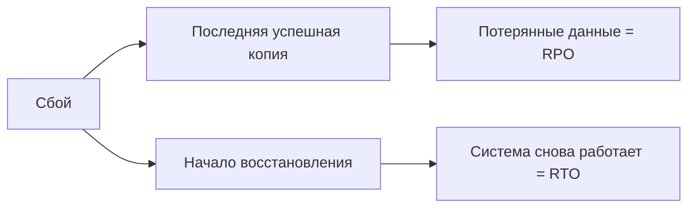

# 🔙 📚 🔜 Навигация по курсу

| [Предыдущее занятие](../LESSONS/PR15.MD) | &nbsp; | [Следующее занятие](../LESSONS/PR16.MD) |
|:--------------------------------------:|:------:|:-------------------------------------:|
| 🏠 [Практика №15](../LESSONS/PR15.MD) | 📖 [Содержание](../README.MD) | 💻 [Практика №15](../LESSONS/PR16.MD) |

# 🎓 Лекция 16. Стратегии резервного копирования: ежедневно, ежечасно

⏱️ **Продолжительность:** 90 минут  
🎯 **Цель лекции:**  
Научить студентов проектировать стратегии резервного копирования, исходя из требований бизнеса к потере данных (RPO) и времени восстановления (RTO). Рассмотреть типовые схемы: ежедневные полные копии, ежечасные разностные, частые бэкапы журнала. Оценить компромиссы между надёжностью, стоимостью хранения и нагрузкой на сервер.

---

## 📖 Справочник терминов (официальные названия из русской SSMS)

| Русский термин | Английский эквивалент | Что это? |
|----------------|------------------------|----------|
| Стратегия резервного копирования | Backup strategy | План, определяющий типы, частоту и хранение резервных копий. |
| Целевая точка восстановления | Recovery Point Objective (RPO) | Максимально допустимый объём потери данных (время). |
| Целевое время восстановления | Recovery Time Objective (RTO) | Максимально допустимое время восстановления после сбоя. |
| Расписание резервного копирования | Backup schedule | Настроенные задания SQL Agent для автоматического создания копий. |
| Окно резервного копирования | Backup window | Время, когда разрешено выполнять ресурсоёмкие операции бэкапа. |
| Цепочка резервных копий | Backup chain | Последовательность: полная + разностные + журналы, необходимая для восстановления. |
| Политика хранения | Retention policy | Правила, определяющие, как долго хранить копии и когда их удалять. |
| Ленточное хранилище | Tape backup | Устаревший, но всё ещё используемый носитель для долгосрочного архива. |
| Облачное резервное копирование | Cloud backup | Хранение копий в Azure Blob Storage, AWS S3 и т.п. |

---

## 1. 🎯 Зачем нужна стратегия?

Без стратегии администратор действует хаотично: то делает копии каждый час, то забывает на неделю. Это приводит к:
- Ненужной нагрузке на сервер;
- Перерасходу дискового пространства;
- Невозможности восстановить данные при реальной аварии.

**Стратегия** – это баланс между **защитой данных** и **ресурсами** (диск, время, деньги).

---

## 2. 📊 Ключевые метрики: RPO и RTO



- **RPO** – сколько данных мы готовы потерять (в минутах/часах).  
  *Пример:* RPO = 15 минут → бэкапы лога каждые 15 минут.
- **RTO** – сколько времени мы готовы ждать восстановления.  
  *Пример:* RTO = 2 часа → нужна быстрая стратегия (полная + разностная, возможно, на быстром хранилище).

---

## 3. 🧩 Элементы стратегии

### 3.1. Типы копий (повторение)
- **Полная** – фундамент, делается редко (например, раз в сутки).
- **Разностная** – ускоряет восстановление, делается между полными (например, каждый час).
- **Журнал транзакций** – обеспечивает PITR, делается часто (5–30 минут).

### 3.2. Расписание (Schedule)
Определяется окном резервного копирования и допустимой нагрузкой.

### 3.3. Хранение (Retention)
- Краткосрочное (неделя) – для быстрого восстановления.
- Долгосрочное (месяц, год) – для аудита и законодательных требований (архив).

### 3.4. Место хранения
- Локальные диски (быстро, но риск при пожаре/краже).
- Сетевые папки (централизованно, но медленнее).
- Облако (географическая отказоустойчивость, но плата за трафик).

---

## 4. 📅 Типовые стратегии

### 🔹 Стратегия 1: Для небольших баз с низкими требованиями (RPO = 24 ч, RTO = 3 ч)
- **Полная копия** – каждую ночь в 02:00.
- **Разностные** – не используются.
- **Журнал** – не требуется (модель SIMPLE).
- Хранение – 7 дней на локальном диске.

### 🔹 Стратегия 2: Для OLTP‑систем среднего размера (RPO = 1 ч, RTO = 2 ч)
- **Полная копия** – каждую ночь в 01:00.
- **Разностная копия** – каждый час с 08:00 до 20:00.
- **Журнал транзакций** – каждые 30 минут.
- Хранение: полные – 2 недели, разностные – 3 дня, журналы – 2 дня.

### 🔹 Стратегия 3: Для высоконагруженных критичных систем (RPO = 5 мин, RTO = 30 мин)
- **Полная копия** – раз в сутки (ночь).
- **Разностная копия** – каждые 30 минут в рабочее время.
- **Журнал транзакций** – каждые 5 минут.
- Хранение: полные – 1 месяц на быстром диске, затем выгрузка в облако; журналы – 3 дня.

---

## 5. 🧮 Расчёт необходимого места

Допустим, база данных 100 ГБ, ежедневные изменения – 20%.

**Вариант А (только полные копии):**
- 1 полная в сутки × 100 ГБ × 30 дней = 3 ТБ в месяц.

**Вариант Б (полная + разностные + журналы):**
- Полные: 100 ГБ × 4 (раз в неделю) = 400 ГБ.
- Разностные: 20% × 100 ГБ × 6 (в день) × 7 дней = 84 ГБ.
- Журналы: 5 ГБ × 24 × 7 = 840 ГБ.
- Итого ≈ 1,3 ТБ в неделю, что значительно экономнее.

---

## 6. 🛠️ Реализация стратегии с помощью SQL Server Agent

Для автоматизации используются задания (Jobs) в SQL Server Agent.

**Пример расписания:**

| Время | Действие | Тип |
|-------|----------|-----|
| 01:00 каждый день | BACKUP DATABASE ... | Полная |
| 09:00, 10:00, ..., 18:00 | BACKUP DATABASE ... WITH DIFFERENTIAL | Разностная |
| Каждые 15 минут с 08:00 до 20:00 | BACKUP LOG ... | Журнал |
| Каждую субботу в 03:00 | Удаление старых файлов (скрипт) | Очистка |

---

## 7. 🧪 Пример комплексного скрипта для настройки стратегии

```sql
-- Создадим задание для полной копии (через sp_add_job, sp_add_jobstep, sp_add_schedule)
-- Но для понимания достаточно увидеть сами команды бэкапа:

-- Полная копия (ежедневно)
BACKUP DATABASE MyDB TO DISK = 'D:\Backup\MyDB_full_$(GETDATE()-format yyyyMMdd).bak'
WITH COMPRESSION, CHECKSUM;

-- Разностная копия (каждый час)
BACKUP DATABASE MyDB TO DISK = 'D:\Backup\MyDB_diff_$(GETDATE()-format yyyyMMdd_HHmm).bak'
WITH DIFFERENTIAL, COMPRESSION, CHECKSUM;

-- Журнал (каждые 15 минут)
BACKUP LOG MyDB TO DISK = 'D:\Backup\MyDB_log_$(GETDATE()-format yyyyMMdd_HHmm).trn'
WITH COMPRESSION, CHECKSUM;
```

В реальности динамические имена формируются через системные переменные или PowerShell.

---

## 8. ⚠️ Подводные камни

- **Разрастание журнала** – если в FULL забыли делать LOG backup.
- **Пересечение бэкапов** – например, полная копия выполняется дольше, чем интервал между разностными.
- **Недостаток места** – если не контролировать политику хранения.
- **Отсутствие проверок** – бэкап может быть битым, а узнают об этом только при восстановлении.

---

## 9. ✅ Резюме

- Стратегия определяется **RPO** и **RTO**.
- Комбинация полных, разностных и журналов позволяет найти баланс.
- **SQL Server Agent** – основной инструмент автоматизации.
- **Политика хранения** обязательна, иначе диски закончатся.

🔑 **Золотое правило:**  
> *«Планируй бэкапы так, чтобы они не мешали пользователям, но всегда могли спасти данные. И проверяй их регулярно!»*

---

## 10. ❓ Вопросы для самопроверки

1. Что такое RPO и RTO? Приведите примеры.
2. Почему для баз с RPO = 1 час недостаточно делать только полные копии раз в сутки?
3. Как часто нужно делать разностные копии, если RTO = 1 час, а размер полной копии – 500 ГБ?
4. В чём преимущество хранения бэкапов на отдельном сетевом ресурсе?
5. Какой тип копий позволяет восстановить данные на момент 10:23?
6. Какие риски возникают при слишком долгом хранении всех бэкапов?
7. Какой системный компонент SQL Server отвечает за автоматизацию бэкапов по расписанию?
8. Предложите стратегию для тестовой базы, где допустима потеря данных за последние сутки, а восстанавливать можно в течение 4 часов.
9. Что произойдёт, если во время выполнения полной копии начнётся разностная?
10. Как проверить, что стратегия работает, не дожидаясь реального сбоя?

---

## 📎 Приложение: команды для работы с SQL Server Agent

```sql
-- Просмотр заданий
SELECT * FROM msdb.dbo.sysjobs;

-- Запуск задания
EXEC msdb.dbo.sp_start_job @job_name = 'Ночной бэкап';

-- История выполнения
SELECT * FROM msdb.dbo.sysjobhistory;
```

---

📜 **Лицензия:** CC BY-NC-SA 4.0  
👨‍🏫 **Автор:** Руслан Ринатович Сафиулин  
📅 **Дата:** 24.02.2026

### 🔙 📚 🔜 Навигация по курсу

# 🔙 📚 🔜 Навигация по курсу

| [Предыдущее занятие](../LESSONS/PR15.MD) | &nbsp; | [Следующее занятие](../LESSONS/PR16.MD) |
|:--------------------------------------:|:------:|:-------------------------------------:|
| 🏠 [Практика №15](../LESSONS/PR15.MD) | 📖 [Содержание](../README.MD) | 💻 [Практика №15](../LESSONS/PR16.MD) |

