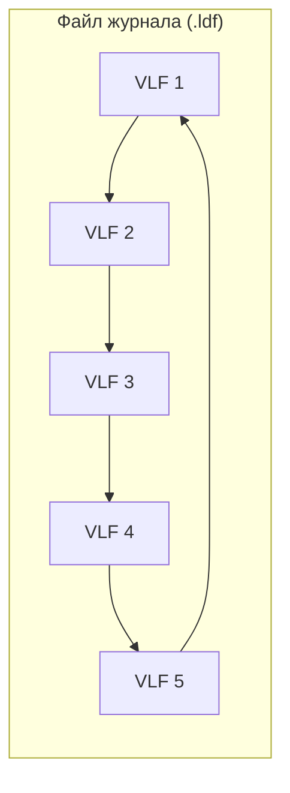
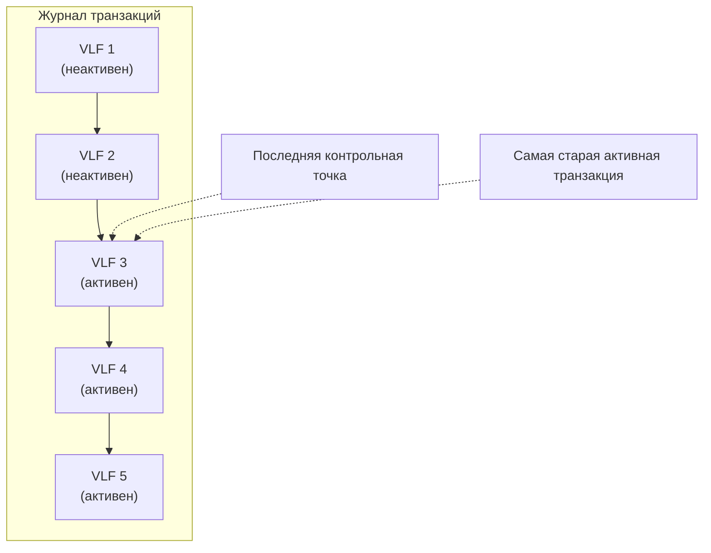
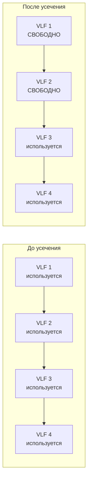
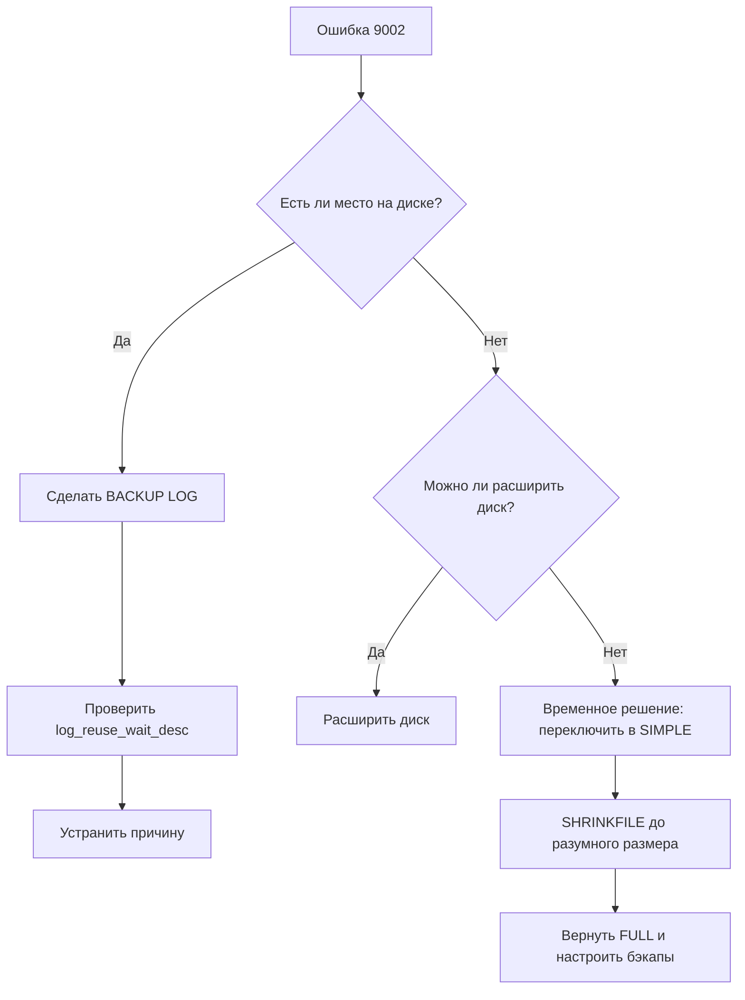

# 🔙 📚 🔜 Навигация по курсу

| [Предыдущее занятие](../LESSONS/PR16.MD) | &nbsp; | [Следующее занятие](../LESSONS/PR17.MD) |
|:--------------------------------------:|:------:|:-------------------------------------:|
| 🏠 [Практика №16](../LESSONS/PR16.MD) | 📖 [Содержание](../README.MD) | 💻 [Практика №17](../LESSONS/PR17.MD) |

# 🎓 Лекция 17. Журнал транзакций: управление размером и усечение

⏱️ **Продолжительность:** 90 минут  
🎯 **Цель лекции:**  
Сформировать у студентов глубокое понимание физической структуры журнала транзакций, механизмов его роста и усечения, а также методов диагностики и решения проблем, связанных с неконтролируемым ростом. Научить студентов эффективно управлять размером журнала, предотвращать ошибки 9002 и обеспечивать бесперебойную работу баз данных.

---
## 📖 Справочник терминов (официальные названия из русской SSMS)

| Русский термин | Английский эквивалент | Что это? | Пример |
|----------------|------------------------|----------|--------|
| Журнал транзакций | Transaction log | Физический файл `.ldf`, содержащий записи обо всех изменениях в базе данных | `AdventureWorks_log.ldf` |
| Виртуальный файл журнала | Virtual Log File (VLF) | Сектор внутри файла журнала, минимальная единица управления | Журнал разбит на VLF |
| Активная часть журнала | Active log | Часть журнала, содержащая незавершённые транзакции | Не может быть усечена |
| Неактивная часть журнала | Inactive log | Часть журнала с завершёнными транзакциями, доступна для переиспользования | Усекается после CHECKPOINT или BACKUP LOG |
| Усечение журнала | Log truncation | Освобождение места в журнале (помечается как свободное) | Происходит автоматически в SIMPLE, по команде в FULL |
| Контрольная точка | CHECKPOINT | Запись грязных страниц на диск, в SIMPLE запускает усечение | `CHECKPOINT;` |
| Номер последовательности в журнале | Log Sequence Number (LSN) | Уникальный номер каждой записи в журнале | Используется для восстановления |
| Повторное использование | Log reuse | Перезапись неактивной части журнала новыми транзакциями | Журнал работает циклически |
| Авторасширение | Autogrowth | Автоматическое увеличение файла журнала при нехватке места | `ALTER DATABASE ... MODIFY FILE` |
| Ошибка 9002 | Error 9002 | "The transaction log for database is full" | Журнал заполнен, требуется ручное вмешательство |
| DBCC SHRINKFILE | DBCC SHRINKFILE | Команда для физического уменьшения файла журнала | `DBCC SHRINKFILE (N'log_file_name', target_size)` |

---

## 1. 🧱 Анатомия журнала транзакций

### 1.1. Физическая структура

Журнал транзакций — это не просто файл, а **кольцевой буфер**. Представьте себе плёнку для видеорегистратора, которая зациклена:



Когда место в конце файла заканчивается, запись продолжается с начала, **если** первые VLF уже неактивны и помечены для повторного использования.

### 1.2. Виртуальные файлы журнала (VLF)

SQL Server разбивает физический файл журнала на **виртуальные файлы журнала (VLF)**. Это делается для более эффективного управления.

**Как создаются VLF:**
- При создании базы данных
- При расширении файла журнала (авторасширение или ручное)

**Количество VLF зависит от начального размера и шага расширения:**

| Размер файла | Количество VLF |
|--------------|----------------|
| До 64 МБ | 4 |
| 64 МБ – 1 ГБ | 8 |
| Больше 1 ГБ | 16 |
| При расширении | 4 новых VLF |

⚠️ **Проблема:** Слишком частое авторасширение маленькими шагами создаёт тысячи мелких VLF, что замедляет:
- Восстановление базы
- Резервное копирование журнала
- Операции усечения

### 1.3. Активная и неактивная части



- **Активная часть** — VLF, содержащие незавершённые транзакции. Они **никогда** не могут быть перезаписаны.
- **Неактивная часть** — транзакции завершены, изменения записаны на диск. Эти VLF могут быть помечены как свободные.

---

## 2. 🔄 Механизм усечения журнала

### 2.1. Что такое усечение?

Усечение (truncation) — это **логическое** освобождение места в журнале. Физический файл `.ldf` **не уменьшается**! Просто VLF помечаются как доступные для повторного использования.



### 2.2. Когда происходит усечение?

**В модели SIMPLE:**
- При каждой контрольной точке (`CHECKPOINT`)
- Автоматически, без участия администратора

**В модели FULL:**
- **Только** после выполнения `BACKUP LOG`
- Никакие контрольные точки не усекают журнал!

**В модели BULK_LOGGED:**
- Аналогично FULL, усечение только после `BACKUP LOG`

### 2.3. Что предотвращает усечение?

1. **Активные транзакции** — самая частая причина. Если есть незавершённая транзакция (например, забытый `BEGIN TRAN`), журнал не усекается.
2. **Репликация** — если база участвует в репликации, журнал нужен для чтения изменений.
3. **Операции с минимальным логированием** — в BULK_LOGGED массовые операции блокируют усечение.
4. **Always On Availability Groups** — требуется синхронизация с репликами.
5. **Задача чтения журнала** — например, CDC (Change Data Capture) или логическая репликация.

---

## 3. 📈 Почему журнал растёт?

### 3.1. Основные причины

| Причина | Объяснение | Решение |
|---------|------------|---------|
| **Нет бэкапов журнала в FULL** | Журнал никогда не усекается | Настроить регулярные `BACKUP LOG` |
| **Длинные транзакции** | Активная часть не может быть усечена | Оптимизировать транзакции, коммитить чаще |
| **Слишком частое малое авторасширение** | Создаются тысячи VLF, фрагментация | Увеличить шаг авторасширения, перестроить журнал |
| **Индексация или массовые операции** | Генерируют много записей в журнале | Использовать BULK_LOGGED временно |
| **Репликация / CDC** | Журнал нужен подписчикам | Настроить своевременную очистку |

### 3.2. Диагностика роста

```sql
-- Проверка размера и заполнения
DBCC SQLPERF(LOGSPACE);

-- Результат:
-- Database Name, Log Size (MB), Log Space Used (%), Status
```

```sql
-- Детальный анализ VLF
DBCC LOGINFO('Имя_БД');
```
Поле `Status`:
- 0 — VLF свободен (не используется)
- 2 — VLF активен (используется)

### 3.3. Пример расчёта скорости роста

Если журнал растёт на 1 ГБ в час, а бэкапы лога делаются раз в сутки, то через сутки размер журнала будет 24 ГБ. Если диск всего 50 ГБ, через двое суток база упадёт с ошибкой 9002.

**Формула:**
```
Время_до_заполнения = (Свободное_место - Текущий_размер_журнала) / Скорость_роста_в_час
```

---

## 4. 🛠️ Управление размером журнала

### 4.1. Регулярные бэкапы журнала (самое важное!)

```sql
-- В FULL модели это ОБЯЗАТЕЛЬНО!
BACKUP LOG [Имя_БД] 
TO DISK = N'D:\Backup\Имя_БД_Log_' + FORMAT(GETDATE(), 'yyyyMMdd_HHmm') + '.trn'
WITH COMPRESSION, CHECKSUM;
```

**Рекомендации по частоте:**
- Критичные системы: каждые 5-15 минут
- Обычные OLTP: каждые 30-60 минут
- Хранилища данных: каждые 2-4 часа

### 4.2. Мониторинг свободного места

```sql
-- Проверка свободного места на диске с журналом
DECLARE @logDrive CHAR(1);
SELECT @logDrive = LEFT(physical_name, 1)
FROM sys.database_files
WHERE type_desc = 'LOG';

EXEC xp_fixeddrives; -- показывает свободное место на всех дисках
```

### 4.3. Принудительное усечение (если бэкап лога невозможен)

Иногда журнал вырос так, что диск заполнен, и `BACKUP LOG` не может создать файл. Тогда приходится переключаться в SIMPLE:

```sql
-- ВАЖНО: Вы теряете возможность PITR с этого момента!
ALTER DATABASE Имя_БД SET RECOVERY SIMPLE;
CHECKPOINT; -- принудительное усечение
ALTER DATABASE Имя_БД SET RECOVERY FULL; -- вернуть обратно
-- Немедленно сделать полный бэкап!
```

### 4.4. Физическое уменьшение файла (SHRINKFILE)

`SHRINKFILE` — **крайняя мера**, так как:
- Вызывает фрагментацию VLF
- Замедляет последующие авторасширения
- Временно блокирует операции

```sql
-- Сначала усекаем журнал (бэкап или переключение в SIMPLE)
-- Затем уменьшаем файл
DBCC SHRINKFILE (N'Имя_лог_файла', target_size_MB);
```

**Пример:**
```sql
-- Узнать логическое имя файла журнала
SELECT name FROM sys.database_files WHERE type_desc = 'LOG';

-- Уменьшить до 1 ГБ (1024 МБ)
DBCC SHRINKFILE (N'AdventureWorks_log', 1024);
```

**Правильный подход:**
1. Сделать `BACKUP LOG`
2. Выполнить `SHRINKFILE` до разумного минимума
3. Сразу настроить авторасширение с адекватным шагом
4. Вернуться к регулярным бэкапам журнала

### 4.5. Настройка авторасширения

```sql
-- Просмотр текущих настроек
SELECT 
    name,
    type_desc,
    size * 8 / 1024 AS CurrentSizeMB,
    growth,
    is_percent_growth,
    max_size
FROM sys.database_files;

-- Изменение настроек
ALTER DATABASE [Имя_БД] 
MODIFY FILE 
(NAME = 'Имя_лог_файла', 
 FILEGROWTH = 512MB,      -- фиксированный размер
 MAXSIZE = 50GB);          -- ограничение
```

**Рекомендации:**
- Используйте **фиксированный шаг** (512 МБ или 1 ГБ), а не проценты
- Проценты при маленьком размере дают мелкие VLF
- Проценты при большом размере дают гигантские скачки

---

## 5. 🧪 Диагностика проблем с журналом

### 5.1. Поиск длинных транзакций

```sql
-- Активные транзакции
SELECT 
    transaction_id,
    database_id,
    transaction_begin_time,
    transaction_type,
    transaction_state
FROM sys.dm_tran_active_transactions;

-- Сессии с открытыми транзакциями
SELECT 
    session_id,
    transaction_id,
    open_transaction_count
FROM sys.dm_tran_session_transactions
WHERE open_transaction_count > 0;

-- Запросы, выполняющиеся дольше 30 минут
SELECT 
    r.session_id,
    r.start_time,
    DATEDIFF(minute, r.start_time, GETDATE()) AS minutes_running,
    t.text
FROM sys.dm_exec_requests r
CROSS APPLY sys.dm_exec_sql_text(r.sql_handle) t
WHERE r.start_time < DATEADD(minute, -30, GETDATE());
```

### 5.2. Почему журнал не усекается?

```sql
-- Причины, препятствующие усечению
SELECT 
    name,
    log_reuse_wait_desc
FROM sys.databases
WHERE name = DB_NAME();
```

**Возможные значения `log_reuse_wait_desc`:**
- `NOTHING` — всё хорошо, можно усекать
- `LOG_BACKUP` — ждёт бэкапа журнала (в FULL)
- `ACTIVE_TRANSACTION` — активная транзакция
- `REPLICATION` — ждёт репликацию
- `AVAILABILITY_REPLICA` — ждёт Always On
- `CHECKPOINT` — ждёт контрольную точку
- `ACTIVE_BACKUP_OR_RESTORE` — идёт бэкап/восстановление

### 5.3. Анализ VLF

```sql
-- Создаём временную таблицу для анализа
CREATE TABLE #VLFInfo (
    FileID INT,
    FileSize BIGINT,
    StartOffset BIGINT,
    FSeqNo BIGINT,
    Status INT,
    Parity INT,
    CreateLSN NUMERIC(38)
);

INSERT INTO #VLFInfo
EXEC ('DBCC LOGINFO');

SELECT 
    COUNT(*) AS TotalVLF,
    SUM(CASE WHEN Status = 2 THEN 1 ELSE 0 END) AS ActiveVLF,
    SUM(CASE WHEN Status = 0 THEN 1 ELSE 0 END) AS FreeVLF
FROM #VLFInfo;

DROP TABLE #VLFInfo;
```

**Норма:** менее 50-100 VLF. Если тысячи — проблема.

---

## 6. 🚨 Аварийные ситуации и их решение

### 6.1. Ошибка 9002: "The transaction log for database is full"

**Симптомы:**
- База доступна только для чтения
- В логе ошибок SQL Server сообщение 9002
- Приложения не могут вставлять/обновлять данные

**План действий:**



**Подробный скрипт для аварийного восстановления:**

```sql
-- Шаг 1: Проверяем причину
SELECT name, log_reuse_wait_desc FROM sys.databases WHERE name = 'ProblemDB';

-- Шаг 2: Если причина LOG_BACKUP, делаем бэкап
BACKUP LOG ProblemDB TO DISK = 'D:\Backup\ProblemDB_emergency.trn';

-- Шаг 3: Если причина ACTIVE_TRANSACTION, находим и убиваем сессию
SELECT session_id FROM sys.dm_tran_session_transactions WHERE database_id = DB_ID('ProblemDB');
KILL <session_id>;

-- Шаг 4: Если диск заполнен и бэкап невозможен
ALTER DATABASE ProblemDB SET RECOVERY SIMPLE;
CHECKPOINT;
DBCC SHRINKFILE (N'ProblemDB_log', 1000); -- уменьшить до 1 ГБ
ALTER DATABASE ProblemDB SET RECOVERY FULL;
BACKUP DATABASE ProblemDB TO DISK = 'D:\Backup\ProblemDB_full_after_crash.bak';
```

### 6.2. Слишком много VLF

**Решение:**
1. Сделать полный бэкап
2. Переключить в SIMPLE (если можно)
3. Выполнить `SHRINKFILE` до минимального размера
4. Увеличить файл сразу до нужного размера **одним шагом** (CREATE)
5. Вернуть модель FULL
6. Настроить авторасширение с большим шагом

```sql
-- Сброс VLF (требует недоступности базы)
ALTER DATABASE ProblemDB SET OFFLINE;
-- Удалить файл журнала (!!!) и создать заново - сложно, лучше другой способ

-- Правильный способ:
-- 1. Переключить в SIMPLE
ALTER DATABASE ProblemDB SET RECOVERY SIMPLE;
-- 2. Сжать до минимума
DBCC SHRINKFILE (N'ProblemDB_log', 1);
-- 3. Расширить сразу до нужного размера
ALTER DATABASE ProblemDB 
MODIFY FILE (NAME = 'ProblemDB_log', SIZE = 10GB);
-- 4. Вернуть FULL
ALTER DATABASE ProblemDB SET RECOVERY FULL;
-- 5. Сделать полный бэкап
```

---

## 7. 📊 Мониторинг и проактивное управление

### 7.1. Ежедневный отчёт о состоянии журналов

```sql
SELECT 
    d.name AS DatabaseName,
    mf.physical_name,
    mf.size * 8 / 1024 AS SizeMB,
    ls.log_space_used_percent AS UsedPercent,
    d.log_reuse_wait_desc AS ReuseWait,
    d.recovery_model_desc AS RecoveryModel
FROM sys.databases d
JOIN sys.master_files mf ON d.database_id = mf.database_id AND mf.type_desc = 'LOG'
CROSS APPLY (SELECT DBCC SQLPERF(LOGSPACE) ... ) -- сложно, проще использовать курсор
ORDER BY ls.log_space_used_percent DESC;
```

Упрощённый вариант:
```sql
-- Создать временную таблицу для DBCC SQLPERF
CREATE TABLE #LogSpace (
    DatabaseName NVARCHAR(128),
    LogSizeMB DECIMAL(18,5),
    LogSpaceUsedPercent DECIMAL(18,5),
    Status INT
);

INSERT INTO #LogSpace
EXEC ('DBCC SQLPERF(LOGSPACE)');

SELECT * FROM #LogSpace WHERE LogSpaceUsedPercent > 80;
DROP TABLE #LogSpace;
```

### 7.2. Автоматизация оповещений

**Создание задания SQL Agent для проверки:**

```sql
-- Проверка и отправка email, если журнал заполнен более чем на 80%
DECLARE @UsedPercent DECIMAL(18,5);

SELECT @UsedPercent = LogSpaceUsedPercent
FROM #LogSpace
WHERE DatabaseName = 'AdventureWorks';

IF @UsedPercent > 80
BEGIN
    EXEC msdb.dbo.sp_send_dbmail
        @profile_name = 'DBA Profile',
        @recipients = 'dba@company.com',
        @subject = 'WARNING: Transaction log usage high',
        @body = 'AdventureWorks log is ' + CAST(@UsedPercent AS VARCHAR) + '% full';
END
```

### 7.3. Best practices для управления журналом

| Практика | Почему это важно |
|----------|------------------|
| **Регулярные бэкапы лога** | Единственный способ усечения в FULL |
| **Мониторинг log_reuse_wait** | Увидеть проблему до того, как диск заполнится |
| **Адекватный шаг авторасширения** | Предотвращает фрагментацию VLF |
| **Размещение на быстром диске** | Ускоряет транзакции |
| **Отдельный диск для журнала** | Уменьшает конкуренцию за I/O |
| **Регулярный анализ VLF** | Выявить фрагментацию |
| **Тестовое восстановление** | Убедиться, что бэкапы работают |
| **Документирование настроек** | Знать, что где и как настроено |

---

## 8. ✅ Резюме

- Журнал транзакций — кольцевой буфер, разбитый на VLF
- Усечение — логическое освобождение места, не уменьшает файл
- В SIMPLE усечение происходит автоматически при CHECKPOINT
- В FULL усечение только после BACKUP LOG
- Основные причины роста: нет бэкапов лога, длинные транзакции, репликация
- SHRINKFILE — крайняя мера, вызывает фрагментацию
- Мониторинг log_reuse_wait_desc помогает диагностировать проблемы

🔑 **Золотое правило:**  
> *«Журнал транзакций — как канализация: если её не чистить (не делать бэкапы лога), она переполняется и всё останавливается. Следите за ней регулярно!»*

---

## 9. ❓ Вопросы для самопроверки

1. Что такое VLF и почему их не должно быть слишком много?
2. Чем отличается усечение журнала от физического уменьшения файла?
3. Почему в модели FULL журнал растёт, даже если делать CHECKPOINT?
4. Какие операции предотвращают усечение журнала?
5. Как узнать, почему журнал не усекается для конкретной базы?
6. Что такое ошибка 9002 и как её предотвратить?
7. Как правильно уменьшить файл журнала без вреда для производительности?
8. Почему не рекомендуется использовать процентное авторасширение для журнала?
9. Как найти сессию, которая держит транзакцию и блокирует усечение?
10. Что произойдёт с журналом, если в FULL модели диск заполнится на 100%?
11. Как настроить оповещение при заполнении журнала более чем на 80%?
12. В чём разница между активной и неактивной частью журнала?
13. Как влияет репликация на усечение журнала?
14. Почему после SHRINKFILE журнал может снова быстро вырасти?
15. Как проверить фрагментацию VLF и исправить её?

---

## 📎 Приложение: Полезные скрипты

### Полный мониторинг журнала

```sql
-- Комплексный анализ журнала для всех баз
DECLARE @dbName NVARCHAR(128);
DECLARE db_cursor CURSOR FOR
    SELECT name FROM sys.databases 
    WHERE database_id > 4 AND state_desc = 'ONLINE';

CREATE TABLE #Results (
    DatabaseName NVARCHAR(128),
    LogSizeMB DECIMAL(18,2),
    LogUsedPercent DECIMAL(18,2),
    ReuseWait NVARCHAR(60),
    RecoveryModel NVARCHAR(60),
    VLFCount INT
);

OPEN db_cursor;
FETCH NEXT FROM db_cursor INTO @dbName;

WHILE @@FETCH_STATUS = 0
BEGIN
    INSERT INTO #Results (DatabaseName, LogSizeMB, LogUsedPercent, ReuseWait, RecoveryModel)
    EXEC ('
        SELECT 
            DB_NAME(),
            size * 8 / 1024.0,
            (SELECT CAST(lsu.LogSpaceUsedPercent AS DECIMAL(18,2))
             FROM sys.databases d
             CROSS APPLY sys.dm_db_log_space_usage lsu
             WHERE d.name = DB_NAME()),
            log_reuse_wait_desc,
            recovery_model_desc
        FROM sys.database_files
        WHERE type_desc = ''LOG''
    ');
    
    -- Подсчёт VLF (упрощённо)
    UPDATE #Results 
    SET VLFCount = (
        SELECT COUNT(*) 
        FROM sys.dm_db_log_info(DB_ID(@dbName))
    )
    WHERE DatabaseName = @dbName;
    
    FETCH NEXT FROM db_cursor INTO @dbName;
END

CLOSE db_cursor;
DEALLOCATE db_cursor;

SELECT * FROM #Results ORDER BY LogUsedPercent DESC;
DROP TABLE #Results;
```

### Быстрая диагностика проблемной базы

```sql
-- Вставьте сюда имя проблемной базы
DECLARE @DB sysname = 'AdventureWorks';

SELECT 
    'Размер журнала (МБ)' AS Metric,
    CAST(size * 8 / 1024.0 AS VARCHAR) AS Value
FROM sys.master_files
WHERE database_id = DB_ID(@DB) AND type_desc = 'LOG'
UNION ALL
SELECT 
    'Занято места (%)',
    CAST(lsu.log_space_used_percent AS VARCHAR)
FROM sys.dm_db_log_space_usage lsu
CROSS JOIN sys.databases d
WHERE d.name = @DB
UNION ALL
SELECT 
    'Причина ожидания усечения',
    log_reuse_wait_desc
FROM sys.databases
WHERE name = @DB
UNION ALL
SELECT 
    'Количество VLF',
    CAST(COUNT(*) AS VARCHAR)
FROM sys.dm_db_log_info(DB_ID(@DB))
UNION ALL
SELECT 
    'Активных VLF',
    CAST(SUM(CASE WHEN vlf_active = 1 THEN 1 ELSE 0 END) AS VARCHAR)
FROM sys.dm_db_log_info(DB_ID(@DB));
```

---

📜 **Лицензия:** CC BY-NC-SA 4.0  
👨‍🏫 **Автор:** Руслан Ринатович Сафиулин  
📅 **Дата:** 26.02.2026

# 🔙 📚 🔜 Навигация по курсу

| [Предыдущее занятие](../LESSONS/PR16.MD) | &nbsp; | [Следующее занятие](../LESSONS/PR17.MD) |
|:--------------------------------------:|:------:|:-------------------------------------:|
| 🏠 [Практика №16](../LESSONS/PR16.MD) | 📖 [Содержание](../README.MD) | 💻 [Практика №17](../LESSONS/PR17.MD) |

