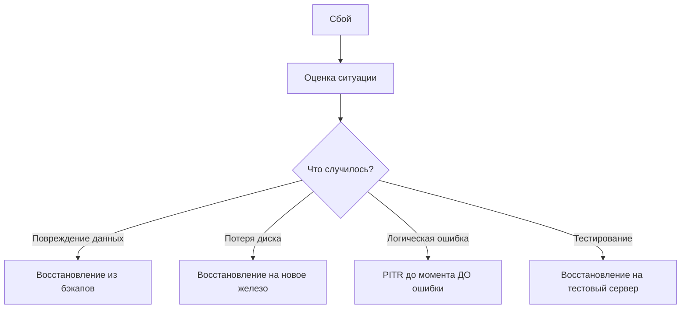
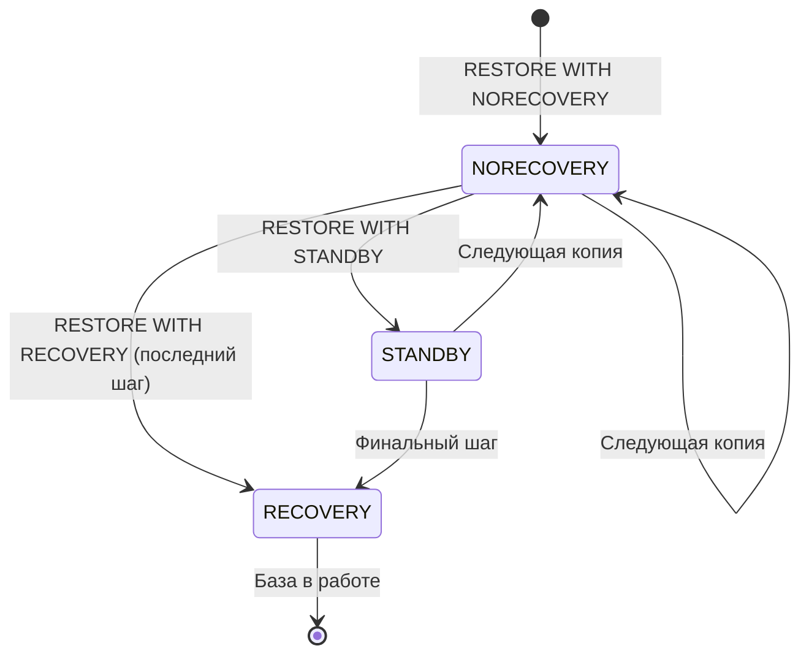

# 🔙 📚 🔜 Навигация по курсу

| [Предыдущее занятие](../LESSONS/PR17.MD) | &nbsp; | [Следующее занятие](../LESSONS/PR18.MD) |
|:--------------------------------------:|:------:|:-------------------------------------:|
| 🏠 [Практика №17](../LESSONS/PR17.MD) | 📖 [Содержание](../README.MD) | 💻 [Практика №18](../LESSONS/PR18.MD) |

---

# 🎓 Лекция 18. Восстановление: полное, по времени, до точки отказа

⏱️ **Продолжительность:** 90 минут  
🎯 **Цель лекции:**  
Сформировать у студентов системное понимание процессов восстановления баз данных в SQL Server. Научить различать сценарии восстановления (полное, по времени, до точки отказа), осознанно выбирать стратегию восстановления в зависимости от ситуации и применять соответствующие команды T-SQL. Разобрать типовые ошибки и отработать навыки диагностики проблем при восстановлении.

## 📖 Справочник терминов (официальные названия из русской SSMS)

| Русский термин | Английский эквивалент | Что это? | Пример |
|----------------|------------------------|----------|--------|
| Восстановление | Restore | Процесс возврата базы данных к состоянию из резервной копии | `RESTORE DATABASE ...` |
| Полное восстановление | Full restore | Восстановление всей базы из полной копии | `RESTORE DATABASE ... WITH RECOVERY` |
| Восстановление по времени | Point-in-Time Recovery (PITR) | Восстановление на конкретный момент времени | `STOPAT = '2026-03-01 14:35:00'` |
| Восстановление до точки отказа | Restore to point of failure | Восстановление всех данных до момента сбоя | Полная + разностные + все журналы |
| Состояние RECOVERY | RECOVERY state | База доступна для пользователей, восстановление завершено | `WITH RECOVERY` |
| Состояние NORECOVERY | NORECOVERY state | База ожидает следующие копии, недоступна | `WITH NORECOVERY` |
| Состояние STANDBY | STANDBY state | База доступна только для чтения между применениями журналов | `WITH STANDBY` |
| Последовательность восстановления | Restore sequence | Набор операций RESTORE, применяемых в правильном порядке | Full → Diff → Logs |
| Цепочка резервных копий | Backup chain | Последовательность зависимых копий | Зависит от LSN |
| LSN (номер в журнале) | Log Sequence Number | Уникальный номер для каждой записи в журнале | Связывает копии |
| STOPAT | STOPAT | Ключевое слово для PITR | `STOPAT = '2026-03-01 14:35'` |
| Tail-log backup | Tail-log backup | Резервная копия хвоста журнала перед восстановлением | `BACKUP LOG ... WITH NORECOVERY` |

---

## 1. 🧠 Философия восстановления: почему это сложнее бэкапа?

Создать резервную копию может каждый. А вот **правильно восстановить** — это высший пилотаж администратора.

**Почему восстановление — это сложно?**

1. **Зависимость от цепочки** — нельзя восстановить разностную копию без полной.
2. **Порядок имеет значение** — копии нужно применять в строгой последовательности.
3. **Состояния базы** — нужно понимать, когда база доступна, а когда ждёт.
4. **Время** — при PITR нужно знать точный момент.
5. **Ошибки не прощают** — неправильное восстановление может уничтожить данные.



---

## 2. 🔄 Состояния восстановления: RECOVERY, NORECOVERY, STANDBY

### 2.1. Состояние RECOVERY (полное восстановление)

```sql
RESTORE DATABASE AdventureWorks
FROM DISK = 'D:\Backup\AdventureWorks_Full.bak'
WITH RECOVERY;  -- база готова к работе
```

- **Что происходит:** SQL Server применяет все завершённые транзакции из журнала и откатывает незавершённые.
- **Результат:** База доступна для пользователей.
- **Когда использовать:** После применения **последней** копии в цепочке.

### 2.2. Состояние NORECOVERY (ожидание следующих копий)

```sql
RESTORE DATABASE AdventureWorks
FROM DISK = 'D:\Backup\AdventureWorks_Full.bak'
WITH NORECOVERY;  -- база в состоянии "восстанавливается"
```

- **Что происходит:** База загружена, но не доступна пользователям. Ожидает применения следующих копий (разностных, журналов).
- **Результат:** База в состоянии `RESTORING`.
- **Когда использовать:** При восстановлении цепочки (полная → разностная → журналы), кроме последнего шага.

### 2.3. Состояние STANDBY (только чтение между применениями)

```sql
RESTORE DATABASE AdventureWorks
FROM DISK = 'D:\Backup\AdventureWorks_Full.bak'
WITH STANDBY = 'D:\Backup\undo_file.tuf';
```

- **Что происходит:** База доступна только для чтения между применениями журналов. SQL Server сохраняет информацию для отката в специальный файл.
- **Результат:** Можно проверять данные на разных этапах восстановления.
- **Когда использовать:** При создании реплик только для чтения или для проверки целостности в процессе восстановления.

### 2.4. Визуализация состояний



---

## 3. 📀 Типы восстановления

### 3.1. Полное восстановление (Full Restore)

**Сценарий:** У нас есть полная копия, нужно восстановить базу целиком. Разностные и журналы не нужны (или их нет).

```sql
RESTORE DATABASE AdventureWorks
FROM DISK = 'D:\Backup\AdventureWorks_Full.bak'
WITH REPLACE,  -- перезаписать существующую базу
     RECOVERY;  -- сразу сделать доступной
```

**Важно:** При полном восстановлении теряются все изменения, сделанные после создания этой копии.

**Когда применяется:**
- Восстановление на тестовый сервер
- Перенос базы на другой сервер
- Если RPO позволяет потерять данные за сутки

### 3.2. Восстановление по времени (Point-in-Time Recovery)

**Сценарий:** В 14:35 кто-то случайно удалил важные данные. Нужно вернуть базу в состояние на 14:34:59.

```sql
-- Шаг 1: Полная копия (с NORECOVERY)
RESTORE DATABASE AdventureWorks
FROM DISK = 'D:\Backup\AdventureWorks_Full.bak'
WITH NORECOVERY,
     REPLACE;

-- Шаг 2: Разностная копия (если есть)
RESTORE DATABASE AdventureWorks
FROM DISK = 'D:\Backup\AdventureWorks_Diff.bak'
WITH NORECOVERY;

-- Шаг 3: Журналы до нужного момента
RESTORE LOG AdventureWorks
FROM DISK = 'D:\Backup\AdventureWorks_Log1.trn'
WITH NORECOVERY,
     STOPAT = '2026-03-01 14:34:59';

RESTORE LOG AdventureWorks
FROM DISK = 'D:\Backup\AdventureWorks_Log2.trn'
WITH RECOVERY,  -- последний шаг
     STOPAT = '2026-03-01 14:34:59';
```

**Ключевые моменты:**
- `STOPAT` указывает точный момент времени
- Все журналы, содержащие этот момент, должны быть применены
- Последний журнал применяется с `RECOVERY`

### 3.3. Восстановление до точки отказа (Restore to point of failure)

**Сценарий:** Диск с данными вышел из строя в 15:23. Нужно восстановить **все** данные до последней возможной секунды.

```mermaid
graph LR
    A[Полная копия<br/>02:00] --> B[Разностная копия<br/>14:00]
    B --> C[Журнал 14:15]
    C --> D[Журнал 14:30]
    D --> E[Журнал 14:45]
    E --> F[Журнал 15:00]
    F --> G[Хвост журнала<br/>15:23 (момент сбоя)]
```

**Порядок действий:**

```sql
-- Шаг 0: Снять хвост журнала (если журнал жив)
BACKUP LOG AdventureWorks
TO DISK = 'D:\Backup\AdventureWorks_Tail.trn'
WITH NORECOVERY;  -- база перейдёт в состояние RESTORING

-- Шаг 1: Полная копия
RESTORE DATABASE AdventureWorks
FROM DISK = 'D:\Backup\AdventureWorks_Full.bak'
WITH NORECOVERY;

-- Шаг 2: Разностная копия (последняя)
RESTORE DATABASE AdventureWorks
FROM DISK = 'D:\Backup\AdventureWorks_Diff.bak'
WITH NORECOVERY;

-- Шаг 3: Все журналы после разностной
RESTORE LOG AdventureWorks
FROM DISK = 'D:\Backup\AdventureWorks_Log1.trn'
WITH NORECOVERY;

RESTORE LOG AdventureWorks
FROM DISK = 'D:\Backup\AdventureWorks_Log2.trn'
WITH NORECOVERY;

-- Шаг 4: Хвост журнала (последний)
RESTORE LOG AdventureWorks
FROM DISK = 'D:\Backup\AdventureWorks_Tail.trn'
WITH RECOVERY;  -- база готова
```

---

## 4. 🧩 Цепочка восстановления и LSN

### 4.1. Как LSN связывают копии

Каждая резервная копия содержит информацию о LSN:

- **FirstLSN** — первая запись в копии
- **LastLSN** — последняя запись в копии
- **DatabaseBackupLSN** — LSN полной копии, к которой относится разностная
- **CheckpointLSN** — последняя контрольная точка

```sql
-- Просмотр LSN в копиях
RESTORE HEADERONLY FROM DISK = 'D:\Backup\AdventureWorks_Full.bak';
RESTORE HEADERONLY FROM DISK = 'D:\Backup\AdventureWorks_Diff.bak';
RESTORE HEADERONLY FROM DISK = 'D:\Backup\AdventureWorks_Log1.trn';
```

### 4.2. Проверка целостности цепочки

```sql
-- Проверить, что разностная копия совместима с полной
RESTORE VERIFYONLY 
FROM DISK = 'D:\Backup\AdventureWorks_Diff.bak'
WITH FILE = 1,
     STOPAT = '2026-03-01 15:00';  -- проверит, достаточно ли журналов
```

---

## 5. 🛠️ Практические сценарии восстановления

### 5.1. Сценарий 1: Случайное удаление таблицы

**Ситуация:** В 10:30 разработчик выполнил `DROP TABLE dbo.Orders`. Нужно восстановить базу на момент 10:29.

**Решение:**
1. Восстановить полную копию на тестовый сервер
2. Применить журналы до 10:29
3. Выгрузить удалённую таблицу и импортировать в основную БД

```sql
-- На тестовом сервере
RESTORE DATABASE AdventureWorks_Test
FROM DISK = 'D:\Backup\AdventureWorks_Full.bak'
WITH NORECOVERY,
     MOVE 'AdventureWorks' TO 'D:\Data\Test\AW.mdf',
     MOVE 'AdventureWorks_log' TO 'D:\Data\Test\AW.ldf';

RESTORE LOG AdventureWorks_Test
FROM DISK = 'D:\Backup\AdventureWorks_Log1.trn'
WITH NORECOVERY,
     STOPAT = '2026-03-02 10:29';

RESTORE LOG AdventureWorks_Test
FROM DISK = 'D:\Backup\AdventureWorks_Log2.trn'
WITH RECOVERY,
     STOPAT = '2026-03-02 10:29';

-- Затем экспорт данных из восстановленной таблицы
SELECT * INTO TempOrders
FROM AdventureWorks_Test.dbo.Orders;

-- И импорт в основную БД
INSERT INTO Production.dbo.Orders
SELECT * FROM TempOrders;
```

### 5.2. Сценарий 2: Полный отказ сервера

**Ситуация:** Сервер сгорел. Есть бэкапы на сетевом ресурсе. Нужно восстановить всё на новом сервере.

**Решение:**
1. Установить SQL Server
2. Восстановить системные базы (master, msdb) из бэкапов
3. Восстановить пользовательские базы

```sql
-- Восстановление master (через командную строку)
-- sqlservr.exe -m -c -T3608

-- Затем в однопользовательском режиме:
RESTORE DATABASE master
FROM DISK = '\\network\backup\master.bak'
WITH REPLACE;
```

### 5.3. Сценарий 3: Повреждение страницы данных

**Ситуация:** `DBCC CHECKDB` обнаружил повреждённые страницы. Можно восстановить только повреждённые страницы из бэкапа.

```sql
-- Восстановление отдельных страниц (SQL Server 2016+)
RESTORE DATABASE AdventureWorks
PAGE = '1:123, 1:456'  -- файл:страница
FROM DISK = 'D:\Backup\AdventureWorks_Full.bak'
WITH NORECOVERY;

-- Затем применить журналы для этих страниц
RESTORE LOG AdventureWorks
FROM DISK = 'D:\Backup\AdventureWorks_Log1.trn'
WITH RECOVERY;
```

---

## 6. 📊 Мониторинг и диагностика восстановления

### 6.1. Просмотр текущих восстановлений

```sql
-- Активные операции восстановления
SELECT 
    session_id,
    command,
    percent_complete,
    estimated_completion_time,
    start_time
FROM sys.dm_exec_requests
WHERE command LIKE '%RESTORE%';
```

### 6.2. История восстановлений

```sql
-- История операций восстановления (из умолчаний)
SELECT 
    destination_database_name,
    restore_date,
    restore_type,
    user_name,
    replace
FROM msdb.dbo.restorehistory
ORDER BY restore_date DESC;
```

### 6.3. Ошибки восстановления

```sql
-- Просмотр ошибок в журнале SQL Server
EXEC xp_readerrorlog 0, 1, 'RESTORE', 'error';
```

---

## 7. 🚨 Типовые ошибки и как их избежать

### 7.1. Ошибка: "The backup set holds a backup of a database other than..."

**Причина:** Пытаемся восстановить копию из другой базы в существующую.

**Решение:** Использовать `WITH REPLACE`.

### 7.2. Ошибка: "The log in this backup set begins at LSN... which is too late"

**Причина:** Нарушен порядок применения журналов (пропущен журнал).

**Решение:** Найти недостающий журнал или начать заново с полной копии.

### 7.3. Ошибка: "STOPAT time is earlier than last applied log"

**Причина:** Указанное время раньше уже применённых журналов.

**Решение:** Проверить порядок применения.

### 7.4. Ошибка: Не хватает места

**Причина:** Целевой диск меньше исходного.

**Решение:** Использовать `MOVE` для переноса файлов.

```sql
RESTORE DATABASE AdventureWorks
FROM DISK = 'D:\Backup\AW.bak'
WITH 
    MOVE 'AdventureWorks' TO 'E:\Data\AW.mdf',
    MOVE 'AdventureWorks_log' TO 'F:\Logs\AW.ldf';
```

---

## 8. ✅ Резюме: чек-лист перед восстановлением

- [ ] Определить **причину** сбоя (повреждение, удаление, отказ железа)
- [ ] Выбрать **тип восстановления** (полное, PITR, до отказа)
- [ ] Найти **все необходимые копии** (полная, разностные, журналы)
- [ ] Снять **хвост журнала** (если возможно)
- [ ] Проверить **целостность копий** (`RESTORE VERIFYONLY`)
- [ ] Определить **порядок применения** (по датам и LSN)
- [ ] Выбрать **целевое расположение** файлов (`MOVE`)
- [ ] Применить копии с **NORECOVERY**, кроме последней
- [ ] Последнюю применить с **RECOVERY**
- [ ] Проверить **целостность** восстановленной БД (`DBCC CHECKDB`)
- [ ] Сделать **новый полный бэкап** после восстановления

🔑 **Золотое правило:**  
> *«Никогда не восстанавливайте базу "поверх" существующей без резервной копии текущего состояния. Сначала снимайте хвост журнала!»*

---

## 9. ❓ Вопросы для самопроверки

1. В чём разница между `WITH RECOVERY` и `WITH NORECOVERY`?
2. Когда используется состояние `STANDBY`?
3. Что такое PITR и какие условия необходимы для его выполнения?
4. Почему перед восстановлением важно снять хвост журнала?
5. Как LSN помогают определить правильный порядок восстановления?
6. Что произойдёт, если применить разностную копию без предварительного применения полной?
7. Как восстановить базу на другой сервер с другими путями к файлам?
8. Что означает ошибка "The backup set holds a backup of a database other than..."?
9. Как проверить, что восстановление пройдёт успешно, до его начала?
10. Можно ли восстановить отдельную таблицу без восстановления всей базы?
11. Как восстановить базу на момент "за 5 минут до DROP TABLE"?
12. Что делать, если один из журналов в цепочке повреждён?
13. Как долго база находится в состоянии NORECOVERY? Есть ли ограничения?
14. Как проверить историю восстановлений на сервере?
15. Почему после восстановления нужно сделать новый полный бэкап?

---

## 📎 Приложение: Шпаргалка по командам RESTORE

```sql
-- Полное восстановление с заменой
RESTORE DATABASE DB FROM DISK = 'path' WITH REPLACE, RECOVERY;

-- Восстановление с перемещением файлов
RESTORE DATABASE DB FROM DISK = 'path' 
WITH MOVE 'logical_name' TO 'physical_path', RECOVERY;

-- Восстановление с PITR
RESTORE LOG DB FROM DISK = 'path' 
WITH STOPAT = '2026-03-01 14:35:00', RECOVERY;

-- Просмотр заголовка копии
RESTORE HEADERONLY FROM DISK = 'path';

-- Проверка целостности
RESTORE VERIFYONLY FROM DISK = 'path';

-- Восстановление отдельных страниц
RESTORE DATABASE DB PAGE = '1:123, 1:456' FROM DISK = 'path';

-- Список файлов в копии
RESTORE FILELISTONLY FROM DISK = 'path';
```


📜 **Лицензия:** CC BY-NC-SA 4.0  
👨‍🏫 **Автор:** Руслан Ринатович Сафиулин  
📅 **Дата:** 28.02.2026

# 🔙 📚 🔜 Навигация по курсу

| [Предыдущее занятие](../LESSONS/PR17.MD) | &nbsp; | [Следующее занятие](../LESSONS/PR18.MD) |
|:--------------------------------------:|:------:|:-------------------------------------:|
| 🏠 [Практика №17](../LESSONS/PR17.MD) | 📖 [Содержание](../README.MD) | 💻 [Практика №18](../LESSONS/PR18.MD) |
