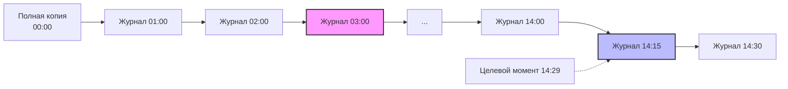
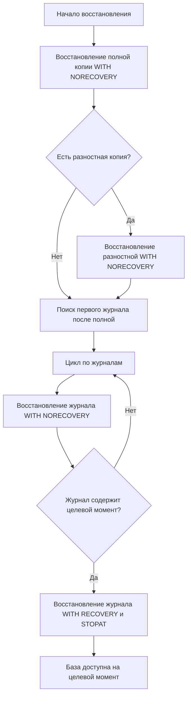

# 🔙 📚 🔜 Навигация по курсу

| [Предыдущее занятие](../LESSONS/PR18.MD) | &nbsp; | [Следующее занятие](../LESSONS/PR19.MD) |
|:--------------------------------------:|:------:|:-------------------------------------:|
| 🏠 [Практика №18](../LESSONS/PR18.MD) | 📖 [Содержание](../README.MD) | 💻 [Практика №19](../LESSONS/PR19.MD) |

---

# 🎓 Лекция 19. Point-in-Time Recovery: теория и требования

⏱️ **Продолжительность:** 90 минут  
🎯 **Цель лекции:**  
Сформировать у студентов глубокое понимание механизма восстановления на момент времени (Point-in-Time Recovery, PITR), его технических предпосылок, ограничений и практических сценариев применения. Научить студентов планировать инфраструктуру для поддержки PITR, выбирать правильные параметры восстановления и диагностировать проблемы, возникающие при восстановлении на момент времени.

---

## 🔙 📚 🔜 Навигация по курсу

| [Предыдущее занятие](../lesson-18/README.md) | &nbsp; | [Следующее занятие](../lesson-19/practice.md) |
|:---------------------------------------------:|:------:|:---------------------------------------------:|
| 🎓 [Лекция 18](../lesson-18/README.md) | 📖 [Содержание](../../README.md) | 💻 [Практика №19](practice.md) |

---

## 📖 Справочник терминов (официальные названия из русской SSMS)

| Русский термин | Английский эквивалент | Что это? | Пример |
|----------------|------------------------|----------|--------|
| Восстановление на момент времени | Point-in-Time Recovery (PITR) | Восстановление базы данных на конкретный момент в прошлом | `STOPAT = '2026-03-15 14:35:00'` |
| STOPAT | STOPAT | Ключевое слово, указывающее момент времени для остановки восстановления | `WITH STOPAT = '2026-03-15 10:30:00'` |
| STOPATMARK | STOPATMARK | Остановка на определённой отметке в журнале (транзакции) | `WITH STOPATMARK = 'TransactionName'` |
| STOPBEFOREMARK | STOPBEFOREMARK | Остановка перед указанной транзакцией | `WITH STOPBEFOREMARK = 'TransactionName'` |
| Цепочка журналов | Log chain | Непрерывная последовательность резервных копий журнала | Все .trn файлы от полной копии |
| Разрыв цепочки | Log chain break | Отсутствие одной из копий журнала в последовательности | PITR становится невозможен |
| Активная транзакция | Active transaction | Незавершённая транзакция на момент восстановления | Может блокировать PITR |
| Распределённая транзакция | Distributed transaction | Транзакция, затрагивающая несколько серверов | Требует координации |
| Маркер транзакции | Transaction mark | Пользовательская отметка в журнале | `BEGIN TRAN WITH MARK` |
| Транзакционно-согласованное восстановление | Transactionally consistent recovery | Состояние, когда все завершённые транзакции применены, а незавершённые откачены | Гарантируется SQL Server |
| Хвост журнала | Tail log | Последняя активная часть журнала, не скопированная в бэкап | `BACKUP LOG ... WITH NORECOVERY` |

---

## 1. 🧠 Что такое Point-in-Time Recovery и зачем он нужен?

### 1.1. Определение

**Point-in-Time Recovery (PITR)** — это возможность восстановить базу данных в состояние, в котором она находилась в **точно заданный момент времени** в прошлом.

```mermaid
timeline
    title Временная шкала событий
    08:00 : Полная копия
    10:15 : Разностная копия
    10:30 : Кто-то удалил таблицу
    10:31 : Обнаружена ошибка
    10:32 : Начало восстановления
    10:35 : Завершение восстановления на 10:29:59
    10:36 : Система работает, данные восстановлены
```

### 1.2. Реальные сценарии применения PITR

| Сценарий | Описание | Без PITR | С PITR |
|----------|----------|----------|--------|
| **Случайное удаление данных** | Разработчик выполнил `DELETE` без WHERE | Потеря всех данных с последнего бэкапа | Восстановление на момент ДО удаления |
| **Ошибочное обновление** | Обновлены неправильные строки | Данные утеряны | Можно вернуться назад |
| **Сбой приложения** | Приложение записало некорректные данные | Потеря данных | Точка восстановления до сбоя |
| **Атака (SQL injection)** | Злоумышленник удалил данные | Катастрофа | Можно откатиться до атаки |
| **Тестирование** | Нужно вернуть тестовые данные в исходное состояние | Пересоздание БД | Быстрый откат |

### 1.3. Что можно восстановить, а что нельзя?

✅ **Можно:**
- Данные (INSERT, UPDATE, DELETE)
- Изменения схемы (ALTER TABLE, CREATE INDEX) — **но с ограничениями**
- Транзакционно-согласованное состояние

❌ **Нельзя (или сложно):**
- Операции с минимальным логированием (BULK_LOGGED) — если они есть в журнале
- Изменения структуры файлов (SHRINKFILE, ADD FILE) — могут потребовать специальной обработки
- Системные базы (master, msdb) — восстанавливаются отдельно

---

## 2. 🔧 Технические требования для PITR

### 2.1. Модель восстановления — только FULL!

PITR возможен **только в модели восстановления FULL**. В SIMPLE журнал усекается автоматически, и восстановить момент в прошлом невозможно.

```sql
-- Проверка модели
SELECT name, recovery_model_desc 
FROM sys.databases 
WHERE name = 'AdventureWorks';

-- Переключение в FULL (если не FULL)
ALTER DATABASE AdventureWorks SET RECOVERY FULL;
```

### 2.2. Непрерывная цепочка журналов

Для PITR необходима **полная, непрерывная цепочка** резервных копий журнала от точки полной копии до целевого момента.



Если хотя бы один журнал отсутствует или повреждён, PITR до момента за этим журналом становится невозможен.

### 2.3. Регулярные бэкапы журнала

Частота бэкапов журнала определяет минимальный RPO (точность восстановления):

| Частота бэкапов журнала | Максимальная точность PITR | RPO |
|-------------------------|----------------------------|-----|
| Каждые 5 минут | ±5 минут | 5 минут |
| Каждые 15 минут | ±15 минут | 15 минут |
| Каждые 30 минут | ±30 минут | 30 минут |
| Каждые 60 минут | ±60 минут | 1 час |

### 2.4. Наличие полной копии

PITR всегда начинается с полной копии. Без неё восстановить ничего нельзя.

```sql
-- Минимальный набор для PITR:
-- 1. Полная копия (когда-то в прошлом)
-- 2. Все журналы от этой полной до целевого момента
-- 3. Последняя разностная копия (опционально, для ускорения)
```

---

## 3. ⏱️ Как работает PITR: пошагово

### 3.1. Процесс восстановления



### 3.2. Детальный пример

Допустим, целевой момент: **15 марта 2026, 14:29:00**

```sql
-- Шаг 1: Полная копия (создана 15 марта в 00:00)
RESTORE DATABASE AdventureWorks
FROM DISK = 'D:\Backup\AW_Full_20260315.bak'
WITH NORECOVERY;

-- Шаг 2: Разностная копия (если есть, создана в 12:00)
RESTORE DATABASE AdventureWorks
FROM DISK = 'D:\Backup\AW_Diff_20260315_1200.bak'
WITH NORECOVERY;

-- Шаг 3: Журнал за 13:00 (содержит транзакции до 13:59:59)
RESTORE LOG AdventureWorks
FROM DISK = 'D:\Backup\AW_Log_20260315_1300.trn'
WITH NORECOVERY;

-- Шаг 4: Журнал за 14:00 (содержит транзакции до 14:59:59)
RESTORE LOG AdventureWorks
FROM DISK = 'D:\Backup\AW_Log_20260315_1400.trn'
WITH NORECOVERY,
     STOPAT = '2026-03-15 14:29:00';  -- остановиться в нужный момент

-- Шаг 5: Восстановление завершено
RESTORE DATABASE AdventureWorks WITH RECOVERY;
```

### 3.3. Что происходит внутри при STOPAT?

Когда указывается `STOPAT`, SQL Server:
1. Прокручивает журнал до указанного момента
2. Применяет все **завершённые** транзакции, которые были зафиксированы до этого момента
3. Откатывает все транзакции, которые были активны или завершились после этого момента
4. Гарантирует транзакционную согласованность

**Важно:** База будет восстановлена в состояние, в котором она была бы, если бы время остановилось ровно в указанный момент.

---

## 4. 🎯 Тонкая настройка: STOPAT, STOPATMARK, STOPBEFOREMARK

### 4.1. STOPAT — остановка по времени

Самый распространённый вариант. Указывается точная дата и время.

```sql
RESTORE LOG AdventureWorks
FROM DISK = 'D:\Backup\AW_Log.trn'
WITH STOPAT = '2026-03-15 14:29:00.000';
```

**Особенности:**
- Время указывается в формате `YYYY-MM-DD HH:MM:SS.mmm`
- Учитывается часовой пояс сервера
- Можно указать только дату (тогда время = 00:00:00)

### 4.2. STOPATMARK — остановка по метке транзакции

Позволяет восстановиться до конкретной **поименованной транзакции**.

Сначала нужно создать транзакцию с меткой:

```sql
BEGIN TRANSACTION ResetBeforeImport WITH MARK 'BeforeImport';
-- какие-то операции
COMMIT TRANSACTION ResetBeforeImport;
```

Затем восстановиться до этой метки:

```sql
RESTORE LOG AdventureWorks
FROM DISK = 'D:\Backup\AW_Log.trn'
WITH STOPATMARK = 'BeforeImport';
```

**Когда применяется:**
- Перед массовым импортом данных
- Перед обновлением приложения
- Для согласованного восстановления нескольких баз

### 4.3. STOPBEFOREMARK — остановка перед меткой

Восстанавливает состояние **непосредственно перед** указанной транзакцией.

```sql
RESTORE LOG AdventureWorks
FROM DISK = 'D:\Backup\AW_Log.trn'
WITH STOPBEFOREMARK = 'DropTableOperation';
```

Полезно, когда нужно исключить саму проблемную транзакцию.

### 4.4. Сравнение методов

| Метод | Синтаксис | Что восстанавливает | Когда использовать |
|-------|-----------|---------------------|-------------------|
| STOPAT | `STOPAT = 'время'` | Состояние на момент времени | Случайное удаление в известное время |
| STOPATMARK | `STOPATMARK = 'метка'` | Состояние после указанной транзакции | После контролируемой операции |
| STOPBEFOREMARK | `STOPBEFOREMARK = 'метка'` | Состояние до указанной транзакции | Исключить проблемную транзакцию |

---

## 5. 🚧 Ограничения и подводные камни PITR

### 5.1. Операции с минимальным логированием

Если в журнале есть операции с минимальным логированием (BULK_LOGGED), PITR может быть невозможен.

```sql
-- Пример операции с минимальным логированием
SELECT * INTO NewTable FROM SourceTable;  -- SELECT INTO минимально логируется
```

**Признак проблемы:** При восстановлении с STOPAT может возникнуть ошибка, что журнал не поддерживает PITR из-за массовых операций.

**Решение:** 
- Избегать массовых операций в критических системах
- Переключаться в BULK_LOGGED только на время, а затем делать полный бэкап

### 5.2. Активные транзакции на целевой момент

Если в целевой момент была активна долгая транзакция, её эффект **не будет** виден в восстановленной базе (транзакция будет откачена). Это правильно и обеспечивает согласованность, но может сбивать с толку.

```sql
-- В 14:28:00 началась транзакция
BEGIN TRAN;
UPDATE Products SET Price = Price * 1.1;
-- Через минуту в 14:29:00 сделали COMMIT

-- Если восстановиться на 14:28:30, эти изменения НЕ войдут в восстановленную БД
```

### 5.3. Ограничения по времени

Нельзя восстановиться на момент **раньше**, чем самая старая запись в имеющихся журналах.

```sql
-- Ошибка: STOPAT time is earlier than the oldest backup in the backup set
```

### 5.4. Разрыв цепочки

Если пропущен хотя бы один журнал, восстановление на момент после этого журнала невозможно.

```sql
-- Проверка цепочки
RESTORE HEADERONLY FROM DISK = 'D:\Backup\AW_Log1.trn';
RESTORE HEADERONLY FROM DISK = 'D:\Backup\AW_Log2.trn';
-- Сравнить FirstLSN и LastLSN
```

### 5.5. Часовые пояса

Сервер может быть в одном часовом поясе, а вы — в другом. Всегда уточняйте, по какому времени указывается STOPAT (обычно по времени сервера).

```sql
-- Узнать время на сервере
SELECT GETDATE() AS ServerTime;
```

---

## 6. 🛠️ Подготовка инфраструктуры для PITR

### 6.1. Настройка частоты бэкапов журнала

```sql
-- Создание задания для бэкапа журнала каждые 15 минут
USE msdb;
GO

EXEC dbo.sp_add_job
    @job_name = N'LogBackup_15min_AdventureWorks',
    @description = N'Бэкап журнала каждые 15 минут';

EXEC dbo.sp_add_jobstep
    @job_name = N'LogBackup_15min_AdventureWorks',
    @step_name = N'Backup Log',
    @command = N'
        DECLARE @fileName NVARCHAR(255) = 
            N''D:\Backup\AdventureWorks_Log_'' + 
            FORMAT(GETDATE(), ''yyyyMMdd_HHmm'') + ''.trn'';
        
        BACKUP LOG AdventureWorks TO DISK = @fileName
        WITH COMPRESSION, CHECKSUM;';

EXEC dbo.sp_add_schedule
    @schedule_name = N'Every15Min',
    @freq_type = 4,  -- ежедневно
    @freq_interval = 1,
    @freq_subday_type = 4,  -- минуты
    @freq_subday_interval = 15,
    @active_start_time = 0;  -- круглосуточно

EXEC dbo.sp_attach_schedule
    @job_name = N'LogBackup_15min_AdventureWorks',
    @schedule_name = N'Every15Min';

EXEC dbo.sp_add_jobserver
    @job_name = N'LogBackup_15min_AdventureWorks';
```

### 6.2. Мониторинг целостности цепочки

```sql
-- Проверка непрерывности цепочки журналов
SELECT 
    database_name,
    backup_start_date,
    backup_finish_date,
    first_lsn,
    last_lsn,
    DATEDIFF(minute, 
        LAG(backup_finish_date) OVER (ORDER BY backup_start_date),
        backup_start_date) AS gap_minutes
FROM msdb.dbo.backupset
WHERE database_name = 'AdventureWorks'
    AND type = 'L'
ORDER BY backup_start_date;
```

### 6.3. Создание маркеров для важных операций

```sql
-- Перед важными операциями создавать маркер
BEGIN TRANSACTION BeforeDeployment WITH MARK 'Deployment_20260315';

-- ... операции развёртывания ...

COMMIT TRANSACTION BeforeDeployment;
```

---

## 7. 📊 Диагностика проблем PITR

### 7.1. Почему не работает STOPAT?

```sql
-- Проверка наличия журналов до нужного момента
SELECT 
    backup_start_date,
    backup_finish_date,
    first_lsn,
    last_lsn,
    CASE 
        WHEN first_lsn > (SELECT first_lsn FROM ...) THEN 'Журнал слишком новый'
        ELSE 'OK'
    END AS status
FROM msdb.dbo.backupset
WHERE database_name = 'AdventureWorks'
    AND type = 'L'
    AND backup_start_date < '2026-03-15 14:30:00'
ORDER BY backup_start_date;
```

### 7.2. Проверка, был ли момент в журналах

```sql
-- Можно ли восстановиться на момент времени?
RESTORE VERIFYONLY 
FROM DISK = 'D:\Backup\AdventureWorks_Full.bak'
WITH STOPAT = '2026-03-15 14:29:00';
```

### 7.3. Поиск точного времени удаления

Если неизвестно точное время ошибки, можно восстановить журналы на тестовый сервер и анализировать:

```sql
-- На тестовом сервере восстановить с STANDBY
RESTORE LOG AdventureWorks_Test
FROM DISK = 'D:\Backup\AdventureWorks_Log1.trn'
WITH STANDBY = 'D:\Backup\undo.ldf';

-- Проверять данные после каждого журнала
SELECT COUNT(*) FROM dbo.ImportantTable;
```

---

## 8. 🧪 Практические сценарии PITR

### 8.1. Сценарий 1: Случайное удаление данных

**Ситуация:** В 10:30 выполнен `DELETE FROM Orders WHERE OrderDate < '2025-01-01'` (удалено 5000 записей). Нужно восстановить удалённые записи.

**Решение:**

```sql
-- На тестовый сервер
RESTORE DATABASE AdventureWorks_Test
FROM DISK = 'D:\Backup\AW_Full.bak'
WITH NORECOVERY,
     MOVE 'AdventureWorks' TO 'D:\Test\AW.mdf',
     MOVE 'AdventureWorks_log' TO 'D:\Test\AW.ldf';

-- Применить все журналы до 10:29
RESTORE LOG AdventureWorks_Test
FROM DISK = 'D:\Backup\AW_Log1.trn'
WITH NORECOVERY,
     STOPAT = '2026-03-16 10:29:59';

RESTORE LOG AdventureWorks_Test
FROM DISK = 'D:\Backup\AW_Log2.trn'
WITH RECOVERY,
     STOPAT = '2026-03-16 10:29:59';

-- Выгрузить удалённые записи
SELECT * INTO DeletedOrders
FROM AdventureWorks_Test.dbo.Orders
WHERE OrderDate < '2025-01-01';

-- Вставить обратно в основную БД
INSERT INTO AdventureWorks.dbo.Orders
SELECT * FROM DeletedOrders;
```

### 8.2. Сценарий 2: Откат ошибочного обновления

**Ситуация:** В 15:45 запустили скрипт, который неправильно обновил цены во всех товарах. Нужно вернуться к состоянию до этого обновления.

**Решение:** Использовать STOPBEFOREMARK, если скрипт начинался с маркированной транзакции.

```sql
-- Если скрипт начинался с BEGIN TRAN WITH MARK 'PriceUpdate'
RESTORE LOG AdventureWorks
FROM DISK = 'D:\Backup\AW_Log_1500.trn'
WITH STOPBEFOREMARK = 'PriceUpdate', RECOVERY;
```

### 8.3. Сценарий 3: Восстановление нескольких связанных баз

**Ситуация:** Есть базы `Sales` и `Inventory`, которые должны быть согласованы по времени.

**Решение:** Использовать метки транзакций и восстанавливать до одной метки.

```sql
-- В обеих базах создаём метку
BEGIN DISTRIBUTED TRANSACTION
BEGIN TRANSACTION WithMark WITH MARK 'ConsistentPoint';
-- операции в обеих базах
COMMIT TRANSACTION;

-- При восстановлении
RESTORE LOG Sales WITH STOPATMARK = 'ConsistentPoint';
RESTORE LOG Inventory WITH STOPATMARK = 'ConsistentPoint';
```

---

## 9. ⚠️ Типовые ошибки при PITR и как их избежать

### Ошибка 1: "STOPAT time is earlier than last applied log"

**Причина:** Указанное время раньше уже применённых журналов.

**Решение:** Проверить порядок применения. Убедитесь, что сначала применяются более старые журналы.

### Ошибка 2: "The log in this backup set begins at LSN... which is too late"

**Причина:** Пропущен журнал в цепочке.

**Решение:** Найти недостающий журнал или начать заново с полной копии.

### Ошибка 3: "STOPAT option is not supported for this backup type"

**Причина:** Пытаетесь применить STOPAT к полной или разностной копии.

**Решение:** STOPAT применяется только к журналам (`RESTORE LOG`).

### Ошибка 4: База после восстановления меньше ожидаемого размера

**Причина:** На целевой момент была активна транзакция, которая не была зафиксирована.

**Решение:** Это нормально. SQL Server гарантирует транзакционную согласованность.

---

## 10. ✅ Резюме: чек-лист для PITR

- [ ] Модель восстановления **FULL** (обязательно!)
- [ ] Регулярные **полные копии** (ежедневно)
- [ ] Регулярные **бэкапы журнала** (частота = желаемый RPO)
- [ ] Непрерывная **цепочка журналов** (все .trn файлы сохранены)
- [ ] Знание **точного времени** события (или наличие маркеров)
- [ ] Достаточно **места на диске** для восстановления
- [ ] **Тестовый сервер** для проверки перед основным восстановлением
- [ ] **Проверка целостности** (`RESTORE VERIFYONLY` с STOPAT)
- [ ] **Резервная копия текущего состояния** (tail-log backup) перед восстановлением

🔑 **Золотое правило:**  
> *«PITR — это как машина времени: она работает, только если вы аккуратно вели дневник (делали бэкапы журналов) и знаете точную дату, куда хотите вернуться.»*

---

## 11. ❓ Вопросы для самопроверки

1. Какие три обязательных условия необходимы для выполнения PITR?
2. Почему PITR невозможен в модели восстановления SIMPLE?
3. Что произойдёт с незавершёнными транзакциями при восстановлении с STOPAT?
4. Как часто нужно делать бэкапы журнала, если RPO = 5 минут?
5. В чём разница между STOPAT, STOPATMARK и STOPBEFOREMARK?
6. Как создать транзакцию с меткой и зачем это нужно?
7. Что такое разрыв цепочки журналов и как его обнаружить?
8. Можно ли выполнить PITR, если в журнале есть операции с минимальным логированием?
9. Как проверить, что нужный момент времени вообще присутствует в имеющихся журналах?
10. Что делать, если точное время сбоя неизвестно?
11. Как восстановить несколько баз данных на один согласованный момент?
12. Почему после восстановления с STOPAT база может быть меньше ожидаемого размера?
13. Какие типы операций НЕ восстанавливаются при PITR?
14. Как настроить оповещение, если цепочка журналов прервалась?
15. Влияет ли часовой пояс сервера на указание STOPAT?

---

## 📎 Приложение: Шпаргалка по PITR

```sql
-- Проверка возможности PITR
SELECT 
    name,
    recovery_model_desc,
    log_reuse_wait_desc
FROM sys.databases
WHERE name = 'AdventureWorks';

-- Просмотр доступных для PITR моментов
RESTORE HEADERONLY FROM DISK = 'D:\Backup\AdventureWorks_Full.bak';
RESTORE HEADERONLY FROM DISK = 'D:\Backup\AdventureWorks_Log1.trn';

-- Восстановление с PITR (полный синтаксис)
RESTORE DATABASE AdventureWorks
FROM DISK = 'D:\Backup\AW_Full.bak'
WITH NORECOVERY;

RESTORE LOG AdventureWorks
FROM DISK = 'D:\Backup\AW_Log1.trn'
WITH NORECOVERY,
     STOPAT = '2026-03-15 14:29:00';

RESTORE LOG AdventureWorks
FROM DISK = 'D:\Backup\AW_Log2.trn'
WITH RECOVERY,
     STOPAT = '2026-03-15 14:29:00';

-- Проверка целостности перед восстановлением
RESTORE VERIFYONLY 
FROM DISK = 'D:\Backup\AW_Full.bak'
WITH STOPAT = '2026-03-15 14:29:00';

-- Создание маркера транзакции
BEGIN TRANSACTION ImportantOperation WITH MARK 'MyMark';
-- операции
COMMIT TRANSACTION ImportantOperation;

-- Восстановление до маркера
RESTORE LOG AdventureWorks
FROM DISK = 'D:\Backup\AW_Log.trn'
WITH STOPATMARK = 'MyMark';

-- Восстановление перед маркером (исключить операцию)
RESTORE LOG AdventureWorks
FROM DISK = 'D:\Backup\AW_Log.trn'
WITH STOPBEFOREMARK = 'MyMark';
```

---

📜 **Лицензия:** CC BY-NC-SA 4.0  
👨‍🏫 **Автор:** Руслан Ринатович Сафиулин  
📅 **Дата:** 05.03.2026


# 🔙 📚 🔜 Навигация по курсу

| [Предыдущее занятие](../LESSONS/PR18.MD) | &nbsp; | [Следующее занятие](../LESSONS/PR19.MD) |
|:--------------------------------------:|:------:|:-------------------------------------:|
| 🏠 [Практика №18](../LESSONS/PR18.MD) | 📖 [Содержание](../README.MD) | 💻 [Практика №19](../LESSONS/PR19.MD) |

---
