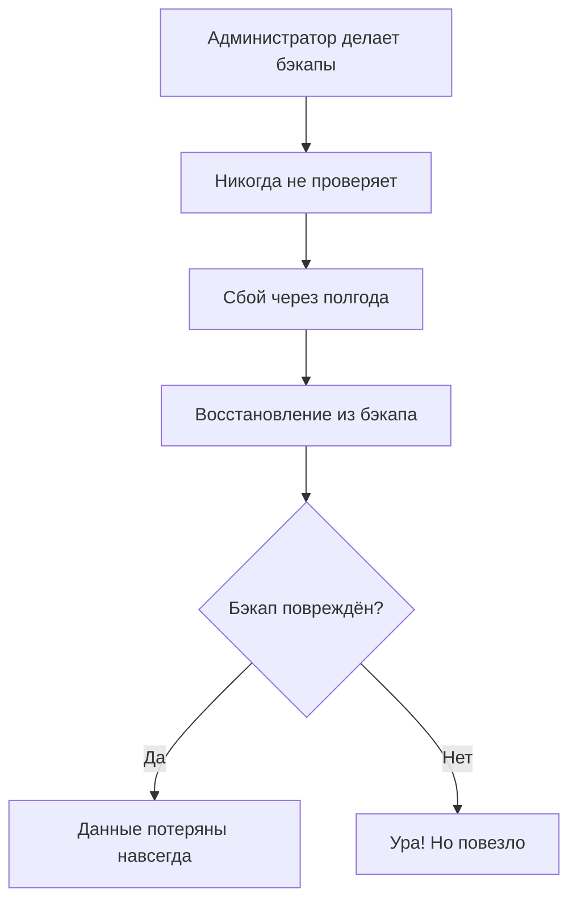
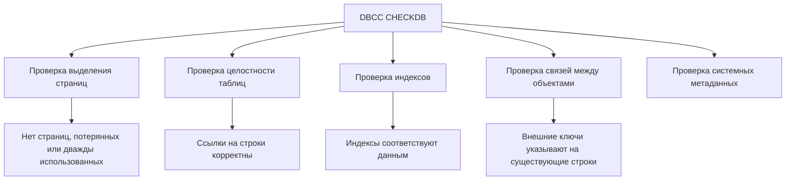
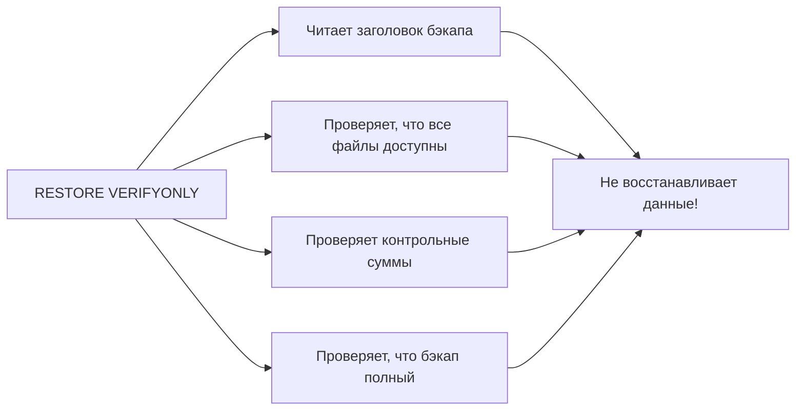
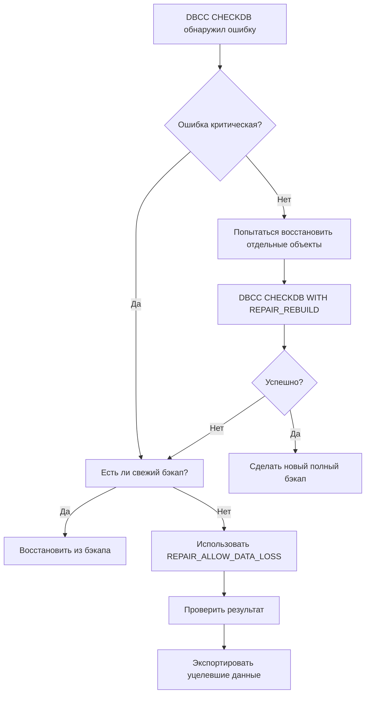

# 🔙 📚 🔜 Навигация по курсу

| [Предыдущее занятие](../LESSONS/PR19.MD) | &nbsp; | [Следующее занятие](../LESSONS/PR.MD) |
|:--------------------------------------:|:------:|:-------------------------------------:|
| 🏠 [Практика №19](../LESSONS/PR19.MD) | 📖 [Содержание](../README.MD) | 💻 [Практика №20](../LESSONS/PR20.MD) |

---

# 🎓 Лекция 20. Проверка целостности: RESTORE VERIFYONLY, DBCC CHECKDB

⏱️ **Продолжительность:** 90 минут  
🎯 **Цель лекции:**  
Сформировать у студентов понимание важности проверки целостности баз данных и резервных копий. Научить использовать команды DBCC CHECKDB для диагностики повреждений, RESTORE VERIFYONLY для проверки бэкапов, а также интерпретировать результаты проверок и предпринимать правильные действия при обнаружении ошибок.

## 📖 Справочник терминов (официальные названия из русской SSMS)

| Русский термин | Английский эквивалент | Что это? | Пример |
|----------------|------------------------|----------|--------|
| Проверка целостности | Integrity check | Процесс проверки логической и физической целостности базы данных | `DBCC CHECKDB` |
| DBCC | Database Console Commands | Консольные команды для обслуживания БД | `DBCC CHECKDB`, `DBCC SHRINKFILE` |
| Повреждение страницы | Page corruption | Ошибка чтения страницы данных (обычно 824 ошибка) | "SQL Server detected logical consistency-based I/O error" |
| Ошибка 823 | Error 823 | Ошибка ввода-вывода на уровне операционной системы | "The operating system returned error 21" |
| Ошибка 824 | Error 824 | Логическая ошибка при чтении страницы | "Logical consistency-based I/O error" |
| Ошибка 825 | Error 825 | Повторное чтение страницы после сбоя | "Read retry" |
| Проверка резервной копии | Backup verification | Проверка, что бэкап можно использовать для восстановления | `RESTORE VERIFYONLY` |
| CHECKSUM | Checksum | Контрольная сумма страницы для обнаружения повреждений | `WITH CHECKSUM` при бэкапе |
| Page Verify | Page Verify | Настройка базы данных для проверки страниц | `ALTER DATABASE SET PAGE_VERIFY CHECKSUM` |
| Восстановление страницы | Page restore | Восстановление отдельных повреждённых страниц | `RESTORE DATABASE ... PAGE = '1:123'` |
| Согласованность на уровне базы данных | Database consistency | Состояние, когда все объекты БД логически корректны | `DBCC CHECKDB` вернул 0 ошибок |

---

## 1. 🧠 Почему проверка целостности критически важна?

### 1.1. Статистика печальных историй



**Реальная статистика:**  
По данным опросов DBA, около **30-40%** организаций хотя бы раз сталкивались с ситуацией, когда резервная копия оказывалась повреждённой и не подлежала восстановлению .

### 1.2. Основные причины повреждений

| Причина | Вероятность | Пояснение |
|---------|-------------|-----------|
| Сбой диска (bad sector) | Высокая | Физическое повреждение носителя |
| Сбой контроллера | Средняя | Проблемы с RAID-контроллером |
| Проблемы с памятью | Средняя | Ошибки в оперативной памяти при записи |
| Сбой питания | Средняя | Неполная запись страниц |
| Ошибки драйверов | Низкая | Баги в драйверах дисков |
| Человеческий фактор | Очень высокая | Случайное удаление, ошибочное обновление |

### 1.3. Две линии обороны

```
Линия обороны 1: DBCC CHECKDB (регулярные проверки)
    ↓
Обнаружение повреждения ДО того, как оно стало критическим
    ↓
Линия обороны 2: RESTORE VERIFYONLY (проверка бэкапов)
    ↓
Уверенность, что бэкап сработает в час X
```

---

## 2. 🔍 DBCC CHECKDB — главный инструмент проверки

### 2.1. Что проверяет DBCC CHECKDB?



### 2.2. Синтаксис и опции

```sql
-- Базовая проверка всей базы
DBCC CHECKDB ('AdventureWorks');

-- С подробным отчётом об ошибках
DBCC CHECKDB ('AdventureWorks') WITH NO_INFOMSGS, ALL_ERRORMSGS;

-- Проверка с исправлением ошибок (ТОЛЬКО В КРАЙНЕМ СЛУЧАЕ!)
DBCC CHECKDB ('AdventureWorks') WITH REPAIR_ALLOW_DATA_LOSS;

-- Быстрая проверка (без детальной проверки индексов)
DBCC CHECKDB ('AdventureWorks') WITH PHYSICAL_ONLY;

-- Проверка с оценкой времени выполнения
DBCC CHECKDB ('AdventureWorks') WITH ESTIMATEONLY;
```

### 2.3. Режимы проверки

| Режим | Описание | Когда использовать | Время выполнения |
|-------|----------|-------------------|------------------|
| **Полный (по умолчанию)** | Проверяет всё: аллокацию, логическую целостность, индексы | Регулярные проверки (раз в неделю) | Самое долгое |
| **PHYSICAL_ONLY** | Только физическая структура страниц | Быстрая ежедневная проверка | Быстро |
| **NO_INFOMSGS** | Подавляет информационные сообщения | Когда нужны только ошибки | То же |
| **ESTIMATEONLY** | Оценивает время и tempdb | Перед большой проверкой | Мгновенно |

### 2.4. Примеры выполнения

```sql
-- Базовая проверка
DBCC CHECKDB('AdventureWorks');
GO

-- Результат:
-- CHECKDB found 0 allocation errors and 0 consistency errors in database 'AdventureWorks'.
-- DBCC execution completed. If DBCC printed error messages, contact your system administrator.
```

```sql
-- Проверка с деталями о занятом времени
DBCC CHECKDB('AdventureWorks') WITH NO_INFOMSGS;
GO
```

### 2.5. Что означают коды ошибок DBCC

| Уровень ошибки | Значение | Действие |
|----------------|----------|----------|
| **0** | Ошибок нет | Всё отлично |
| **1-3** | Незначительные проблемы с метаданными | Обычно можно игнорировать |
| **4-7** | Проблемы с отдельными объектами | Нужно восстановить повреждённые объекты |
| **8-10** | Серьёзные проблемы с аллокацией | Требуется восстановление из бэкапа |
| **11+** | Критические повреждения | База может быть недоступна |

---

## 3. 🛡️ RESTORE VERIFYONLY — проверка резервных копий

### 3.1. Что проверяет VERIFYONLY?



**Важнейшее отличие:** `RESTORE VERIFYONLY` **НЕ восстанавливает** данные. Он только проверяет, что бэкап **можно прочитать** и что он **не повреждён**.

### 3.2. Синтаксис

```sql
-- Проверка одного файла бэкапа
RESTORE VERIFYONLY 
FROM DISK = 'D:\Backup\AdventureWorks_Full.bak';

-- Проверка с детальным отчётом
RESTORE VERIFYONLY 
FROM DISK = 'D:\Backup\AdventureWorks_Full.bak'
WITH CHECKSUM;

-- Проверка конкретного набора в файле (если их несколько)
RESTORE VERIFYONLY 
FROM DISK = 'D:\Backup\AdventureWorks_Full.bak'
WITH FILE = 2;
```

### 3.3. Что означает результат?

```sql
-- Успешная проверка
RESTORE VERIFYONLY FROM DISK = 'C:\Backup\good_backup.bak';
GO
-- Результат: The backup set is valid.
```

```sql
-- Ошибка проверки
RESTORE VERIFYONLY FROM DISK = 'C:\Backup\corrupted_backup.bak';
GO
-- Результат: 
-- Msg 3241, Level 16, State 40, Line 1
-- The media family on device 'C:\Backup\corrupted_backup.bak' is incorrectly formed.
-- SQL Server cannot process this media family.
```

### 3.4. Проверка с контрольными суммами

Если бэкап создавался с опцией `CHECKSUM`, при проверке можно дополнительно убедиться, что данные не повреждены:

```sql
-- Создание бэкапа с CHECKSUM
BACKUP DATABASE AdventureWorks 
TO DISK = 'D:\Backup\AW_Checksum.bak'
WITH CHECKSUM, COMPRESSION;

-- Проверка с CHECKSUM
RESTORE VERIFYONLY 
FROM DISK = 'D:\Backup\AW_Checksum.bak'
WITH CHECKSUM;
```

---

## 4. ⚠️ Типовые ошибки и их значение

### 4.1. Ошибка 823 — физическая ошибка ввода-вывода

**Текст ошибки:**
```
Error: 823, Severity: 24, State: 2
The operating system returned error 21(The device is not ready.) to SQL Server during a read at offset 0x00000030000000 in file 'D:\Data\AdventureWorks.mdf'.
```

**Причина:** Windows не может прочитать сектор диска. Физическая проблема с диском.

**Действия:**
1. Немедленно проверить диск (`chkdsk /f /r`)
2. Попытаться восстановить повреждённые страницы из бэкапа
3. Заменить диск, если есть bad sectors

### 4.2. Ошибка 824 — логическая ошибка чтения

**Текст ошибки:**
```
Error: 824, Severity: 24, State: 2
SQL Server detected a logical consistency-based I/O error: incorrect checksum (expected: 0x12345678; actual: 0x87654321). It occurred during a read of page (1:12345) in database ID 7 at offset 0x00000030000000 in file 'D:\Data\AdventureWorks.mdf'.
```

**Причина:** Контрольная сумма страницы не совпадает. Данные были повреждены после записи.

**Действия:**
1. Немедленно выполнить `DBCC CHECKDB`
2. Если ошибка только на одной странице — попытаться восстановить страницу из бэкапа
3. Проверить память (memtest), контроллер диска

### 4.3. Ошибка 825 — повторное чтение

**Текст ошибки:**
```
Error: 825, Severity: 10, State: 2
A read of the file 'D:\Data\AdventureWorks.mdf' at offset 0x00000030000000 succeeded after failing 2 time(s) with error: 1117. Additional messages in the SQL Server error log may provide more detail.
```

**Причина:** Первая попытка чтения не удалась, но повторная — удалась. Предупреждение о проблемах с диском.

**Действия:**
1. Внимательно следить за диском
2. Запланировать замену, если ошибки повторяются

---

## 5. 🛠️ Стратегия проверки целостности

### 5.1. Регулярные проверки (расписание)

```mermaid
gantt
    title Расписание проверок целостности
    dateFormat HH:mm
    axisFormat %H:%M
    
    section Ежедневно
    DBCC CHECKDB WITH PHYSICAL_ONLY :daily, 02:00, 30m
    
    section Еженедельно
    Полный DBCC CHECKDB :weekly, 03:00, 2h
    
    section После каждого бэкапа
    RESTORE VERIFYONLY :after backup, 10m
```



### 5.2. Скрипт для автоматической проверки всех баз

```sql
-- Проверка всех пользовательских баз
DECLARE @dbName NVARCHAR(128);
DECLARE db_cursor CURSOR FOR
    SELECT name 
    FROM sys.databases 
    WHERE database_id > 4  -- исключаем системные БД
        AND state_desc = 'ONLINE';

OPEN db_cursor;
FETCH NEXT FROM db_cursor INTO @dbName;

WHILE @@FETCH_STATUS = 0
BEGIN
    PRINT 'Checking database: ' + @dbName;
    
    BEGIN TRY
        EXEC ('DBCC CHECKDB (' + @dbName + ') WITH NO_INFOMSGS');
        PRINT 'Database ' + @dbName + ' is consistent.';
    END TRY
    BEGIN CATCH
        PRINT 'ERROR in database ' + @dbName + ': ' + ERROR_MESSAGE();
        
        -- Отправить уведомление администратору
        EXEC msdb.dbo.sp_send_dbmail
            @recipients = 'dba@company.com',
            @subject = 'Database corruption detected',
            @body = 'Database ' + @dbName + ' has consistency errors';
    END CATCH
    
    FETCH NEXT FROM db_cursor INTO @dbName;
END

CLOSE db_cursor;
DEALLOCATE db_cursor;
```

### 5.3. Проверка всех резервных копий

```sql
-- Проверка всех .bak файлов в папке
DECLARE @filePath NVARCHAR(255);
DECLARE file_cursor CURSOR FOR
    SELECT physical_device_name
    FROM msdb.dbo.backupmediafamily
    WHERE physical_device_name LIKE '%.bak';

OPEN file_cursor;
FETCH NEXT FROM file_cursor INTO @filePath;

WHILE @@FETCH_STATUS = 0
BEGIN
    PRINT 'Verifying: ' + @filePath;
    
    BEGIN TRY
        RESTORE VERIFYONLY FROM DISK = @filePath WITH CHECKSUM;
        PRINT 'Backup is valid: ' + @filePath;
    END TRY
    BEGIN CATCH
        PRINT 'Backup is CORRUPT: ' + @filePath;
        -- Логировать в таблицу проблем
    END CATCH
    
    FETCH NEXT FROM file_cursor INTO @filePath;
END

CLOSE file_cursor;
DEALLOCATE file_cursor;
```

---

## 6. 🆘 Что делать при обнаружении ошибок?

### 6.1. Алгоритм действий при ошибке DBCC



### 6.2. Восстановление отдельных страниц (SQL Server 2016+)

Если повреждены только несколько страниц, можно восстановить только их:

```sql
-- 1. Определить повреждённые страницы
DBCC CHECKDB ('AdventureWorks') WITH NO_INFOMSGS, ALL_ERRORMSGS;

-- 2. Восстановить конкретные страницы из бэкапа
RESTORE DATABASE AdventureWorks
PAGE = '1:12345, 1:12346'  -- файл:страница
FROM DISK = 'D:\Backup\AdventureWorks_Full.bak'
WITH NORECOVERY;

-- 3. Применить журналы для этих страниц
RESTORE LOG AdventureWorks
FROM DISK = 'D:\Backup\AdventureWorks_Log1.trn'
WITH RECOVERY;
```

### 6.3. Режимы REPAIR (использовать с осторожностью!)

```sql
-- REPAIR_REBUILD - перестраивает индексы, не удаляет данные
DBCC CHECKDB ('AdventureWorks', REPAIR_REBUILD) WITH NO_INFOMSGS;

-- REPAIR_ALLOW_DATA_LOSS - может удалять повреждённые строки
-- ТОЛЬКО В КРАЙНЕМ СЛУЧАЕ, КОГДА НЕТ БЭКАПА!
DBCC CHECKDB ('AdventureWorks', REPAIR_ALLOW_DATA_LOSS) WITH NO_INFOMSGS;
```

**Предупреждение Microsoft:**  
> *"REPAIR_ALLOW_DATA_LOSS should only be used as a last resort. This option may cause data loss and should be used only if you have no valid backup."*

---

## 7. 📊 Мониторинг и отчётность

### 7.1. Просмотр истории ошибок в логе SQL Server

```sql
-- Последние ошибки 823, 824, 825
EXEC xp_readerrorlog 0, 1, '823';
EXEC xp_readerrorlog 0, 1, '824';
EXEC xp_readerrorlog 0, 1, '825';
```

### 7.2. Системная таблица suspect_pages

SQL Server ведёт учёт подозрительных страниц:

```sql
SELECT 
    database_id,
    file_id,
    page_id,
    event_type,
    error_count,
    last_update_date
FROM msdb.dbo.suspect_pages
ORDER BY last_update_date DESC;
```

### 7.3. Дашборд состояния баз данных

```sql
SELECT 
    d.name AS DatabaseName,
    d.state_desc,
    d.page_verify_option_desc,
    DATEPART(hh, 
        DATEADD(ms, 
            (SELECT MAX(backup_finish_date) 
             FROM msdb.dbo.backupset 
             WHERE database_name = d.name AND type = 'D'), 0)) AS LastFullBackupAgeHours,
    CASE 
        WHEN EXISTS (SELECT 1 FROM msdb.dbo.suspect_pages WHERE database_id = d.database_id)
        THEN 'Corruption detected'
        ELSE 'OK'
    END AS IntegrityStatus
FROM sys.databases d
WHERE d.database_id > 4
ORDER BY d.name;
```

---

## 8. ✅ Резюме: чек-лист администратора

### Ежедневно:
- [ ] `DBCC CHECKDB WITH PHYSICAL_ONLY` для критических баз
- [ ] Проверка логов на ошибки 823, 824, 825

### Еженедельно:
- [ ] Полный `DBCC CHECKDB` для всех пользовательских баз
- [ ] `RESTORE VERIFYONLY` для свежих бэкапов

### Ежемесячно:
- [ ] Тестовое восстановление на отдельный сервер
- [ ] Проверка всех архивных бэкапов
- [ ] Анализ `suspect_pages` и очистка старых записей

🔑 **Золотое правило:**  
> *«Бэкап, который никогда не проверяли — это не бэкап, это просто файл на диске. Проверяйте регулярно!»*

---

## 9. ❓ Вопросы для самопроверки

1. В чём разница между ошибками 823 и 824? 
2. Что проверяет `RESTORE VERIFYONLY` и почему это не заменяет тестового восстановления?
3. Какие опции `DBCC CHECKDB` вы знаете и когда их применять?
4. Почему нельзя регулярно использовать `REPAIR_ALLOW_DATA_LOSS`?
5. Что такое контрольная сумма страницы и как она защищает данные?
6. Как восстановить отдельные повреждённые страницы без восстановления всей базы?
7. Где SQL Server хранит информацию о подозрительных страницах?
8. Как часто нужно выполнять полный `DBCC CHECKDB` на критических системах?
9. Что делать, если `DBCC CHECKDB` обнаружил ошибку, а бэкапа нет?
10. Как проверить, что все резервные копии за последний месяц целы?
11. В чём разница между `WITH PHYSICAL_ONLY` и полной проверкой?
12. Что означает ошибка 825 и как на неё реагировать?
13. Можно ли выполнять `DBCC CHECKDB` на работающей базе?
14. Как настроить автоматическое уведомление при обнаружении ошибок целостности?
15. Почему важно проверять бэкапы на другом сервере?

---

## 📎 Приложение: Шпаргалка команд

```sql
-- Полная проверка базы
DBCC CHECKDB('AdventureWorks');

-- Быстрая физическая проверка
DBCC CHECKDB('AdventureWorks') WITH PHYSICAL_ONLY;

-- Проверка с исправлением (только если нет бэкапа!)
DBCC CHECKDB('AdventureWorks', REPAIR_REBUILD);
DBCC CHECKDB('AdventureWorks', REPAIR_ALLOW_DATA_LOSS);

-- Проверка бэкапа
RESTORE VERIFYONLY FROM DISK = 'D:\Backup\AW.bak';

-- Проверка с CHECKSUM
RESTORE VERIFYONLY FROM DISK = 'D:\Backup\AW.bak' WITH CHECKSUM;

-- Восстановление страниц
RESTORE DATABASE AdventureWorks PAGE = '1:12345' FROM DISK = 'D:\Backup\AW.bak';

-- Поиск ошибок в логе
EXEC xp_readerrorlog 0, 1, '824';

-- Просмотр suspect_pages
SELECT * FROM msdb.dbo.suspect_pages;

-- Настройка page_verify
ALTER DATABASE AdventureWorks SET PAGE_VERIFY CHECKSUM;
```

---

📜 **Лицензия:** CC BY-NC-SA 4.0  
👨‍🏫 **Автор:** Руслан Ринатович Сафиулин  
📅 **Дата:** 10.03.2026

---

# 🔙 📚 🔜 Навигация по курсу

| [Предыдущее занятие](../LESSONS/PR19.MD) | &nbsp; | [Следующее занятие](../LESSONS/PR.MD) |
|:--------------------------------------:|:------:|:-------------------------------------:|
| 🏠 [Практика №19](../LESSONS/PR19.MD) | 📖 [Содержание](../README.MD) | 💻 [Практика №20](../LESSONS/PR20.MD) |

---
