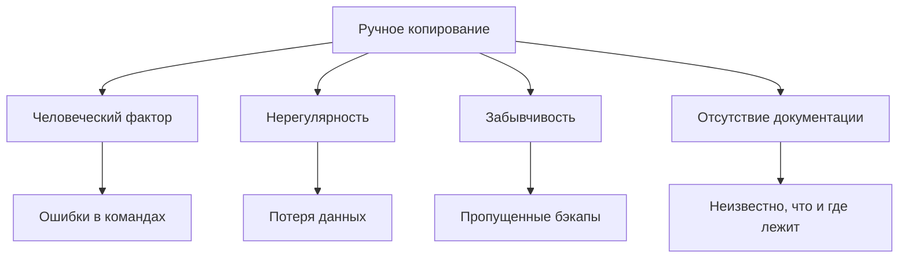
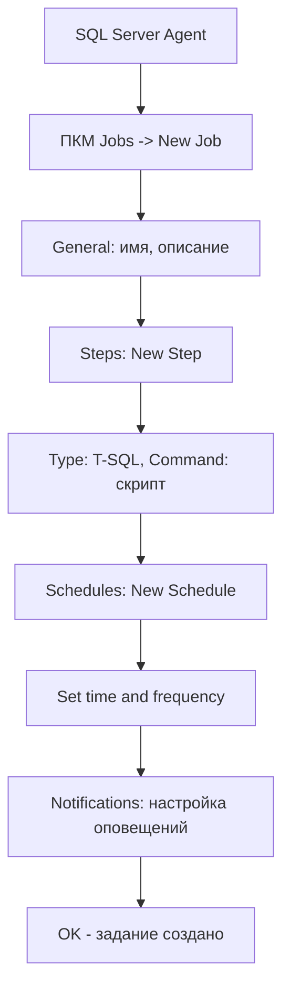

# 🔙 📚 🔜 Навигация по курсу

| [Предыдущее занятие](../LESSONS/PR20.MD) | &nbsp; | [Следующее занятие](../LESSONS/PR21.MD) |
|:--------------------------------------:|:------:|:-------------------------------------:|
| 🏠 [Практика №20](../LESSONS/PR20.MD) | 📖 [Содержание](../README.MD) | 💻 [Практика №21](../LESSONS/PR21.MD) |

---


# 🎓 Лекция 21. Автоматизация резервного копирования: скрипты

⏱️ **Продолжительность:** 90 минут  
🎯 **Цель лекции:**  
Сформировать у студентов понимание принципов автоматизации резервного копирования, научить создавать универсальные скрипты с динамическими именами файлов, использовать системные переменные и функции для генерации имён, а также применять эти скрипты в заданиях SQL Server Agent для полностью автоматизированного процесса бэкапов.

---

## 📖 Справочник терминов (официальные названия из русской SSMS)

| Русский термин | Английский эквивалент | Что это? | Пример |
|----------------|------------------------|----------|--------|
| Автоматизация | Automation | Процесс выполнения задач по расписанию без участия человека | Ежедневный бэкап в 02:00 |
| Динамическое имя файла | Dynamic filename | Имя файла, генерируемое на основе даты/времени | `AdventureWorks_20260313_0200.bak` |
| SQL Server Agent | SQL Server Agent | Компонент для автоматизации задач | Планировщик заданий |
| Задание | Job | Набор шагов, выполняемых по расписанию | `Backup_All_Databases` |
| Расписание | Schedule | Время и периодичность выполнения задания | Каждый день в 02:00 |
| Шаг задания | Job step | Отдельная команда в задании | `BACKUP DATABASE ...` |
| Уведомление | Notification | Оповещение о результате выполнения | Email при ошибке |
| Оператор | Operator | Получатель уведомлений | dba@company.com |
| Системная переменная | System variable | Переменная, предоставляющая информацию о системе | `@@SERVERNAME` |
| Функция даты/времени | Date/time function | Функция для работы с датой и временем | `GETDATE()`, `FORMAT()` |

---

## 1. 🤔 Зачем автоматизировать резервное копирование?

### 1.1. Проблемы ручного копирования



**Реальная статистика:**  
По данным опросов, около 60% сбоев восстановления связаны с тем, что бэкапы не выполнялись по расписанию или выполнялись с ошибками.

### 1.2. Преимущества автоматизации

| Аспект | Ручное копирование | Автоматизация |
|--------|---------------------|---------------|
| Регулярность | Зависит от памяти админа | Всегда по расписанию |
| Ошибки | Высокая вероятность | Минимальная |
| Масштабирование | Сложно при росте числа БД | Легко добавить новую БД |
| Документирование | Нужно вести вручную | Логи в msdb автоматически |
| Воспроизводимость | Разные результаты | Всегда одинаково |
| Освобождение времени | Админ занят рутиной | Админ занимается развитием |

---

## 2. 📝 Основы создания скриптов для бэкапов

### 2.1. Простейший скрипт с фиксированным именем

```sql
-- Плохо: имя не меняется, каждый бэкап перезаписывает предыдущий
BACKUP DATABASE AdventureWorks
TO DISK = 'D:\Backup\AdventureWorks.bak'
WITH COMPRESSION, CHECKSUM;
```

**Проблемы:**
- Вчерашний бэкап будет затерт сегодняшним
- Нет истории, нельзя восстановиться на вчера
- Непонятно, когда сделан бэкап

### 2.2. Скрипт с ручным указанием даты

```sql
-- Тоже плохо: нужно каждый раз менять дату вручную
BACKUP DATABASE AdventureWorks
TO DISK = 'D:\Backup\AdventureWorks_20260313.bak'
WITH COMPRESSION, CHECKSUM;
```

**Проблемы:**
- Каждый день нужно редактировать скрипт
- Легко ошибиться в дате
- Нет автоматизации

### 2.3. Динамическое имя с использованием функций

```sql
-- Хорошо: имя генерируется автоматически
DECLARE @FileName NVARCHAR(255);
SET @FileName = 'D:\Backup\AdventureWorks_' + 
                FORMAT(GETDATE(), 'yyyyMMdd_HHmm') + 
                '.bak';

BACKUP DATABASE AdventureWorks
TO DISK = @FileName
WITH COMPRESSION, CHECKSUM;
```

---

## 3. 🛠️ Функции для генерации динамических имён

### 3.1. Основные функции даты и времени

| Функция | Описание | Пример результата |
|---------|----------|-------------------|
| `GETDATE()` | Текущая дата и время | `2026-03-13 14:35:22.123` |
| `SYSDATETIME()` | Более точное время | `2026-03-13 14:35:22.1234567` |
| `FORMAT(date, format)` | Форматирование даты | `FORMAT(GETDATE(), 'yyyyMMdd')` → `20260313` |
| `DATEPART(part, date)` | Часть даты | `DATEPART(hh, GETDATE())` → `14` |
| `YEAR(date)`, `MONTH(date)`, `DAY(date)` | Год, месяц, день | `YEAR(GETDATE())` → `2026` |

### 3.2. Форматы для имён файлов

```sql
-- Только дата: 20260313
FORMAT(GETDATE(), 'yyyyMMdd')

-- Дата и время: 20260313_1435
FORMAT(GETDATE(), 'yyyyMMdd_HHmm')

-- Дата и время с секундами: 20260313_143522
FORMAT(GETDATE(), 'yyyyMMdd_HHmmss')

-- Для журналов с точностью до минут: 20260313_1435
FORMAT(GETDATE(), 'yyyyMMdd_HHmm')

-- Имя сервера + дата: SERVER1_20260313_1435
@@SERVERNAME + '_' + FORMAT(GETDATE(), 'yyyyMMdd_HHmm')
```

### 3.3. Создание пути с учётом структуры папок

```sql
-- Базовая папка + подпапка по дате + имя файла
DECLARE @BasePath NVARCHAR(255) = 'D:\Backup\';
DECLARE @DateFolder NVARCHAR(50) = FORMAT(GETDATE(), 'yyyyMM');
DECLARE @FileName NVARCHAR(255) = 'AdventureWorks_' + 
                                   FORMAT(GETDATE(), 'yyyyMMdd_HHmm') + 
                                   '.bak';

DECLARE @FullPath NVARCHAR(500) = @BasePath + @DateFolder + '\' + @FileName;

PRINT @FullPath;
-- Результат: D:\Backup\202603\AdventureWorks_20260313_1435.bak
```

---

## 4. 📦 Универсальные скрипты для всех баз

### 4.1. Бэкап одной базы с параметризацией

```sql
CREATE PROCEDURE dbo.usp_BackupSingleDatabase
    @DatabaseName NVARCHAR(128),
    @BackupPath NVARCHAR(500) = 'D:\Backup\'
AS
BEGIN
    DECLARE @FileName NVARCHAR(500);
    DECLARE @SQL NVARCHAR(MAX);
    
    -- Формируем имя файла
    SET @FileName = @BackupPath + @DatabaseName + '_' + 
                    FORMAT(GETDATE(), 'yyyyMMdd_HHmm') + '.bak';
    
    -- Формируем команду бэкапа
    SET @SQL = '
        BACKUP DATABASE [' + @DatabaseName + ']
        TO DISK = ''' + @FileName + '''
        WITH COMPRESSION, CHECKSUM, STATS = 10;';
    
    -- Выполняем
    PRINT @SQL;
    EXEC sp_executesql @SQL;
    
    -- Возвращаем имя файла
    SELECT @FileName AS BackupFileName;
END;
GO

-- Использование
EXEC dbo.usp_BackupSingleDatabase 'AdventureWorks', 'D:\Backup\';
```

### 4.2. Бэкап всех пользовательских баз

```sql
CREATE PROCEDURE dbo.usp_BackupAllUserDatabases
    @BackupPath NVARCHAR(500) = 'D:\Backup\'
AS
BEGIN
    DECLARE @DatabaseName NVARCHAR(128);
    DECLARE @FileName NVARCHAR(500);
    DECLARE @SQL NVARCHAR(MAX);
    
    -- Курсор по всем пользовательским БД
    DECLARE db_cursor CURSOR FOR
        SELECT name 
        FROM sys.databases 
        WHERE database_id > 4  -- исключаем системные
            AND state_desc = 'ONLINE'
            AND name NOT IN ('tempdb');  -- tempdb не бэкапим
    
    OPEN db_cursor;
    FETCH NEXT FROM db_cursor INTO @DatabaseName;
    
    WHILE @@FETCH_STATUS = 0
    BEGIN
        -- Формируем имя файла
        SET @FileName = @BackupPath + @DatabaseName + '_' + 
                        FORMAT(GETDATE(), 'yyyyMMdd_HHmm') + '.bak';
        
        -- Формируем команду бэкапа
        SET @SQL = '
            BACKUP DATABASE [' + @DatabaseName + ']
            TO DISK = ''' + @FileName + '''
            WITH COMPRESSION, CHECKSUM, STATS = 10;';
        
        -- Логируем начало
        PRINT 'Starting backup of ' + @DatabaseName + ' at ' + 
              CONVERT(NVARCHAR, GETDATE(), 120);
        
        -- Выполняем
        EXEC sp_executesql @SQL;
        
        -- Логируем завершение
        PRINT 'Finished backup of ' + @DatabaseName + ' at ' + 
              CONVERT(NVARCHAR, GETDATE(), 120);
        PRINT 'File: ' + @FileName;
        PRINT '';
        
        FETCH NEXT FROM db_cursor INTO @DatabaseName;
    END
    
    CLOSE db_cursor;
    DEALLOCATE db_cursor;
END;
GO

-- Использование
EXEC dbo.usp_BackupAllUserDatabases 'D:\Backup\';
```

### 4.3. Бэкап с ротацией (удаление старых файлов)

```sql
CREATE PROCEDURE dbo.usp_BackupWithRetention
    @DatabaseName NVARCHAR(128),
    @BackupPath NVARCHAR(500),
    @RetentionDays INT = 7
AS
BEGIN
    DECLARE @FileName NVARCHAR(500);
    DECLARE @SQL NVARCHAR(MAX);
    DECLARE @DeleteDate DATETIME;
    
    -- Формируем имя файла
    SET @FileName = @BackupPath + @DatabaseName + '_' + 
                    FORMAT(GETDATE(), 'yyyyMMdd_HHmm') + '.bak';
    
    -- Бэкап
    SET @SQL = '
        BACKUP DATABASE [' + @DatabaseName + ']
        TO DISK = ''' + @FileName + '''
        WITH COMPRESSION, CHECKSUM;';
    
    EXEC sp_executesql @SQL;
    
    -- Удаляем старые файлы (через xp_cmdshell)
    SET @DeleteDate = DATEADD(day, -@RetentionDays, GETDATE());
    
    -- Включите xp_cmdshell, если нужно
    -- EXEC xp_cmdshell 'forfiles /p "D:\Backup" /m *.bak /d -7 /c "cmd /c del @file"';
    
    PRINT 'Backup completed: ' + @FileName;
    PRINT 'Files older than ' + CAST(@RetentionDays AS VARCHAR) + ' days should be removed.';
END;
GO
```

---

## 5. 🔧 Расширенные техники

### 5.1. Бэкап с проверкой свободного места

```sql
CREATE PROCEDURE dbo.usp_SafeBackup
    @DatabaseName NVARCHAR(128),
    @BackupPath NVARCHAR(500),
    @MinFreeSpaceGB INT = 10
AS
BEGIN
    DECLARE @FileName NVARCHAR(500);
    DECLARE @SQL NVARCHAR(MAX);
    DECLARE @FreeSpaceMB INT;
    DECLARE @EstimatedSizeMB INT;
    DECLARE @DriveLetter CHAR(1);
    
    -- Определяем диск
    SET @DriveLetter = LEFT(@BackupPath, 1);
    
    -- Проверяем свободное место (через xp_fixeddrives)
    CREATE TABLE #DriveSpace (
        Drive CHAR(1),
        FreeMB INT
    );
    
    INSERT INTO #DriveSpace
    EXEC xp_fixeddrives;
    
    SELECT @FreeSpaceMB = FreeMB 
    FROM #DriveSpace 
    WHERE Drive = @DriveLetter;
    
    DROP TABLE #DriveSpace;
    
    -- Оцениваем размер бэкапа (приблизительно)
    SELECT @EstimatedSizeMB = 
        (SELECT SUM(size) * 8 / 1024 
         FROM sys.master_files 
         WHERE database_id = DB_ID(@DatabaseName)) * 0.7;  -- с учётом сжатия
    
    -- Проверяем, хватит ли места
    IF @FreeSpaceMB > @EstimatedSizeMB + (@MinFreeSpaceGB * 1024)
    BEGIN
        SET @FileName = @BackupPath + @DatabaseName + '_' + 
                        FORMAT(GETDATE(), 'yyyyMMdd_HHmm') + '.bak';
        
        SET @SQL = '
            BACKUP DATABASE [' + @DatabaseName + ']
            TO DISK = ''' + @FileName + '''
            WITH COMPRESSION, CHECKSUM;';
        
        EXEC sp_executesql @SQL;
        PRINT 'Backup successful: ' + @FileName;
    END
    ELSE
    BEGIN
        PRINT 'ERROR: Not enough free space!';
        PRINT 'Required: ' + CAST(@EstimatedSizeMB AS VARCHAR) + ' MB';
        PRINT 'Available: ' + CAST(@FreeSpaceMB AS VARCHAR) + ' MB';
        PRINT 'Minimum required with buffer: ' + 
              CAST(@EstimatedSizeMB + (@MinFreeSpaceGB * 1024) AS VARCHAR) + ' MB';
    END
END;
GO
```

### 5.2. Логирование результатов бэкапов

```sql
-- Таблица для логов
CREATE TABLE dbo.BackupLog (
    LogID INT IDENTITY(1,1) PRIMARY KEY,
    DatabaseName NVARCHAR(128),
    BackupType CHAR(1),
    BackupFileName NVARCHAR(500),
    BackupSizeMB DECIMAL(18,2),
    StartTime DATETIME,
    EndTime DATETIME,
    Status NVARCHAR(50),
    ErrorMessage NVARCHAR(MAX)
);
GO

-- Процедура с логированием
CREATE PROCEDURE dbo.usp_BackupWithLog
    @DatabaseName NVARCHAR(128),
    @BackupType CHAR(1) = 'D'  -- D - полная, L - журнал
AS
BEGIN
    DECLARE @FileName NVARCHAR(500);
    DECLARE @SQL NVARCHAR(MAX);
    DECLARE @StartTime DATETIME = GETDATE();
    DECLARE @ErrorMessage NVARCHAR(MAX) = NULL;
    
    -- Формируем имя файла
    SET @FileName = 'D:\Backup\' + @DatabaseName + 
                    CASE @BackupType 
                        WHEN 'D' THEN '_FULL_' 
                        WHEN 'L' THEN '_LOG_' 
                    END +
                    FORMAT(GETDATE(), 'yyyyMMdd_HHmm') + 
                    CASE @BackupType 
                        WHEN 'D' THEN '.bak' 
                        WHEN 'L' THEN '.trn' 
                    END;
    
    BEGIN TRY
        -- Выполняем бэкап
        IF @BackupType = 'D'
        BEGIN
            SET @SQL = '
                BACKUP DATABASE [' + @DatabaseName + ']
                TO DISK = ''' + @FileName + '''
                WITH COMPRESSION, CHECKSUM;';
        END
        ELSE
        BEGIN
            SET @SQL = '
                BACKUP LOG [' + @DatabaseName + ']
                TO DISK = ''' + @FileName + '''
                WITH COMPRESSION, CHECKSUM;';
        END
        
        EXEC sp_executesql @SQL;
        
        -- Логируем успех
        INSERT INTO dbo.BackupLog (
            DatabaseName, BackupType, BackupFileName, 
            BackupSizeMB, StartTime, EndTime, Status
        )
        SELECT 
            @DatabaseName,
            @BackupType,
            @FileName,
            backup_size / 1048576.0,
            @StartTime,
            GETDATE(),
            'SUCCESS'
        FROM msdb.dbo.backupset
        WHERE database_name = @DatabaseName
            AND backup_start_date > @StartTime;
    END TRY
    BEGIN CATCH
        SET @ErrorMessage = ERROR_MESSAGE();
        
        -- Логируем ошибку
        INSERT INTO dbo.BackupLog (
            DatabaseName, BackupType, BackupFileName, 
            StartTime, EndTime, Status, ErrorMessage
        )
        VALUES (
            @DatabaseName,
            @BackupType,
            @FileName,
            @StartTime,
            GETDATE(),
            'FAILED',
            @ErrorMessage
        );
        
        -- Пробрасываем ошибку дальше
        THROW;
    END CATCH
END;
GO
```

---

## 6. 🤖 Интеграция с SQL Server Agent

### 6.1. Создание задания через T-SQL

```sql
USE msdb;
GO

-- Создаём задание
EXEC dbo.sp_add_job
    @job_name = N'AutomatedBackup_AllDatabases',
    @description = N'Автоматический бэкап всех пользовательских баз',
    @owner_login_name = N'sa';

-- Создаём шаг задания
EXEC dbo.sp_add_jobstep
    @job_name = N'AutomatedBackup_AllDatabases',
    @step_name = N'Backup Step',
    @command = N'
        -- Здесь наш универсальный скрипт
        DECLARE @BackupPath NVARCHAR(255) = ''D:\Backup\'';
        DECLARE @DatabaseName NVARCHAR(128);
        DECLARE @FileName NVARCHAR(500);
        DECLARE @SQL NVARCHAR(MAX);
        
        DECLARE db_cursor CURSOR FOR
            SELECT name FROM sys.databases 
            WHERE database_id > 4 AND state_desc = ''ONLINE'';
        
        OPEN db_cursor;
        FETCH NEXT FROM db_cursor INTO @DatabaseName;
        
        WHILE @@FETCH_STATUS = 0
        BEGIN
            SET @FileName = @BackupPath + @DatabaseName + ''_'' + 
                            FORMAT(GETDATE(), ''yyyyMMdd_HHmm'') + ''.bak'';
            
            SET @SQL = ''
                BACKUP DATABASE ['' + @DatabaseName + '']
                TO DISK = '''''' + @FileName + ''''''
                WITH COMPRESSION, CHECKSUM;'';
            
            EXEC sp_executesql @SQL;
            
            FETCH NEXT FROM db_cursor INTO @DatabaseName;
        END
        
        CLOSE db_cursor;
        DEALLOCATE db_cursor;',
    @database_name = N'master';

-- Создаём расписание (каждый день в 02:00)
EXEC dbo.sp_add_schedule
    @schedule_name = N'NightlySchedule',
    @freq_type = 4,  -- ежедневно
    @freq_interval = 1,
    @active_start_time = 020000;  -- 02:00

-- Привязываем расписание к заданию
EXEC dbo.sp_attach_schedule
    @job_name = N'AutomatedBackup_AllDatabases',
    @schedule_name = N'NightlySchedule';

-- Добавляем задание на сервер
EXEC dbo.sp_add_jobserver
    @job_name = N'AutomatedBackup_AllDatabases';
```

### 6.2. Создание задания через SSMS (графический интерфейс)



### 6.3. Оповещения об ошибках

```sql
-- Создаём оператора
EXEC msdb.dbo.sp_add_operator
    @name = N'DBA Team',
    @email_address = N'dba@company.com';

-- Настраиваем уведомления для задания
EXEC msdb.dbo.sp_update_job
    @job_name = N'AutomatedBackup_AllDatabases',
    @notify_level_email = 2,  -- уведомлять при ошибке
    @notify_email_operator_name = N'DBA Team';
```

---

## 7. 📊 Мониторинг и отчётность

### 7.1. Проверка последних бэкапов

```sql
-- Последний бэкап для каждой базы
SELECT 
    database_name,
    MAX(backup_start_date) AS LastBackup,
    DATEDIFF(hh, MAX(backup_start_date), GETDATE()) AS HoursAgo,
    CASE 
        WHEN DATEDIFF(hh, MAX(backup_start_date), GETDATE()) > 24 
        THEN 'CRITICAL'
        WHEN DATEDIFF(hh, MAX(backup_start_date), GETDATE()) > 12 
        THEN 'WARNING'
        ELSE 'OK'
    END AS Status
FROM msdb.dbo.backupset
WHERE type = 'D'
GROUP BY database_name
ORDER BY database_name;
```

### 7.2. Проверка размера бэкапов

```sql
-- Размер бэкапов за последние 7 дней
SELECT 
    database_name,
    CONVERT(DATE, backup_start_date) AS BackupDate,
    COUNT(*) AS BackupCount,
    SUM(backup_size / 1048576) AS TotalSizeMB,
    AVG(backup_size / 1048576) AS AvgSizeMB
FROM msdb.dbo.backupset
WHERE backup_start_date > DATEADD(day, -7, GETDATE())
    AND type = 'D'
GROUP BY database_name, CONVERT(DATE, backup_start_date)
ORDER BY database_name, BackupDate DESC;
```

---

## 8. ✅ Резюме: чек-лист автоматизации

### При создании скрипта:
- [ ] Используйте динамические имена с датой/временем
- [ ] Добавьте проверку свободного места
- [ ] Логируйте результаты в таблицу
- [ ] Обрабатывайте ошибки (TRY-CATCH)
- [ ] Делайте скрипты параметризуемыми

### При настройке задания:
- [ ] Выберите правильное время (окно бэкапов)
- [ ] Настройте уведомления об ошибках
- [ ] Проверьте права на выполнение
- [ ] Протестируйте задание вручную
- [ ] Настройте очистку старых файлов

🔑 **Золотое правило:**  
> *«Автоматизация бэкапов — это не роскошь, а необходимость. Человек может забыть, ошибиться или заболеть. Скрипт — никогда.»*

---

## 9. ❓ Вопросы для самопроверки

1. Какие функции T-SQL можно использовать для генерации динамических имён файлов?
2. В чём преимущество динамических имён перед статическими?
3. Как создать скрипт, который бэкапит все пользовательские базы автоматически?
4. Что такое SQL Server Agent и для чего он используется?
5. Как настроить расписание для задания?
6. Какие опции бэкапа обязательны для надёжности (CHECKSUM, COMPRESSION)?
7. Как проверить, что бэкап прошёл успешно, из T-SQL?
8. Как организовать хранение бэкапов по папкам с датами?
9. Что делать, если при автоматическом бэкапе закончилось место на диске?
10. Как настроить уведомление по email при ошибке бэкапа?
11. В чём разница между FORMAT и DATEPART при создании имён?
12. Как включить xp_cmdshell для удаления старых файлов?
13. Почему важно логировать результаты бэкапов в таблицу?
14. Как проверить, что задание SQL Agent действительно выполняется?
15. Какие системные представления хранят историю бэкапов?

---

## 📎 Приложение: Шпаргалка по функциям

```sql
-- Форматирование даты
FORMAT(GETDATE(), 'yyyyMMdd')           -- 20260313
FORMAT(GETDATE(), 'yyyyMMdd_HHmm')       -- 20260313_1435
FORMAT(GETDATE(), 'yyyy-MM-dd HH:mm:ss') -- 2026-03-13 14:35:22

-- Части даты
YEAR(GETDATE())      -- 2026
MONTH(GETDATE())     -- 3
DAY(GETDATE())       -- 13
DATEPART(hh, GETDATE()) -- 14
DATEPART(mi, GETDATE()) -- 35

-- Имя сервера
@@SERVERNAME         -- SERVER1

-- Текущая БД
DB_NAME()            -- CurrentDB

-- Проверка свободного места
EXEC xp_fixeddrives; -- список дисков и свободного места

-- Создание папки (через xp_cmdshell)
EXEC xp_cmdshell 'mkdir D:\Backup\202603';
```

---

📜 **Лицензия:** CC BY-NC-SA 4.0  
👨‍🏫 **Автор:** Руслан Ринатович Сафиулин  
📅 **Дата:** 13.03.2026

---

# 🔙 📚 🔜 Навигация по курсу

| [Предыдущее занятие](../LESSONS/PR20.MD) | &nbsp; | [Следующее занятие](../LESSONS/PR21.MD) |
|:--------------------------------------:|:------:|:-------------------------------------:|
| 🏠 [Практика №20](../LESSONS/PR20.MD) | 📖 [Содержание](../README.MD) | 💻 [Практика №21](../LESSONS/PR21.MD) |


