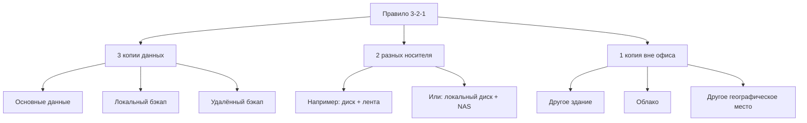
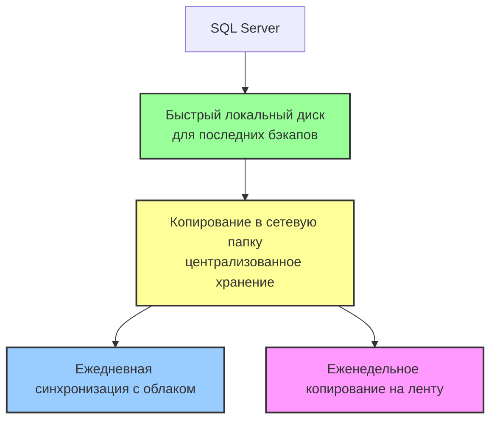

# 🔙 📚 🔜 Навигация по курсу

| [Предыдущее занятие](../LESSONS/PR21.MD) | &nbsp; | [Следующее занятие](../LESSONS/PR22.MD) |
|:--------------------------------------:|:------:|:-------------------------------------:|
| 🏠 [Практика №21](../LESSONS/PR21.MD) | 📖 [Содержание](../README.MD) | 💻 [Практика №22](../LESSONS/PR22.MD) |

---

# 🎓 Лекция 22. Хранение резервных копий: локально, сетевые папки

⏱️ **Продолжительность:** 90 минут  
🎯 **Цель лекции:**  
Сформировать у студентов понимание стратегий хранения резервных копий, их преимуществ и недостатков. Научить выбирать оптимальное место хранения в зависимости от требований к надёжности, скорости восстановления и бюджету. Рассмотреть локальные диски, сетевые папки, облачные хранилища и ленточные библиотеки, а также методы обеспечения отказоустойчивости хранилищ.

---
## 📖 Справочник терминов (официальные названия из русской SSMS)

| Русский термин | Английский эквивалент | Что это? | Пример |
|----------------|------------------------|----------|--------|
| Локальное хранилище | Local storage | Хранение на дисках того же сервера | `D:\Backup\` |
| Сетевое хранилище | Network storage | Хранение на сетевых ресурсах (UNC-пути) | `\\NAS\Backup\` |
| Облачное хранилище | Cloud storage | Хранение в облачных сервисах | Azure Blob, AWS S3 |
| Ленточная библиотека | Tape library | Хранение на магнитных лентах | Для долгосрочного архива |
| UNC-путь | UNC path | Universal Naming Convention - сетевой путь | `\\SERVER\Share\Folder` |
| SMB протокол | SMB protocol | Протокол доступа к сетевым папкам | Используется для сетевых ресурсов |
| Отказоустойчивость | Fault tolerance | Способность системы продолжать работу при сбоях | RAID, репликация |
| Географическая избыточность | Geo-redundancy | Хранение копий в разных географических точках | Azure Geo-Redundant Storage |
| Политика хранения | Retention policy | Правила, определяющие срок хранения копий | Хранить 30 дней |
| Ротация бэкапов | Backup rotation | Циклическая замена старых копий новыми | Схема "дед-отец-сын" |
| Медиа-набор | Media set | Набор носителей для резервных копий | Несколько файлов/лент |

---

## 1. 🧠 Почему место хранения критически важно?

### 1.1. Три копии, два разных носителя, одна вне сайта

**Золотое правило бэкапов (3-2-1 правило):**



### 1.2. Риски хранения в одном месте

| Риск | Локальный диск | Сетевая папка | Облако |
|------|----------------|---------------|--------|
| Пожар в серверной | 🔴 Потеря данных | 🟢 Безопасно | 🟢 Безопасно |
| Кража оборудования | 🔴 Потеря данных | 🟢 Безопасно | 🟢 Безопасно |
| Сбой диска | 🔴 Потеря бэкапов | 🟢 RAID защита | 🟢 Репликация |
| Вирус-шифровальщик | 🔴 Шифрует бэкапы | 🟡 Может заразить | 🟢 Версионирование |
| Ошибка администратора | 🔴 Случайное удаление | 🔴 Тоже удалит | 🟢 Можно восстановить |

### 1.3. История из реальной практики

> *"Администратор хранил бэкапы на том же диске, что и базы данных. Когда диск упал, он потерял всё. Бэкапы не спасли — они лежали рядом с данными."*

> *"В компании случился пожар в серверной. Все локальные бэкапы сгорели. Спаслись только те, кто хранил копии в другом здании."*

> *"Вирус-шифровальщик зашифровал все доступные диски, включая сетевые папки, подключенные к серверу. Выжили только бэкапы в облаке с версионированием."*

---

## 2. 💾 Локальное хранение (Local Storage)

### 2.1. Преимущества

| Аспект | Оценка | Пояснение |
|--------|--------|-----------|
| **Скорость** | ⚡⚡⚡⚡⚡ | Максимальная скорость чтения/записи |
| **Доступность** | ✅ Всегда доступно | Не зависит от сети |
| **Простота** | ✅ Легко настроить | Просто указать путь `D:\Backup\` |
| **Стоимость** | 💰 Средняя | Зависит от типа дисков |

### 2.2. Недостатки

| Аспект | Оценка | Пояснение |
|--------|--------|-----------|
| **Риск пожара/кражи** | 🔴 Высокий | Физически рядом с сервером |
| **Отказ диска** | 🔴 RAID не спасает | Если весь сервер упал |
| **Вирусы** | 🔴 Уязвим | Шифровальщики шифруют всё подряд |

### 2.3. Рекомендации по локальному хранению

```sql
-- Плохо (на системном диске)
BACKUP DATABASE AdventureWorks 
TO DISK = 'C:\Backup\AW.bak';  -- C: может заполниться и уронить ОС

-- Хорошо (на отдельном физическом диске)
BACKUP DATABASE AdventureWorks 
TO DISK = 'D:\Backup\AW.bak';  -- D: отдельный диск/массив

-- Отлично (на быстром RAID-массиве)
BACKUP DATABASE AdventureWorks 
TO DISK = 'E:\Backup\AW.bak';  -- E: RAID 10 для скорости и надёжности
```

### 2.4. Организация структуры папок

```
D:\Backup\
├── Full\           → Полные копии
│   ├── 202603\
│   └── 202604\
├── Diff\           → Разностные копии
│   └── 202603\
├── Log\            → Журналы транзакций
│   └── 202603\
└── Archive\        → Долгосрочное хранение
    └── 2025\
```

---

## 3. 🌐 Сетевое хранение (Network Storage)

### 3.1. Что такое UNC-путь

```
\\SERVER\Share\Folder\File.bak
  ↑       ↑      ↑       ↑
  Имя     Имя    Папка   Файл
сервера   ресурса
```

Пример: `\\NAS01\Backup\AdventureWorks\AW_20260313.bak`

### 3.2. Преимущества сетевого хранения

| Аспект | Оценка | Пояснение |
|--------|--------|-----------|
| **Централизация** | ✅ | Все бэкапы в одном месте |
| **Физическая безопасность** | 🟢 | Можно разместить в другом здании |
| **Масштабирование** | ✅ | Легко добавить диски |
| **Обслуживание** | ✅ | Не зависит от SQL Server |

### 3.3. Недостатки сетевого хранения

| Аспект | Оценка | Пояснение |
|--------|--------|-----------|
| **Скорость** | ⚡⚡ | Зависит от сети (обычно 1 Гбит/с) |
| **Надёжность сети** | 🔴 | Если сеть упала — бэкапы не пишутся |
| **Сложность настройки** | 🟡 | Права доступа, учётные записи |
| **Задержки** | 🐢 | Может тормозить при большой нагрузке |

### 3.4. Настройка сетевого доступа

**На стороне Windows (предоставление доступа):**
1. Создать папку
2. Правой кнопкой → Properties → Sharing
3. Добавить пользователя `SQL Server Agent` (обычно `NT SERVICE\SQLSERVERAGENT`)
4. Выдать права на чтение/запись

**На стороне SQL Server (использование):**

```sql
-- Сначала нужно создать учётные данные (Credential)
CREATE CREDENTIAL [NetworkBackupCredential]
WITH IDENTITY = 'DOMAIN\SQLServiceAccount',
SECRET = 'password';

-- Использовать сетевой путь
BACKUP DATABASE AdventureWorks
TO DISK = '\\NAS01\Backup\AdventureWorks\AW_20260313.bak'
WITH COMPRESSION, CHECKSUM;
```

### 3.5. Проблемы с правами доступа

```sql
-- Если возникает ошибка доступа, проверьте:
-- 1. Под какой учётной записью работает SQL Server Agent
EXEC xp_cmdshell 'whoami';

-- 2. Добавьте эту учётную запись в права на сетевую папку
-- 3. Можно использовать "Network Service" или специальную доменную учётку
```

---

## 4. ☁️ Облачное хранение (Cloud Storage)

### 4.1. Azure Blob Storage

```sql
-- Создание учётных данных для Azure
CREATE CREDENTIAL [https://storageaccount.blob.core.windows.net/backup]
WITH IDENTITY = 'SHARED ACCESS SIGNATURE',
SECRET = 'sv=2022-11-02&ss=b&srt=co&sp=rwdl&se=2026-12-31&sig=...';

-- Бэкап напрямую в Azure
BACKUP DATABASE AdventureWorks
TO URL = 'https://storageaccount.blob.core.windows.net/backup/AW_20260313.bak'
WITH COMPRESSION, CHECKSUM, STATS = 10;
```

### 4.2. Преимущества облака

| Аспект | Оценка | Пояснение |
|--------|--------|-----------|
| **Географическая избыточность** | 🟢 | Данные в нескольких дата-центрах |
| **Неограниченный размер** | ✅ | Платите только за использование |
| **Безопасность** | 🟢 | Шифрование, версионирование |
| **Доступность** | ✅ | 99.9% SLA |

### 4.3. Недостатки облака

| Аспект | Оценка | Пояснение |
|--------|--------|-----------|
| **Скорость** | ⚡ | Зависит от канала (обычно медленно) |
| **Стоимость** | 💰💰💰 | Плата за хранение и трафик |
| **Сложность настройки** | 🟡 | SAS-токены, политики доступа |
| **Восстановление** | 🐢 | Медленно скачивать большие объёмы |

### 4.4. AWS S3 (через сторонние утилиты)

SQL Server не умеет напрямую писать в S3, но можно:
1. Писать локально
2. Синхронизировать с S3 через PowerShell

```powershell
# PowerShell скрипт для загрузки в S3
Write-S3Object -BucketName "my-backup-bucket" `
               -File "C:\Backup\AW.bak" `
               -Key "AdventureWorks/20260313/AW.bak"
```

---

## 5. 🎞️ Ленточное хранение (Tape Storage)

### 5.1. Когда используется

- Долгосрочное хранение (годы)
- Соответствие законодательным требованиям
- Дешевизна при больших объёмах

### 5.2. Преимущества и недостатки

| Аспект | Оценка | Пояснение |
|--------|--------|-----------|
| **Стоимость** | 💰 | Дешево за гигабайт |
| **Долговечность** | ✅ | 30+ лет хранения |
| **Безопасность** | 🟢 | Физически отключается |
| **Скорость** | 🐢 | Очень медленно |
| **Доступность** | 🔴 | Только последовательный доступ |
| **Сложность** | 🟡 | Требуется специализированное ПО |

### 5.3. Пример работы с лентой

```sql
-- Бэкап на ленточное устройство
BACKUP DATABASE AdventureWorks
TO TAPE = '\\.\Tape0'
WITH COMPRESSION, CHECKSUM;
```

---

## 6. 📊 Сравнительная таблица вариантов хранения

| Критерий | Локальный диск | Сетевая папка | Облако | Лента |
|----------|----------------|---------------|--------|-------|
| **Скорость записи** | ⚡⚡⚡⚡⚡ | ⚡⚡⚡ | ⚡⚡ | ⚡ |
| **Скорость чтения** | ⚡⚡⚡⚡⚡ | ⚡⚡⚡ | ⚡⚡ | ⚡ |
| **Надёжность** | Средняя | Выше среднего | Очень высокая | Высокая |
| **Стоимость/ГБ** | Средняя | Средняя | Высокая | Низкая |
| **Масштабирование** | Ограничено | Хорошее | Отличное | Хорошее |
| **Гео-избыточность** | Нет | Можно | Да | Нет |
| **Защита от вирусов** | Нет | Частичная | Да | Да |
| **Восстановление после катастрофы** | Нет | Частично | Да | Частично |

---

## 7. 🏗️ Стратегии хранения

### 7.1. Гибридная стратегия (рекомендуемая)



### 7.2. Схема ротации "дед-отец-сын"

```
Сын (ежедневно) → хранятся 7 дней
Отец (еженедельно) → хранятся 4 недели
Дед (ежемесячно) → хранятся 12 месяцев

Локально: сын + отец
Сеть: отец + дед
Облако/лента: дед
```

### 7.3. Политика хранения по типам

| Тип бэкапа | Локально | Сеть | Облако | Срок |
|------------|----------|------|--------|------|
| Полные (ежедневные) | 3 дня | 7 дней | - | Краткосрочные |
| Полные (еженедельные) | 2 недели | 4 недели | 3 месяца | Среднесрочные |
| Полные (ежемесячные) | - | 3 месяца | 1 год | Долгосрочные |
| Журналы | 1 день | 3 дня | - | Для PITR |
| Разностные | 2 дня | 5 дней | - | Для ускорения |

---

## 8. 🛠️ Настройка хранения в SQL Server

### 8.1. Бэкап с копированием в несколько мест

```sql
-- Бэкап одновременно локально и в сетевую папку
BACKUP DATABASE AdventureWorks
TO DISK = 'D:\Backup\AdventureWorks_Full.bak',
   DISK = '\\NAS\Backup\AdventureWorks_Full.bak'
WITH COMPRESSION, CHECKSUM;
```

### 8.2. Создание медиа-набора для распределения

```sql
-- Распределение бэкапа на несколько устройств (striping)
BACKUP DATABASE AdventureWorks
TO DISK = 'D:\Backup\AW_1.bak',
   DISK = 'E:\Backup\AW_2.bak',
   DISK = '\\NAS\Backup\AW_3.bak'
WITH FORMAT,  -- инициализация нового медиа-набора
     COMPRESSION, CHECKSUM;
```

### 8.3. Автоматическое копирование после бэкапа

```sql
-- Создаём процедуру, которая копирует бэкап в сетевую папку
CREATE PROCEDURE dbo.usp_BackupAndCopy
    @DatabaseName NVARCHAR(128),
    @LocalPath NVARCHAR(255) = 'D:\Backup\',
    @NetworkPath NVARCHAR(255) = '\\NAS\Backup\'
AS
BEGIN
    DECLARE @FileName NVARCHAR(500);
    DECLARE @LocalFile NVARCHAR(500);
    DECLARE @NetworkFile NVARCHAR(500);
    DECLARE @DateStr NVARCHAR(20) = FORMAT(GETDATE(), 'yyyyMMdd_HHmm');
    
    -- Локальный файл
    SET @LocalFile = @LocalPath + @DatabaseName + '_' + @DateStr + '.bak';
    
    -- Бэкап локально
    BACKUP DATABASE @DatabaseName TO DISK = @LocalFile
    WITH COMPRESSION, CHECKSUM;
    
    -- Копирование в сетевую папку
    SET @NetworkFile = @NetworkPath + @DatabaseName + '_' + @DateStr + '.bak';
    
    DECLARE @CopyCommand NVARCHAR(1000);
    SET @CopyCommand = 'COPY "' + @LocalFile + '" "' + @NetworkFile + '"';
    
    -- Включите xp_cmdshell для выполнения
    EXEC xp_cmdshell @CopyCommand;
    
    -- Проверка, что копирование успешно
    IF EXISTS (SELECT 1 FROM OPENROWSET(BULK @NetworkFile, SINGLE_BLOB) AS x)
        PRINT 'Копирование в сеть успешно';
    ELSE
        PRINT 'Ошибка копирования в сеть';
END;
```

---

## 9. ⚠️ Подводные камни и типовые ошибки

### 9.1. Ошибка: "Нет места на диске"

**Причина:** Не настроена очистка старых бэкапов.

**Решение:**
```sql
-- Скрипт для удаления файлов старше 30 дней
EXEC xp_cmdshell 'forfiles /p "D:\Backup" /s /m *.bak /d -30 /c "cmd /c del @file"';
```

### 9.2. Ошибка: "Не удалось получить доступ к сетевой папке"

**Причина:** Неправильные права доступа.

**Проверка:**
```sql
-- Проверка доступа к сетевой папке
EXEC xp_cmdshell 'dir \\NAS\Backup';
```

### 9.3. Ошибка: "Сетевой путь не найден"

**Причина:** Проблемы с DNS или отключённый NAS.

**Решение:** Использовать IP-адрес вместо имени:
```sql
BACKUP DATABASE AdventureWorks
TO DISK = '\\192.168.1.100\Backup\AW.bak';
```

### 9.4. Ошибка: "Медленное восстановление из сети"

**Причина:** Сеть 1 Гбит/с → максимум 100 МБ/с. Для 500 ГБ базы это 1.5 часа.

**Решение:** Хранить последние копии локально, сеть — для архива.

---

## 10. ✅ Резюме: чек-лист администратора

### При выборе места хранения:
- [ ] Локально: отдельный физический диск (не C:)
- [ ] Сеть: централизованное хранилище в другом здании
- [ ] Облако: географическая избыточность
- [ ] Лента: долгосрочный архив

### При настройке:
- [ ] Настроить права доступа для SQL Server Agent
- [ ] Организовать структуру папок по датам
- [ ] Настроить автоматическую очистку старых файлов
- [ ] Проверить скорость записи/чтения
- [ ] Протестировать восстановление из каждого хранилища

🔑 **Золотое правило:**  
> *«Храните бэкапы в трёх местах: одно быстрое (локально), одно надёжное (сеть), одно вечное (облако/лента).»*

---

## 11. ❓ Вопросы для самопроверки

1. Почему нельзя хранить бэкапы на том же диске, что и база данных?
2. Какие преимущества даёт сетевое хранение перед локальным?
3. Какие риски возникают при использовании только сетевого хранения?
4. Что такое UNC-путь и как он формируется?
5. Какие проблемы с правами доступа могут возникнуть при бэкапе в сетевую папку?
6. Как настроить бэкап напрямую в Azure Blob Storage?
7. В чём преимущества и недостатки облачного хранения?
8. Когда используется ленточное хранение?
9. Что означает правило 3-2-1?
10. Как организовать ротацию бэкапов по схеме "дед-отец-сын"?
11. Как проверить доступность сетевой папки из T-SQL?
12. Что делать, если бэкап в сетевую папку работает медленно?
13. Как защитить бэкапы от вирусов-шифровальщиков?
14. Как настроить автоматическое удаление старых бэкапов?
15. Какие системные таблицы хранят информацию о местоположении бэкапов?

---

## 📎 Приложение: Шпаргалка команд

```sql
-- Бэкап локально
BACKUP DATABASE DB TO DISK = 'D:\Backup\DB.bak';

-- Бэкап в сетевую папку
BACKUP DATABASE DB TO DISK = '\\NAS\Backup\DB.bak';

-- Бэкап одновременно в два места
BACKUP DATABASE DB TO DISK = 'D:\Backup\DB.bak', DISK = '\\NAS\Backup\DB.bak';

-- Бэкап в Azure
BACKUP DATABASE DB TO URL = 'https://storage.blob.core.windows.net/backup/DB.bak';

-- Проверка доступа к сетевой папке
EXEC xp_cmdshell 'dir \\NAS\Backup';

-- Создание учётных данных для Azure
CREATE CREDENTIAL [https://storage.blob.core.windows.net/backup]
WITH IDENTITY = 'SHARED ACCESS SIGNATURE',
SECRET = 'sv=...';

-- Очистка старых файлов (через командную строку)
EXEC xp_cmdshell 'forfiles /p "D:\Backup" /m *.bak /d -30 /c "cmd /c del @file"';
```

---

📜 **Лицензия:** CC BY-NC-SA 4.0  
👨‍🏫 **Автор:** Руслан Ринатович Сафиулин  
📅 **Дата:** 17.03.2026

---


# 🔙 📚 🔜 Навигация по курсу

| [Предыдущее занятие](../LESSONS/PR21.MD) | &nbsp; | [Следующее занятие](../LESSONS/PR22.MD) |
|:--------------------------------------:|:------:|:-------------------------------------:|
| 🏠 [Практика №21](../LESSONS/PR21.MD) | 📖 [Содержание](../README.MD) | 💻 [Практика №22](../LESSONS/PR22.MD) |

