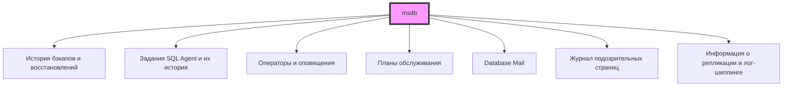
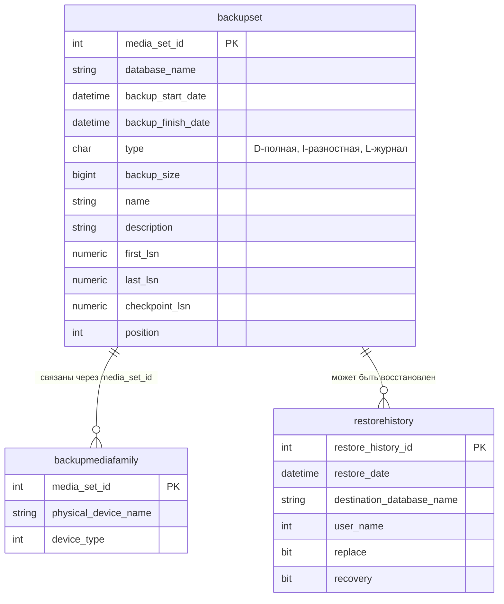
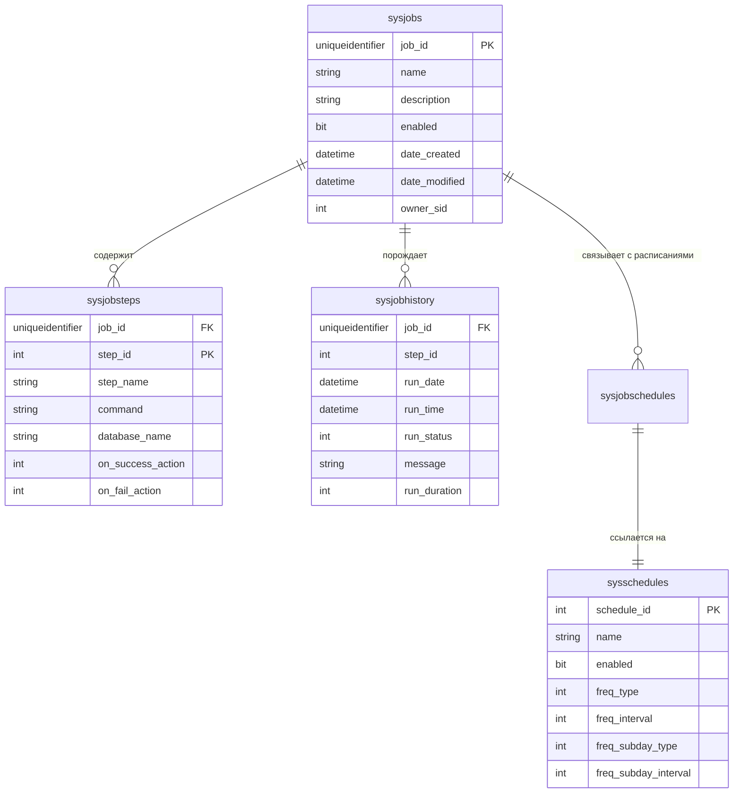

# 🔙 📚 🔜 Навигация по курсу

| [Предыдущее занятие](../LESSONS/PR22.MD) | &nbsp; | [Следующее занятие](../LESSONS/PR23.MD) |
|:--------------------------------------:|:------:|:-------------------------------------:|
| 🏠 [Практика №22](../LESSONS/PR22.MD) | 📖 [Содержание](../README.MD) | 💻 [Практика №23](../LESSONS/PR23.MD) |

---

# 🎓 Лекция 23. Журнал msdb: отслеживание успешных/неудачных операций

⏱️ **Продолжительность:** 90 минут  
🎯 **Цель лекции:**  
Сформировать у студентов понимание роли системной базы данных msdb как центрального хранилища истории операций SQL Server. Научиться извлекать информацию о резервных копиях, заданиях SQL Agent, обслуживающих планах и ошибках, а также интерпретировать эти данные для мониторинга и аудита. Освоить методы диагностики проблем и проактивного контроля на основе анализа msdb.

---

## 🔙 📚 🔜 Навигация по курсу

| [Предыдущее занятие](../lesson-22/practice.md) | &nbsp; | [Следующее занятие](../lesson-23/practice.md) |
|:-----------------------------------------------:|:------:|:---------------------------------------------:|
| 💻 [Практика №22](../lesson-22/practice.md) | 📖 [Содержание](../../README.md) | 💻 [Практика №23](practice.md) |

---

## 📖 Справочник терминов (официальные названия из русской SSMS)

| Русский термин | Английский эквивалент | Что это? | Таблица/Представление |
|----------------|------------------------|----------|----------------------|
| **База данных msdb** | msdb database | Системная база данных для хранения истории операций, заданий, бэкапов | — |
| **Журнал резервных копий** | Backup history | История всех выполненных операций резервного копирования | `backupset`, `backupmediafamily` |
| **Журнал восстановлений** | Restore history | История операций восстановления | `restorehistory` |
| **Задание** | Job | Набор шагов, выполняемых по расписанию | `sysjobs` |
| **Шаг задания** | Job step | Отдельная команда в задании | `sysjobsteps` |
| **История выполнения заданий** | Job history | Журнал запусков и результатов заданий | `sysjobhistory` |
| **Расписание** | Schedule | Время и периодичность выполнения задания | `sysschedules` |
| **Оператор** | Operator | Получатель уведомлений | `sysoperators` |
| **Оповещение** | Alert | Реакция на событие или ошибку | `sysalerts` |
| **План обслуживания** | Maintenance plan | Набор задач по обслуживанию БД | `sysssispackages` |
| **История почты** | Mail history | Журнал отправки email через Database Mail | `sysmail_allitems` |
| **Подозрительные страницы** | Suspect pages | Страницы с ошибками целостности | `suspect_pages` |

---

## 1. 🧠 Что такое msdb и зачем она нужна?

### 1.1. Роль msdb в экосистеме SQL Server

**Msdb** — это системная база данных, которая служит **центральным "чёрным ящиком"** для SQL Server . Если `master` хранит конфигурацию сервера, то `msdb` хранит **историю деятельности** .



### 1.2. Почему важно знать msdb?

| Сценарий | Запрос к msdb даёт ответ |
|----------|--------------------------|
| **Аудит** | "Когда в последний раз делался бэкап базы Sales?" |
| **Диагностика** | "Почему не запустилось ночное задание?" |
| **Мониторинг** | "Какие базы не бэкапились больше суток?" |
| **Безопасность** | "Кто создал это задание?" |
| **Производительность** | "Сколько времени занял последний бэкап?" |
| **Планирование** | "Какой размер бэкапов за последний месяц?" |

### 1.3. Где физически находится msdb?

```sql
-- Физическое расположение файлов msdb
SELECT 
    name,
    physical_name,
    type_desc,
    state_desc
FROM sys.master_files
WHERE database_id = DB_ID('msdb');
```

По умолчанию:
- Данные: `C:\Program Files\Microsoft SQL Server\MSSQL15.MSSQLSERVER\MSSQL\DATA\MSDBData.mdf`
- Журнал: `C:\Program Files\Microsoft SQL Server\MSSQL15.MSSQLSERVER\MSSQL\DATA\MSDBLog.ldf` 

### 1.4. Модель восстановления msdb

По умолчанию msdb использует **простую модель восстановления** (SIMPLE) . Однако Microsoft **рекомендует** переключить её на FULL, если вы используете таблицы истории бэкапов .

```sql
-- Проверка модели восстановления msdb
SELECT recovery_model_desc 
FROM sys.databases 
WHERE name = 'msdb';

-- Перевод в FULL (рекомендуется для production)
ALTER DATABASE msdb SET RECOVERY FULL;
```

**Важно!** После любого обновления SQL Server или перестроения системных баз модель msdb сбрасывается на SIMPLE .

---

## 2. 📚 Ключевые таблицы msdb

### 2.1. Таблицы истории резервного копирования 



**Пример запроса :**

```sql
SELECT 
    bs.database_name,
    bmf.physical_device_name,
    CASE bs.type
        WHEN 'D' THEN 'Полная'
        WHEN 'I' THEN 'Разностная'
        WHEN 'L' THEN 'Журнал'
    END AS BackupType,
    bs.backup_size / 1048576 AS SizeMB,
    bs.backup_start_date,
    bs.backup_finish_date,
    DATEDIFF(minute, bs.backup_start_date, bs.backup_finish_date) AS DurationMin
FROM msdb.dbo.backupset bs
JOIN msdb.dbo.backupmediafamily bmf 
    ON bs.media_set_id = bmf.media_set_id
ORDER BY bs.backup_start_date DESC;
```

### 2.2. Таблицы заданий SQL Agent 



**Значения run_status в sysjobhistory :**
- `0` — Ошибка (Failed)
- `1` — Успех (Succeeded)
- `2` — Повтор (Retry)
- `3` — Отменён (Canceled)
- `4` — Выполняется (In progress)

### 2.3. Таблицы Database Mail

| Таблица | Назначение |
|---------|------------|
| `sysmail_allitems` | Все отправленные сообщения |
| `sysmail_sentitems` | Успешно отправленные |
| `sysmail_unsentitems` | Ожидающие отправки |
| `sysmail_faileditems` | Ошибочные при отправке  |
| `sysmail_mailattachments` | Вложения |

### 2.4. Таблица подозрительных страниц 

```sql
SELECT 
    database_id,
    file_id,
    page_id,
    event_type,
    error_count,
    last_update_date
FROM msdb.dbo.suspect_pages;
```

**Значения event_type:**
- 1 — ошибка 823 (ошибка ввода-вывода)
- 2 — ошибка 824 (несовпадение контрольной суммы)
- 3 — страница восстановлена
- 4 — восстановленная страница (отложенная)

### 2.5. Таблицы планов обслуживания 

Начиная с SQL Server 2005, планы обслуживания хранятся как SSIS-пакеты:

```sql
SELECT 
    name,
    description,
    created,
    packageFormat
FROM msdb.dbo.sysssispackages
WHERE name LIKE '%Maintenance%';
```

### 2.6. Таблицы лог-шиппинга 

```sql
-- Таблицы с префиксом log_shipping
SELECT * FROM msdb.dbo.log_shipping_primary_databases;
SELECT * FROM msdb.dbo.log_shipping_secondary_databases;
SELECT * FROM msdb.dbo.log_shipping_monitor_history_detail;
```

---

## 3. 🔍 Полезные аналитические запросы

### 3.1. Последний бэкап для каждой базы 

```sql
WITH LastBackups AS (
    SELECT 
        database_name,
        type,
        backup_finish_date,
        ROW_NUMBER() OVER (PARTITION BY database_name, type ORDER BY backup_finish_date DESC) AS rn
    FROM msdb.dbo.backupset
    WHERE database_name NOT IN ('master', 'model', 'msdb', 'tempdb')
)
SELECT 
    database_name,
    MAX(CASE WHEN type = 'D' AND rn = 1 THEN backup_finish_date END) AS LastFull,
    MAX(CASE WHEN type = 'I' AND rn = 1 THEN backup_finish_date END) AS LastDiff,
    MAX(CASE WHEN type = 'L' AND rn = 1 THEN backup_finish_date END) AS LastLog,
    DATEDIFF(hh, 
        MAX(CASE WHEN type = 'D' AND rn = 1 THEN backup_finish_date END), 
        GETDATE()) AS HoursSinceLastFull
FROM LastBackups
GROUP BY database_name
ORDER BY HoursSinceLastFull DESC;
```

### 3.2. Размер бэкапов по дням

```sql
SELECT 
    database_name,
    CONVERT(DATE, backup_start_date) AS BackupDate,
    COUNT(*) AS BackupCount,
    SUM(backup_size / 1048576) AS TotalSizeMB,
    AVG(backup_size / 1048576) AS AvgSizeMB
FROM msdb.dbo.backupset
WHERE backup_start_date > DATEADD(day, -30, GETDATE())
GROUP BY database_name, CONVERT(DATE, backup_start_date)
ORDER BY database_name, BackupDate DESC;
```

### 3.3. История выполнения заданий 

```sql
SELECT 
    j.name AS JobName,
    jh.run_date,
    jh.run_time,
    jh.run_duration,
    CASE jh.run_status
        WHEN 0 THEN '❌ Ошибка'
        WHEN 1 THEN '✅ Успех'
        WHEN 2 THEN '🔄 Повтор'
        WHEN 3 THEN '⏹️ Отменён'
        WHEN 4 THEN '⏳ Выполняется'
    END AS Status,
    jh.message
FROM msdb.dbo.sysjobs j
JOIN msdb.dbo.sysjobhistory jh ON j.job_id = jh.job_id
WHERE jh.run_date > CONVERT(VARCHAR, DATEADD(day, -7, GETDATE()), 112)
ORDER BY jh.run_date DESC, jh.run_time DESC;
```

### 3.4. Самые долгие задания

```sql
SELECT TOP 10
    j.name AS JobName,
    jh.step_name,
    jh.run_date,
    jh.run_time,
    jh.run_duration,
    jh.run_duration / 10000 AS Hours,
    (jh.run_duration % 10000) / 100 AS Minutes,
    (jh.run_duration % 100) AS Seconds,
    jh.message
FROM msdb.dbo.sysjobs j
JOIN msdb.dbo.sysjobhistory jh ON j.job_id = jh.job_id
WHERE jh.run_status = 1  -- только успешные
ORDER BY jh.run_duration DESC;
```

### 3.5. Мониторинг Database Mail 

```sql
-- Последние 10 писем
SELECT TOP 10
    mailitem_id,
    send_request_date,
    sent_status,
    recipients,
    subject,
    last_mod_date
FROM msdb.dbo.sysmail_allitems
ORDER BY send_request_date DESC;

-- Неудачные письма
SELECT * FROM msdb.dbo.sysmail_faileditems
ORDER BY last_mod_date DESC;
```

### 3.6. Задания, которые не выполнялись долгое время

```sql
SELECT 
    j.name AS JobName,
    j.enabled,
    MAX(jh.run_date) AS LastRunDate,
    DATEDIFF(day, CONVERT(DATETIME, MAX(jh.run_date)), GETDATE()) AS DaysSinceLastRun
FROM msdb.dbo.sysjobs j
LEFT JOIN msdb.dbo.sysjobhistory jh ON j.job_id = jh.job_id
WHERE j.enabled = 1
GROUP BY j.name, j.enabled
HAVING MAX(jh.run_date) IS NULL 
    OR DATEDIFF(day, CONVERT(DATETIME, MAX(jh.run_date)), GETDATE()) > 7
ORDER BY DaysSinceLastRun DESC;
```

### 3.7. Просмотр истории конкретного задания 

```sql
EXEC msdb.dbo.sp_help_jobhistory 
    @job_name = N'NightlyBackups',
    @mode = 'FULL';
```

---

## 4. ⚠️ Мониторинг и проактивное администрирование

### 4.1. Создание проактивного мониторинга 

```sql
-- Создаём таблицу для результатов проверки
CREATE TABLE dbo.BackupMonitorResults (
    CheckID INT IDENTITY(1,1) PRIMARY KEY,
    CheckTime DATETIME DEFAULT GETDATE(),
    DatabaseName NVARCHAR(128),
    LastFullBackup DATETIME,
    LastDiffBackup DATETIME,
    LastLogBackup DATETIME,
    Status NVARCHAR(50),
    AlertMessage NVARCHAR(MAX)
);

-- Процедура проверки бэкапов
CREATE PROCEDURE dbo.usp_CheckBackups
AS
BEGIN
    DECLARE @Databases TABLE (DbName NVARCHAR(128));
    DECLARE @DbName NVARCHAR(128);
    DECLARE @LastFull DATETIME, @LastDiff DATETIME, @LastLog DATETIME;
    DECLARE @Status NVARCHAR(50);
    DECLARE @Message NVARCHAR(MAX);
    
    -- Собираем все пользовательские базы
    INSERT INTO @Databases (DbName)
    SELECT name FROM sys.databases 
    WHERE database_id > 4 AND state_desc = 'ONLINE';
    
    DECLARE db_cursor CURSOR FOR SELECT DbName FROM @Databases;
    OPEN db_cursor;
    FETCH NEXT FROM db_cursor INTO @DbName;
    
    WHILE @@FETCH_STATUS = 0
    BEGIN
        -- Получаем последние бэкапы
        SELECT @LastFull = MAX(backup_finish_date)
        FROM msdb.dbo.backupset
        WHERE database_name = @DbName AND type = 'D';
        
        SELECT @LastDiff = MAX(backup_finish_date)
        FROM msdb.dbo.backupset
        WHERE database_name = @DbName AND type = 'I';
        
        SELECT @LastLog = MAX(backup_finish_date)
        FROM msdb.dbo.backupset
        WHERE database_name = @DbName AND type = 'L';
        
        -- Оценка статуса
        SET @Status = 'OK';
        SET @Message = NULL;
        
        IF @LastFull IS NULL
        BEGIN
            SET @Status = 'CRITICAL';
            SET @Message = 'Никогда не было полного бэкапа!';
        END
        ELSE IF DATEDIFF(day, @LastFull, GETDATE()) > 7
        BEGIN
            SET @Status = 'WARNING';
            SET @Message = 'Последний полный бэкап более 7 дней назад';
        END
        
        IF @Status = 'OK' AND @LastLog IS NOT NULL 
            AND DATEDIFF(hour, @LastLog, GETDATE()) > 24
        BEGIN
            SET @Status = 'WARNING';
            SET @Message = 'Бэкап журнала более 24 часов назад';
        END
        
        -- Сохраняем результат
        INSERT INTO dbo.BackupMonitorResults 
            (DatabaseName, LastFullBackup, LastDiffBackup, LastLogBackup, Status, AlertMessage)
        VALUES (@DbName, @LastFull, @LastDiff, @LastLog, @Status, @Message);
        
        FETCH NEXT FROM db_cursor INTO @DbName;
    END
    
    CLOSE db_cursor;
    DEALLOCATE db_cursor;
    
    -- Отправка email при критических проблемах (если настроена Database Mail)
    IF EXISTS (SELECT 1 FROM dbo.BackupMonitorResults WHERE Status = 'CRITICAL')
    BEGIN
        DECLARE @Body NVARCHAR(MAX);
        SET @Body = 'Критические проблемы с бэкапами:' + CHAR(13) + CHAR(10);
        SELECT @Body = @Body + DatabaseName + ': ' + AlertMessage + CHAR(13) + CHAR(10)
        FROM dbo.BackupMonitorResults WHERE Status = 'CRITICAL';
        
        EXEC msdb.dbo.sp_send_dbmail
            @profile_name = 'DBA Profile',
            @recipients = 'dba@company.com',
            @subject = 'КРИТИЧЕСКИЕ ПРОБЛЕМЫ С БЭКАПАМИ',
            @body = @Body;
    END
END;
```

### 4.2. Очистка старой истории

История бэкапов и заданий может сильно разрастаться. SQL Server автоматически чистит историю, но можно управлять вручную:

```sql
-- Очистка истории бэкапов старше 90 дней
DECLARE @OldestDate DATETIME = DATEADD(day, -90, GETDATE());
EXEC msdb.dbo.sp_delete_backuphistory @oldest_date = @OldestDate;

-- Очистка истории заданий старше 90 дней
EXEC msdb.dbo.sp_purge_jobhistory @oldest_date = @OldestDate;
```

### 4.3. Рекомендации по резервному копированию msdb 

После любых изменений в:
- заданиях
- операторах и оповещениях
- планах обслуживания
- профилях Database Mail
- политиках управления

**Немедленно делайте бэкап msdb!**

```sql
BACKUP DATABASE msdb
TO DISK = N'C:\Backup\msdb_' + FORMAT(GETDATE(), 'yyyyMMdd_HHmm') + '.bak'
WITH COMPRESSION, CHECKSUM;
```

---

## 5. 🛡️ Ограничения и защита msdb 

### 5.1. Что нельзя делать с msdb

| Операция | Разрешено? | Примечание |
|----------|------------|------------|
| Изменение сортировки | ❌ | Должна совпадать с серверной |
| Удаление базы | ❌ | Системная БД |
| Удаление пользователя guest | ❌ | Необходим для работы |
| Участие в зеркалировании | ❌ | Не поддерживается |
| Переименование базы | ❌ | Имя фиксировано |
| Перевод в OFFLINE | ❌ | Остановит SQL Agent |
| Смена модели на SIMPLE | ✅ | Но не рекомендуется  |
| Создание пользовательских объектов | ✅ | Но увеличивает частоту бэкапов  |

### 5.2. Безопасность msdb

**Рекомендации Microsoft :**
- Рассматривайте msdb как критически важную базу
- Не давайте доступ без необходимости
- Аудируйте изменения объектов в msdb
- Учитывайте, что задания часто выполняются от имени sysadmin

---

## 6. ✅ Резюме: чек-лист администратора

### Ежедневно:
- [ ] Проверять неудачные задания (`sysjobhistory` с run_status = 0)
- [ ] Проверять неудачные email (`sysmail_faileditems`)
- [ ] Мониторить подозрительные страницы (`suspect_pages`)

### Еженедельно:
- [ ] Анализировать свежесть бэкапов всех баз
- [ ] Проверять задания, которые не выполнялись более 7 дней
- [ ] Оценивать размер и динамику роста msdb

### Ежемесячно:
- [ ] Очищать устаревшую историю (старше 90 дней)
- [ ] Делать бэкап msdb
- [ ] Анализировать тенденции (время выполнения, размер бэкапов)

🔑 **Золотое правило:**  
> *«Msdb — это память вашего сервера. Храните её в чистоте, регулярно бекапьте, и она всегда подскажет, что пошло не так.»*

---

## 7. ❓ Вопросы для самопроверки

1. Какие категории информации хранятся в msdb?
2. В каких таблицах msdb хранится история резервных копий?
3. Как связаны таблицы `backupset` и `backupmediafamily`?
4. Как узнать, какие задания провалились за последние сутки?
5. Что означают значения `run_status` в `sysjobhistory`?
6. Как найти все письма, отправленные через Database Mail, за последний месяц?
7. Где SQL Server хранит информацию о подозрительных страницах?
8. Почему msdb нужно регулярно бекапить?
9. Какие ограничения существуют при работе с msdb?
10. Как очистить старую историю бэкапов?
11. Как найти базы, которые не бэкапились более 7 дней?
12. Как определить, сколько времени заняло выполнение задания?
13. Какие риски возникают при создании пользовательских объектов в msdb?
14. Как проверить, включена ли Database Mail и работает ли она?
15. Почему msdb по умолчанию использует простую модель восстановления?

---

## 📎 Приложение: Шпаргалка по msdb

```sql
-- Переключение в msdb
USE msdb;
GO

-- Последние 10 бэкапов
SELECT TOP 10 * FROM backupset ORDER BY backup_start_date DESC;

-- Последние 10 заданий
SELECT TOP 10 j.name, jh.* 
FROM sysjobs j
JOIN sysjobhistory jh ON j.job_id = jh.job_id
ORDER BY jh.run_date DESC, jh.run_time DESC;

-- Проваленные задания за сегодня
SELECT * FROM sysjobhistory 
WHERE run_date = CONVERT(VARCHAR, GETDATE(), 112)
    AND run_status = 0;

-- Размер msdb
EXEC sp_spaceused;

-- Очистка истории бэкапов старше 30 дней
EXEC sp_delete_backuphistory @oldest_date = '2026-02-17';

-- Просмотр настроек Database Mail
SELECT * FROM sysmail_profile;
SELECT * FROM sysmail_account;
```

---

📜 **Лицензия:** CC BY-NC-SA 4.0  
👨‍🏫 **Автор:** Руслан Ринатович Сафиулин  
📅 **Дата:** 19.03.2026

---

# 🔙 📚 🔜 Навигация по курсу

| [Предыдущее занятие](../LESSONS/PR22.MD) | &nbsp; | [Следующее занятие](../LESSONS/PR23.MD) |
|:--------------------------------------:|:------:|:-------------------------------------:|
| 🏠 [Практика №22](../LESSONS/PR22.MD) | 📖 [Содержание](../README.MD) | 💻 [Практика №23](../LESSONS/PR23.MD) |
