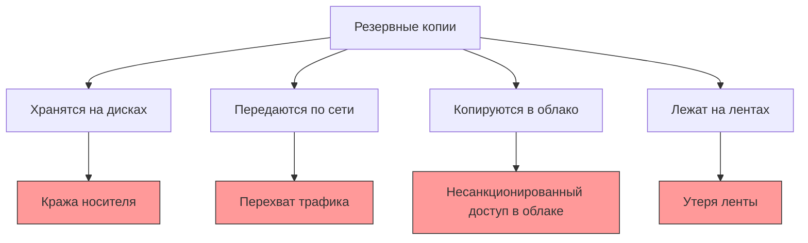
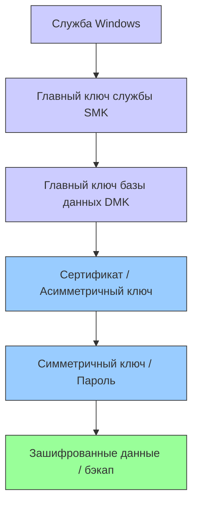
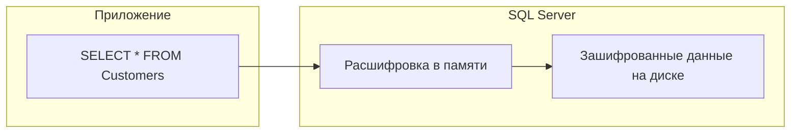

# 🔙 📚 🔜 Навигация по курсу

| [Предыдущее занятие](../LESSONS/PR23.MD) | &nbsp; | [Следующее занятие](../LESSONS/PR24.MD) |
|:--------------------------------------:|:------:|:-------------------------------------:|
| 🏠 [Практика №23](../LESSONS/PR23.MD) | 📖 [Содержание](../README.MD) | 💻 [Практика №24](../LESSONS/PR24.MD) |

---
# 🎓 Лекция 24. Шифрование резервных копий (TDE, backup encryption)

⏱️ **Продолжительность:** 90 минут  
🎯 **Цель лекции:**  
Сформировать у студентов понимание методов защиты резервных копий от несанкционированного доступа. Научить использовать встроенные механизмы шифрования резервных копий в SQL Server, различать TDE (прозрачное шифрование данных) и шифрование бэкапов, а также управлять ключами шифрования и сертификатами.

---

## 📖 Справочник терминов (официальные названия из русской SSMS)

| Русский термин | Английский эквивалент | Что это? | Пример |
|----------------|------------------------|----------|--------|
| **Шифрование резервной копии** | Backup encryption | Защита бэкапа паролем или сертификатом | `WITH ENCRYPTION` |
| **TDE** | Transparent Data Encryption | Прозрачное шифрование данных на диске | Шифрует файлы .mdf/.ndf |
| **Сертификат** | Certificate | Цифровой сертификат для шифрования | `CREATE CERTIFICATE` |
| **Асимметричный ключ** | Asymmetric key | Пара ключей: публичный и приватный | `CREATE ASYMMETRIC KEY` |
| **Симметричный ключ** | Symmetric key | Один ключ для шифрования и расшифровки | `CREATE SYMMETRIC KEY` |
| **Главный ключ службы** | Service Master Key (SMK) | Корневой ключ SQL Server | Создаётся автоматически |
| **Главный ключ базы данных** | Database Master Key (DMK) | Ключ для шифрования объектов в БД | `CREATE MASTER KEY` |
| **Шифрование с паролем** | Password encryption | Защита бэкапа паролем | `WITH PASSWORD = '...'` |
| **Шифрование с сертификатом** | Certificate encryption | Защита бэкапа сертификатом | `WITH CERTIFICATE = ...` |
| **Резервное копирование ключа** | Key backup | Экспорт ключа для восстановления | `BACKUP CERTIFICATE` |
| **Метаданные бэкапа** | Backup metadata | Информация о бэкапе в msdb | Не шифруется |

---

## 1. 🛡️ Зачем шифровать резервные копии?

### 1.1. Реальные угрозы для бэкапов



**Статистика:**
- 70% утечек данных связаны с потерянными/украденными носителями
- 40% организаций не шифруют резервные копии
- Средняя стоимость утечки 1 ГБ данных — $10 000

### 1.2. Требования законодательства

| Законодательство | Требование к шифрованию |
|-------------------|-------------------------|
| **GDPR (ЕС)** | Персональные данные должны быть защищены |
| **152-ФЗ (РФ)** | Защита персональных данных в ИСПДн |
| **PCI DSS** | Данные платёжных карт должны быть зашифрованы |
| **HIPAA (США)** | Медицинские данные требуют шифрования |

### 1.3. Два подхода к защите

| Подход | Описание | Плюсы | Минусы |
|--------|----------|-------|--------|
| **Шифрование бэкапа** | Шифруется только файл бэкапа | Гибкость, разные ключи | Нужно управлять ключами |
| **TDE** | Шифруются все файлы базы | Прозрачно для приложений | Влияет на производительность |

---

## 2. 🔐 Иерархия шифрования в SQL Server



### 2.1. Главный ключ службы (SMK)

Создаётся автоматически при первом запуске SQL Server. Защищён учётной записью службы Windows.

```sql
-- Просмотр SMK
SELECT * FROM sys.symmetric_keys WHERE name = '##MS_ServiceMasterKey##';
```

### 2.2. Главный ключ базы данных (DMK)

Создаётся для каждой базы, где используется шифрование. Защищён SMK и паролем.

```sql
CREATE MASTER KEY ENCRYPTION BY PASSWORD = 'StrongPassword123!';
```

### 2.3. Сертификаты и ключи

```sql
-- Создание сертификата
CREATE CERTIFICATE MyBackupCert 
WITH SUBJECT = 'Certificate for backup encryption';

-- Создание асимметричного ключа
CREATE ASYMMETRIC KEY MyBackupKey 
WITH ALGORITHM = RSA_2048 
ENCRYPTION BY PASSWORD = 'KeyPassword123!';
```

### 2.4. Симметричные ключи

```sql
-- Создание симметричного ключа, защищённого сертификатом
CREATE SYMMETRIC KEY MySymKey 
WITH ALGORITHM = AES_256 
ENCRYPTION BY CERTIFICATE MyBackupCert;
```

---

## 3. 📀 Шифрование резервных копий

### 3.1. Два способа шифрования бэкапов

| Способ | Синтаксис | Когда использовать |
|--------|-----------|-------------------|
| **С паролем** | `WITH PASSWORD = '...'` | Простота, не требует инфраструктуры ключей |
| **С сертификатом/ключом** | `WITH ENCRYPTION (ALGORITHM = AES_256, SERVER CERTIFICATE = ...)` | Надёжность, централизованное управление |

### 3.2. Шифрование с паролем

```sql
-- Создание бэкапа с паролем
BACKUP DATABASE AdventureWorks
TO DISK = 'D:\Backup\AdventureWorks_Encrypted.bak'
WITH 
    COMPRESSION,
    PASSWORD = 'MyStrongPassword123!';
```

**Восстановление с паролем:**
```sql
RESTORE DATABASE AdventureWorks
FROM DISK = 'D:\Backup\AdventureWorks_Encrypted.bak'
WITH PASSWORD = 'MyStrongPassword123!';
```

⚠️ **Важно:** Парольное шифрование — это **слабая защита**. Пароль может быть подобран брутфорсом. Рекомендуется использовать сертификаты.

### 3.3. Шифрование с сертификатом (рекомендуемый способ)

```sql
-- Шаг 1: Создать мастер-ключ базы (если не создан)
USE master;
GO
CREATE MASTER KEY ENCRYPTION BY PASSWORD = 'StrongMasterKey123!';

-- Шаг 2: Создать сертификат
CREATE CERTIFICATE BackupCert
WITH SUBJECT = 'Certificate for backup encryption';

-- Шаг 3: Создать зашифрованный бэкап
BACKUP DATABASE AdventureWorks
TO DISK = 'D:\Backup\AdventureWorks_CertEncrypted.bak'
WITH 
    COMPRESSION,
    ENCRYPTION (
        ALGORITHM = AES_256,
        SERVER CERTIFICATE = BackupCert
    );
```

### 3.4. Поддерживаемые алгоритмы шифрования

| Алгоритм | Размер ключа | Скорость | Надёжность |
|----------|--------------|----------|------------|
| **AES_128** | 128 бит | ⚡⚡⚡⚡ | ✅ Хорошая |
| **AES_192** | 192 бит | ⚡⚡⚡ | ✅ Отличная |
| **AES_256** | 256 бит | ⚡⚡ | ✅✅ Отличная |
| **TRIPLE_DES_3KEY** | 168 бит | ⚡⚡ | ⚠️ Устарел |

**Рекомендация:** Используйте **AES_256** для максимальной защиты.

---

## 4. 🏢 TDE (Transparent Data Encryption)

### 4.1. Что такое TDE?

TDE — это технология, которая **автоматически** шифрует все данные на диске (файлы .mdf, .ndf, .ldf) **без изменения приложений**.



### 4.2. Когда использовать TDE?

✅ **TDE подходит, если:**
- Нужно защитить все данные в базе
- Нельзя менять приложения
- Требуется соответствие законодательству (152-ФЗ, PCI DSS)
- Данные хранятся на съёмных носителях

❌ **TDE НЕ подходит, если:**
- Нужна защита только бэкапов
- Есть ограничения по производительности
- Используется сжатие данных (может снижать эффективность)

### 4.3. Настройка TDE

```sql
-- 1. Создать мастер-ключ (если нет)
USE master;
GO
CREATE MASTER KEY ENCRYPTION BY PASSWORD = 'MasterKey123!';

-- 2. Создать сертификат для TDE
CREATE CERTIFICATE TDECert
WITH SUBJECT = 'Certificate for TDE';

-- 3. Создать ключ шифрования базы данных
USE AdventureWorks;
GO
CREATE DATABASE ENCRYPTION KEY
WITH ALGORITHM = AES_256
ENCRYPTION BY SERVER CERTIFICATE TDECert;

-- 4. Включить шифрование
ALTER DATABASE AdventureWorks
SET ENCRYPTION ON;
```

### 4.4. Мониторинг TDE

```sql
-- Состояние шифрования баз
SELECT 
    db.name,
    dek.encryption_state,
    CASE dek.encryption_state
        WHEN 0 THEN 'No encryption key'
        WHEN 1 THEN 'Unencrypted'
        WHEN 2 THEN 'Encryption in progress'
        WHEN 3 THEN 'Encrypted'
        WHEN 4 THEN 'Key change in progress'
        WHEN 5 THEN 'Decryption in progress'
    END AS EncryptionState
FROM sys.databases db
LEFT JOIN sys.dm_database_encryption_keys dek
    ON db.database_id = dek.database_id;
```

---

## 5. 🔑 Управление ключами и сертификатами

### 5.1. Резервное копирование сертификата

**Критически важно!** Без резервной копии сертификата вы НЕ сможете восстановить зашифрованные бэкапы!

```sql
-- Создаём резервную копию сертификата
BACKUP CERTIFICATE BackupCert
TO FILE = 'C:\Backup\BackupCert.cer'
WITH PRIVATE KEY (
    FILE = 'C:\Backup\BackupCert_PrivateKey.pvk',
    ENCRYPTION BY PASSWORD = 'PrivateKeyPassword123!'
);
```

### 5.2. Восстановление сертификата на другом сервере

```sql
-- На целевом сервере
CREATE MASTER KEY ENCRYPTION BY PASSWORD = 'MasterKey123!';

CREATE CERTIFICATE BackupCert
FROM FILE = 'C:\Backup\BackupCert.cer'
WITH PRIVATE KEY (
    FILE = 'C:\Backup\BackupCert_PrivateKey.pvk',
    DECRYPTION BY PASSWORD = 'PrivateKeyPassword123!'
);
```

### 5.3. Управление ключами (Best Practices)

| Практика | Рекомендация |
|----------|--------------|
| **Хранение ключей** | Отдельно от бэкапов, в защищённом месте |
| **Резервное копирование** | Сразу после создания сертификата |
| **Ротация** | Менять сертификаты каждые 1-2 года |
| **Документирование** | Записывать, какой сертификат для какой базы |
| **Доступ** | Только у авторизованных администраторов |

---

## 6. 📊 Сравнение методов шифрования

| Характеристика | Парольное шифрование | Сертификатное шифрование | TDE |
|----------------|----------------------|-------------------------|-----|
| **Сложность настройки** | 🟢 Низкая | 🟡 Средняя | 🟡 Средняя |
| **Защита бэкапов** | ✅ | ✅ | ❌ (шифрует данные) |
| **Защита файлов .mdf** | ❌ | ❌ | ✅ |
| **Прозрачность для приложений** | ❌ | ❌ | ✅ |
| **Централизованное управление** | ❌ | ✅ | ✅ |
| **Производительность** | 🟢 Высокая | 🟢 Высокая | 🟡 Снижение 3-5% |
| **Восстановление на другой сервер** | Нужен пароль | Нужен сертификат | Нужен сертификат |
| **Рекомендация Microsoft** | 🟡 Только для совместимости | ✅ Рекомендуется | ✅ Для защиты на диске |

---

## 7. 🚨 Подводные камни и типовые ошибки

### 7.1. Ошибка: Потеря сертификата

**Ситуация:** Сертификат удалён или утерян, бэкапы не восстановить.

**Решение:** Всегда делать резервную копию сертификата и хранить в безопасном месте!

```sql
-- Проверка наличия сертификата
SELECT * FROM sys.certificates;
```

### 7.2. Ошибка: Пароль слишком простой

```sql
-- Плохо
BACKUP DATABASE DB TO DISK = 'file.bak' WITH PASSWORD = '123';

-- Хорошо
BACKUP DATABASE DB TO DISK = 'file.bak' WITH PASSWORD = 'X9$mK2#pL8&qW5!';
```

### 7.3. Ошибка: TDE и сжатие бэкапов

При включённом TDE сжатие бэкапов может быть менее эффективным, так как данные уже зашифрованы.

### 7.4. Ошибка: Неправильное восстановление

При восстановлении зашифрованного бэкапа на другой сервер:

```sql
-- Обязательно восстановить сертификат ДО восстановления бэкапа
CREATE CERTIFICATE BackupCert
FROM FILE = 'C:\Backup\BackupCert.cer'
WITH PRIVATE KEY (...);

-- Затем восстановление
RESTORE DATABASE DB FROM DISK = 'file.bak';
```

---

## 8. ✅ Резюме: чек-лист администратора

### При создании зашифрованных бэкапов:
- [ ] Создать мастер-ключ базы данных (DMK)
- [ ] Создать сертификат или асимметричный ключ
- [ ] **Сразу сделать резервную копию сертификата**
- [ ] Выбрать алгоритм AES_256 (рекомендуется)
- [ ] Хранить ключи отдельно от бэкапов

### При восстановлении:
- [ ] Убедиться, что сертификат присутствует на сервере
- [ ] При необходимости восстановить сертификат из резервной копии
- [ ] Проверить права доступа к файлу ключа

🔑 **Золотое правило:**  
> *«Нет сертификата — нет восстановления. Резервная копия сертификата так же важна, как и резервная копия данных!»*

---

## 9. ❓ Вопросы для самопроверки

1. В чём разница между шифрованием бэкапа и TDE?
2. Какие алгоритмы шифрования поддерживаются для бэкапов?
3. Что такое главный ключ службы (SMK) и зачем он нужен?
4. Как создать сертификат для шифрования бэкапов?
5. Почему парольное шифрование считается менее надёжным?
6. Как восстановить зашифрованный бэкап на другом сервере?
7. Что произойдёт, если потерять сертификат для шифрования бэкапов?
8. Как проверить, включён ли TDE для базы данных?
9. Какие ограничения есть у TDE?
10. Где хранятся резервные копии сертификатов?
11. Как часто нужно менять сертификаты?
12. Можно ли использовать один сертификат для шифрования бэкапов и TDE?
13. Как создать бэкап с паролем?
14. Влияет ли шифрование на размер резервной копии?
15. Какие требования законодательства требуют шифрования бэкапов?

---

## 📎 Приложение: Шпаргалка команд

```sql
-- Создание мастер-ключа
CREATE MASTER KEY ENCRYPTION BY PASSWORD = 'StrongPassword123!';

-- Создание сертификата
CREATE CERTIFICATE BackupCert
WITH SUBJECT = 'Certificate for backup encryption';

-- Шифрованный бэкап
BACKUP DATABASE DB
TO DISK = 'path.bak'
WITH 
    COMPRESSION,
    ENCRYPTION (
        ALGORITHM = AES_256,
        SERVER CERTIFICATE = BackupCert
    );

-- Резервная копия сертификата
BACKUP CERTIFICATE BackupCert
TO FILE = 'path.cer'
WITH PRIVATE KEY (
    FILE = 'path.pvk',
    ENCRYPTION BY PASSWORD = 'PrivateKeyPass123!'
);

-- Восстановление сертификата
CREATE CERTIFICATE BackupCert
FROM FILE = 'path.cer'
WITH PRIVATE KEY (
    FILE = 'path.pvk',
    DECRYPTION BY PASSWORD = 'PrivateKeyPass123!'
);

-- Бэкап с паролем
BACKUP DATABASE DB TO DISK = 'path.bak' WITH PASSWORD = 'Pass123!';

-- Просмотр сертификатов
SELECT * FROM sys.certificates;

-- Просмотр состояния TDE
SELECT * FROM sys.dm_database_encryption_keys;
```

---

📜 **Лицензия:** CC BY-NC-SA 4.0  
👨‍🏫 **Автор:** Руслан Ринатович Сафиулин  
📅 **Дата:** 24.03.2026


# 🔙 📚 🔜 Навигация по курсу

| [Предыдущее занятие](../LESSONS/PR23.MD) | &nbsp; | [Следующее занятие](../LESSONS/PR24.MD) |
|:--------------------------------------:|:------:|:-------------------------------------:|
| 🏠 [Практика №23](../LESSONS/PR23.MD) | 📖 [Содержание](../README.MD) | 💻 [Практика №24](../LESSONS/PR24.MD) |

---
