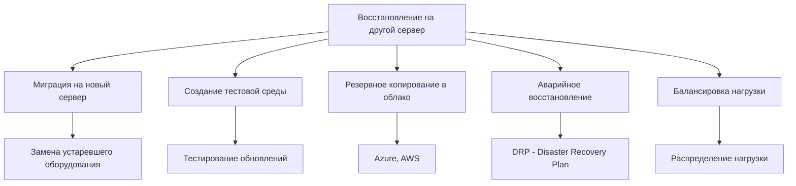
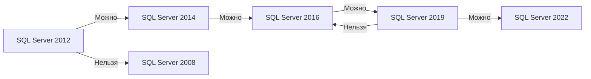

# 🔙 📚 🔜 Навигация по курсу

| [Предыдущее занятие](../LESSONS/PR24.MD) | &nbsp; | [Следующее занятие](../LESSONS/PR25.MD) |
|:--------------------------------------:|:------:|:-------------------------------------:|
| 🏠 [Практика №24](../LESSONS/PR24.MD) | 📖 [Содержание](../README.MD) | 💻 [Практика №25](../LESSONS/PR25.MD) |

---

# 🎓 Лекция 25. Восстановление на другой сервер (restore to new server)

⏱️ **Продолжительность:** 90 минут  
🎯 **Цель лекции:**  
Сформировать у студентов понимание процесса восстановления баз данных на другой сервер SQL Server, включая учёт путей к файлам, различий в версиях, наличия сертификатов для шифрования и других факторов. Научить студентов выполнять восстановление с перемещением файлов, диагностировать и решать типовые проблемы при переносе баз между серверами.

---

## 📖 Справочник терминов (официальные названия из русской SSMS)

| Русский термин | Английский эквивалент | Что это? | Пример |
|----------------|------------------------|----------|--------|
| **Восстановление на другой сервер** | Cross-server restore | Восстановление базы на другом экземпляре SQL Server | Перенос базы на новый сервер |
| **MOVE** | MOVE | Переназначение физического пути файлов при восстановлении | `WITH MOVE` |
| **REPLACE** | REPLACE | Перезапись существующей базы при восстановлении | `WITH REPLACE` |
| **Имя файла данных** | Data file name | Логическое имя файла данных в бэкапе | `AdventureWorks` |
| **Имя файла журнала** | Log file name | Логическое имя файла журнала в бэкапе | `AdventureWorks_log` |
| **RESTORE FILELISTONLY** | RESTORE FILELISTONLY | Команда для просмотра содержимого бэкапа | Список файлов в копии |
| **RESTORE HEADERONLY** | RESTORE HEADERONLY | Просмотр заголовка бэкапа | Версия SQL Server, LSN |
| **Разные версии SQL Server** | SQL Server version compatibility | Совместимость при восстановлении на более старую/новую версию | С ограничениями |
| **Сертификат шифрования** | Encryption certificate | Сертификат, использованный для шифрования бэкапа | Должен быть на целевом сервере |
| **Одинокий пользователь** | Orphaned user | Пользователь без соответствующего логина на новом сервере | `sp_change_users_login` |
| **Database Compatibility Level** | Database Compatibility Level | Уровень совместимости базы с версией SQL Server | `ALTER DATABASE SET COMPATIBILITY_LEVEL` |

---

## 1. 🧠 Зачем восстанавливать на другой сервер?

### 1.1. Основные сценарии



### 1.2. Требования к восстановлению

| Требование | Описание | Проверка |
|------------|----------|----------|
| **Версия SQL Server** | Целевая версия >= исходной | `SELECT @@VERSION` |
| **Свободное место** | Достаточно для данных и журнала | `RESTORE FILELISTONLY` |
| **Сертификаты** | Для зашифрованных бэкапов | `SELECT * FROM sys.certificates` |
| **Права доступа** | Права на чтение бэкапа и запись в папку | Проверка учётной записи |
| **Уникальность имени** | Имя базы не должно существовать (или с REPLACE) | `SELECT name FROM sys.databases` |

### 1.3. Ограничения версий SQL Server



**Важно:** Нельзя восстановить базу на более старую версию SQL Server! Только на ту же или более новую.

---

## 2. 📦 Просмотр содержимого резервной копии

### 2.1. RESTORE FILELISTONLY — список файлов

Перед восстановлением нужно узнать, какие файлы содержит бэкап и какие у них логические имена.

```sql
RESTORE FILELISTONLY 
FROM DISK = 'D:\Backup\AdventureWorks_Full.bak';
```

**Результат:**

| LogicalName | PhysicalName | Type | Size |
|-------------|--------------|------|------|
| AdventureWorks | D:\Data\AdventureWorks.mdf | D | 5242880 |
| AdventureWorks_log | D:\Data\AdventureWorks_log.ldf | L | 1048576 |

### 2.2. RESTORE HEADERONLY — информация о бэкапе

```sql
RESTORE HEADERONLY 
FROM DISK = 'D:\Backup\AdventureWorks_Full.bak';
```

Показывает:
- **BackupName** — имя набора
- **BackupType** — тип (1 = полная, 5 = разностная)
- **ServerName** — исходный сервер
- **DatabaseName** — имя базы
- **BackupStartDate** — дата создания
- **SoftwareVersionMajor** — версия SQL Server
- **Compressed** — сжатие

### 2.3. RESTORE LABELONLY — информация о носителе

```sql
RESTORE LABELONLY 
FROM DISK = 'D:\Backup\AdventureWorks_Full.bak';
```

---

## 3. 🔧 Синтаксис восстановления с MOVE

### 3.1. Базовый синтаксис

```sql
RESTORE DATABASE NewDatabaseName
FROM DISK = 'D:\Backup\BackupFile.bak'
WITH 
    MOVE 'LogicalDataFileName' TO 'D:\Data\NewDatabaseName.mdf',
    MOVE 'LogicalLogFileName' TO 'D:\Logs\NewDatabaseName_log.ldf',
    RECOVERY;
```

### 3.2. Пример с несколькими файлами данных

```sql
-- Сначала узнаём структуру
RESTORE FILELISTONLY FROM DISK = 'D:\Backup\MyDB.bak';

-- Затем восстанавливаем
RESTORE DATABASE MyDB_New
FROM DISK = 'D:\Backup\MyDB.bak'
WITH 
    MOVE 'MyDB_Data1' TO 'E:\Data\MyDB_New_Data1.ndf',
    MOVE 'MyDB_Data2' TO 'E:\Data\MyDB_New_Data2.ndf',
    MOVE 'MyDB_Log' TO 'F:\Logs\MyDB_New_Log.ldf',
    REPLACE,
    STATS = 5;
```

### 3.3. Восстановление с REPLACE

Если база с таким именем уже существует:

```sql
RESTORE DATABASE AdventureWorks
FROM DISK = 'D:\Backup\AdventureWorks_Full.bak'
WITH 
    REPLACE,  -- перезаписать существующую
    MOVE 'AdventureWorks' TO 'D:\Data\AdventureWorks_New.mdf',
    MOVE 'AdventureWorks_log' TO 'D:\Logs\AdventureWorks_New_log.ldf',
    RECOVERY;
```

---

## 4. 🚨 Типовые проблемы и их решение

### 4.1. Проблема: Пути не существуют

**Ошибка:**
```
The file 'D:\Data\AdventureWorks.mdf' cannot be used because it is in a different format.
```

**Решение:** Создать папку или использовать MOVE.

```sql
-- Предварительно создать папку
EXEC xp_cmdshell 'mkdir E:\Data';
EXEC xp_cmdshell 'mkdir F:\Logs';

-- Или использовать MOVE
RESTORE DATABASE AdventureWorks
FROM DISK = 'D:\Backup\AW.bak'
WITH 
    MOVE 'AdventureWorks' TO 'E:\Data\AW.mdf',
    MOVE 'AdventureWorks_log' TO 'F:\Logs\AW.ldf';
```

### 4.2. Проблема: База уже существует

**Ошибка:**
```
The database already exists. To overwrite it, use the REPLACE option.
```

**Решение:** Использовать `WITH REPLACE`.

```sql
RESTORE DATABASE AdventureWorks
FROM DISK = 'D:\Backup\AW.bak'
WITH REPLACE, RECOVERY;
```

### 4.3. Проблема: Версия SQL Server несовместима

**Ошибка:**
```
The database was backed up on a server running version 15.00.2000. That version is incompatible with this server, which is running version 14.00.1000.
```

**Решение:** 
- Обновить целевой сервер до более новой версии
- Или создать базу на исходном сервере с уровнем совместимости ниже

```sql
-- На исходном сервере перед бэкапом
ALTER DATABASE AdventureWorks 
SET COMPATIBILITY_LEVEL = 130;  -- SQL Server 2016
```

### 4.4. Проблема: Отсутствует сертификат для зашифрованного бэкапа

**Ошибка:**
```
Cannot decrypt the backup because the certificate used for encryption is not available.
```

**Решение:** Восстановить сертификат на целевом сервере.

```sql
-- Восстановить сертификат
CREATE CERTIFICATE BackupCert
FROM FILE = 'C:\Backup\BackupCert.cer'
WITH PRIVATE KEY (
    FILE = 'C:\Backup\BackupCert_PrivateKey.pvk',
    DECRYPTION BY PASSWORD = 'CertPassword123!'
);

-- Затем восстановить бэкап
RESTORE DATABASE AdventureWorks
FROM DISK = 'D:\Backup\AW_Encrypted.bak'
WITH RECOVERY;
```

### 4.5. Проблема: Одинокие пользователи

После восстановления базы пользователи могут быть не связаны с логинами.

```sql
-- Найти одиноких пользователей
USE RestoredDatabase;
GO
EXEC sp_change_users_login @Action = 'Report';

-- Связать пользователя с существующим логином
EXEC sp_change_users_login 
    @Action = 'Update_One',
    @UserNamePattern = 'UserName',
    @LoginName = 'LoginName';

-- Или создать нового пользователя
EXEC sp_change_users_login 
    @Action = 'Auto_Fix',
    @UserNamePattern = 'UserName';
```

---

## 5. 📊 Восстановление на облачный сервер (Azure SQL Database)

### 5.1. Особенности Azure SQL Database

- Не поддерживает стандартный `RESTORE DATABASE`
- Поддерживает восстановление из бэкапов в Azure Blob Storage
- Нужно использовать `CREATE DATABASE ... AS COPY OF`

### 5.2. Восстановление из Azure Blob

```sql
-- Создание учётных данных для Azure
CREATE CREDENTIAL [https://storage.blob.core.windows.net/backup]
WITH IDENTITY = 'SHARED ACCESS SIGNATURE',
SECRET = 'sv=2022-11-02&ss=b&srt=co&sp=rwdl&se=2026-12-31&sig=...';

-- Восстановление из URL
RESTORE DATABASE AdventureWorks_Azure
FROM URL = 'https://storage.blob.core.windows.net/backup/AdventureWorks.bak'
WITH 
    MOVE 'AdventureWorks' TO 'AdventureWorks_Azure.mdf',
    MOVE 'AdventureWorks_log' TO 'AdventureWorks_Azure_log.ldf',
    STATS = 5;
```

---

## 6. 🛠️ Автоматизация восстановления

### 6.1. Процедура для восстановления на другой сервер

```sql
CREATE PROCEDURE dbo.usp_RestoreDatabaseFromBackup
    @BackupPath NVARCHAR(500),
    @NewDatabaseName NVARCHAR(128),
    @DataPath NVARCHAR(255) = 'C:\Program Files\Microsoft SQL Server\MSSQL15.MSSQLSERVER\MSSQL\DATA\',
    @LogPath NVARCHAR(255) = NULL,
    @OverwriteExisting BIT = 0
AS
BEGIN
    SET NOCOUNT ON;
    
    DECLARE @FileList TABLE (
        LogicalName NVARCHAR(128),
        PhysicalName NVARCHAR(260),
        Type CHAR(1),
        Size INT,
        MaxSize INT,
        FileId INT
    );
    
    DECLARE @SQL NVARCHAR(MAX);
    DECLARE @LogicalDataName NVARCHAR(128);
    DECLARE @LogicalLogName NVARCHAR(128);
    DECLARE @PhysicalDataPath NVARCHAR(500);
    DECLARE @PhysicalLogPath NVARCHAR(500);
    
    -- Установка пути для логов
    IF @LogPath IS NULL
        SET @LogPath = @DataPath;
    
    -- Получение списка файлов из бэкапа
    INSERT INTO @FileList
    EXEC ('RESTORE FILELISTONLY FROM DISK = ''' + @BackupPath + '''');
    
    -- Получение логических имён
    SELECT @LogicalDataName = LogicalName 
    FROM @FileList 
    WHERE Type = 'D';
    
    SELECT @LogicalLogName = LogicalName 
    FROM @FileList 
    WHERE Type = 'L';
    
    -- Формирование физических путей
    SET @PhysicalDataPath = @DataPath + @NewDatabaseName + '.mdf';
    SET @PhysicalLogPath = @LogPath + @NewDatabaseName + '_log.ldf';
    
    -- Формирование команды восстановления
    SET @SQL = 'RESTORE DATABASE [' + @NewDatabaseName + '] FROM DISK = ''' + @BackupPath + ''''
        + ' WITH MOVE ''' + @LogicalDataName + ''' TO ''' + @PhysicalDataPath + ''''
        + ', MOVE ''' + @LogicalLogName + ''' TO ''' + @PhysicalLogPath + ''''
        + ', STATS = 10';
    
    IF @OverwriteExisting = 1
        SET @SQL = @SQL + ', REPLACE';
    
    SET @SQL = @SQL + ', RECOVERY';
    
    -- Выполнение
    PRINT 'Выполняется восстановление...';
    PRINT @SQL;
    EXEC sp_executesql @SQL;
    
    PRINT 'Восстановление завершено. База: ' + @NewDatabaseName;
END;
GO

-- Использование
EXEC dbo.usp_RestoreDatabaseFromBackup 
    @BackupPath = 'D:\Backup\AdventureWorks_Full.bak',
    @NewDatabaseName = 'AdventureWorks_Test',
    @DataPath = 'E:\Data\',
    @LogPath = 'F:\Logs\',
    @OverwriteExisting = 1;
```

---

## 7. ✅ Резюме: чек-лист восстановления на другой сервер

### Подготовка:
- [ ] Проверить версию SQL Server (целевая >= исходной)
- [ ] Убедиться, что бэкап доступен (UNC-путь, права)
- [ ] Узнать содержимое бэкапа (`RESTORE FILELISTONLY`)
- [ ] Создать необходимые папки для файлов данных и журнала
- [ ] Убедиться в наличии свободного места

### При восстановлении:
- [ ] Использовать `MOVE` для переназначения путей
- [ ] При необходимости использовать `REPLACE`
- [ ] При восстановлении зашифрованного бэкапа — восстановить сертификат
- [ ] Проверить уровень совместимости базы

### После восстановления:
- [ ] Проверить целостность (`DBCC CHECKDB`)
- [ ] Проверить одиноких пользователей (`sp_change_users_login`)
- [ ] Создать недостающие логины
- [ ] Обновить статистику (`UPDATE STATISTICS`)
- [ ] Сделать новый полный бэкап

🔑 **Золотое правило:**  
> *«Восстановление на другой сервер — это не просто копирование файлов. Всегда проверяйте версии, пути, права и одиноких пользователей. И никогда не восстанавливайте бэкап, не зная, что в нём!»*

---

## 8. ❓ Вопросы для самопроверки

1. Какая команда позволяет узнать, какие файлы содержит резервная копия?
2. Зачем нужна опция `MOVE` при восстановлении?
3. Что произойдёт, если не указать `MOVE`, а исходные пути не существуют?
4. Когда используется опция `REPLACE` и чем она опасна?
5. Можно ли восстановить бэкап с SQL Server 2019 на SQL Server 2016?
6. Как восстановить зашифрованный бэкап на другом сервере?
7. Что такое одинокие пользователи и как их исправить?
8. Как проверить уровень совместимости базы после восстановления?
9. Какие данные показывает `RESTORE HEADERONLY`?
10. Что делать, если на целевом сервере нет логина для пользователя базы?
11. Как восстановить базу из сетевой папки?
12. Почему после восстановления нужно делать новый полный бэкап?
13. Какие права нужны учётной записи SQL Server для доступа к бэкапу?
14. Как восстановить базу под другим именем?
15. Что такое `WITH NORECOVERY` и когда он используется при восстановлении на другой сервер?

---

## 📎 Приложение: Шпаргалка команд

```sql
-- Просмотр содержимого бэкапа
RESTORE FILELISTONLY FROM DISK = 'D:\Backup\AdventureWorks.bak';
RESTORE HEADERONLY FROM DISK = 'D:\Backup\AdventureWorks.bak';

-- Восстановление с MOVE
RESTORE DATABASE NewDB
FROM DISK = 'D:\Backup\AdventureWorks.bak'
WITH 
    MOVE 'AdventureWorks' TO 'D:\Data\NewDB.mdf',
    MOVE 'AdventureWorks_log' TO 'D:\Logs\NewDB_log.ldf',
    RECOVERY;

-- Восстановление с перезаписью
RESTORE DATABASE AdventureWorks
FROM DISK = 'D:\Backup\AdventureWorks.bak'
WITH REPLACE, RECOVERY;

-- Восстановление на другую версию (с уровнем совместимости)
ALTER DATABASE AdventureWorks SET COMPATIBILITY_LEVEL = 140;
BACKUP DATABASE AdventureWorks TO DISK = 'D:\Backup\AW_Compatible.bak';

-- Исправление одиноких пользователей
USE AdventureWorks;
GO
EXEC sp_change_users_login @Action = 'Report';
EXEC sp_change_users_login @Action = 'Auto_Fix', @UserNamePattern = 'UserName';

-- Проверка версии SQL Server
SELECT @@VERSION;
SELECT SERVERPROPERTY('ProductVersion'), SERVERPROPERTY('ProductLevel');
```

---

📜 **Лицензия:** CC BY-NC-SA 4.0  
👨‍🏫 **Автор:** Руслан Ринатович Сафиулин  
📅 **Дата:** 27.04.2026

---
# 🔙 📚 🔜 Навигация по курсу

| [Предыдущее занятие](../LESSONS/PR24.MD) | &nbsp; | [Следующее занятие](../LESSONS/PR25.MD) |
|:--------------------------------------:|:------:|:-------------------------------------:|
| 🏠 [Практика №24](../LESSONS/PR24.MD) | 📖 [Содержание](../README.MD) | 💻 [Практика №25](../LESSONS/PR25.MD) |

