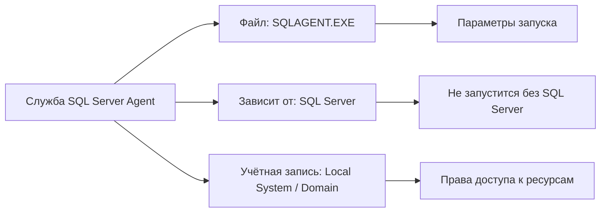
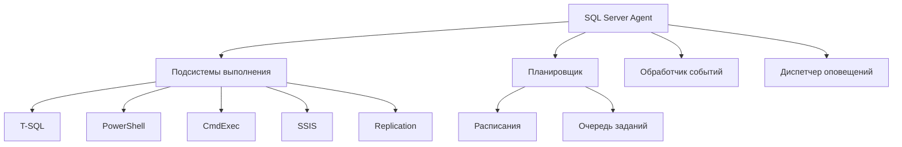
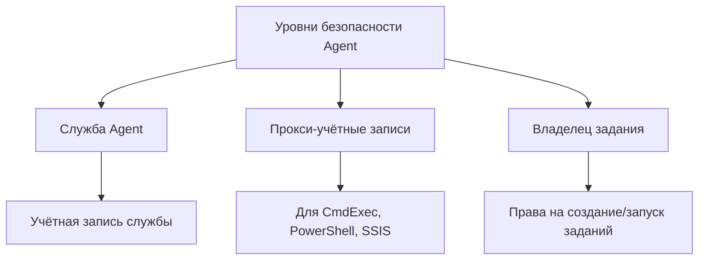

# 🔙 📚 🔜 Навигация по курсу

| [Предыдущее занятие](../LESSONS/PR25.MD) | &nbsp; | [Следующее занятие](../LESSONS/PR26.MD) |
|:--------------------------------------:|:------:|:-------------------------------------:|
| 🏠 [Практика №25](../LESSONS/PR25.MD) | 📖 [Содержание](../README.MD) | 💻 [Практика №26](../LESSONS/PR26.MD) |

---

# 🎓 Лекция 26. SQL Server Agent: назначение, настройка, требования

⏱️ **Продолжительность:** 90 минут  
🎯 **Цель лекции:**  
Сформировать у студентов понимание роли SQL Server Agent в автоматизации задач администрирования, научить проверять статус и настраивать параметры агента, а также познакомить с основными компонентами и требованиями к работе.

---

## 📖 Справочник терминов (официальные названия из русской SSMS)

| Русский термин | Английский эквивалент | Что это? | Пример |
|----------------|------------------------|----------|--------|
| **Агент SQL Server** | SQL Server Agent | Служба Windows для автоматизации задач | `SQLSERVERAGENT` |
| **Задание** | Job | Набор действий, выполняемых по расписанию | `DailyBackup` |
| **Расписание** | Schedule | Время и периодичность выполнения | `Каждый день в 02:00` |
| **Оповещение** | Alert | Реакция на определённое событие | Ошибка 825 |
| **Оператор** | Operator | Получатель уведомлений | `DBA@company.com` |
| **Журнал ошибок** | Error log | Файл лога SQL Agent | `SQLAGENT.OUT` |
| **Прокси-учётная запись** | Proxy account | Учётная запись для выполнения шагов | `DOMAIN\ProxyUser` |
| **Подсистема** | Subsystem | Тип выполняемого шага | T‑SQL, PowerShell, CmdExec |
| **История заданий** | Job history | Журнал выполнения заданий | Таблица `sysjobhistory` |

---

## 1. 🧠 Что такое SQL Server Agent?

### 1.1. Определение

**SQL Server Agent** — это служба Windows, которая выполняет **автоматические задачи** в SQL Server: резервное копирование, обслуживание индексов, импорт данных, мониторинг и многое другое.

```mermaid
graph TD
    A[SQL Server Agent] --> B[Задания (Jobs)]
    A --> C[Расписания (Schedules)]
    A --> D[Оповещения (Alerts)]
    A --> E[Операторы (Operators)]
    
    B --> B1[Шаг 1: T-SQL]
    B --> B2[Шаг 2: PowerShell]
    B --> B3[Шаг 3: CmdExec]
    
    D --> F[Реакция на ошибки]
    D --> G[Реакция на события]
    
    E --> H[Email уведомления]
    E --> I[События в лог]
```

### 1.2. История и версии

| Версия SQL Server | Нововведения в Agent |
|-------------------|---------------------|
| SQL Server 6.5 | Первое появление (SQL Executive) |
| SQL Server 7.0 | Переименован в SQL Server Agent |
| SQL Server 2005 | Добавлена поддержка прокси-учётных записей |
| SQL Server 2008 | Улучшена интеграция с политиками управления |
| SQL Server 2012 | Поддержка Always On |
| SQL Server 2016+ | Интеграция с PowerShell, SSIS |

### 1.3. Зачем нужен SQL Server Agent?

| Без Agent | С Agent |
|-----------|---------|
| Администратор сидит ночью и делает бэкапы | Бэкапы выполняются автоматически |
| Забыли сделать обслуживание → падение производительности | Обслуживание по расписанию |
| Узнали о сбое от пользователей | Автоматическое оповещение по email |
| Ошибки остаются незамеченными | Оповещения на критичные ошибки |

---

## 2. ⚙️ Архитектура и компоненты

### 2.1. Служба Windows



**Имя службы:**
- `SQLSERVERAGENT` — для экземпляра по умолчанию
- `SQLAgent$ИмяЭкземпляра` — для именованного экземпляра

### 2.2. База данных msdb

Все настройки Agent хранятся в базе **msdb**:

| Таблица | Назначение |
|---------|------------|
| `sysjobs` | Список заданий |
| `sysjobsteps` | Шаги заданий |
| `sysschedules` | Расписания |
| `sysalerts` | Оповещения |
| `sysoperators` | Операторы |
| `sysjobhistory` | История выполнения |

### 2.3. Компоненты Agent



### 2.4. Журналы SQL Agent

| Журнал | Путь | Назначение |
|--------|------|------------|
| **Журнал ошибок** | `C:\Program Files\Microsoft SQL Server\MSSQL15.MSSQLSERVER\MSSQL\Log\SQLAGENT.OUT` | Общий журнал |
| **Журнал заданий** | В msdb (`sysjobhistory`) | История выполнения |

---

## 3. 🔧 Настройка SQL Server Agent

### 3.1. Проверка статуса службы

**Через SSMS:**
- В обозревателе объектов: зелёный треугольник у `SQL Server Agent` → запущен
- Красный квадрат → остановлен

**Через T-SQL:**
```sql
-- Проверка статуса
EXEC xp_servicecontrol 'QUERYSTATE', 'SQLSERVERAGENT';

-- Результат: Running (запущен) или Stopped (остановлен)
```

**Через PowerShell:**
```powershell
Get-Service | Where-Object {$_.Name -like "*SQLSERVERAGENT*"}
```

### 3.2. Запуск/остановка

**В SSMS:**
- ПКМ на `SQL Server Agent` → Start / Stop

**В T-SQL:**
```sql
-- Запуск
EXEC xp_servicecontrol 'START', 'SQLSERVERAGENT';

-- Остановка
EXEC xp_servicecontrol 'STOP', 'SQLSERVERAGENT';
```

**В PowerShell:**
```powershell
Start-Service SQLSERVERAGENT
Stop-Service SQLSERVERAGENT
```

### 3.3. Настройка учётной записи

**Рекомендации Microsoft:**
- Использовать учётную запись **с минимальными правами**
- Не использовать `Local System` (слишком много прав)
- Для сетевых операций — доменная учётная запись

**Проверка учётной записи:**
```sql
-- Просмотр служб и учётных записей
SELECT servicename, service_account
FROM sys.dm_server_services
WHERE servicename LIKE '%SQLSERVERAGENT%';
```

### 3.4. Свойства SQL Agent (в SSMS)

**ПКМ на SQL Server Agent → Properties → Advanced:**

| Вкладка | Параметр | Назначение |
|---------|----------|------------|
| **General** | Auto restart | Автоматический перезапуск при сбое |
| **Advanced** | Logging | Уровень логирования |
| **Alert System** | Mail session | Настройка Database Mail |
| **Connection** | Alias | Псевдоним для соединения |

### 3.5. Настройка уровня логирования

```sql
-- Через хранимую процедуру
EXEC msdb.dbo.sp_set_sqlagent_properties
    @error_log_file = N'C:\Program Files\Microsoft SQL Server\MSSQL15.MSSQLSERVER\MSSQL\Log\SQLAGENT.OUT',
    @error_logging_level = 2;  -- 1-обычный, 2-подробный
```

---

## 4. 📋 Требования и ограничения

### 4.1. Требования для работы

| Требование | Описание |
|------------|----------|
| **Служба SQL Server** | Agent зависит от SQL Server |
| **База msdb** | Должна быть доступна |
| **Права** | Доступ к папкам, сетевым ресурсам |
| **Память** | Минимум 1 ГБ свободной памяти |
| **Диск** | Место для логов (SQLAGENT.OUT) |

### 4.2. Ограничения

| Ограничение | Значение |
|-------------|----------|
| Максимальное количество заданий | 100 000 (настраивается) |
| Максимальное количество шагов в задании | 1000 |
| Максимальная длина команды шага | 64 КБ (для T-SQL) |
| Максимальное количество операторов | 100 000 |

### 4.3. Уровни безопасности



---

## 5. 🛠️ Диагностика проблем

### 5.1. Ошибка: SQL Agent не запускается

**Причины:**
- SQL Server не запущен
- Недостаточно прав
- Повреждён файл конфигурации

**Диагностика:**
```sql
-- Проверка лога ошибок
EXEC xp_readerrorlog 0, 2, 'Unable to start';
```

### 5.2. Ошибка: Задания не выполняются

**Проверка:**
```sql
-- Запущен ли Agent?
SELECT @@SERVERNAME, service_account
FROM sys.dm_server_services
WHERE servicename LIKE '%SQLSERVERAGENT%';

-- Проверка базы msdb
SELECT name, state_desc FROM sys.databases WHERE name = 'msdb';
```

### 5.3. Ошибка: Задания выполняются, но не работают

**Решение:** Проверить права владельца задания.

```sql
-- Сменить владельца на sa
EXEC msdb.dbo.sp_update_job
    @job_name = 'MyJob',
    @owner_login_name = 'sa';
```

---

## 6. 🔄 Интеграция с другими службами

### 6.1. Database Mail

Для отправки уведомлений требуется настроить Database Mail:

```sql
-- Проверка профиля
SELECT * FROM msdb.dbo.sysmail_profile;
```

### 6.2. PowerShell

Agent может выполнять PowerShell-скрипты:

```powershell
# Пример шага PowerShell
Get-Process | Export-Csv C:\Backup\processes.csv
```

### 6.3. SSIS (Integration Services)

Agent может запускать пакеты SSIS, хранящиеся в msdb или файловой системе.

---

## 7. 📊 Мониторинг Agent

### 7.1. Проверка статуса

```sql
-- Расширенная проверка
SELECT 
    CONVERT(SYSNAME, SERVERPROPERTY('ServerName')) AS ServerName,
    CASE 
        WHEN EXISTS (SELECT 1 FROM master.dbo.sysprocesses WHERE program_name = 'SQLAgent - Generic Refresher')
        THEN 'Running'
        ELSE 'Stopped'
    END AS AgentStatus;
```

### 7.2. Количество активных заданий

```sql
-- Текущие выполняющиеся задания
SELECT 
    j.name,
    ja.start_execution_date
FROM msdb.dbo.sysjobactivity ja
JOIN msdb.dbo.sysjobs j ON ja.job_id = j.job_id
WHERE ja.stop_execution_date IS NULL
    AND ja.start_execution_date IS NOT NULL;
```

### 7.3. Размер истории

```sql
-- Количество записей в истории
SELECT 
    COUNT(*) AS TotalRecords,
    MIN(run_date) AS OldestRecord,
    MAX(run_date) AS NewestRecord
FROM msdb.dbo.sysjobhistory;
```

---

## 8. ✅ Резюме: чек-лист администратора

### После установки:
- [ ] Проверить, что SQL Agent запущен
- [ ] Настроить учётную запись службы
- [ ] Настроить уровень логирования
- [ ] Включить автоматический перезапуск

### Ежедневно:
- [ ] Проверить статус службы
- [ ] Просмотреть ошибки в журнале `SQLAGENT.OUT`

### Еженедельно:
- [ ] Очистить устаревшую историю заданий
- [ ] Проверить права владельцев заданий

🔑 **Золотое правило:**  
> *«SQL Server Agent — это сердце автоматизации. Если оно не бьётся, ваши бэкапы не делаются, а оповещения не приходят. Следите за его состоянием!»*

---

## 9. ❓ Вопросы для самопроверки

1. Что такое SQL Server Agent и для чего он нужен?
2. Как узнать, запущен ли Agent, через T-SQL?
3. Какая база данных хранит настройки Agent?
4. Какие основные компоненты есть у Agent?
5. Как изменить учётную запись службы Agent?
6. Какие подсистемы выполнения поддерживает Agent?
7. Где хранится файл журнала ошибок SQL Agent?
8. Почему Agent может не запускаться?
9. Как настроить автоматический перезапуск Agent?
10. Какие права нужны для запуска заданий?
11. Как проверить, какие задания выполняются сейчас?
12. Что такое прокси-учётная запись?
13. Как ограничить количество одновременно выполняемых заданий?
14. Почему Agent должен быть запущен для выполнения заданий?
15. Как очистить историю заданий?

---

## 📎 Приложение: Шпаргалка команд

```sql
-- Проверка статуса Agent
EXEC xp_servicecontrol 'QUERYSTATE', 'SQLSERVERAGENT';

-- Запуск Agent
EXEC xp_servicecontrol 'START', 'SQLSERVERAGENT';

-- Остановка Agent
EXEC xp_servicecontrol 'STOP', 'SQLSERVERAGENT';

-- Просмотр служб
SELECT servicename, service_account 
FROM sys.dm_server_services;

-- Просмотр логов Agent
EXEC xp_readerrorlog 0, 2, 'SQLAgent';

-- Настройка свойств Agent
EXEC msdb.dbo.sp_set_sqlagent_properties
    @auto_restart = 1,  -- автоматический перезапуск
    @job_history_max_rows = 10000,
    @job_history_max_rows_per_job = 1000;
```
---

📜 **Лицензия:** CC BY-NC-SA 4.0  
👨‍🏫 **Автор:** Руслан Ринатович Сафиулин  
📅 **Дата:** 27.04.2026

---
# 🔙 📚 🔜 Навигация по курсу

| [Предыдущее занятие](../LESSONS/PR25.MD) | &nbsp; | [Следующее занятие](../LESSONS/PR26.MD) |
|:--------------------------------------:|:------:|:-------------------------------------:|
| 🏠 [Практика №25](../LESSONS/PR25.MD) | 📖 [Содержание](../README.MD) | 💻 [Практика №26](../LESSONS/PR26.MD) |

---
