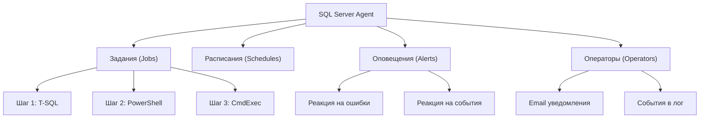
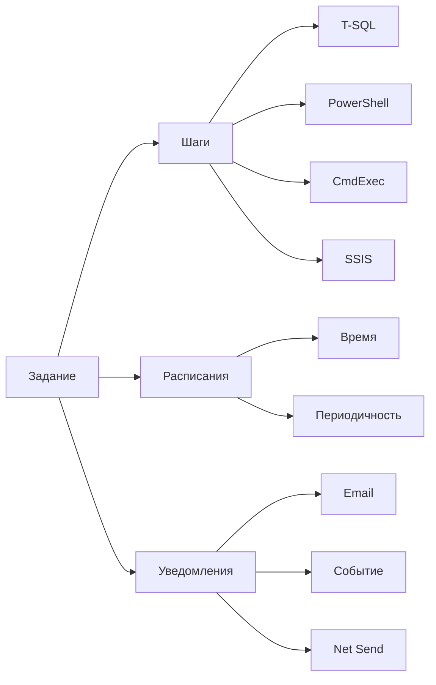
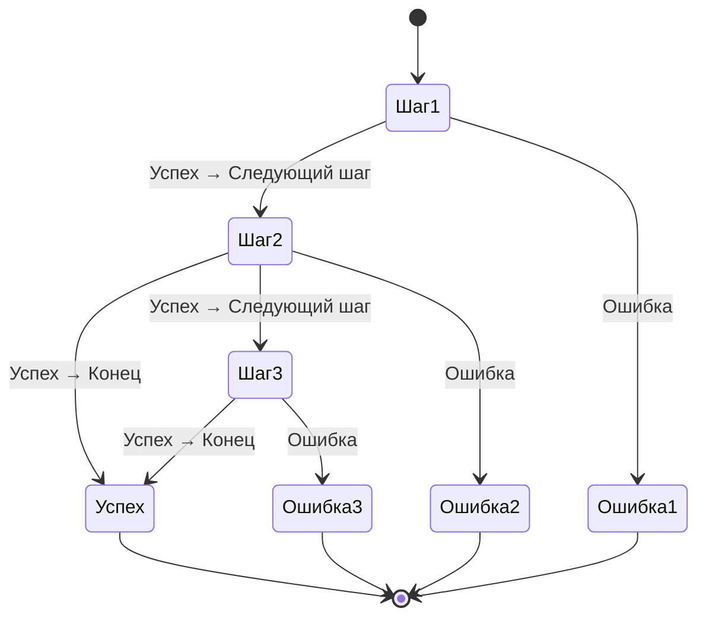
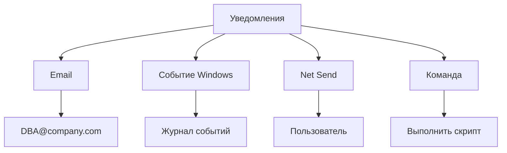
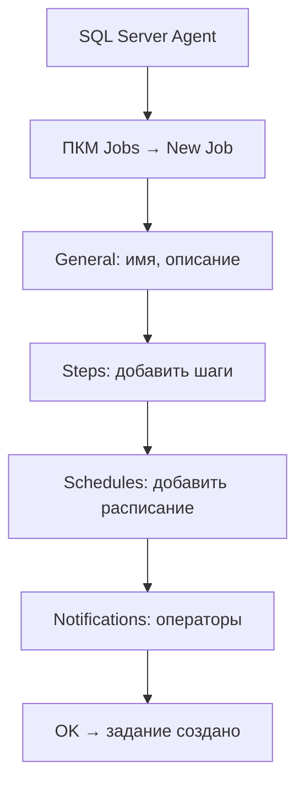

# 🔙 📚 🔜 Навигация по курсу

| [Предыдущее занятие](../LESSONS/PR26.MD) | &nbsp; | [Следующее занятие](../LESSONS/PR27.MD) |
|:--------------------------------------:|:------:|:-------------------------------------:|
| 🏠 [Практика №26](../LESSONS/PR26.MD) | 📖 [Содержание](../README.MD) | 💻 [Практика №27](../LESSONS/PR27.MD) |

---

# 🎓 Лекция 27. Задания (Jobs): шаги, расписания, уведомления

⏱️ **Продолжительность:** 90 минут  
🎯 **Цель лекции:**  
Сформировать у студентов понимание архитектуры заданий SQL Server Agent, научить создавать многошаговые задания, настраивать расписания и уведомления, а также организовывать выполнение административных задач в автоматическом режиме.

---

## 🔙 📚 🔜 Навигация по курсу

| [Предыдущее занятие](../lesson-26/practice.md) | &nbsp; | [Следующее занятие](../lesson-27/practice.md) |
|:-----------------------------------------------:|:------:|:---------------------------------------------:|
| 💻 [Практика №26](../lesson-26/practice.md) | 📖 [Содержание](../../README.md) | 💻 [Практика №27](practice.md) |

---

## 📖 Справочник терминов (официальные названия из русской SSMS)

| Русский термин | Английский эквивалент | Что это? | Пример |
|----------------|------------------------|----------|--------|
| **Задание** | Job | Набор действий, выполняемых по расписанию | `Еженочный бэкап` |
| **Шаг задания** | Job step | Отдельная команда внутри задания | `BACKUP DATABASE` |
| **Расписание** | Schedule | Время и периодичность выполнения | `Каждый день в 02:00` |
| **Уведомление** | Notification | Оповещение о результате выполнения | Email при ошибке |
| **Журнал заданий** | Job history | Лог выполнения заданий | Таблица `sysjobhistory` |
| **Тип шага** | Step type | Тип команды в шаге | T‑SQL, PowerShell, CmdExec |
| **Действие при успехе** | On success action | Что делать при успешном выполнении | Перейти к следующему шагу |
| **Действие при ошибке** | On fail action | Что делать при ошибке | Завершить с ошибкой |
| **Повтор** | Retry | Повтор шага при ошибке | 3 раза, интервал 5 минут |
| **Оператор** | Operator | Получатель уведомлений | dba@company.com |

---

## 1. 🧠 Что такое задание (Job)?

### 1.1. Определение

**Задание** — это объект SQL Server Agent, который содержит последовательность **шагов**, выполняемых по определённому **расписанию** или по требованию.



### 1.2. Зачем нужны задания?

| Задача | Пример задания |
|--------|----------------|
| **Резервное копирование** | Полная копия всех БД ежедневно в 02:00 |
| **Обслуживание** | Перестроение индексов раз в неделю |
| **Очистка** | Удаление старых бэкапов каждую субботу |
| **Мониторинг** | Проверка размера БД и отправка отчёта |
| **Интеграция данных** | Импорт данных из внешней системы |

### 1.3. Компоненты задания



---

## 2. 📝 Шаги задания (Job Steps)

### 2.1. Типы шагов

| Тип шага | Описание | Пример команды |
|----------|----------|----------------|
| **T‑SQL** | Выполнение SQL-скрипта | `BACKUP DATABASE ...` |
| **PowerShell** | Выполнение PowerShell-скрипта | `Get-Date` |
| **CmdExec** | Команда командной строки | `dir C:\Backup` |
| **SSIS** | Выполнение пакета SSIS | Пакет ETL |
| **Analytic Queries** | Запросы к службам Analysis Services | DAX-запрос |

### 2.2. Поток выполнения шагов



### 2.3. Действия при успехе/ошибке

| Действие | Код | Описание |
|----------|-----|----------|
| **Перейти к следующему шагу** | 1 | Продолжить выполнение |
| **Завершить успешно** | 3 | Прервать задание с успехом |
| **Завершить с ошибкой** | 4 | Прервать задание с ошибкой |
| **Перейти к другому шагу** | 2 | Перейти к указанному шагу |

### 2.4. Повторы (Retry)

Можно настроить повтор шага при ошибке:

| Параметр | Значение | Описание |
|----------|----------|----------|
| **Количество повторов** | 3 | Попробовать выполнить 3 раза |
| **Интервал** | 5 минут | Ждать 5 минут между повторами |

### 2.5. Пример шага T‑SQL

```sql
-- Шаг для бэкапа
BACKUP DATABASE AdventureWorks
TO DISK = 'D:\Backup\AdventureWorks.bak'
WITH COMPRESSION, CHECKSUM;

IF @@ERROR != 0
BEGIN
    PRINT 'Ошибка бэкапа'
    RAISERROR('Бэкап не удался', 16, 1)
END
```

---

## 3. ⏰ Расписания (Schedules)

### 3.1. Типы периодичности

| Тип | Код | Описание | Пример |
|-----|-----|----------|--------|
| **Однократное** | 1 | Выполнить один раз | Запуск после установки |
| **Ежедневно** | 4 | Каждый день | 02:00 |
| **Еженедельно** | 8 | В определённые дни недели | Каждое воскресенье |
| **Ежемесячно** | 16 | В определённые дни месяца | 1-е число |
| **Ежечасно** | 32 | С заданным интервалом | Каждые 15 минут |

### 3.2. Параметры ежедневного расписания

```sql
-- Ежедневно в 02:00
@freq_type = 4,          -- ежедневно
@freq_interval = 1,      -- каждый день
@active_start_time = 20000  -- 02:00:00
```

### 3.3. Параметры еженедельного расписания

```sql
-- Каждое воскресенье в 03:00
@freq_type = 8,          -- еженедельно
@freq_interval = 1,      -- воскресенье (битовая маска)
@active_start_time = 30000  -- 03:00:00
```

**Битовая маска дней недели:**

| День | Значение |
|------|----------|
| Воскресенье | 1 |
| Понедельник | 2 |
| Вторник | 4 |
| Среда | 8 |
| Четверг | 16 |
| Пятница | 32 |
| Суббота | 64 |

### 3.4. Параметры ежечасного расписания

```sql
-- Каждые 15 минут
@freq_type = 4,              -- ежедневно
@freq_subday_type = 4,       -- минуты
@freq_subday_interval = 15,  -- каждые 15 минут
@active_start_time = 0,      -- с 00:00
@active_end_time = 235959    -- до 23:59:59
```

### 3.5. Параметры активного периода

| Параметр | Описание | Пример |
|----------|----------|--------|
| **active_start_date** | Дата начала | `20260301` (1 марта 2026) |
| **active_end_date** | Дата окончания | `20261231` (31 дек 2026) |
| **active_start_time** | Время начала | `80000` (08:00) |
| **active_end_time** | Время окончания | `200000` (20:00) |

---

## 4. 📧 Уведомления (Notifications)

### 4.1. Типы уведомлений



### 4.2. Когда отправлять уведомления

| Условие | Описание |
|---------|----------|
| **При успехе** | Когда задание успешно завершено |
| **При ошибке** | Когда задание завершено с ошибкой |
| **При завершении** | Всегда, независимо от результата |
| **Никогда** | Не отправлять уведомления |

### 4.3. Настройка Database Mail (обязательно перед уведомлениями)

```sql
-- Профиль почты
EXEC msdb.dbo.sysmail_add_profile_sp
    @profile_name = 'DBA Profile',
    @description = 'Profile for DBA notifications';

-- Учётная запись
EXEC msdb.dbo.sysmail_add_account_sp
    @account_name = 'SQLMail',
    @email_address = 'sqlagent@company.com',
    @mailserver_name = 'smtp.company.com';

-- Связываем
EXEC msdb.dbo.sysmail_add_profileaccount_sp
    @profile_name = 'DBA Profile',
    @account_name = 'SQLMail',
    @sequence_number = 1;
```

---

## 5. 🔧 Создание задания через SSMS

### 5.1. Пошаговая инструкция



### 5.2. Пример задания: "Еженочный бэкап"

**Шаг 1: Полная копия**
```sql
BACKUP DATABASE AdventureWorks
TO DISK = 'D:\Backup\AdventureWorks_Full.bak'
WITH COMPRESSION, CHECKSUM;
```

**Шаг 2: Очистка старых файлов**
```sql
EXEC xp_cmdshell 'forfiles /p "D:\Backup" /m *.bak /d -7 /c "cmd /c del @file"';
```

**Расписание:** Ежедневно в 02:00
**Уведомление:** Email при ошибке

---

## 6. 📊 Мониторинг заданий

### 6.1. Просмотр истории

```sql
-- Последние запуски заданий
SELECT 
    j.name AS JobName,
    jh.run_date,
    jh.run_time,
    CASE jh.run_status
        WHEN 0 THEN '❌ Ошибка'
        WHEN 1 THEN '✅ Успех'
        WHEN 2 THEN '🔄 Повтор'
        WHEN 3 THEN '⏹️ Отменён'
        WHEN 4 THEN '⏳ Выполняется'
    END AS Status,
    jh.message
FROM msdb.dbo.sysjobs j
JOIN msdb.dbo.sysjobhistory jh ON j.job_id = jh.job_id
WHERE jh.step_id = 0  -- только итоги задания
ORDER BY jh.run_date DESC, jh.run_time DESC;
```

### 6.2. Просмотр деталей шага

```sql
-- Детали выполнения (сообщения об ошибках)
SELECT 
    j.name AS JobName,
    jh.step_name,
    jh.run_date,
    jh.run_time,
    jh.run_status,
    jh.message
FROM msdb.dbo.sysjobs j
JOIN msdb.dbo.sysjobhistory jh ON j.job_id = jh.job_id
WHERE jh.step_id > 0  -- все шаги
ORDER BY jh.run_date DESC, jh.run_time DESC;
```

### 6.3. Проверка активных заданий

```sql
-- Задания, которые выполняются прямо сейчас
SELECT 
    ja.job_id,
    j.name,
    ja.start_execution_date,
    ja.last_executed_step_id,
    ja.stop_execution_date
FROM msdb.dbo.sysjobactivity ja
JOIN msdb.dbo.sysjobs j ON ja.job_id = j.job_id
WHERE ja.stop_execution_date IS NULL
    AND ja.start_execution_date IS NOT NULL;
```

---

## 7. 🚨 Типовые ошибки и их решение

### 7.1. Ошибка: "Задание не выполнилось, потому что SQL Agent остановлен"

**Решение:** Запустить SQL Server Agent.

```sql
EXEC xp_servicecontrol 'START', 'SQLSERVERAGENT';
```

### 7.2. Ошибка: "Не удалось отправить email"

**Решение:** Проверить Database Mail.

```sql
-- Проверка очереди почты
SELECT * FROM msdb.dbo.sysmail_allitems WHERE sent_status = 'failed';
```

### 7.3. Ошибка: "Недостаточно прав"

**Решение:** Назначить владельца задания с нужными правами.

```sql
EXEC msdb.dbo.sp_update_job
    @job_name = 'MyJob',
    @owner_login_name = 'sa';
```

### 7.4. Ошибка: "Расписание не срабатывает"

**Проверка:** Убедиться, что расписание включено.

```sql
SELECT name, enabled FROM msdb.dbo.sysschedules;
```

---

## 8. ✅ Резюме: чек-лист создания задания

### Подготовка:
- [ ] SQL Server Agent запущен
- [ ] Database Mail настроен (если нужны Email-уведомления)
- [ ] Продумана последовательность шагов

### Создание:
- [ ] Задано имя и описание
- [ ] Добавлены шаги с правильными командами
- [ ] Настроены действия при успехе/ошибке
- [ ] Настроены повторы (при необходимости)
- [ ] Задано расписание
- [ ] Настроены уведомления

### Проверка:
- [ ] Задание запускается вручную
- [ ] Все шаги выполняются успешно
- [ ] Результат соответствует ожиданиям
- [ ] Уведомления приходят (если настроены)

🔑 **Золотое правило:**  
> *«Задание должно быть идемпотентным — повторный запуск не должен вызывать ошибок. Всегда тестируйте задание вручную перед настройкой автоматического расписания!»*

---

## 9. ❓ Вопросы для самопроверки

1. Из каких компонентов состоит задание SQL Agent?
2. Какие типы шагов поддерживаются?
3. Как задать выполнение задания каждый час?
4. Что означает код `@freq_type = 8`?
5. Как настроить повтор шага при ошибке?
6. Где хранится история выполнения заданий?
7. Как узнать, почему задание провалилось?
8. Что нужно настроить для отправки Email-уведомлений?
9. Как запустить задание вручную через T-SQL?
10. Как остановить выполняющееся задание?
11. Что такое уровень совместимости задания?
12. Как изменить владельца задания?
13. Можно ли временно отключить расписание?
14. Как экспортировать задание на другой сервер?
15. Почему нужно тестировать задание вручную перед автоматизацией?

---

## 📎 Приложение: Шпаргалка команд

```sql
-- Запуск задания вручную
EXEC msdb.dbo.sp_start_job @job_name = 'MyJob';

-- Остановка задания
EXEC msdb.dbo.sp_stop_job @job_name = 'MyJob';

-- Изменение владельца
EXEC msdb.dbo.sp_update_job 
    @job_name = 'MyJob',
    @owner_login_name = 'sa';

-- Включение/отключение задания
EXEC msdb.dbo.sp_update_job 
    @job_name = 'MyJob',
    @enabled = 0;  -- 1 включить

-- Просмотр всех заданий
SELECT * FROM msdb.dbo.sysjobs;

-- Просмотр расписаний
SELECT * FROM msdb.dbo.sysschedules;

-- Удаление задания
EXEC msdb.dbo.sp_delete_job @job_name = 'MyJob';
```

---

📜 **Лицензия:** CC BY-NC-SA 4.0  
👨‍🏫 **Автор:** Руслан Ринатович Сафиулин  
📅 **Дата:** 30.04.2026

---

# 🔙 📚 🔜 Навигация по курсу

| [Предыдущее занятие](../LESSONS/PR26.MD) | &nbsp; | [Следующее занятие](../LESSONS/PR27.MD) |
|:--------------------------------------:|:------:|:-------------------------------------:|
| 🏠 [Практика №26](../LESSONS/PR26.MD) | 📖 [Содержание](../README.MD) | 💻 [Практика №27](../LESSONS/PR27.MD) |

---
