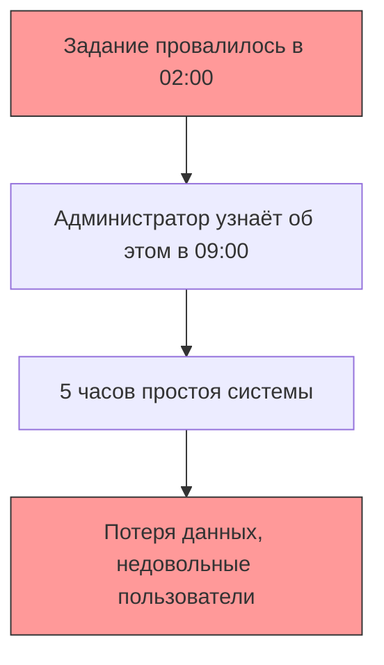
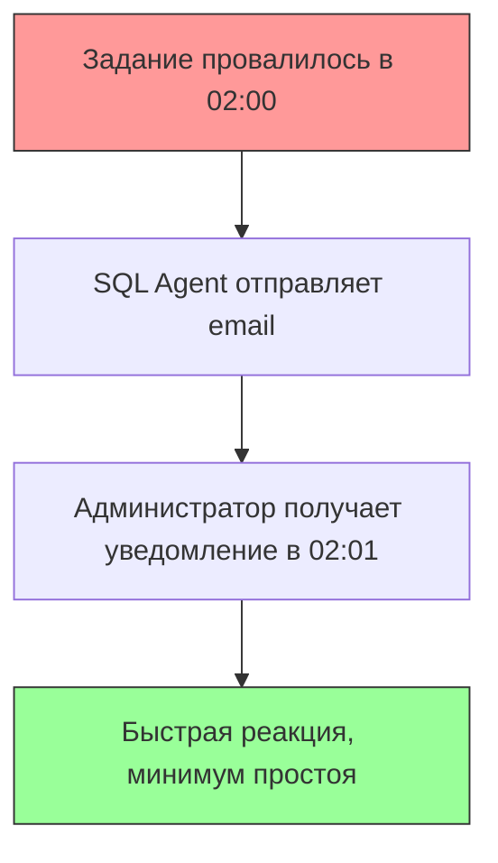
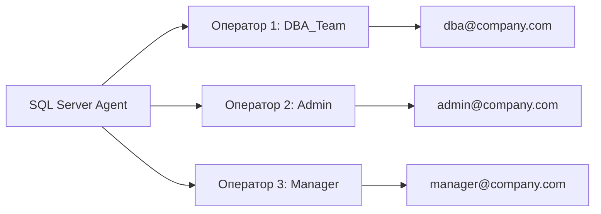
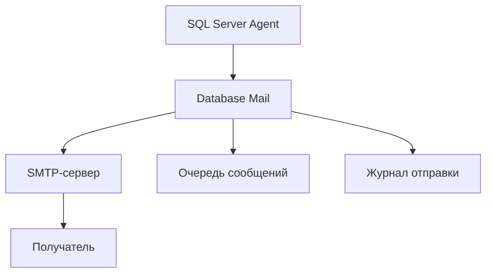
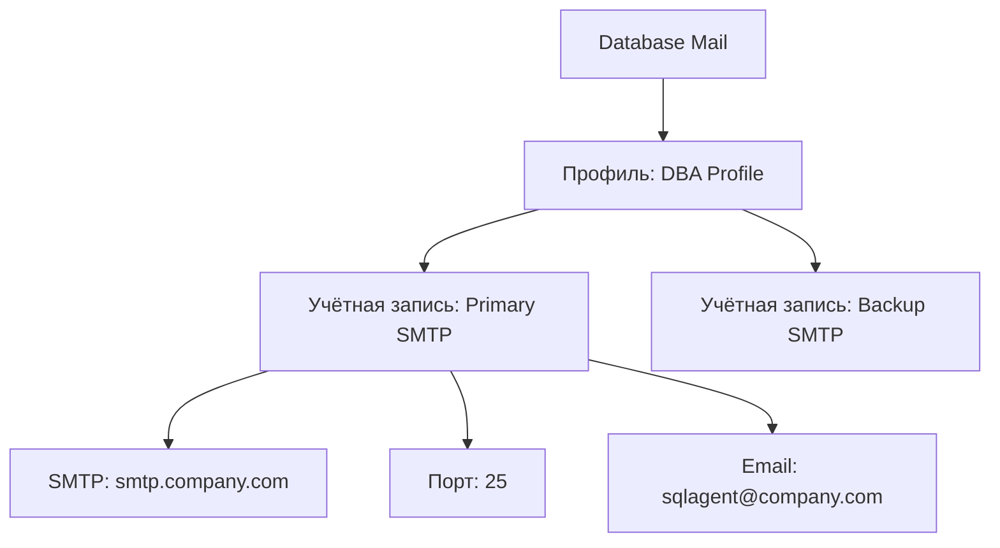
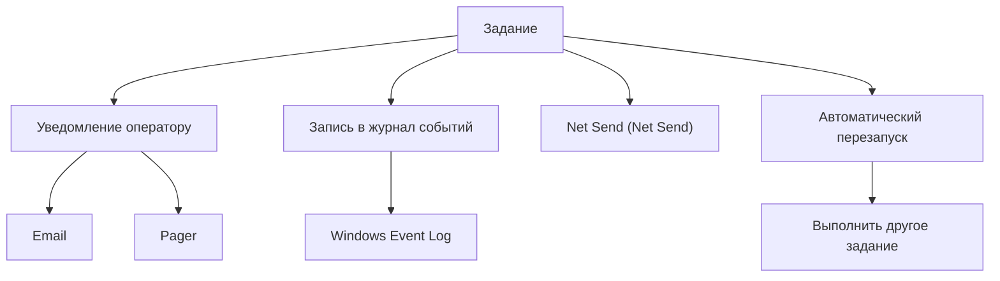

# 🔙 📚 🔜 Навигация по курсу

| [Предыдущее занятие](../LESSONS/PR27.MD) | &nbsp; | [Следующее занятие](../LESSONS/PR28.MD) |
|:--------------------------------------:|:------:|:-------------------------------------:|
| 🏠 [Практика №27](../LESSONS/PR27.MD) | 📖 [Содержание](../README.MD) | 💻 [Практика №28](../LESSONS/PR28.MD) |

---

# 🎓 Лекция 28. Операторы и уведомления (эмуляция email)

⏱️ **Продолжительность:** 90 минут  
🎯 **Цель лекции:**  
Сформировать у студентов понимание системы оповещений SQL Server Agent, научить создавать операторов, настраивать Database Mail для отправки email-уведомлений, а также организовывать автоматическое оповещение администратора при сбоях выполнения заданий.

---

## 📖 Справочник терминов (официальные названия из русской SSMS)

| Русский термин | Английский эквивалент | Что это? | Пример |
|----------------|------------------------|----------|--------|
| **Оператор** | Operator | Получатель уведомлений | `DBA_Team` |
| **Уведомление** | Notification | Оповещение о результате выполнения задания | Email при ошибке |
| **Database Mail** | Database Mail | Система отправки email из SQL Server | smtp.company.com |
| **Профиль Database Mail** | Mail profile | Набор учётных записей для отправки | `DBA Profile` |
| **Учётная запись Database Mail** | Mail account | Параметры подключения к SMTP-серверу | `sqlmail@company.com` |
| **Очередь почты** | Mail queue | Хранилище сообщений до отправки | `sysmail_mailitems` |
| **Журнал почты** | Mail log | История отправленных сообщений | `sysmail_log` |
| **Эмуляция email** | Email emulation | Имитация отправки без реального SMTP | Для учебных целей |
| **Оповещение (Alert)** | Alert | Реакция на событие или ошибку | Ошибка 825 |
| **Net Send** | Net Send | Устаревший способ уведомлений | `net send user "message"` |

---

## 1. 🧠 Зачем нужны операторы и уведомления?

### 1.1. Проблема без уведомлений



### 1.2. Решение: автоматические уведомления



### 1.3. Какие события требуют уведомлений?

| Событие | Важность | Пример уведомления |
|---------|----------|-------------------|
| **Ошибка задания** | 🔴 Критическая | "Бэкап не удался" |
| **Успех задания** | 🟢 Информационная | "Бэкап завершён" |
| **Долгое выполнение** | 🟡 Предупреждение | "Задание выполняется 2 часа" |
| **Ошибка SQL Server** | 🔴 Критическая | Ошибка 825, 823, 824 |
| **Недостаточно места** | 🔴 Критическая | "Диск заполнен на 95%" |

---

## 2. 👤 Операторы (Operators)

### 2.1. Что такое оператор?

**Оператор** — это объект SQL Server Agent, который определяет получателя уведомлений. Оператор может получать уведомления:
- по **email**
- через **Net Send** (устаревший)
- через **пейджер** (устаревший)



### 2.2. Создание оператора

**Через SSMS:**
```
SQL Server Agent → Operators → New Operator
```

**Через T-SQL:**
```sql
USE msdb;
GO
EXEC dbo.sp_add_operator
    @name = N'DBA_Team',
    @enabled = 1,
    @email_address = N'dba@company.com',
    @category_name = N'[Uncategorized]';
```

### 2.3. Просмотр операторов

```sql
-- Все операторы
SELECT * FROM msdb.dbo.sysoperators;

-- Режим отправки (email, pager, net send)
SELECT name, email_address, enabled
FROM msdb.dbo.sysoperators;
```

---

## 3. 📧 Database Mail

### 3.1. Что такое Database Mail?

**Database Mail** — это компонент SQL Server для отправки email-сообщений из базы данных. Он использует SMTP-протокол и не зависит от Outlook или других почтовых клиентов.



### 3.2. Компоненты Database Mail

| Компонент | Назначение | Пример |
|-----------|------------|--------|
| **Учётная запись** | Параметры подключения к SMTP | smtp.company.com, порт 25 |
| **Профиль** | Набор учётных записей | `DBA Profile` |
| **Приватный профиль** | Доступен только определённым пользователям | Для учётной записи Agent |
| **Публичный профиль** | Доступен всем пользователям | Для общих уведомлений |

### 3.3. Иерархия Database Mail



### 3.4. Настройка Database Mail (основные шаги)

```sql
-- 1. Включение Database Mail
EXEC sp_configure 'show advanced options', 1;
RECONFIGURE;
EXEC sp_configure 'Database Mail XPs', 1;
RECONFIGURE;

-- 2. Создание учётной записи
EXEC msdb.dbo.sysmail_add_account_sp
    @account_name = 'SQLMail',
    @email_address = 'sqlagent@company.com',
    @display_name = 'SQL Server Agent',
    @mailserver_name = 'smtp.company.com',
    @port = 25,
    @enable_ssl = 0;

-- 3. Создание профиля
EXEC msdb.dbo.sysmail_add_profile_sp
    @profile_name = 'DBA Profile',
    @description = 'Profile for DBA notifications';

-- 4. Добавление учётной записи в профиль
EXEC msdb.dbo.sysmail_add_profileaccount_sp
    @profile_name = 'DBA Profile',
    @account_name = 'SQLMail',
    @sequence_number = 1;

-- 5. Предоставление доступа к профилю Agent
EXEC msdb.dbo.sysmail_add_principalprofile_sp
    @profile_name = 'DBA Profile',
    @principal_name = 'public',
    @is_default = 1;
```

### 3.5. Проверка Database Mail

```sql
-- Отправка тестового письма
EXEC msdb.dbo.sp_send_dbmail
    @profile_name = 'DBA Profile',
    @recipients = 'dba@company.com',
    @subject = 'Test email from SQL Server',
    @body = 'If you see this, Database Mail works!';
```

---

## 4. 📧 Эмуляция email для учебных целей

### 4.1. Проблема: нет SMTP-сервера

В учебной среде часто нет реального почтового сервера. Решения:

| Способ | Описание | Сложность |
|--------|----------|-----------|
| **Локальный SMTP (IIS)** | Встроенный SMTP-сервер Windows | 🟡 Средняя |
| **Fake SMTP сервер** | Программа-имитатор (Papercut, FakeSMTP) | 🟢 Низкая |
| **Логирование** | Сохранение писем в таблицу | 🟢 Низкая |
| **Событие Windows** | Запись в журнал событий вместо email | 🟢 Низкая |

### 4.2. Эмуляция через таблицу (рекомендуется для учёбы)

```sql
-- Создание таблицы для эмуляции почтовых сообщений
CREATE TABLE dbo.EmailLog (
    EmailID INT IDENTITY(1,1) PRIMARY KEY,
    Recipients NVARCHAR(500),
    Subject NVARCHAR(255),
    Body NVARCHAR(MAX),
    CreatedDate DATETIME DEFAULT GETDATE(),
    Status NVARCHAR(50) DEFAULT 'Pending'
);

-- Процедура-эмулятор отправки
CREATE PROCEDURE dbo.sp_send_dbmail_emulator
    @recipients NVARCHAR(500),
    @subject NVARCHAR(255),
    @body NVARCHAR(MAX)
AS
BEGIN
    INSERT INTO dbo.EmailLog (Recipients, Subject, Body, Status)
    VALUES (@recipients, @subject, @body, 'Emulated');
    
    PRINT 'Email эмулирован: ' + @subject;
    PRINT 'Получатель: ' + @recipients;
END;
```

### 4.3. Настройка SQL Agent для использования эмулятора

```sql
-- Назначение процедуры-эмулятора для уведомлений
-- (вместо реальной отправки)
EXEC msdb.dbo.sp_set_sqlagent_properties
    @email_save_in_sent_folder = 1;
```

---

## 5. 🔔 Уведомления заданий

### 5.1. Типы уведомлений заданий



### 5.2. Настройка уведомлений задания

**Через SSMS:**
```
Job Properties → Notifications
```

**Через T-SQL:**
```sql
-- Уведомление при ошибке
EXEC msdb.dbo.sp_update_job
    @job_name = 'DailyBackup',
    @notify_level_email = 2,  -- при ошибке
    @notify_email_operator_name = 'DBA_Team';
```

### 5.3. Уровни уведомлений (notify_level)

| Значение | Описание |
|----------|----------|
| **0** | Никогда не уведомлять |
| **1** | Уведомлять при успехе |
| **2** | Уведомлять при ошибке |
| **3** | Уведомлять всегда (при завершении) |

### 5.4. Пример полной настройки

```sql
-- Создание оператора
EXEC msdb.dbo.sp_add_operator
    @name = N'DBA_Team',
    @email_address = N'dba@company.com';

-- Создание задания
EXEC msdb.dbo.sp_add_job
    @job_name = 'DailyBackup',
    @owner_login_name = 'sa';

-- Добавление уведомлений
EXEC msdb.dbo.sp_update_job
    @job_name = 'DailyBackup',
    @notify_level_email = 2,  -- при ошибке
    @notify_email_operator_name = 'DBA_Team';
```

---

## 6. 📊 Мониторинг отправки уведомлений

### 6.1. Просмотр очереди Database Mail

```sql
-- Все сообщения
SELECT * FROM msdb.dbo.sysmail_allitems
ORDER BY send_request_date DESC;

-- Только неудачные
SELECT * FROM msdb.dbo.sysmail_faileditems;

-- Только ожидающие
SELECT * FROM msdb.dbo.sysmail_unsentitems;
```

### 6.2. Журнал отправки

```sql
-- Детальный журнал
SELECT 
    l.log_id,
    l.event_type,
    l.log_date,
    l.description
FROM msdb.dbo.sysmail_log l
ORDER BY l.log_date DESC;
```

### 6.3. Проверка статуса профиля

```sql
-- Профили и учётные записи
SELECT 
    p.name AS ProfileName,
    a.name AS AccountName,
    a.email_address,
    a.mailserver_name
FROM msdb.dbo.sysmail_profile p
JOIN msdb.dbo.sysmail_profileaccount pa ON p.profile_id = pa.profile_id
JOIN msdb.dbo.sysmail_account a ON pa.account_id = a.account_id;
```

---

## 7. 🚨 Типовые ошибки и их решение

### 7.1. Email не отправляется

| Причина | Решение |
|---------|---------|
| Database Mail не включён | `EXEC sp_configure 'Database Mail XPs', 1; RECONFIGURE;` |
| Неправильные SMTP-настройки | Проверить сервер, порт, SSL |
| Нет прав у Agent | Дать доступ к профилю |
| Очередь остановлена | `EXEC msdb.dbo.sysmail_start_sp;` |

### 7.2. Ошибка: "No profile assigned"

```sql
-- Назначить профиль
EXEC msdb.dbo.sysmail_add_principalprofile_sp
    @profile_name = 'DBA Profile',
    @principal_name = 'public',
    @is_default = 1;
```

### 7.3. Ошибка: "Operator does not exist"

```sql
-- Проверить существование оператора
SELECT name FROM msdb.dbo.sysoperators WHERE name = 'DBA_Team';
```

### 7.4. Email попадает в спам

**Решение:** Настроить SPF, DKIM, DMARC записи для домена отправителя.

---

## 8. ✅ Резюме: чек-лист администратора

### Настройка Database Mail:
- [ ] Включить Database Mail через sp_configure
- [ ] Создать учётную запись (SMTP-сервер, порт, email)
- [ ] Создать профиль
- [ ] Привязать учётную запись к профилю
- [ ] Дать доступ к профилю (public или конкретному пользователю)

### Настройка операторов:
- [ ] Создать оператора с email-адресом
- [ ] Проверить, что оператор включён (enabled = 1)

### Настройка уведомлений заданий:
- [ ] Выбрать задание
- [ ] Настроить уровень уведомлений (при ошибке, при успехе)
- [ ] Выбрать оператора
- [ ] Проверить отправку тестового письма

🔑 **Золотое правило:**  
> *«Уведомления должны быть значимыми — не заваливайте администратора спамом. Но критичные ошибки должны доставляться мгновенно!»*

---

## 9. ❓ Вопросы для самопроверки

1. Что такое оператор в SQL Server Agent?
2. Какие способы уведомлений поддерживает SQL Agent?
3. Что такое Database Mail и зачем он нужен?
4. Какие компоненты входят в Database Mail?
5. Как создать учётную запись Database Mail через T-SQL?
6. Как создать профиль Database Mail?
7. Как отправить тестовое письмо из SQL Server?
8. Как проверить, что письмо было отправлено?
9. Что означают уровни уведомлений (0,1,2,3)?
10. Как привязать уведомления к заданию?
11. Как эмулировать email в учебных целях?
12. Что делать, если письма не отправляются?
13. Как просмотреть очередь неотправленных писем?
14. Как остановить и запустить очередь Database Mail?
15. Зачем нужен публичный профиль Database Mail?

---

## 📎 Приложение: Шпаргалка команд

```sql
-- Включение Database Mail
EXEC sp_configure 'show advanced options', 1;
RECONFIGURE;
EXEC sp_configure 'Database Mail XPs', 1;
RECONFIGURE;

-- Создание учётной записи
EXEC msdb.dbo.sysmail_add_account_sp
    @account_name = 'SQLMail',
    @email_address = 'sqlagent@company.com',
    @mailserver_name = 'smtp.company.com';

-- Создание профиля
EXEC msdb.dbo.sysmail_add_profile_sp
    @profile_name = 'DBA Profile';

-- Привязка учётной записи к профилю
EXEC msdb.dbo.sysmail_add_profileaccount_sp
    @profile_name = 'DBA Profile',
    @account_name = 'SQLMail';

-- Предоставление доступа
EXEC msdb.dbo.sysmail_add_principalprofile_sp
    @profile_name = 'DBA Profile',
    @principal_name = 'public',
    @is_default = 1;

-- Тестовое письмо
EXEC msdb.dbo.sp_send_dbmail
    @profile_name = 'DBA Profile',
    @recipients = 'test@company.com',
    @subject = 'Test',
    @body = 'Test body';

-- Создание оператора
EXEC msdb.dbo.sp_add_operator
    @name = 'DBA_Team',
    @email_address = 'dba@company.com';

-- Настройка уведомлений задания
EXEC msdb.dbo.sp_update_job
    @job_name = 'DailyBackup',
    @notify_level_email = 2,
    @notify_email_operator_name = 'DBA_Team';

-- Просмотр очереди
SELECT * FROM msdb.dbo.sysmail_allitems
ORDER BY send_request_date DESC;

-- Запуск очереди
EXEC msdb.dbo.sysmail_start_sp;
```

---

📜 **Лицензия:** CC BY-NC-SA 4.0  
👨‍🏫 **Автор:** Руслан Ринатович Сафиулин  
📅 **Дата:** 07.05.2026

---

# 🔙 📚 🔜 Навигация по курсу

| [Предыдущее занятие](../LESSONS/PR27.MD) | &nbsp; | [Следующее занятие](../LESSONS/PR28.MD) |
|:--------------------------------------:|:------:|:-------------------------------------:|
| 🏠 [Практика №27](../LESSONS/PR27.MD) | 📖 [Содержание](../README.MD) | 💻 [Практика №28](../LESSONS/PR28.MD) |

