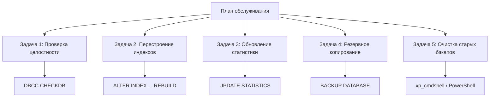
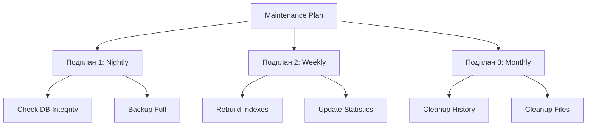
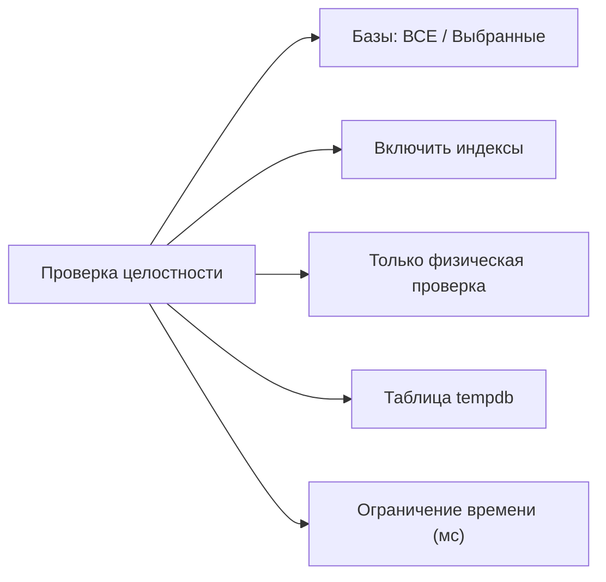
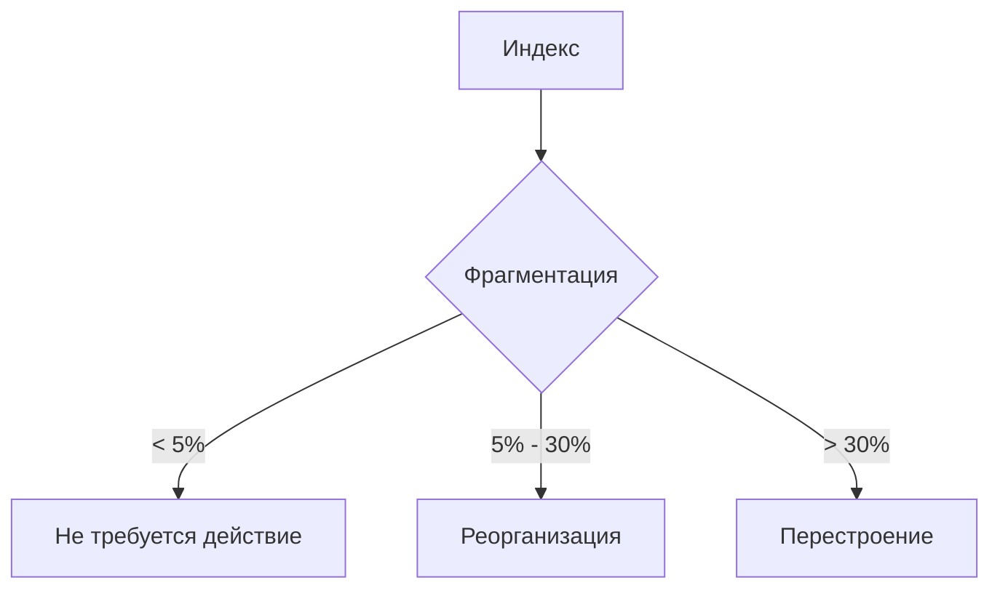
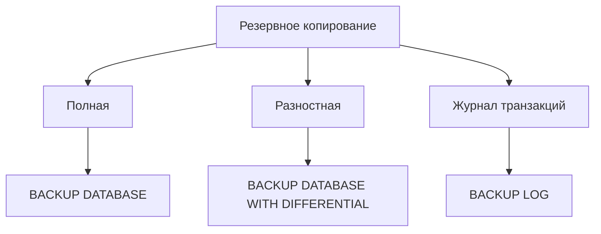
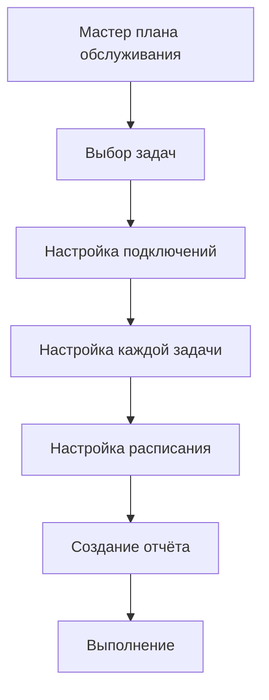
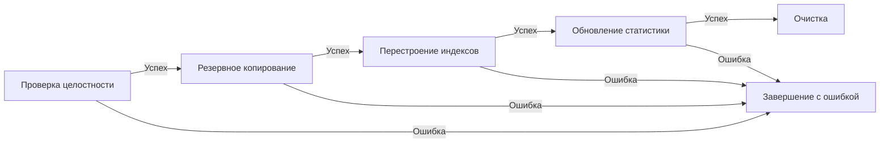

# 🔙 📚 🔜 Навигация по курсу

| [Предыдущее занятие](../LESSONS/PR28.MD) | &nbsp; | [Следующее занятие](../LESSONS/PR29.MD) |
|:--------------------------------------:|:------:|:-------------------------------------:|
| 🏠 [Практика №28](../LESSONS/PR28.MD) | 📖 [Содержание](../README.MD) | 💻 [Практика №29](../LESSONS/PR29.MD) |

---
# 🎓 Лекция 29. Планы обслуживания (Maintenance Plans)

⏱️ **Продолжительность:** 90 минут  
🎯 **Цель лекции:**  
Сформировать у студентов понимание назначения и возможностей планов обслуживания SQL Server, научить создавать и настраивать планы для автоматизации задач резервного копирования, перестроения индексов, обновления статистики и проверки целостности базы данных.

---

## 🔙 📚 🔜 Навигация по курсу

| [Предыдущее занятие](../lesson-28/practice.md) | &nbsp; | [Следующее занятие](../lesson-29/practice.md) |
|:-----------------------------------------------:|:------:|:---------------------------------------------:|
| 💻 [Практика №28](../lesson-28/practice.md) | 📖 [Содержание](../../README.md) | 💻 [Практика №29](practice.md) |

---

## 📖 Справочник терминов (официальные названия из русской SSMS)

| Русский термин | Английский эквивалент | Что это? | Пример |
|----------------|------------------------|----------|--------|
| **План обслуживания** | Maintenance Plan | Набор задач для автоматического обслуживания БД | `WeeklyMaintenance` |
| **Задача** | Task | Отдельное действие в плане обслуживания | `Back Up Database Task` |
| **Подплан** | Subplan | Группа задач с общим расписанием | `NightlyBackup` |
| **Проверка целостности** | Check Database Integrity | Задача DBCC CHECKDB | `CheckDB` |
| **Перестроение индекса** | Rebuild Index | Полная перестройка индекса | Исправляет фрагментацию |
| **Реорганизация индекса** | Reorganize Index | Дефрагментация индекса | Мягкое исправление |
| **Обновление статистики** | Update Statistics | Обновление статистики для оптимизатора | Улучшает планы запросов |
| **Очистка истории** | History Cleanup | Удаление старых записей из msdb | `sp_delete_backuphistory` |
| **Задача «Резервное копирование»** | Backup Task | Создание резервной копии | Full, Diff, Log |
| **Очистка обслуживания** | Maintenance Cleanup | Удаление старых файлов бэкапов | Удаление файлов старше N дней |
| **План обслуживания (SSIS)** | Maintenance Plan (SSIS) | План обслуживания как SSIS-пакет | Хранится в msdb |
| **Отчёт** | Report | Журнал выполнения плана | HTML или текст |
| **Сжатие бэкапа** | Backup Compression | Сжатие резервной копии | Экономит место |
| **Проверка контрольной суммы** | Checksum | Проверка целостности страниц | `WITH CHECKSUM` |

---

## 1. 🧠 Что такое план обслуживания?

### 1.1. Определение

**План обслуживания (Maintenance Plan)** — это графический инструмент в SSMS, который позволяет создавать и автоматизировать задачи обслуживания баз данных без написания T-SQL кода. План обслуживания представляет собой SSIS-пакет, который выполняется SQL Server Agent.



### 1.2. Зачем нужны планы обслуживания?

| Без плана обслуживания | С планом обслуживания |
|------------------------|----------------------|
| Администратор вручную выполняет DBCC CHECKDB | Автоматическая проверка по расписанию |
| Индексы фрагментируются → падение производительности | Автоматическое перестроение индексов |
| Статистика устаревает → плохие планы запросов | Автоматическое обновление статистики |
| Бэкапы делаются от случая к случаю | Бэкапы по расписанию |
| История не ведётся | Детальные отчёты о выполнении |

### 1.3. Типовые задачи плана обслуживания

| Задача | Назначение | Периодичность |
|--------|------------|---------------|
| **Проверка целостности** | Выявление повреждений данных | Еженедельно |
| **Перестроение индексов** | Устранение фрагментации (>30%) | Еженедельно |
| **Реорганизация индексов** | Устранение фрагментации (5-30%) | Ежедневно |
| **Обновление статистики** | Обновление распределения данных | Ежедневно |
| **Резервное копирование** | Защита от потери данных | Ежедневно |
| **Очистка истории** | Удаление старых записей из msdb | Ежемесячно |
| **Очистка файлов** | Удаление старых бэкапов | Еженедельно |

---

## 2. 🛠️ Компоненты плана обслуживания

### 2.1. Структура плана обслуживания



### 2.2. Типы подключений

| Тип | Описание | Когда использовать |
|-----|----------|-------------------|
| **Текущий экземпляр** | Задачи выполняются на текущем сервере | Обычный сценарий |
| **Другой экземпляр** | Задачи выполняются на удалённом сервере | Централизованное управление |

### 2.3. Задачи плана обслуживания

| Задача | Описание | Параметры |
|--------|----------|-----------|
| **Проверка целостности** | `DBCC CHECKDB` | Только физическая проверка, отключение индексов |
| **Перестроение индекса** | `ALTER INDEX ... REBUILD` | Степень заполнения (FILLFACTOR), сжатие |
| **Реорганизация индекса** | `ALTER INDEX ... REORGANIZE` | Сжатие LOB-данных |
| **Обновление статистики** | `UPDATE STATISTICS` | Полное/выборочное, количество сэмплов |
| **Резервное копирование** | `BACKUP DATABASE / LOG` | Тип, сжатие, контрольная сумма |
| **Очистка истории** | Удаление из `backupset`, `sysjobhistory` | Возраст записей |
| **Очистка файлов** | Удаление файлов с диска | Папка, маска, возраст |
| **Выполнение T-SQL** | Любой пользовательский скрипт | T-SQL команда |

---

## 3. 📋 Задача «Проверка целостности»

### 3.1. Настройки задачи



### 3.2. Параметры

| Параметр | Значение | Рекомендация |
|----------|----------|--------------|
| **Проверка целостности** | Включить | ✅ Всегда |
| **Включить индексы** | Да | ✅ (требует ресурсов) |
| **Только физическая проверка** | Да/Нет | Быстрая ежедневная проверка |
| **Сброс времени ожидания** | 3600 | Для больших баз |
| **Хост для tempdb** | По умолчанию | Обычно оставляют |

### 3.3. Сгенерированный T-SQL

```sql
-- Задача "Проверка целостности" генерирует:
DBCC CHECKDB (N'AdventureWorks') WITH NO_INFOMSGS;
```

---

## 4. 🔧 Задачи перестроения и реорганизации индексов

### 4.1. Перестроение (REBUILD) vs Реорганизация (REORGANIZE)

| Характеристика | REBUILD | REORGANIZE |
|----------------|---------|------------|
| **Фрагментация** | Любая (рекомендуется >30%) | 5-30% |
| **Операция** | Удаление и создание заново | Дефрагментация страниц |
| **Блокировка** | Большая (SLE, таблица) | Малая (индекс) |
| **Время** | Долго | Быстро |
| **Требует места** | Да (до 2x размера) | Нет |
| **Обновление статистики** | Автоматически | Нет |



### 4.2. Параметры задачи

| Параметр | Описание | Режим |
|----------|----------|-------|
| **Базы данных** | Все/Выбранные | Выбор |
| **Объекты** | Таблицы и представления | Фильтр |
| **Тип операции** | REBUILD / REORGANIZE | Автоматически |
| **Степень заполнения** | FILLFACTOR (0-100) | 100 (без места) |
| **Сжатие данных** | PAGE / ROW | Не рекомендуется |
| **Сохранение индекса онлайн** | ONLINE | Enterprise Edition |
| **Лимит времени** | мс | 0 (без лимита) |

### 4.3. Сгенерированный T-SQL

```sql
-- Реорганизация
ALTER INDEX [IX_Name] ON [dbo].[Table] REORGANIZE;

-- Перестроение
ALTER INDEX [IX_Name] ON [dbo].[Table] REBUILD 
WITH (FILLFACTOR = 100, ONLINE = OFF);
```

---

## 5. 📊 Задача «Обновление статистики»

### 5.1. Что такое статистика?

Статистика — это метаданные о распределении данных в таблице, которые оптимизатор запросов использует для построения плана выполнения.

### 5.2. Настройки задачи

| Параметр | Описание | Рекомендация |
|----------|----------|--------------|
| **Базы данных** | Все/Выбранные | Все пользовательские |
| **Объекты** | Таблицы, представления | Все |
| **Обновление статистики** | Полное/Выборочное | Полное еженедельно |
| **Процент охвата** | Количество сэмплов | 100% или автоматически |
| **Обновление индексов** | Да/Нет | ✅ Да |

### 5.3. Сгенерированный T-SQL

```sql
-- Обновление статистики
UPDATE STATISTICS [dbo].[Employees] [IX_Department]
WITH FULLSCAN;

-- Для всех статистик таблицы
UPDATE STATISTICS [dbo].[Employees] WITH FULLSCAN;
```

---

## 6. 💾 Задача «Резервное копирование»

### 6.1. Типы резервных копий



### 6.2. Настройки задачи

| Параметр | Описание | Пример |
|----------|----------|--------|
| **Тип копии** | Полная / Разностная / Журнал | Полная |
| **Базы данных** | Все / Выбранные | Все пользовательские |
| **Папка назначения** | Локальная / Сетевая | `D:\Backup` |
| **Имя файла** | Шаблон | `{DB}_{DATE}.bak` |
| **Сжатие** | Да / Нет | ✅ Да |
| **Проверка контрольной суммы** | Да / Нет | ✅ Да |
| **Расширение файла** | .bak / .trn | .bak |

### 6.3. Шаблоны имён файлов

| Шаблон | Результат |
|--------|-----------|
| `{DB}_{DATE}_{TIME}.bak` | `AdventureWorks_20260512_0200.bak` |
| `{SERVER}{DB}_{DATE}.bak` | `SERVER1AdventureWorks_20260512.bak` |
| `{DB}_{DATE}_{SHORTTIME}.bak` | `AdventureWorks_20260512_02.bak` |

### 6.4. Сгенерированный T-SQL

```sql
BACKUP DATABASE [AdventureWorks]
TO DISK = N'D:\Backup\AdventureWorks_20260512.bak'
WITH COMPRESSION, CHECKSUM;
```

---

## 7. 🧹 Задача «Очистка обслуживания»

### 7.1. Две задачи очистки

| Задача | Что очищает | Таблица/Папка |
|--------|-------------|---------------|
| **Очистка истории** | Записи в msdb | `backupset`, `sysjobhistory` |
| **Очистка файлов** | Физические файлы | `D:\Backup\*.bak` |

### 7.2. Настройки очистки истории

| Параметр | Значение | Рекомендация |
|----------|----------|--------------|
| **Удалить данные старше** | Дни | 90 дней |
| **История бэкапов** | Да | ✅ |
| **История заданий** | Да | ✅ |
| **История обслуживания** | Да | ✅ |

### 7.3. Настройки очистки файлов

| Параметр | Значение | Рекомендация |
|----------|----------|--------------|
| **Папка** | Путь | `D:\Backup` |
| **Расширение** | `.bak`, `.trn` | `.bak` |
| **Если файл старше** | Дни | 7-30 дней |
| **Включать подпапки** | Да/Нет | ✅ Нет |

### 7.4. Сгенерированный T-SQL

```sql
-- Очистка истории
EXEC msdb.dbo.sp_delete_backuphistory 
    @oldest_date = '2026-02-11';

-- Очистка файлов (через xp_cmdshell)
EXEC xp_cmdshell 'forfiles /p "D:\Backup" /m *.bak /d -7 /c "cmd /c del @file"';
```

---

## 8. 📅 Создание плана обслуживания

### 8.1. Мастер создания плана



### 8.2. Расписания

| Расписание | Частота | Задачи |
|------------|---------|--------|
| **Nightly** | Ежедневно, 01:00 | Резервное копирование |
| **Weekly** | Еженедельно, воскресенье | Проверка целостности, индексы |
| **Hourly** | Каждый час | Копия журнала |
| **Cleanup** | Ежемесячно | Очистка истории |

### 8.3. Порядок выполнения задач



---

## 9. 📊 Мониторинг и отчёты

### 9.1. История выполнения плана

```sql
-- План обслуживания как задание SQL Agent
SELECT 
    j.name AS PlanName,
    jh.run_date,
    jh.run_time,
    CASE jh.run_status
        WHEN 0 THEN '❌ Ошибка'
        WHEN 1 THEN '✅ Успех'
        WHEN 2 THEN '🔄 Повтор'
        WHEN 3 THEN '⏹️ Отменён'
        WHEN 4 THEN '⏳ Выполняется'
    END AS Status,
    jh.message
FROM msdb.dbo.sysjobs j
JOIN msdb.dbo.sysjobhistory jh ON j.job_id = jh.job_id
WHERE j.name LIKE '%Maintenance%'
ORDER BY jh.run_date DESC, jh.run_time DESC;
```

### 9.2. Просмотр свойств плана

```sql
-- План обслуживания как SSIS-пакет
SELECT 
    name,
    description,
    created,
    packageFormat
FROM msdb.dbo.sysssispackages
WHERE name LIKE '%Maintenance%';
```

### 9.3. Отчёт о выполнении в SSMS

```
Management → Maintenance Plans → ПКМ → View History
```

---

## 10. ⚠️ Рекомендации и подводные камни

### 10.1. Рекомендации

| Задача | Частота | Время | Примечание |
|--------|---------|-------|------------|
| Проверка целостности | Еженедельно | Ночью | Ресурсоёмкая |
| Перестроение индексов | Еженедельно | Ночью | Требует места |
| Обновление статистики | Ежедневно | Ночью | Быстрая |
| Резервное копирование | Ежедневно | Ночью | Полная копия |
| Копия журнала | Каждые 15-60 мин | 24/7 | Для FULL модели |
| Очистка истории | Ежемесячно | Ночью | Поддерживает msdb |

### 10.2. Подводные камни

| Проблема | Решение |
|----------|---------|
| **Перестроение падает при нехватке места** | Увеличить диск или использовать REORGANIZE |
| **Проверка целостности долго выполняется** | Использовать `PHYSICAL_ONLY` для ежедневной проверки |
| **Бэкап перезаписывает старые файлы** | Использовать `INIT` или динамические имена |
| **Задание не выполняется из-за прав** | Назначить Owner с правами sysadmin |
| **Очистка файлов удаляет нужные бэкапы** | Проверить возраст (`/d -7`) |

### 10.3. Лучшие практики

- [ ] Разделить задачи на разные подпланы: **Nightly**, **Weekly**, **Hourly**
- [ ] Настроить **уведомления** для критических задач
- [ ] Регулярно **тестировать** восстановление бэкапов
- [ ] **Мониторить** время выполнения задач
- [ ] Хранить бэкапы на **отдельном диске**
- [ ] Настроить **сжатие** бэкапов
- [ ] Использовать **CHECKSUM** для контроля целостности

🔑 **Золотое правило:**  
> *«План обслуживания должен быть простым и предсказуемым. Не смешивайте задачи с разными временами выполнения в одном подплане. Всегда тестируйте план на тестовой среде перед внедрением на production!»*

---

## 11. ❓ Вопросы для самопроверки

1. Что такое план обслуживания в SQL Server?
2. Какие задачи можно добавить в план обслуживания?
3. В чём разница между REBUILD и REORGANIZE индексов?
4. При каком уровне фрагментации рекомендуется REBUILD?
5. При каком уровне фрагментации рекомендуется REORGANIZE?
6. Зачем нужно обновление статистики?
7. Какие типы резервных копий можно создавать в плане обслуживания?
8. Как настроить очистку старых бэкапов?
9. Как настроить расписание для плана обслуживания?
10. Где хранятся планы обслуживания?
11. Как посмотреть историю выполнения плана обслуживания?
12. Что такое FILLFACTOR и как он влияет на производительность?
13. Почему проверку целостности и перестроение индексов лучше выполнять в разное время?
14. Что произойдёт, если во время перестроения индекса закончится место на диске?
15. Как настроить уведомления об ошибках в плане обслуживания?

---

## 📎 Приложение: Шпаргалка команд

```sql
-- Просмотр планов обслуживания
SELECT * FROM msdb.dbo.sysssispackages;

-- Просмотр подпланов
SELECT * FROM msdb.dbo.sysmaintplan_plans;
SELECT * FROM msdb.dbo.sysmaintplan_subplans;

-- Просмотр истории выполнения
SELECT * FROM msdb.dbo.sysmaintplan_log;

-- Создание плана через T-SQL (сложно, через SSIS)
-- Рекомендуется использовать SSMS

-- Удаление плана
EXEC msdb.dbo.sp_delete_maintenance_plan @plan_id = '...';

-- Отключение плана
EXEC msdb.dbo.sp_update_job @job_name = 'Maintenance Plan...', @enabled = 0;
```


# 🔙 📚 🔜 Навигация по курсу

| [Предыдущее занятие](../LESSONS/PR28.MD) | &nbsp; | [Следующее занятие](../LESSONS/PR29.MD) |
|:--------------------------------------:|:------:|:-------------------------------------:|
| 🏠 [Практика №28](../LESSONS/PR28.MD) | 📖 [Содержание](../README.MD) | 💻 [Практика №29](../LESSONS/PR29.MD) |
