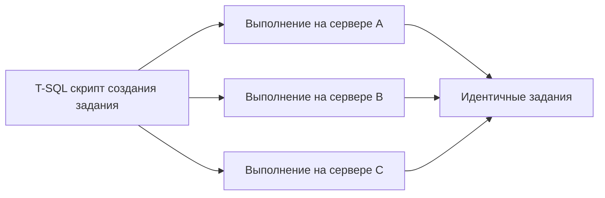
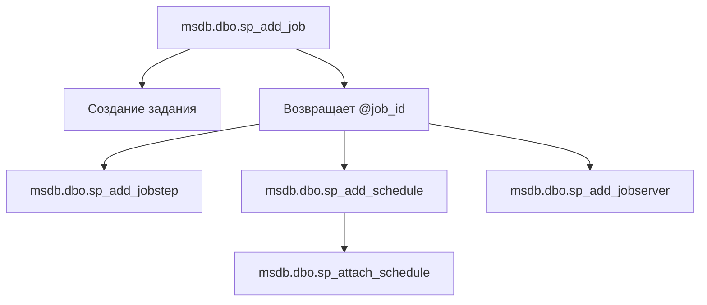
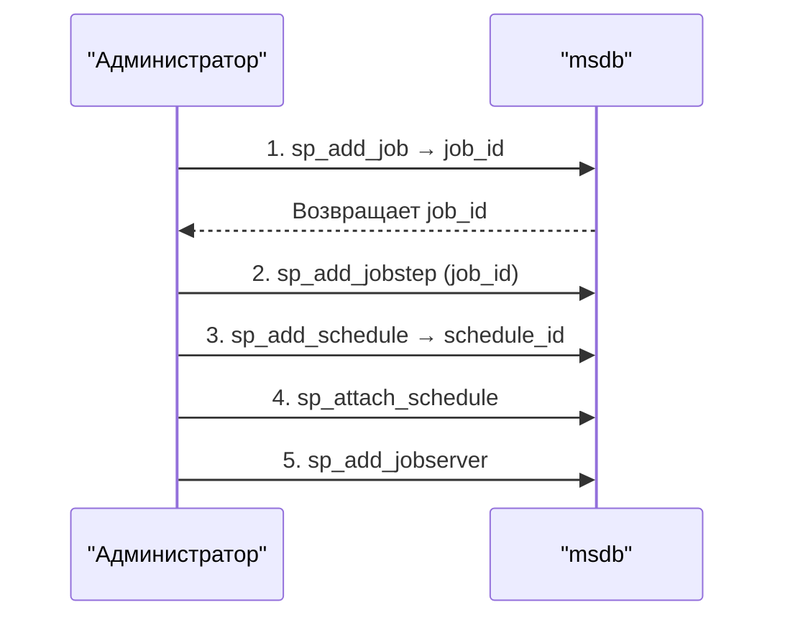

# 🔙 📚 🔜 Навигация по курсу

| [Предыдущее занятие](../LESSONS/PR29.MD) | &nbsp; | [Следующее занятие](../LESSONS/PR30.MD) |
|:--------------------------------------:|:------:|:-------------------------------------:|
| 🏠 [Практика №29](../LESSONS/PR29.MD) | 📖 [Содержание](../README.MD) | 💻 [Практика №30](../LESSONS/PR30.MD) |

---

# 🎓 Лекция 30. Автоматизация через T-SQL: sp_add_job, sp_add_jobstep

⏱️ **Продолжительность:** 90 минут  
🎯 **Цель лекции:**  
Сформировать у студентов понимание программного создания заданий SQL Server Agent с использованием системных хранимых процедур `sp_add_job`, `sp_add_jobstep`, `sp_add_schedule`, `sp_add_jobserver`. Научить писать полностью автоматизированные скрипты для развёртывания заданий на новых серверах, использовать динамические имена и настраивать уведомления через T-SQL без использования графического интерфейса.

---

## 📖 Справочник терминов (официальные названия из русской SSMS)

| Русский термин | Английский эквивалент | Что это? | Процедура |
|----------------|------------------------|----------|-----------|
| **Создание задания** | Add job | Создание нового задания | `sp_add_job` |
| **Добавление шага** | Add job step | Добавление шага в задание | `sp_add_jobstep` |
| **Добавление расписания** | Add schedule | Создание нового расписания | `sp_add_schedule` |
| **Привязка расписания** | Attach schedule | Связывание расписания с заданием | `sp_attach_schedule` |
| **Добавление сервера** | Add jobserver | Добавление целевого сервера | `sp_add_jobserver` |
| **Владелец задания** | Owner | Учётная запись, владеющая заданием | `@owner_login_name` |
| **Категория задания** | Category | Группировка заданий | `@category_name` |
| **Имя шага** | Step name | Идентификатор шага | `@step_name` |
| **Команда шага** | Command | Исполняемый код | `@command` |
| **База данных шага** | Database | Контекст БД для шага | `@database_name` |
| **Действие при успехе** | On success action | Код действия | `@on_success_action` |
| **Действие при ошибке** | On fail action | Код действия | `@on_fail_action` |
| **Повтор** | Retry | Количество и интервал повторов | `@retry_attempts`, `@retry_interval` |
| **Расписание (тип)** | Schedule type | Периодичность | `@freq_type` |
| **Интервал расписания** | Schedule interval | Детали периодичности | `@freq_interval`, `@freq_subday_interval` |
| **Время начала** | Active start time | Начало окна активности | `@active_start_time` |

---

## 1. 🧠 Зачем создавать задания через T-SQL?

### 1.1. Преимущества программного создания

| Способ создания | Графический интерфейс (SSMS) | T-SQL скрипты |
|----------------|------------------------------|---------------|
| **Скорость** | Медленно (ручная настройка) | Быстро (один запуск) |
| **Повторяемость** | Низкая (разные настройки) | Высокая (один скрипт) |
| **Воспроизводимость** | Требуется ручная копия | Скрипт в системе контроля версий |
| **Массовое развёртывание** | Сложно | Легко (циклы) |
| **Динамические параметры** | Нет | Да (переменные, даты) |
| **Ошибки ввода** | Часто (опечатки) | Контролируемые |



### 1.2. Типовые сценарии использования

| Сценарий | Описание |
|----------|----------|
| **Миграция заданий** | Перенос заданий с одного сервера на другой |
| **Шаблоны заданий** | Создание однотипных заданий для разных БД |
| **Динамические расписания** | Расписания, зависящие от даты или дня недели |
| **Автоматическая установка** | Развёртывание заданий вместе с БД |
| **Версионирование** | Хранение скриптов в Git |

---

## 2. 📝 Системные процедуры SQL Agent в msdb

### 2.1. Основные процедуры



### 2.2. Порядок создания задания



### 2.3. Ключевые параметры sp_add_job

| Параметр | Описание | Пример |
|----------|----------|--------|
| `@job_name` | Уникальное имя задания | `'DailyBackup'` |
| `@enabled` | Включено ли задание | `1` (включено) |
| `@description` | Описание задания | `'Полный бэкап'` |
| `@owner_login_name` | Владелец | `'sa'` |
| `@category_name` | Категория | `'Database Maintenance'` |
| `@job_id` | OUTPUT - возвращаемый ID | `@jobId OUTPUT` |

### 2.4. Ключевые параметры sp_add_jobstep

| Параметр | Описание | Пример |
|----------|----------|--------|
| `@job_id` | ID задания | `@jobId` |
| `@step_name` | Имя шага | `'Backup Step'` |
| `@subsystem` | Тип шага | `'TSQL'` (T-SQL) |
| `@command` | Текст команды | `'BACKUP DATABASE...'` |
| `@database_name` | База данных | `'master'` |
| `@on_success_action` | При успехе: 1-след.шаг, 3-успех | `1` |
| `@on_fail_action` | При ошибке: 2-след.шаг?, 4-ошибка | `4` |
| `@retry_attempts` | Количество повторов | `3` |
| `@retry_interval` | Интервал повтора (мин) | `5` |

**Значения `@on_success_action` / `@on_fail_action`:**

| Код | Действие |
|-----|----------|
| 1 | Перейти к следующему шагу |
| 2 | Завершить задание успешно |
| 3 | Завершить задание с ошибкой |
| 4 | Перейти к указанному шагу (требует `@on_success_step_id`) |

### 2.5. Параметры расписания (sp_add_schedule)

| Параметр | Описание | Пример |
|----------|----------|--------|
| `@schedule_name` | Имя расписания | `'NightlySchedule'` |
| `@freq_type` | Тип: 1-разово, 4-ежедневно, 8-еженедельно | `4` |
| `@freq_interval` | Дни недели (битовая маска) или дни месяца | `1` |
| `@freq_subday_type` | Внутри дня: 1-время, 4-минуты, 8-часы | `1` |
| `@freq_subday_interval` | Интервал внутри дня | `0` |
| `@active_start_date` | Дата начала (YYYYMMDD) | `20260501` |
| `@active_end_date` | Дата окончания | `99991231` |
| `@active_start_time` | Время начала (HHMMSS) | `20000` (02:00) |

### 2.6. Привязка и назначение

```sql
-- Привязка расписания к заданию
EXEC msdb.dbo.sp_attach_schedule
    @job_name = 'DailyBackup',
    @schedule_name = 'NightlySchedule';

-- Добавление задания на текущий сервер
EXEC msdb.dbo.sp_add_jobserver
    @job_name = 'DailyBackup';
```

---

## 3. 💻 Примеры создания заданий через T-SQL

### 3.1. Простейшее задание с одним шагом

```sql
USE msdb;
GO

DECLARE @jobId BINARY(16);

-- 1. Создать задание
EXEC dbo.sp_add_job
    @job_name = N'SimpleBackup_Test',
    @enabled = 1,
    @description = N'Простой бэкап тестовой БД',
    @owner_login_name = N'sa',
    @job_id = @jobId OUTPUT;

-- 2. Добавить шаг
EXEC dbo.sp_add_jobstep
    @job_id = @jobId,
    @step_name = N'Backup Step',
    @subsystem = N'TSQL',
    @command = N'
        BACKUP DATABASE AdventureWorks
        TO DISK = ''D:\Backup\AdventureWorks.bak''
        WITH COMPRESSION, CHECKSUM;',
    @database_name = N'master',
    @on_success_action = 3,  -- завершить успешно
    @on_fail_action = 4;     -- завершить с ошибкой

-- 3. Добавить на сервер
EXEC dbo.sp_add_jobserver
    @job_name = N'SimpleBackup_Test';
```

### 3.2. Задание с несколькими шагами и расписанием

```sql
USE msdb;
GO

DECLARE @jobId BINARY(16);

-- Задание
EXEC dbo.sp_add_job
    @job_name = N'ComplexBackup_WithSchedule',
    @enabled = 1,
    @description = N'Бэкап, проверка, очистка',
    @owner_login_name = N'sa',
    @job_id = @jobId OUTPUT;

-- Шаг 1: Полный бэкап
EXEC dbo.sp_add_jobstep
    @job_id = @jobId,
    @step_name = N'Full Backup',
    @subsystem = N'TSQL',
    @command = N'
        DECLARE @FileName NVARCHAR(500);
        SET @FileName = ''D:\Backup\AW_'' + FORMAT(GETDATE(), ''yyyyMMdd'') + ''.bak'';
        BACKUP DATABASE AdventureWorks TO DISK = @FileName
        WITH COMPRESSION, CHECKSUM;',
    @database_name = N'master',
    @on_success_action = 1,  -- следующий шаг
    @on_fail_action = 4,     -- ошибка
    @retry_attempts = 2,
    @retry_interval = 5;

-- Шаг 2: Очистка старых бэкапов
EXEC dbo.sp_add_jobstep
    @job_id = @jobId,
    @step_name = N'Cleanup Old Backups',
    @subsystem = N'CmdExec',
    @command = N'forfiles /p "D:\Backup" /m *.bak /d -7 /c "cmd /c del @file"',
    @on_success_action = 3,  -- завершить успешно
    @on_fail_action = 4;

-- Расписание: ежедневно в 02:00
EXEC dbo.sp_add_schedule
    @schedule_name = N'Nightly_2AM',
    @freq_type = 4,               -- ежедневно
    @freq_interval = 1,           -- каждый день
    @active_start_time = 20000,   -- 02:00
    @active_end_time = 235959,
    @active_start_date = 20260501,
    @active_end_date = 99991231;

-- Привязка расписания
EXEC dbo.sp_attach_schedule
    @job_name = N'ComplexBackup_WithSchedule',
    @schedule_name = N'Nightly_2AM';

-- Добавление на сервер
EXEC dbo.sp_add_jobserver
    @job_name = N'ComplexBackup_WithSchedule';
```

### 3.3. Динамическое создание задания для всех пользовательских баз

```sql
USE msdb;
GO

DECLARE @dbName NVARCHAR(128);
DECLARE @jobId BINARY(16);
DECLARE @jobName NVARCHAR(255);
DECLARE @stepCommand NVARCHAR(MAX);

DECLARE db_cursor CURSOR FOR
    SELECT name FROM sys.databases
    WHERE database_id > 4 AND state_desc = 'ONLINE'
        AND name NOT IN ('tempdb');

OPEN db_cursor;
FETCH NEXT FROM db_cursor INTO @dbName;

WHILE @@FETCH_STATUS = 0
BEGIN
    SET @jobName = N'Backup_' + @dbName;
    
    -- Проверяем, существует ли уже задание (можно удалить, если нужно)
    IF NOT EXISTS (SELECT 1 FROM msdb.dbo.sysjobs WHERE name = @jobName)
    BEGIN
        EXEC dbo.sp_add_job
            @job_name = @jobName,
            @enabled = 1,
            @description = N'Ежедневный бэкап базы ' + @dbName,
            @owner_login_name = N'sa',
            @job_id = @jobId OUTPUT;
        
        SET @stepCommand = N'
            DECLARE @FileName NVARCHAR(500);
            SET @FileName = ''D:\Backup\' + @dbName + N'_'' + FORMAT(GETDATE(), ''yyyyMMdd_HHmm'') + ''.bak'';
            BACKUP DATABASE [' + @dbName + N'] TO DISK = @FileName
            WITH COMPRESSION, CHECKSUM;';
        
        EXEC dbo.sp_add_jobstep
            @job_id = @jobId,
            @step_name = N'Backup Step',
            @subsystem = N'TSQL',
            @command = @stepCommand,
            @database_name = N'master',
            @on_success_action = 3,
            @on_fail_action = 4;
        
        EXEC dbo.sp_add_jobserver
            @job_name = @jobName;
    END
    
    FETCH NEXT FROM db_cursor INTO @dbName;
END

CLOSE db_cursor;
DEALLOCATE db_cursor;
```

---

## 4. 🔧 Расширенные техники

### 4.1. Использование переменных и динамических имён

```sql
DECLARE @JobName NVARCHAR(128) = N'Maintenance_' + CONVERT(NVARCHAR, GETDATE(), 112);
DECLARE @ScheduleName NVARCHAR(128) = N'Sched_' + @JobName;
DECLARE @JobId BINARY(16);

EXEC dbo.sp_add_job
    @job_name = @JobName,
    @job_id = @JobId OUTPUT,
    @enabled = 1,
    @owner_login_name = N'sa';

-- ... остальные операции
```

### 4.2. Добавление уведомлений через T-SQL

```sql
-- Создание оператора (если не существует)
IF NOT EXISTS (SELECT 1 FROM msdb.dbo.sysoperators WHERE name = 'DBA_Team')
BEGIN
    EXEC msdb.dbo.sp_add_operator
        @name = N'DBA_Team',
        @email_address = N'dba@company.com',
        @enabled = 1;
END

-- Обновление задания для уведомлений
EXEC msdb.dbo.sp_update_job
    @job_name = N'DailyBackup',
    @notify_level_email = 2,   -- при ошибке
    @notify_email_operator_name = N'DBA_Team';
```

### 4.3. Копирование задания с другого сервера

```sql
-- 1. Получить определение задания с исходного сервера (скрипт)
-- 2. Подставить параметры (владелец, пути)
-- 3. Выполнить на целевом сервере
```

### 4.4. Проверка существования задания перед созданием

```sql
IF NOT EXISTS (SELECT 1 FROM msdb.dbo.sysjobs WHERE name = N'MyJob')
BEGIN
    EXEC dbo.sp_add_job ...;
END
ELSE
BEGIN
    PRINT 'Задание уже существует';
END
```

---

## 5. 📊 Мониторинг и управление заданиями через T-SQL

### 5.1. Просмотр всех заданий

```sql
SELECT 
    job_id,
    name,
    enabled,
    description,
    date_created,
    date_modified
FROM msdb.dbo.sysjobs
ORDER BY name;
```

### 5.2. Просмотр шагов задания

```sql
SELECT 
    job_id,
    step_id,
    step_name,
    subsystem,
    command,
    database_name,
    on_success_action,
    on_fail_action,
    retry_attempts
FROM msdb.dbo.sysjobsteps
WHERE job_id = (SELECT job_id FROM msdb.dbo.sysjobs WHERE name = 'DailyBackup')
ORDER BY step_id;
```

### 5.3. Включение/отключение задания

```sql
EXEC msdb.dbo.sp_update_job
    @job_name = N'DailyBackup',
    @enabled = 0;  -- 1 - включить
```

### 5.4. Удаление задания

```sql
EXEC msdb.dbo.sp_delete_job
    @job_name = N'DailyBackup';
```

---

## 6. 🚨 Типовые ошибки и их решение

| Ошибка | Причина | Решение |
|--------|---------|---------|
| **Не удалось найти задание** | Имя задания указано неверно | Проверить регистр, пробелы |
| **Параметр @job_id не указан** | Пропущен OUTPUT | Добавить `@job_id = @JobId OUTPUT` |
| **Расписание уже существует** | Дублирование имени | Проверить перед созданием |
| **Недостаточно прав** | Не sysadmin | Использовать `sa` или владельца |
| **Шаг ссылается на несуществующую БД** | Опечатка в имени БД | Проверить имена |

---

## 7. ✅ Резюме: чек-лист создания задания через T-SQL

### Подготовка:
- [ ] Подключиться к `msdb`
- [ ] Объявить переменную `@jobId BINARY(16)`

### Создание задания:
- [ ] `sp_add_job` с OUTPUT параметром
- [ ] `sp_add_jobstep` для каждого шага
- [ ] `sp_add_schedule` (опционально)
- [ ] `sp_attach_schedule` (если есть расписание)
- [ ] `sp_add_jobserver` (добавить на сервер)

### Проверка:
- [ ] Выполнить `sp_start_job` для теста
- [ ] Проверить `sysjobhistory`
- [ ] Убедиться, что задание работает по расписанию

🔑 **Золотое правило:**  
> *«Всегда используйте переменную `@job_id OUTPUT` и сохраняйте её для последующих шагов. Это гарантирует правильную связь между заданием и его компонентами. Храните скрипты создания заданий в системе контроля версий!»*

---

## 8. ❓ Вопросы для самопроверки

1. Какие основные системные процедуры используются для создания задания?
2. В какой базе данных они находятся?
3. Зачем нужен параметр `@job_id OUTPUT`?
4. Что означают значения `@freq_type = 4` и `@freq_type = 8`?
5. Какие действия можно задать при успехе/ошибке шага?
6. Как задать ежечасное выполнение задания через T-SQL?
7. Как добавить уведомление по email в задание через T-SQL?
8. Как проверить, существует ли задание, перед его созданием?
9. Как удалить задание через T-SQL?
10. Как временно отключить задание?
11. Какие права необходимы для создания заданий?
12. Как просмотреть шаги существующего задания?
13. Можно ли создать расписание без привязки к заданию?
14. Что такое подсистема `CmdExec` и для чего она используется?
15. Как запустить задание вручную через T-SQL?

---

## 📎 Приложение: Шпаргалка команд

```sql
-- === СОЗДАНИЕ ЗАДАНИЯ ===
USE msdb;
GO
DECLARE @jobId BINARY(16);

EXEC dbo.sp_add_job
    @job_name = 'MyJob',
    @enabled = 1,
    @description = 'Описание',
    @owner_login_name = 'sa',
    @job_id = @jobId OUTPUT;

EXEC dbo.sp_add_jobstep
    @job_id = @jobId,
    @step_name = 'Step1',
    @subsystem = 'TSQL',
    @command = 'SELECT 1',
    @database_name = 'master',
    @on_success_action = 3,
    @on_fail_action = 4;

EXEC dbo.sp_add_jobserver
    @job_name = 'MyJob';

-- === РАСПИСАНИЕ ===
EXEC dbo.sp_add_schedule
    @schedule_name = 'Daily_2AM',
    @freq_type = 4,
    @freq_interval = 1,
    @active_start_time = 20000;

EXEC dbo.sp_attach_schedule
    @job_name = 'MyJob',
    @schedule_name = 'Daily_2AM';

-- === УПРАВЛЕНИЕ ===
EXEC dbo.sp_start_job @job_name = 'MyJob';
EXEC dbo.sp_stop_job @job_name = 'MyJob';
EXEC dbo.sp_update_job @job_name = 'MyJob', @enabled = 0;
EXEC dbo.sp_delete_job @job_name = 'MyJob';

-- === ПРОСМОТР ===
SELECT * FROM sysjobs;
SELECT * FROM sysjobsteps WHERE job_id = (SELECT job_id FROM sysjobs WHERE name = 'MyJob');
SELECT * FROM sysjobhistory WHERE job_id = (SELECT job_id FROM sysjobs WHERE name = 'MyJob');
```

---

📜 **Лицензия:** CC BY-NC-SA 4.0  
👨‍🏫 **Автор:** Руслан Ринатович Сафиулин  
📅 **Дата:** 14.05.2026

---

# 🔙 📚 🔜 Навигация по курсу

| [Предыдущее занятие](../LESSONS/PR29.MD) | &nbsp; | [Следующее занятие](../LESSONS/PR30.MD) |
|:--------------------------------------:|:------:|:-------------------------------------:|
| 🏠 [Практика №29](../LESSONS/PR29.MD) | 📖 [Содержание](../README.MD) | 💻 [Практика №30](../LESSONS/PR30.MD) |

