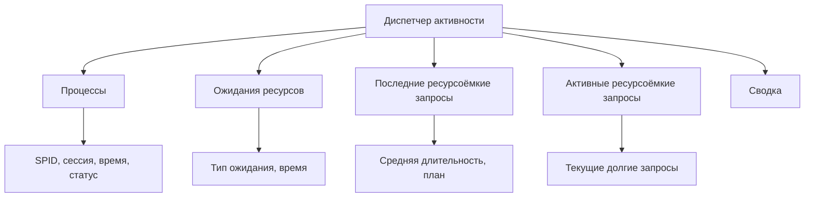
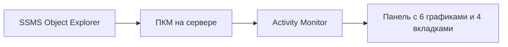
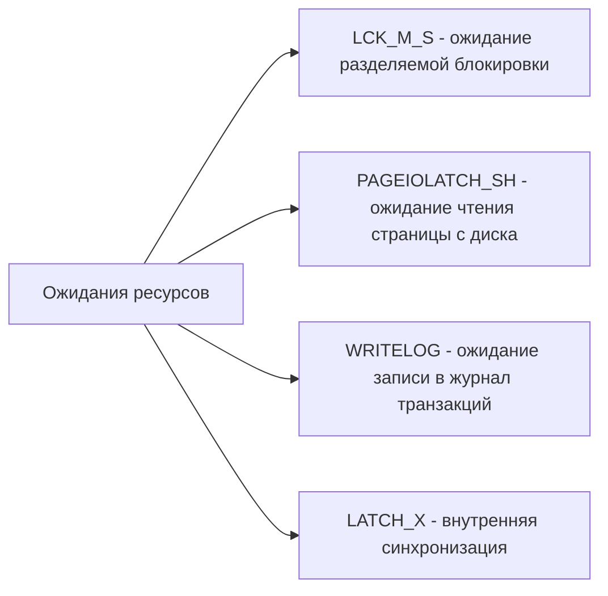
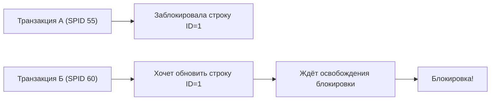
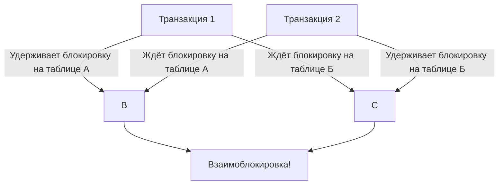

# 🔙 📚 🔜 Навигация по курсу

| [Предыдущее занятие](../LESSONS/PR30.MD) | &nbsp; | [Следующее занятие](../LESSONS/PR31.MD) |
|:--------------------------------------:|:------:|:-------------------------------------:|
| 🏠 [Практика №30](../LESSONS/PR30.MD) | 📖 [Содержание](../README.MD) | 💻 [Практика №31](../LESSONS/PR31.MD) |

---

# 🎓 Лекция 31. Мониторинг производительности: Диспетчер активности

⏱️ **Продолжительность:** 90 минут  
🎯 **Цель лекции:**  
Сформировать у студентов понимание методов мониторинга текущей активности SQL Server, научить использовать инструмент «Диспетчер активности» (Activity Monitor) в SSMS для выявления проблем производительности, анализа блокировок, долгих запросов и ресурсоёмких процессов.

---

## 🔙 📚 🔜 Навигация по курсу

| [Предыдущее занятие](../lesson-30/practice.md) | &nbsp; | [Следующее занятие](../lesson-31/practice.md) |
|:-----------------------------------------------:|:------:|:---------------------------------------------:|
| 💻 [Практика №30](../lesson-30/practice.md) | 📖 [Содержание](../../README.md) | 💻 [Практика №31](practice.md) |

---

## 📖 Справочник терминов (официальные названия из русской SSMS)

| Русский термин | Английский эквивалент | Что это? | Пример |
|----------------|------------------------|----------|--------|
| **Диспетчер активности** | Activity Monitor | Инструмент для просмотра текущей активности сервера | ПКМ на сервер → Activity Monitor |
| **Процессы** | Processes | Текущие подключения и выполняемые запросы | Сессии пользователей |
| **Ожидания** | Waits | Ресурсы, которых ожидают запросы | PAGEIOLATCH_SH, LCK_M_S |
| **Последние ресурсоёмкие запросы** | Recent Expensive Queries | Запросы с высоким потреблением ресурсов | По времени, I/O, CPU |
| **Блокировка** | Blocking | Ситуация, когда один процесс удерживает ресурс, а другой ждёт | Голодная блокировка (blocking chain) |
| **Взаимоблокировка** | Deadlock | Два процесса ждут ресурсы друг друга | Жертва взаимоблокировки |
| **Тип ожидания** | Wait type | Категория, почему запрос не выполняется | `LCK_M_S` — ожидание разделяемой блокировки |
| **Время ожидания** | Wait time | Время, проведённое в ожидании | 5000 мс |
| **Время ЦП** | CPU time | Время использования процессора запросом | 2500 мс |
| **Логические операции чтения** | Logical reads | Количество страниц, прочитанных из кэша | 12500 |
| **Физические операции чтения** | Physical reads | Количество страниц, прочитанных с диска | 500 |
| **Страница** | Page | Единица хранения данных (8 КБ) | Страница 1:12345 |
| **Блокировка страницы** | Page lock | Блокировка на уровне страницы | `PAGELOCK` |
| **Блокировка строки** | Row lock | Блокировка на уровне строки | `ROWLOCK` |
| **Уровень изоляции** | Isolation level | Уровень согласованности данных | READ COMMITTED, SERIALIZABLE |
| **Вложенные циклы** | Nested loops | План выполнения | Дорогой оператор |

---

## 1. 🖥️ Диспетчер активности: назначение и возможности

### 1.1. Что такое Диспетчер активности?

**Диспетчер активности** — это встроенный графический инструмент SSMS для реального мониторинга текущей работы SQL Server. Он показывает:

- Все активные сессии (процессы)
- Блокировки и ожидания
- Ресурсоёмкие запросы
- Статистику I/O, CPU, памяти



### 1.2. Зачем нужен мониторинг?

| Проблема | Признак в мониторинге | Действие |
|----------|-----------------------|----------|
| **Медленные запросы** | Долгое время выполнения, высокий CPU | Оптимизировать запрос, добавить индекс |
| **Блокировки** | Процесс ждёт `LCK_M_*` | Найти блокирующую сессию, отменить/дождаться |
| **Взаимоблокировка** | Ошибка 1205, жертва | Переписать транзакции |
| **Недостаток памяти** | Высокие физические чтения | Добавить RAM, настроить кэш |
| **Проблемы с диском** | `PAGEIOLATCH_*` ожидания | Ускорить диск, разнести файлы |

### 1.3. Открытие Диспетчера активности



---

## 2. 📊 Компоненты Диспетчера активности

### 2.1. Вкладка «Обзор»

| График | Показывает | Нормальное значение |
|--------|------------|---------------------|
| **Загрузка процессора (%)** | Использование CPU | < 70%, пики допустимы |
| **Ожидающие задачи** | Количество ожидающих процессов | < 10 в обычном режиме |
| **Ввод-вывод базы данных (МБ/с)** | Дисковая активность | Зависит от дисков |
| **Общее количество запросов в секунду** | Нагрузка на сервер | Стабильно +-10% |
| **Память, используемая SQL Server (МБ)** | Использование RAM | Почти вся выделенная память |

### 2.2. Вкладка «Процессы»

Показывает все активные подключения (сессии) с деталями:

| Колонка | Описание |
|---------|----------|
| **SPID** | Идентификатор сессии (Session ID) |
| **Имя входа** | Пользователь (логин) |
| **База данных** | Текущая БД сессии |
| **Команда** | Тип команды (SELECT, INSERT, UPDATE, DELETE, BACKUP и др.) |
| **Приложение** | Имя приложения (SSMS, приложение .NET) |
| **Время ожидания** | Общее время ожидания (мс) |
| **Тип ожидания** | Последний тип ожидания (например, `PAGEIOLATCH_SH`) |
| **Длительность (мс)** | Время выполнения текущего запроса (или общей сессии) |
| **Физические операции чтения** | Количество страниц, считанных с диска |
| **Логические операции чтения** | Количество страниц, прочитанных из памяти |
| **Время ЦП (мс)** | CPU время запроса |
| **Память (КБ)** | Выделенная память |
| **Заблокировано** | SPID блокирующего процесса (если блокируется) |

### 2.3. Вкладка «Ожидания ресурсов»

Группирует ожидания по типам и показывает их суммарное время:



### 2.4. Вкладка «Последние ресурсоёмкие запросы»

Показывает запросы, которые в последнее время потребляли много ресурсов:
- По времени выполнения
- По CPU
- По физическим чтениям

Можно увидеть текст запроса и план выполнения.

### 2.5. Вкладка «Активные ресурсоёмкие запросы»

Текущие запросы, которые выполняются дольше заданного порога (по умолчанию 1000 мс).

---

## 3. 🔍 Анализ блокировок

### 3.1. Что такое блокировка?

**Блокировка (blocking)** — ситуация, когда одна транзакция удерживает блокировку на ресурсе (строка, страница, таблица), а другая транзакция ожидает освобождения этого ресурса.



### 3.2. Типы блокировок (Lock Modes)

| Тип | Полное название | Назначение |
|-----|-----------------|------------|
| **S** | Shared (разделяемая) | Чтение данных. Может быть несколько S-блокировок одновременно |
| **X** | Exclusive (исключительная) | Запись (INSERT, UPDATE, DELETE). Только одна |
| **U** | Update (обновления) | Предварительная блокировка для последующего X |
| **IS** | Intent Shared | Намерение получить S-блокировку на более низком уровне |
| **IX** | Intent Exclusive | Намерение получить X-блокировку на более низком уровне |
| **Sch-M** | Schema Modification | Изменение схемы таблицы (ALTER, DROP) |
| **Sch-S** | Schema Stability | Выполнение запроса, не меняющего схему |

### 3.3. Обнаружение блокировок через Диспетчер активности

1. Открыть вкладку **«Процессы»**
2. Найти строки, где колонка **«Заблокировано»** не пуста (там указан SPID блокирующей сессии)
3. Найти блокирующую сессию по этому SPID
4. Посмотреть её запрос (через инструмент или через контекстное меню)

### 3.4. Просмотр деталей блокировки через T-SQL

```sql
-- Кто кого блокирует?
SELECT 
    blocking.session_id AS BlockingSPID,
    blocking.blocking_session_id AS BlockerSPID,
    blocking.wait_type,
    blocking.wait_time,
    blocking.wait_resource,
    blocking.command,
    SQLtext.text
FROM sys.dm_exec_requests blocking
CROSS APPLY sys.dm_exec_sql_text(blocking.sql_handle) SQLtext
WHERE blocking.blocking_session_id > 0;

-- Все блокировки в системе
SELECT 
    request_session_id AS SPID,
    resource_type,
    resource_database_id,
    resource_description,
    request_mode,
    request_status
FROM sys.dm_tran_locks
WHERE request_status = 'WAIT' OR request_status = 'GRANT';
```

### 3.5. Поиск долгих транзакций

```sql
SELECT 
    st.session_id,
    at.transaction_id,
    at.transaction_begin_time,
    DATEDIFF(minute, at.transaction_begin_time, GETDATE()) AS duration_min,
    st.open_transaction_count,
    t.text
FROM sys.dm_tran_active_transactions at
JOIN sys.dm_tran_session_transactions st ON at.transaction_id = st.transaction_id
CROSS APPLY sys.dm_exec_sql_text(st.session_id) t;
```

### 3.6. Принудительное завершение сессии

```sql
-- KILL SPID (осторожно!)
KILL 55;
```

---

## 4. 🔥 Анализ долгих запросов

### 4.1. Выявление долгих запросов в Диспетчере активности

- **Вкладка «Активные ресурсоёмкие запросы»** показывает запросы, выполняющиеся дольше 1000 мс.
- **Вкладка «Последние ресурсоёмкие запросы»** позволяет увидеть недавние проблемы.

### 4.2. Получение текста запроса из Диспетчера активности

1. На вкладке **«Процессы»** ПКМ на строке → **Details**
2. Или запустить T-SQL:

```sql
-- Получить текст запроса по SPID
SELECT TEXT 
FROM sys.dm_exec_connections c
CROSS APPLY sys.dm_exec_sql_text(c.most_recent_sql_handle)
WHERE c.session_id = 55;  -- нужный SPID
```

### 4.3. Статистика выполнения запроса

```sql
-- Статистика I/O и CPU для активного запроса
SELECT 
    session_id,
    cpu_time,
    total_elapsed_time,
    logical_reads,
    writes,
    status,
    command
FROM sys.dm_exec_requests
WHERE session_id = 55;
```

### 4.4. Реальные планы выполнения

В Диспетчере активности можно посмотреть **приблизительный план** (estimated plan) или, если запрос выполняется, запросить **реальный план** (actual plan) через контекстное меню.

---

## 5. 📈 Статистика ожиданий (Wait Statistics)

### 5.1. Основные типы ожиданий

| Тип ожидания | Описание | Решение |
|--------------|----------|---------|
| **PAGEIOLATCH_SH / PAGEIOLATCH_EX** | Ожидание чтения/записи страницы с диска | Ускорить диск, увеличить кэш, оптимизировать запросы |
| **LCK_M_S, LCK_M_X** | Ожидание блокировки | Найти блокирующую сессию, оптимизировать транзакции |
| **WRITELOG** | Ожидание записи в журнал транзакций | Разместить журнал на быстром SSD, уменьшить частоту коммитов |
| **LATCH_* (LATCH_SH, LATCH_EX)** | Внутренняя синхронизация | Проблемы с памятью или с конкурентным доступом |
| **ASYNC_NETWORK_IO** | Клиент медленно читает данные | Оптимизировать клиент, увеличить буфер |
| **SOS_SCHEDULER_YIELD** | Запрос добровольно уступил процессор | Нормально для длительных запросов, но при большом количестве — загрузка CPU |
| **THREADPOOL** | Не хватает рабочих потоков | Увеличить `max worker threads`, оптимизировать запросы |

### 5.2. Просмотр глобальной статистики ожиданий

```sql
SELECT 
    wait_type,
    waiting_tasks_count,
    wait_time_ms,
    max_wait_time_ms,
    signal_wait_time_ms
FROM sys.dm_os_wait_stats
WHERE wait_type NOT LIKE '%SLEEP%'
ORDER BY wait_time_ms DESC;
```

### 5.3. Сброс статистики ожиданий (для чистоты эксперимента)

```sql
DBCC SQLPERF('sys.dm_os_wait_stats', CLEAR);
```

---

## 6. 🛠️ Диагностика взаимоблокировок (Deadlocks)

### 6.1. Что такое взаимоблокировка?

Две или более транзакции удерживают ресурсы, которые нужны другим, и никто не может продолжить выполнение. SQL Server выбирает **жертву** и откатывает её транзакцию.



### 6.2. Поиск взаимоблокировок

- **Журнал ошибок SQL Server** (сообщение 1205)
- **Трассировка событий (Extended Events)**
- **Системные функции**:

```sql
-- Вывести последнюю взаимоблокировку
SELECT 
    CAST(entry_data AS XML) AS DeadlockGraph
FROM sys.dm_xe_session_targets
WHERE target_name = 'ring_buffer'
    AND CAST(entry_data AS XML).value('(event/@name)[1]', 'VARCHAR(50)') = 'xml_deadlock_report';
```

### 6.3. Граф взаимоблокировки

В журнале SQL Server (или в расширенных событиях) сохраняется граф взаимоблокировки в XML. Его можно открыть в SSMS как диаграмму.

---

## 7. 📊 Рекомендации по проактивному мониторингу

| Интервал | Что проверять |
|----------|----------------|
| **Каждые 5 минут** | Количество ожидающих задач, блокировки |
| **Каждый час** | Долгие запросы, статистику ожиданий |
| **Ежедневно** | Тенденции использования CPU, I/O, памяти |
| **Еженедельно** | Регулировка порогов, анализ самых ресурсоёмких запросов |

### 7.1. Простой скрипт для периодического сбора статистики

```sql
-- Сохранение текущих блокировок в таблицу
CREATE TABLE dbo.BlockingLog (
    CaptureTime DATETIME,
    BlockingSPID INT,
    BlockedSPID INT,
    WaitType NVARCHAR(60),
    WaitTime INT
);

INSERT INTO dbo.BlockingLog
SELECT 
    GETDATE(),
    blocking_session_id,
    session_id,
    wait_type,
    wait_time
FROM sys.dm_exec_requests
WHERE blocking_session_id > 0;
```

---

## 8. ✅ Резюме: чек-лист администратора

### При подозрении на медленную работу:
- [ ] Открыть Диспетчер активности
- [ ] Проверить вкладку **«Процессы»** на наличие сессий с ненулевым `Заблокировано`
- [ ] Найти блокирующую сессию, определить её запрос
- [ ] При необходимости принять меры: оптимизировать запрос, завершить сессию
- [ ] Проверить вкладку **«Ожидания ресурсов»** для выявления типовых задержек
- [ ] Проанализировать **«Активные ресурсоёмкие запросы»**

### Для профилактики:
- [ ] Использовать индексы, соответствующие запросам
- [ ] Удерживать транзакции короткими
- [ ] Настроить уровни изоляции (READ COMMITTED SNAPSHOT)
- [ ] Мониторить статистику ожиданий

🔑 **Золотое правило:**  
> *«Диспетчер активности — первое, что нужно открыть при жалобах на производительность. Он показывает, кто и чего ждёт. Не гадайте — смотрите!»*

---

## 9. ❓ Вопросы для самопроверки

1. Как открыть Диспетчер активности в SSMS?
2. Какие 4 основные вкладки есть в Диспетчере активности?
3. Как определить, что сессия заблокирована?
4. Как узнать текст запроса, который выполняется в сессии?
5. Что означает тип ожидания `PAGEIOLATCH_SH`?
6. Что означают типы ожиданий `LCK_M_S` и `LCK_M_X`?
7. Как найти блокирующую сессию через T-SQL?
8. Что такое взаимоблокировка (deadlock)?
9. Как завершить сессию, если она заблокировала систему?
10. Где в SQL Server хранится информация о последних взаимоблокировках?
11. Как сбросить статистику ожиданий?
12. Какие графики отображаются на вкладке «Обзор»?
13. Как увидеть приблизительный план выполнения долгого запроса?
14. Какие действия можно предпринять при высоких `PAGEIOLATCH` ожиданиях?
15. Как настроить уровень изоляции `READ COMMITTED SNAPSHOT` для уменьшения блокировок?

---

## 📎 Приложение: Шпаргалка команд

```sql
-- Текущие активные запросы
SELECT * FROM sys.dm_exec_requests;

-- Текст запроса по SPID
SELECT text FROM sys.dm_exec_connections c
CROSS APPLY sys.dm_exec_sql_text(c.most_recent_sql_handle)
WHERE session_id = 55;

-- Кто кого блокирует
SELECT session_id, blocking_session_id, wait_type, wait_time
FROM sys.dm_exec_requests WHERE blocking_session_id > 0;

-- Статистика ожиданий
SELECT wait_type, wait_time_ms, waiting_tasks_count
FROM sys.dm_os_wait_stats
ORDER BY wait_time_ms DESC;

-- Все блокировки
SELECT * FROM sys.dm_tran_locks;

-- Завершить сессию
KILL 55;
```

---

📜 **Лицензия:** CC BY-NC-SA 4.0  
👨‍🏫 **Автор:** Руслан Ринатович Сафиулин  
📅 **Дата:** 15.05.2026

---

# 🔙 📚 🔜 Навигация по курсу

| [Предыдущее занятие](../LESSONS/PR30.MD) | &nbsp; | [Следующее занятие](../LESSONS/PR31.MD) |
|:--------------------------------------:|:------:|:-------------------------------------:|
| 🏠 [Практика №30](../LESSONS/PR30.MD) | 📖 [Содержание](../README.MD) | 💻 [Практика №31](../LESSONS/PR31.MD) |

