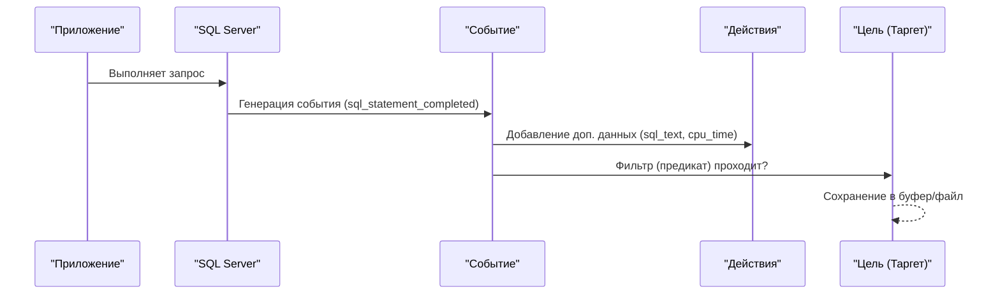
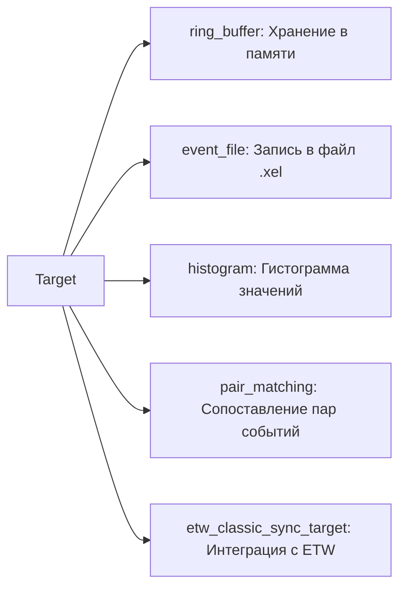
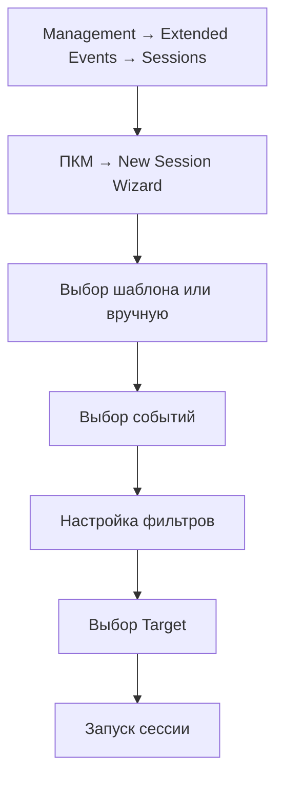
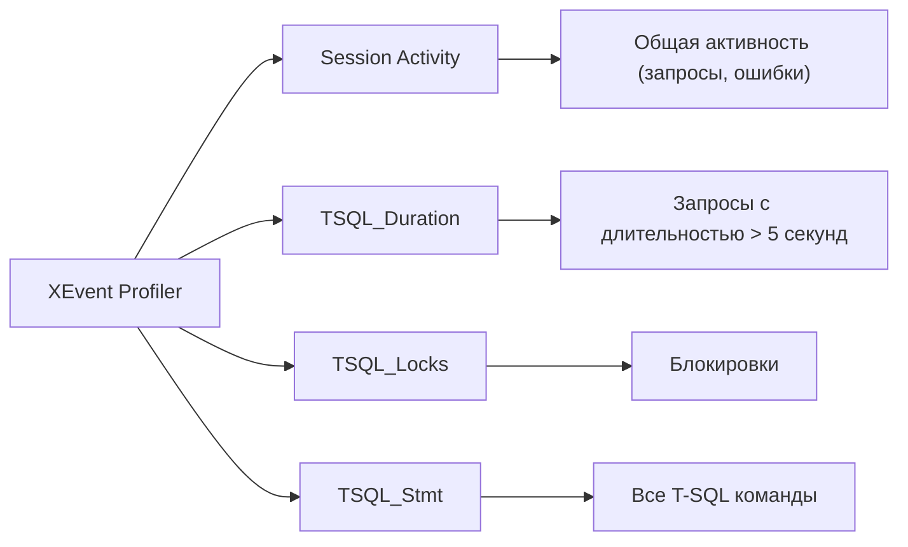

# 🔙 📚 🔜 Навигация по курсу

| [Предыдущее занятие](../LESSONS/PR31.MD) | &nbsp; | [Следующее занятие](../LESSONS/PR32.MD) |
|:--------------------------------------:|:------:|:-------------------------------------:|
| 🏠 [Практика №31](../LESSONS/PR31.MD) | 📖 [Содержание](../README.MD) | 💻 [Практика №32](../LESSONS/PR32.MD) |

---

# 🎓 Лекция 32. Extended Events — современный инструмент мониторинга

⏱️ **Продолжительность:** 90 минут  
🎯 **Цель лекции:**  
Сформировать у студентов понимание архитектуры и возможностей Extended Events (XEvents) как современного, легковесного инструмента для мониторинга и диагностики SQL Server. Научить создавать сессии для отслеживания медленных запросов, ошибок, блокировок и других событий с минимальной нагрузкой на систему.

---

## 📖 Справочник терминов (официальные названия из русской SSMS)

| Русский термин | Английский эквивалент | Что это? | Пример |
|----------------|------------------------|----------|--------|
| **Расширенные события** | Extended Events (XEvents) | Легковесная система трассировки и мониторинга | Альтернатива SQL Trace/Profiler |
| **Сессия** | Session | Набор событий и их настроек | `SlowQueriesSession` |
| **Событие** | Event | Конкретное действие/ситуация в SQL Server | `sql_statement_completed`, `error_reported` |
| **Действие** | Action | Дополнительные данные, собираемые при срабатывании события | `sql_text`, `session_id`, `cpu_time` |
| **Цель (таргет)** | Target | Место хранения собранных данных | `ring_buffer`, `event_file`, `histogram` |
| **Предикат (фильтр)** | Predicate | Условие для срабатывания события | `duration > 5000000` (более 5 секунд) |
| **Хранилище файлов** | Event File | Целевой файл (.xel) для хранения событий | `C:\XEvents\session.xel` |
| **Кольцевой буфер** | Ring Buffer | Хранение событий в памяти (циклический буфер) | Для краткосрочного мониторинга |
| **Счётчик** | Counter | Сбор статистики по событиям | Для подсчёта количества ошибок |
| **Блокировка** | blocking | Ожидание ресурса | `blocked_process_report` |
| **Страница памяти** | memory page | Для буфера кольца | `ring_buffer target` |
| **Расширенные события (конструктор)** | XEvent Profiler | Встроенный GUI в SSMS для шаблонов | Session Activity, TSQL_Duration |

---

## 1. 🧠 Что такое Extended Events?

### 1.1. Определение

**Extended Events (XEvents)** — это встроенная в SQL Server инфраструктура для легковесного сбора и мониторинга событий, происходящих в системе. Она была представлена начиная с SQL Server 2008 и полностью заменила устаревший SQL Trace/Profiler.

```mermaid
graph TD
    A["Extended Events"] --> B["События"]
    A --> C["Действия"]
    A --> D["Цели (таргеты)"]
    A --> E["Предикаты (фильтры)"]
    
    B --> F["sql_batch_completed"]
    B --> G["sql_statement_completed"]
    B --> H["error_reported"]
    B --> I["blocked_process_report"]
    
    C --> J["sql_text"]
    C --> K["session_id"]
    C --> L["cpu_time"]
    C --> M["reads", "writes"]
    
    D --> N["ring_buffer"]
    D --> O["event_file"]
    D --> P["histogram"]
    D --> Q["pair_matching"]
```

### 1.2. Почему Extended Events лучше SQL Trace/Profiler?

| Характеристика | SQL Trace / Profiler | Extended Events |
|----------------|---------------------|-----------------|
| **Нагрузка на сервер** | Высокая | Низкая (легковесный) |
| **Гибкость фильтрации** | Ограниченная | Расширенная (предикаты) |
| **Сбор данных** | Только определённые столбцы | Любые действия (actions) |
| **Хранение** | Файлы .trc, таблицы | Файлы .xel, кольцевой буфер |
| **Интеграция с DMV** | Нет | Да (`sys.dm_xe_*`) |
| **Поддержка новых версий** | Устаревший | Активно развивается |

### 1.3. Архитектура Extended Events



---

## 2. 🧩 Компоненты Extended Events

### 2.1. События (Events)

События — это точки, в которых XEvents могут зафиксировать данные. Существуют сотни событий. Основные категории:

| Категория | Примеры событий | Назначение |
|-----------|----------------|------------|
| **Запросы** | `sql_batch_completed`, `sql_statement_completed` | Время выполнения, текст |
| **Ошибки** | `error_reported` | Перехват ошибок (включая 825) |
| **Блокировки** | `blocked_process_report` | Отслеживание заблокированных процессов |
| **Соединения** | `login`, `logout` | Вход/выход пользователей |
| **Обслуживание** | `backup_restore_progress` | Прогресс бэкапа |
| **Производительность** | `wait_info`, `wait_stats` | Статистика ожиданий |

### 2.2. Действия (Actions)

Действия — это дополнительные атрибуты, которые собираются вместе с событием.

| Действие | Описание |
|----------|----------|
| `sql_text` | Текст SQL-запроса |
| `session_id` | SPID сессии |
| `username` | Имя пользователя |
| `database_name` | Имя базы данных |
| `cpu_time` | Время CPU (мкс) |
| `duration` | Общая длительность (мкс) |
| `physical_reads`, `logical_reads`, `writes` | Операции ввода-вывода |
| `row_count` | Количество затронутых строк |

### 2.3. Цели (Targets)

Target'ы определяют, куда сохранять собранные данные.



| Target | Описание | Применение |
|--------|----------|------------|
| **ring_buffer** | Циклический буфер в памяти | Краткосрочный мониторинг |
| **event_file** | Файл на диске (.xel) | Долгосрочное хранение |
| **histogram** | Группировка по ключу | Статистика по значениям |
| **pair_matching** | Поиск незавершённых пар | Например, начатые незавершённые транзакции |

### 2.4. Предикаты (Фильтры)

Предикаты позволяют ограничить сбор событий определёнными условиями, снижая нагрузку.

```sql
-- Пример: собирать только события длительностью более 5 секунд
WHERE duration > 5000000

-- Пример: только для конкретной базы данных
WHERE database_id = 7

-- Сложный фильтр: длительность > 1 секунды И не системная БД
WHERE duration > 1000000 AND database_id > 4
```

---

## 3. 🛠️ Создание сессии Extended Events

### 3.1. Через графический интерфейс SSMS



### 3.2. Через T-SQL (динамическое создание)

```sql
-- Удаляем сессию, если существует
IF EXISTS (SELECT 1 FROM sys.server_event_sessions WHERE name = 'SlowQueriesSession')
    DROP EVENT SESSION SlowQueriesSession ON SERVER;
GO

-- Создаём сессию
CREATE EVENT SESSION SlowQueriesSession ON SERVER
ADD EVENT sqlserver.sql_statement_completed
(
    ACTION (sqlserver.sql_text, sqlserver.session_id, sqlserver.username, sqlserver.database_id)
    WHERE duration > 5000000  -- 5 секунд в микросекундах
),
ADD EVENT sqlserver.sql_batch_completed
(
    ACTION (sqlserver.sql_text, sqlserver.session_id)
    WHERE duration > 5000000
)
ADD TARGET package0.ring_buffer
WITH (
    MAX_MEMORY = 4096 KB,
    EVENT_RETENTION_MODE = ALLOW_SINGLE_EVENT_LOSS,
    MAX_DISPATCH_LATENCY = 30 SECONDS,
    MAX_EVENT_SIZE = 0 KB,
    MEMORY_PARTITION_MODE = NONE,
    TRACK_CAUSALITY = OFF,
    STARTUP_STATE = OFF
);
GO

-- Запускаем сессию
ALTER EVENT SESSION SlowQueriesSession ON SERVER STATE = START;
```

### 3.3. Сессия для отслеживания ошибок (например, 825)

```sql
CREATE EVENT SESSION TrackError825 ON SERVER
ADD EVENT sqlserver.error_reported
(
    ACTION (sqlserver.sql_text, sqlserver.session_id, sqlserver.username)
    WHERE error = 825  -- только ошибка 825
)
ADD TARGET package0.ring_buffer
WITH (MAX_MEMORY = 4096 KB, STARTUP_STATE = OFF);
```

---

## 4. 📊 Работа с собранными данными

### 4.1. Просмотр данных из ring_buffer

```sql
-- Просмотр последних событий из ring_buffer
SELECT 
    CAST(target_data AS XML) AS EventData
FROM sys.dm_xe_session_targets
WHERE name = 'SlowQueriesSession';
```

### 4.2. Разбор XML-данных

```sql
-- Парсинг данных из ring_buffer
WITH EventData AS (
    SELECT 
        CAST(target_data AS XML) AS target_data
    FROM sys.dm_xe_session_targets
    WHERE name = 'SlowQueriesSession'
)
SELECT 
    event.value('(@name)[1]', 'varchar(50)') AS EventName,
    event.value('(data[@name="duration"]/value)[1]', 'bigint') / 1000000.0 AS DurationSec,
    event.value('(action[@name="sql_text"]/value)[1]', 'varchar(max)') AS SQLText,
    event.value('(action[@name="session_id"]/value)[1]', 'int') AS SessionID,
    event.value('(action[@name="username"]/value)[1]', 'varchar(100)') AS UserName
FROM EventData
CROSS APPLY target_data.nodes('//RingBufferTarget/event') AS Events(event);
```

### 4.3. Чтение из файлового хранилища

```sql
-- Чтение из файлов .xel
SELECT 
    event_data.value('(event/@name)[1]', 'varchar(50)') AS EventName,
    event_data.value('(event/data[@name="duration"]/value)[1]', 'bigint') / 1000000.0 AS DurationSec,
    event_data.value('(event/action[@name="sql_text"]/value)[1]', 'varchar(max)') AS SQLText
FROM (
    SELECT CAST(event_data AS XML) AS event_data
    FROM sys.fn_xe_file_target_read_file('C:\XEvents\*.xel', NULL, NULL, NULL)
) AS events;
```

---

## 5. 🔍 Шаблоны Extended Events в SSMS (XEvent Profiler)

SSMS предлагает готовые шаблоны:



**Как открыть:**  
В SSMS → Расширенные события → Profiler XEvent → Выбрать шаблон.

---

## 6. 📊 Сравнение Extended Events с другими инструментами

| Инструмент | Нагрузка | Гибкость | Простота | Применение |
|------------|----------|----------|----------|------------|
| **Extended Events** | Низкая | Высокая | Средняя | Современный мониторинг |
| **SQL Trace/Profiler** | Высокая | Низкая | Высокая | Устарел (не рекомендуется) |
| **DMV** | Низкая | Средняя | Средняя | Текущее состояние, моментный срез |
| **SQL Server Log** | Низкая | Низкая | Высокая | Ошибки и аудит |

---

## 7. ✅ Резюме: чек-лист администратора

### Создание сессии:
- [ ] Определить цель: какие события, какие данные нужны
- [ ] Выбрать нужные события, действия и фильтры
- [ ] Выбрать target (ring_buffer для отладки, event_file — для длительного хранения)
- [ ] Настроить задержку публикации (MAX_DISPATCH_LATENCY)
- [ ] Запустить сессию (STATE = START)

### Мониторинг и анализ:
- [ ] Проверить, что сессия запущена
- [ ] Просмотреть собранные данные (XML, DMV)
- [ ] Добавить предикаты, если событий слишком много
- [ ] Остановить сессию после сбора данных, если она не нужна постоянно

### Поддержка:
- [ ] Настроить автозапуск (STARTUP_STATE = ON)
- [ ] Для файловых таргетов — настроить ротацию файлов
- [ ] Удалять устаревшие файлы .xel

🔑 **Золотое правило:**  
> *«Extended Events — это скальпель, а не кувалда. Настраивайте фильтры, чтобы собирать только нужные данные. Не включайте сбор всего подряд на production-сервере — это всё равно что включить Profiler на сутки.»*

---

## 8. ❓ Вопросы для самопроверки

1. Что такое Extended Events?
2. Какие компоненты входят в архитектуру XEvents?
3. Чем отличается `ring_buffer` от `event_file`?
4. Как создать сессию XEvents через T-SQL?
5. Что такое предикат (фильтр) в XEvents?
6. Как просмотреть данные из ring_buffer?
7. Какие действия (actions) чаще всего используются?
8. Как настроить сбор только для определённой базы данных?
9. Какой таргет использовать для длительного хранения?
10. Как прочитать данные из файлов .xel?
11. Какие шаблоны XEvents есть в SSMS?
12. Чем XEvents лучше SQL Profiler?
13. Как остановить и запустить сессию?
14. Что означает `MAX_DISPATCH_LATENCY`?
15. Как удалить сессию XEvents?

---

## 📎 Приложение: Шпаргалка команд

```sql
-- Просмотр существующих сессий
SELECT * FROM sys.server_event_sessions;

-- Запуск сессии
ALTER EVENT SESSION [SessionName] ON SERVER STATE = START;

-- Остановка сессии
ALTER EVENT SESSION [SessionName] ON SERVER STATE = STOP;

-- Удаление сессии
DROP EVENT SESSION [SessionName] ON SERVER;

-- Просмотр целей (targets)
SELECT * FROM sys.dm_xe_session_targets;

-- Чтение ring_buffer
SELECT CAST(target_data AS XML) FROM sys.dm_xe_session_targets;

-- Чтение event_file
SELECT * FROM sys.fn_xe_file_target_read_file('C:\XEvents\*.xel', NULL, NULL, NULL);
```

---

📜 **Лицензия:** CC BY-NC-SA 4.0  
👨‍🏫 **Автор:** Руслан Ринатович Сафиулин  
📅 **Дата:** 17.05.2026

---
# 🔙 📚 🔜 Навигация по курсу

| [Предыдущее занятие](../LESSONS/PR31.MD) | &nbsp; | [Следующее занятие](../LESSONS/PR32.MD) |
|:--------------------------------------:|:------:|:-------------------------------------:|
| 🏠 [Практика №31](../LESSONS/PR31.MD) | 📖 [Содержание](../README.MD) | 💻 [Практика №32](../LESSONS/PR32.MD) |
