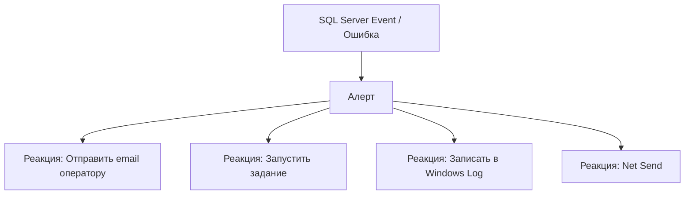
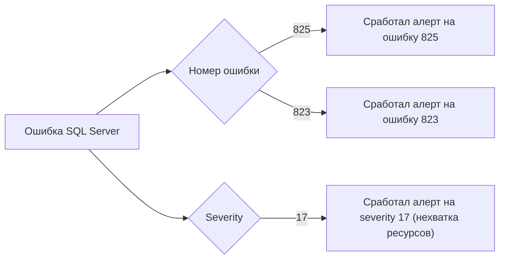
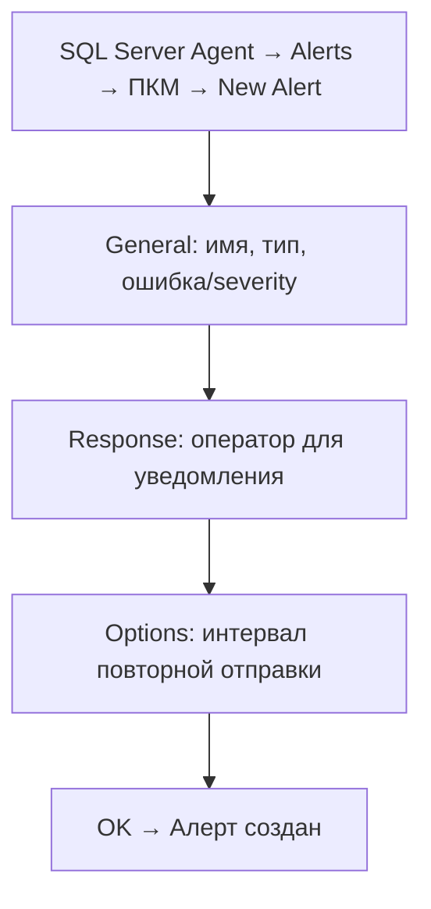

# 🔙 📚 🔜 Навигация по курсу

| [Предыдущее занятие](../LESSONS/PR32.MD) | &nbsp; | [Следующее занятие](../LESSONS/PR33.MD) |
|:--------------------------------------:|:------:|:-------------------------------------:|
| 🏠 [Практика №32](../LESSONS/PR32.MD) | 📖 [Содержание](../README.MD) | 💻 [Практика №33](../LESSONS/PR33.MD) |

---

# 🎓 Лекция 33. Алерты (Alerts): реакция на ошибки и события

⏱️ **Продолжительность:** 90 минут  
🎯 **Цель лекции:**  
Сформировать у студентов понимание системы оповещений (Alerts) в SQL Server Agent, научить настраивать алерты на ошибки SQL Server (включая ошибку 825), а также интегрировать их с операторами и заданиями для автоматической реакции на события.

---

## 🔙 📚 🔜 Навигация по курсу

| [Предыдущее занятие](../lesson-32/practice.md) | &nbsp; | [Следующее занятие](../lesson-33/practice.md) |
|:-----------------------------------------------:|:------:|:---------------------------------------------:|
| 💻 [Практика №32](../lesson-32/practice.md) | 📖 [Содержание](../../README.md) | 💻 [Практика №33](practice.md) |

---

## 📖 Справочник терминов (официальные названия из русской SSMS)

| Русский термин | Английский эквивалент | Что это? | Пример |
|----------------|------------------------|----------|--------|
| **Оповещение (Алерт)** | Alert | Реакция SQL Agent на событие или ошибку | При ошибке 825 отправить email |
| **Пороговое значение** | Threshold | Значение, при превышении которого срабатывает алерт | CPU > 80% |
| **Интервал повтора** | Repeat interval | Минимальное время между повторными срабатываниями | 300 секунд |
| **Ошибка (severity)** | Severity | Уровень серьезности ошибки SQL Server | 17 (нехватка ресурсов) |
| **Номер ошибки** | Error number | Уникальный номер ошибки SQL Server | 825 (повторное чтение) |
| **Пользовательское событие** | User-defined event | Событие, сгенерированное пользователем | `RAISERROR WITH SET` |
| **Производительность (counter)** | Performance counter | Счётчик производительности Windows/SQL | Avg. Disk Queue Length |

---

## 1. 🧠 Что такое Алерты (Alerts)?

### 1.1. Определение

**Алерт** — это объект SQL Server Agent, который автоматически реагирует на определённое событие: ошибку SQL Server (по номеру или уровню серьезности), пользовательское событие или превышение порога счётчика производительности.



### 1.2. Зачем нужны алерты?

| Сценарий | Действие |
|----------|----------|
| **Ошибка 825 (повторное чтение)** → Предупреждение о проблемах диска | Немедленно уведомить DBA |
| **Ошибка 823/824** → Повреждение данных | Запустить задание проверки целостности |
| **Уровень серьезности 17** (нехватка ресурсов) | Оповестить администратора сервера |
| **Счётчик CPU > 80%** (долгое время) | Запустить задание сбора диагностики |
| **Срабатывание определённого события** (RAISERROR) | Выполнить пользовательский скрипт |

---

## 2. 🔔 Типы алертов

### 2.1. Алерт на ошибку SQL Server

Срабатывает при возникновении ошибки с определённым номером или уровнем серьезности.



**Параметры:**
- **Номер ошибки** (например, 825)
- **Уровень серьезности** (например, 17)
- **База данных** (опционально)
- **Текст ошибки** (фильтр)

### 2.2. Алерт на уровень серьезности (Severity)

Уровни серьезности ошибок SQL Server:

| Severity | Описание | Действие |
|----------|----------|----------|
| 10 | Информационное сообщение | Логировать |
| 11-16 | Ошибки пользователя (можно исправить) | Уведомить разработчика |
| 17 | Нехватка ресурсов (память, диск) | Срочное уведомление DBA |
| 18 | Внутренняя ошибка | Отправить в Microsoft |
| 19 | Ошибка в ресурсе (запрос прерван) | Срочно! |
| 20-25 | Повреждение данных, фатальные ошибки | Критично! |

### 2.3. Алерт на счётчик производительности

Срабатывает, когда значение счётчика Windows или SQL Server превышает порог.

| Счётчик | Категория | Порог |
|---------|-----------|-------|
| `Processor Time` | Processor | > 80% длительное время |
| `Avg. Disk Queue Length` | PhysicalDisk | > 2 |
| `Page Life Expectancy` | Buffer Manager | < 300 секунд |
| `SQL Compilations/sec` | SQL Statistics | резкий рост |

### 2.4. Пользовательский алерт (User-defined event)

Срабатывает, когда в коде T‑SQL выполняется `RAISERROR` с указанием определённого `set` параметра.

```sql
-- Включение пользовательских событий
sp_altermessage 50001, 'WITH_LOG', 'true';
GO

-- Генерация события
RAISERROR('Пользовательское событие', 16, 1) WITH SET;
```

---

## 3. 🛠️ Настройка алерта (через SSMS)



### 3.1. Параметры алерта

| Вкладка | Параметр | Описание |
|---------|----------|----------|
| **General** | Name | Имя алерта |
| **General** | Type | SQL Server event / Performance condition |
| **General** | Error number | Номер ошибки (например, 825) |
| **General** | Severity | Уровень серьезности (0-25) |
| **General** | Database name | Ограничить конкретной БД |
| **Response** | Execute job | Задание, которое запустить |
| **Response** | Operators | Email, Pager, Net Send |
| **Options** | Delay between responses | Интервал повторной отправки (сек) |

---

## 4. 📧 Алерт на ошибку 825 (повторное чтение)

### 4.1. Что такое ошибка 825?

**Ошибка 825** появляется, когда SQL Server при чтении страницы сначала получил ошибку, а при повторном чтении (retry) — успех. Это **предупреждение** о проблемах с диском (возможны сбойные сектора).

```
Error: 825, Severity: 10, State: 2
A read of the file 'D:\Data\AdventureWorks.mdf' at offset 0x00000030000000 
succeeded after failing 2 time(s) with error: 1117. 
Additional messages in the SQL Server error log may provide more detail.
```

### 4.2. Создание алерта на ошибку 825 через T-SQL

```sql
USE msdb;
GO

-- 1. Создание оператора (если не существует)
IF NOT EXISTS (SELECT 1 FROM msdb.dbo.sysoperators WHERE name = 'DBA_Team')
BEGIN
    EXEC dbo.sp_add_operator
        @name = N'DBA_Team',
        @email_address = N'dba@company.com',
        @enabled = 1;
END

-- 2. Создание алерта
EXEC dbo.sp_add_alert
    @name = N'Alert_Error_825',
    @message_id = 825,
    @severity = 0,
    @enabled = 1,
    @delay_between_responses = 300,  -- не чаще чем раз в 5 минут
    @include_event_description_in = 1,
    @category_name = N'[Uncategorized]';

-- 3. Привязка оператора к алерту
EXEC dbo.sp_add_notification
    @alert_name = N'Alert_Error_825',
    @operator_name = N'DBA_Team',
    @notification_method = 1;  -- 1-email, 2-pager, 4-net send
```

### 4.3. Просмотр существующих алертов

```sql
SELECT * FROM msdb.dbo.sysalerts;
```

---

## 5. 🔄 Взаимодействие алертов с заданиями (Jobs)

Алерт может не только отправить уведомление, но и запустить задание.

```sql
-- 1. Создаём задание, которое будет выполняться при срабатывании алерта
EXEC msdb.dbo.sp_add_job
    @job_name = N'Job_On_Error_825',
    @description = N'Диагностика при ошибке 825';

EXEC msdb.dbo.sp_add_jobstep
    @job_name = N'Job_On_Error_825',
    @step_name = N'Collect Disk Info',
    @command = N'
        -- Собрать информацию о диске
        EXEC xp_cmdshell ''wmic logicaldisk get name, size, freespace'';
        -- Записать в таблицу лога
        INSERT INTO DBAdmin.dbo.Error825Log (ErrorTime, Message)
        VALUES (GETDATE(), ''Error 825 occurred'');
    ';

-- 2. Назначаем задание алерту
EXEC msdb.dbo.sp_add_alert
    @name = N'Alert_Error_825',
    @job_name = N'Job_On_Error_825';
```

---

## 6. 📊 Мониторинг алертов

### 6.1. Просмотр алертов и их состояния

```sql
SELECT 
    name,
    enabled,
    severity,
    message_id,
    'job_name' = j.name,
    last_occurrence_date,
    last_occurrence_time,
    occurrence_count
FROM msdb.dbo.sysalerts a
LEFT JOIN msdb.dbo.sysjobs j ON a.job_id = j.job_id;
```

### 6.2. История срабатываний

```sql
SELECT 
    a.name,
    o.name AS OperatorName,
    lh.event_date,
    lh.message
FROM msdb.dbo.sysalerts a
JOIN msdb.dbo.sysnotifications n ON a.id = n.alert_id
JOIN msdb.dbo.sysoperators o ON n.operator_id = o.id
JOIN msdb.dbo.sysalertslas lh ON a.id = lh.alert_id
ORDER BY lh.event_date DESC;
```

---

## 7. 🚨 Типовые ошибки и их решение

| Ошибка | Причина | Решение |
|--------|---------|---------|
| **Алерт не срабатывает** | Неправильный номер ошибки | Проверить `message_id` |
| **Email не приходит** | Database Mail не настроен | Настроить почту |
| **Срабатывает слишком часто** | `delay_between_responses` слишком маленький | Увеличить до 300-600 |
| **Алерт создан, но не активен** | `enabled = 0` | Установить `enabled = 1` |
| **Severity 0 не перехватывает** | Для ошибки 825 severity = 10 | Использовать конкретный `message_id` |

---

## 8. ✅ Резюме: чек-лист администратора

### Настройка алерта:
- [ ] Определить номер ошибки или уровень серьезности
- [ ] Настроить оператора (email) в SQL Agent
- [ ] Создать алерт с правильным message_id/severity
- [ ] Установить интервал повторных уведомлений (`delay_between_responses`)
- [ ] Привязать оператора к алерту (`sp_add_notification`)
- [ ] Включить алерт (`enabled = 1`)

### Поддержка:
- [ ] Периодически проверять, срабатывают ли алерты
- [ ] Анализировать историю срабатываний
- [ ] Адаптировать алерты к изменениям инфраструктуры

🔑 **Золотое правило:**  
> *«Алерт без действий — белый шум. Каждое оповещение должно вести к конкретному действию: уведомлению оператора, запуску задания или записи в лог. Не создавайте алерты, на которые невозможно адекватно реагировать.»*

---

## 9. ❓ Вопросы для самопроверки

1. Что такое алерт в SQL Server Agent?
2. Какие типы алертов существуют?
3. Что означает ошибка 825 и почему на неё стоит подписаться?
4. Как создать алерт через T-SQL?
5. Что такое `delay_between_responses` и зачем он нужен?
6. Как связать алерт с оператором?
7. Как связать алерт с заданием?
8. Как просмотреть историю срабатываний алерта?
9. Какие уровни серьезности ошибок существуют?
10. Чем отличается `message_id` от `severity`?
11. Как создать пользовательский алерт через RAISERROR?
12. Как отключить алерт?
13. Как удалить алерт?
14. Какие счётчики производительности можно отслеживать?
15. Почему ошибка 825 имеет severity 10, но на неё стоит реагировать?

---

## 📎 Приложение: Шпаргалка команд

```sql
-- Создание оператора
EXEC msdb.dbo.sp_add_operator
    @name = N'DBA_Team',
    @email_address = N'dba@company.com';

-- Создание алерта
EXEC msdb.dbo.sp_add_alert
    @name = N'Alert_Error_825',
    @message_id = 825,
    @severity = 0,
    @enabled = 1,
    @delay_between_responses = 300;

-- Привязка оператора
EXEC msdb.dbo.sp_add_notification
    @alert_name = N'Alert_Error_825',
    @operator_name = N'DBA_Team',
    @notification_method = 1;

-- Просмотр алертов
SELECT * FROM msdb.dbo.sysalerts;

-- Включение/отключение
EXEC msdb.dbo.sp_update_alert
    @name = N'Alert_Error_825',
    @enabled = 0;

-- Удаление алерта
EXEC msdb.dbo.sp_delete_alert @name = N'Alert_Error_825';

-- Пользовательское событие
sp_altermessage 50001, 'WITH_LOG', 'true';
RAISERROR('Test user event', 16, 1) WITH SET;
```

---

📜 **Лицензия:** CC BY-NC-SA 4.0  
👨‍🏫 **Автор:** Руслан Ринатович Сафиуллин  
📅 **Дата:** 17.05.2026

---

# 🔙 📚 🔜 Навигация по курсу

| [Предыдущее занятие](../LESSONS/PR32.MD) | &nbsp; | [Следующее занятие](../LESSONS/PR33.MD) |
|:--------------------------------------:|:------:|:-------------------------------------:|
| 🏠 [Практика №32](../LESSONS/PR32.MD) | 📖 [Содержание](../README.MD) | 💻 [Практика №33](../LESSONS/PR33.MD) |
