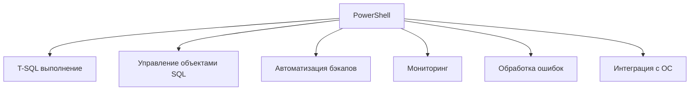

# 🔙 📚 🔜 Навигация по курсу

| [Предыдущее занятие](../LESSONS/PR33.MD) | &nbsp; | [Следующее занятие](../LESSONS/PR34.MD) |
|:--------------------------------------:|:------:|:-------------------------------------:|
| 🏠 [Практика №33](../LESSONS/PR33.MD) | 📖 [Содержание](../README.MD) | 💻 [Практика №34](../LESSONS/PR34.MD) |

---

# 🎓 Лекция 34. PowerShell и SQL Server: основы автоматизации

⏱️ **Продолжительность:** 90 минут  
🎯 **Цель лекции:**  
Сформировать у студентов понимание возможностей PowerShell для автоматизации задач администрирования SQL Server, научить подключаться к экземплярам, выполнять T-SQL команды, создавать резервные копии и управлять заданиями через PowerShell, а также интегрировать PowerShell-скрипты с SQL Server Agent.

---

## 🔙 📚 🔜 Навигация по курсу

| [Предыдущее занятие](../lesson-33/practice.md) | &nbsp; | [Следующее занятие](../lesson-34/practice.md) |
|:-----------------------------------------------:|:------:|:---------------------------------------------:|
| 💻 [Практика №33](../lesson-33/practice.md) | 📖 [Содержание](../../README.md) | 💻 [Практика №34](practice.md) |

---

## 📖 Справочник терминов (официальные названия из русской SSMS)

| Русский термин | Английский эквивалент | Что это? | Пример |
|----------------|------------------------|----------|--------|
| **Модуль SQL Server** | SQL Server PowerShell Module | Модуль с командлетами для работы с SQL Server | `SqlServer` |
| **Командлет** | Cmdlet | Команда PowerShell | `Invoke-Sqlcmd` |
| **Провайдер SQL Server** | SQL Server Provider | Доступ к объектам SQL Server через PSDrive | `SQLSERVER:\` |
| **SMO** | SQL Server Management Objects | Объектная модель для управления SQL Server | `Microsoft.SqlServer.Management.Smo` |
| **Подключение** | Connection | Строка подключения или объект соединения | `Integrated Security=SSPI` |
| **Выполнение запроса** | Execute query | Выполнение T-SQL из PowerShell | `Invoke-Sqlcmd` |
| **Переменные** | Variables | Параметры для передачи в скрипт | `$ServerName`, `$DatabaseName` |
| **Конвейер** | Pipeline | Передача объектов между командлетами | `Get-Process | Stop-Process` |
| **Триггер** | Trigger | Событие, запускающее скрипт | По времени, по ошибке |
| **Учётные данные** | Credential | Безопасное хранение паролей | `Get-Credential` |

---

## 1. 🧠 Почему PowerShell для SQL Server?

### 1.1. Что такое PowerShell?

**PowerShell** — это кроссплатформенная платформа автоматизации от Microsoft, объединяющая командную оболочку, язык сценариев и среду выполнения. Для администраторов SQL Server PowerShell даёт возможность:

- Выполнять T-SQL запросы и команды
- Управлять объектами SQL Server (базы, таблицы, задания)
- Автоматизировать многократные задачи
- Интегрироваться с Active Directory, файловой системой, сетью
- Создавать сложные сценарии с условиями и циклами



### 1.2. Преимущества PowerShell для DBA

| Возможность | Преимущество |
|-------------|--------------|
| **Многократное использование** | Один скрипт для множества серверов |
| **Обработка ошибок** | Try/Catch, детальное логирование |
| **Гибкость** | Ветвления, циклы, функции |
| **Интеграция** | Доступ к WMI, CIM, реестру, файлам |
| **Версионирование** | Скрипты можно хранить в Git |
| **Кроссплатформенность** | PowerShell Core работает на Linux/macOS |

### 1.3. Сравнение: T-SQL vs PowerShell для автоматизации

| Задача | T-SQL | PowerShell |
|--------|-------|------------|
| **Создание бэкапа одной БД** | ✅ Легко | ✅ Легко |
| **Создание бэкапов всех БД на нескольких серверах** | 🟡 Цикл по серверам (linked server) | ✅ Единый скрипт, Invoke-Command |
| **Проверка свободного места на диске** | 🟡 xp_cmdshell | ✅ Get-PSDrive |
| **Копирование файлов бэкапов в сетевую папку** | 🟡 xp_cmdshell | ✅ Copy-Item |
| **Отправка отчёта по email** | 🟡 Database Mail | ✅ Send-MailMessage |
| **Взаимодействие с AD (получение групп, прав)** | 🔴 Сложно | ✅ ActiveDirectory модуль |
| **Сложная обработка ошибок** | 🟡 TRY/CATCH ограничен | ✅ Полноценный exception handling |

---

## 2. 🛠️ Модуль SqlServer

### 2.1. Установка модуля

```powershell
# Установка модуля (от администратора)
Install-Module -Name SqlServer -Force -AllowClobber

# Просмотр установленных командлетов
Get-Command -Module SqlServer

# Импорт модуля (если не загружен автоматически)
Import-Module SqlServer
```

### 2.2. Основные командлеты модуля SqlServer

| Командлет | Назначение | Пример |
|-----------|------------|--------|
| **Invoke-Sqlcmd** | Выполнение T-SQL запроса | `Invoke-Sqlcmd -Query "SELECT @@VERSION"` |
| **Backup-SqlDatabase** | Резервное копирование | `Backup-SqlDatabase -DatabaseName AdventureWorks` |
| **Restore-SqlDatabase** | Восстановление БД | `Restore-SqlDatabase -DatabaseName RestoredDB` |
| **Get-SqlDatabase** | Получение информации о БД | `Get-SqlDatabase -Name "*"` |
| **Get-SqlAgentJob** | Получение заданий SQL Agent | `Get-SqlAgentJob -Name "Backup*"` |
| **Start-SqlAgentJob** | Запуск задания | `Start-SqlAgentJob -Name "NightlyBackup"` |
| **Read-SqlTableData** | Чтение данных таблицы | `Read-SqlTableData -TableName Employees` |
| **Write-SqlTableData** | Запись данных в таблицу | `Write-SqlTableData -TableName Log -InputData $data` |

### 2.3. Подключение к SQL Server

```powershell
# 1. Использование сервера по умолчанию (Windows Auth)
$server = "localhost"
$database = "master"

# 2. Через Invoke-Sqlcmd
Invoke-Sqlcmd -ServerInstance $server -Database $database -Query "SELECT GETDATE()"

# 3. Через SMO
$smo = New-Object Microsoft.SqlServer.Management.Smo.Server($server)
$smo.Databases | Select-Object Name, Size
```

### 2.4. Безопасное хранение учётных данных

```powershell
# Запрос пароля (без сохранения в открытом виде)
$credential = Get-Credential

# Использование с Invoke-Sqlcmd
Invoke-Sqlcmd -ServerInstance "prod-sql" -Credential $credential -Query "SELECT * FROM Users"
```

---

## 3. 📜 Выполнение T-SQL через Invoke-Sqlcmd

### 3.1. Базовое выполнение

```powershell
# Простой запрос
$result = Invoke-Sqlcmd -ServerInstance "localhost" -Database "master" -Query "SELECT @@VERSION AS Version"
$result.Version

# Сохранение результата в переменную
$databases = Invoke-Sqlcmd -ServerInstance "localhost" -Query "SELECT name FROM sys.databases WHERE database_id > 4"
$databases
```

### 3.2. Использование переменных

```powershell
$dbName = "AdventureWorks"
$backupPath = "D:\Backup\"

$query = @"
BACKUP DATABASE [$dbName]
TO DISK = '$backupPath$dbName.bak'
WITH COMPRESSION, CHECKSUM
"@

Invoke-Sqlcmd -ServerInstance "localhost" -Query $query
```

### 3.3. Выполнение скрипта из файла

```powershell
Invoke-Sqlcmd -ServerInstance "localhost" -InputFile "C:\Scripts\CreateTables.sql"
```

### 3.4. Обработка результата

```powershell
$result = Invoke-Sqlcmd -ServerInstance "localhost" -Query "SELECT name FROM sys.databases"

foreach ($row in $result) {
    Write-Host "Database: $($row.name)"
}
```

---

## 4. 💾 Резервное копирование через PowerShell

### 4.1. Простое копирование через Invoke-Sqlcmd

```powershell
$dbName = "AdventureWorks"
$date = Get-Date -Format "yyyyMMdd_HHmm"
$backupPath = "C:\Backup\"

$query = @"
BACKUP DATABASE [$dbName]
TO DISK = '$backupPath$dbName`_$date.bak'
WITH COMPRESSION, CHECKSUM, STATS = 5
"@

Invoke-Sqlcmd -ServerInstance "localhost" -Query $query
Write-Host "Бэкап создан: $backupPath$dbName`_$date.bak"
```

### 4.2. Использование Backup-SqlDatabase (рекомендуется)

```powershell
# Бэкап одной базы
Backup-SqlDatabase -ServerInstance "localhost" -Database "AdventureWorks" -BackupFile "C:\Backup\AdventureWorks.bak" -CompressionOption On -Checksum

# Бэкап с динамическим именем
$date = Get-Date -Format "yyyyMMdd"
$backupFile = "C:\Backup\AdventureWorks_$date.bak"
Backup-SqlDatabase -ServerInstance "localhost" -Database "AdventureWorks" -BackupFile $backupFile -CompressionOption On
```

### 4.3. Бэкап всех пользовательских баз

```powershell
$server = "localhost"
$backupPath = "C:\Backup\"
$date = Get-Date -Format "yyyyMMdd_HHmm"

# Получаем список пользовательских БД
$databases = Invoke-Sqlcmd -ServerInstance $server -Query "SELECT name FROM sys.databases WHERE database_id > 4 AND state_desc = 'ONLINE' AND name NOT IN ('tempdb')"

foreach ($db in $databases) {
    $dbName = $db.name
    $backupFile = "$backupPath$dbName`_$date.bak"
    
    Write-Host "Создание бэкапа базы: $dbName"
    
    try {
        Backup-SqlDatabase -ServerInstance $server -Database $dbName -BackupFile $backupFile -CompressionOption On -Checksum -ErrorAction Stop
        Write-Host "✅ Бэкап успешен: $backupFile"
    }
    catch {
        Write-Host "❌ Ошибка бэкапа $dbName : $_"
    }
}
```

### 4.4. Бэкап с проверкой свободного места

```powershell
function Get-FreeSpace {
    param($DriveLetter)
    $drive = Get-PSDrive -Name $DriveLetter
    return $drive.Free / 1GB
}

$backupDrive = "C"
$requiredSpaceGB = 10
$freeSpace = Get-FreeSpace -DriveLetter $backupDrive

if ($freeSpace -gt $requiredSpaceGB) {
    Backup-SqlDatabase -ServerInstance "localhost" -Database "AdventureWorks" -BackupFile "C:\Backup\AW.bak"
} else {
    Write-Warning "Недостаточно места на диске C: (свободно: $freeSpace GB)"
}
```

---

## 5. 📁 Работа с файлами и дисками

### 5.1. Проверка и создание папок

```powershell
$backupPath = "C:\Backup\Daily"
if (-not (Test-Path $backupPath)) {
    New-Item -ItemType Directory -Path $backupPath -Force
    Write-Host "Создана папка: $backupPath"
}
```

### 5.2. Очистка старых файлов

```powershell
$backupPath = "C:\Backup"
$daysToKeep = 7
$cutoffDate = (Get-Date).AddDays(-$daysToKeep)

# Удаление файлов старше N дней
Get-ChildItem -Path $backupPath -Filter "*.bak" | Where-Object { $_.LastWriteTime -lt $cutoffDate } | Remove-Item -Force
Write-Host "Удалены файлы старше $daysToKeep дней"
```

### 5.3. Копирование бэкапов в сетевую папку

```powershell
$source = "C:\Backup\AdventureWorks.bak"
$destination = "\\NAS\Backup\AdventureWorks.bak"

# Копирование с проверкой
if (Test-Path $source) {
    Copy-Item -Path $source -Destination $destination -Force
    Write-Host "Файл скопирован в $destination"
} else {
    Write-Warning "Исходный файл не найден: $source"
}
```

---

## 6. 🔄 Интеграция с SQL Server Agent

### 6.1. Выполнение PowerShell из шага задания

Тип шага: **PowerShell**

```powershell
# Скрипт прямо в шаге
$server = "localhost"
$backupPath = "C:\Backup\"
$date = Get-Date -Format "yyyyMMdd"

Backup-SqlDatabase -ServerInstance $server -Database "AdventureWorks" -BackupFile "$backupPath\AW_$date.bak"
```

### 6.2. Выполнение PowerShell-скрипта из файла

```sql
-- Через CmdExec
powershell.exe -File "C:\Scripts\BackupAllDatabases.ps1"
```

### 6.3. Создание задания через PowerShell

```powershell
# Создаём задание, которое будет запускать PowerShell скрипт
Invoke-Sqlcmd -ServerInstance "localhost" -Query @"
USE msdb;
EXEC dbo.sp_add_job
    @job_name = N'PowerShell_Backup_Job',
    @enabled = 1,
    @description = N'Бэкап через PowerShell';

EXEC dbo.sp_add_jobstep
    @job_name = N'PowerShell_Backup_Job',
    @step_name = N'Run PowerShell Script',
    @subsystem = N'PowerShell',
    @command = N'
        C:\Scripts\BackupAllDatabases.ps1
    ';

EXEC dbo.sp_add_jobserver
    @job_name = N'PowerShell_Backup_Job';
"@
```

---

## 7. 📧 Отправка отчётов по email

```powershell
# Отправка отчёта о бэкапах
$smtpServer = "smtp.company.com"
$from = "sqlagent@company.com"
$to = "dba@company.com"
$subject = "Отчёт о бэкапах"

$body = @"
<h2>Результаты бэкапов</h2>
<p>Дата: $(Get-Date -Format 'dd.MM.yyyy HH:mm')</p>
<p>Сервер: localhost</p>
"@

Send-MailMessage -SmtpServer $smtpServer -From $from -To $to -Subject $subject -Body $body -BodyAsHtml
```

---

## 8. ✅ Резюме: чек-лист администратора

### Установка и настройка:
- [ ] Установить модуль SqlServer
- [ ] Проверить политику выполнения скриптов (`Set-ExecutionPolicy RemoteSigned`)
- [ ] Настроить безопасное хранение учётных данных

### Разработка скриптов:
- [ ] Добавить обработку ошибок (try/catch)
- [ ] Логировать результаты
- [ ] Использовать параметры для гибкости
- [ ] Комментировать код

### Интеграция:
- [ ] Создать задания в SQL Agent для периодического запуска
- [ ] Настроить уведомления
- [ ] Хранить скрипты в системе контроля версий

🔑 **Золотое правило:**  
> *«PowerShell — это швейцарский нож администратора. Один скрипт может заменить часы ручной работы. Но всегда проверяйте свои скрипты на тестовой среде перед запуском в production!»*

---

## 9. ❓ Вопросы для самопроверки

1. Как установить модуль SqlServer для PowerShell?
2. Как выполнить T-SQL запрос из PowerShell?
3. Какой командлет используется для резервного копирования?
4. Как создать динамическое имя файла бэкапа с датой?
5. Как удалить файлы бэкапа старше 7 дней?
6. Как получить список всех пользовательских баз?
7. Как обработать ошибку в PowerShell (try/catch)?
8. Как запустить PowerShell скрипт из SQL Server Agent?
9. Как отправить email-отчёт из PowerShell?
10. Что такое SMO и зачем он нужен?

---

## 📎 Приложение: Шпаргалка команд

```powershell
# Установка модуля
Install-Module -Name SqlServer -Force

# Подключение и выполнение запроса
Invoke-Sqlcmd -ServerInstance "localhost" -Query "SELECT @@VERSION"

# Бэкап
Backup-SqlDatabase -ServerInstance "localhost" -Database "AdventureWorks" -BackupFile "C:\Backup\AW.bak"

# Бэкап всех БД
$dbs = Invoke-Sqlcmd -ServerInstance "localhost" -Query "SELECT name FROM sys.databases WHERE database_id > 4"
foreach ($db in $dbs) {
    Backup-SqlDatabase -ServerInstance "localhost" -Database $db.name -BackupFile "C:\Backup\$($db.name).bak"
}

# Очистка
Get-ChildItem "C:\Backup\*.bak" | Where-Object { $_.LastWriteTime -lt (Get-Date).AddDays(-7) } | Remove-Item

# Ошибки
try {
    Backup-SqlDatabase -ServerInstance "localhost" -Database "NonexistentDB" -ErrorAction Stop
} catch {
    Write-Host "Ошибка: $_"
}

# Выполнение скрипта из файла
Invoke-Sqlcmd -ServerInstance "localhost" -InputFile "C:\Scripts\script.sql"
```

---

📜 **Лицензия:** CC BY-NC-SA 4.0  
👨‍🏫 **Автор:** Руслан Ринатович Сафиулин  
📅 **Дата:** 18.05.2026

---
# 🔙 📚 🔜 Навигация по курсу

| [Предыдущее занятие](../LESSONS/PR33.MD) | &nbsp; | [Следующее занятие](../LESSONS/PR34.MD) |
|:--------------------------------------:|:------:|:-------------------------------------:|
| 🏠 [Практика №33](../LESSONS/PR33.MD) | 📖 [Содержание](../README.MD) | 💻 [Практика №34](../LESSONS/PR34.MD) |

