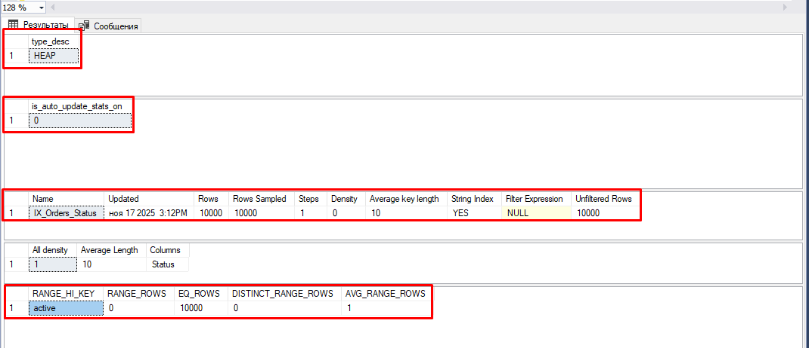
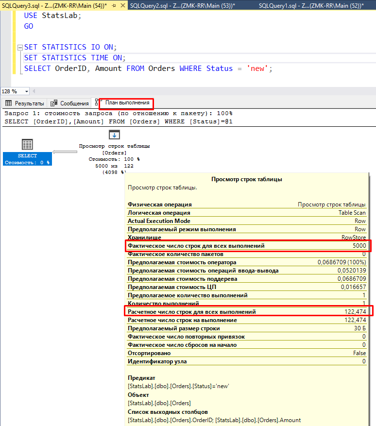
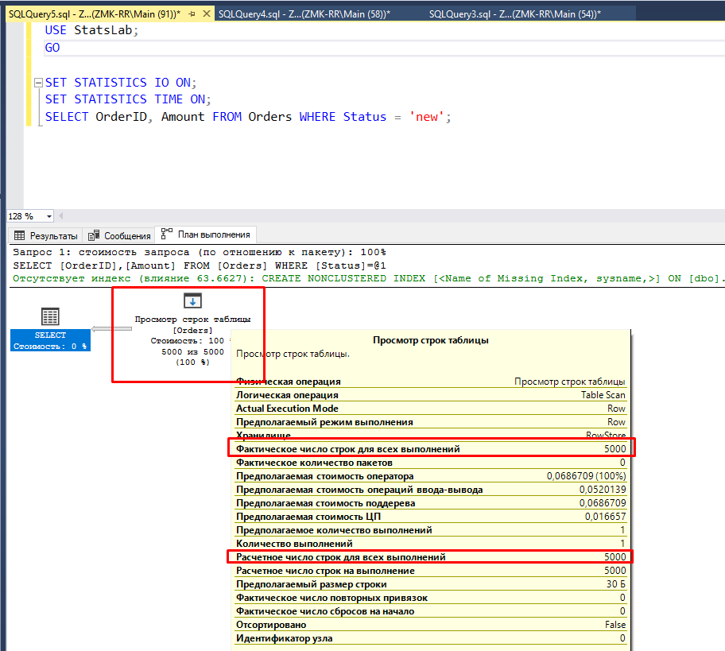

### 🔙 📚 🔜 Навигация по курсу

| [Предыдущее занятие](../LESSONS/LESSON9.MD) | &nbsp; | [Следующее занятие](../LESSONS/LESSON10.MD) |
|:--------------------------------------:|:------:|:-------------------------------------:|
| 🏠 [Лекция №8](../LESSONS/LESSON9.MD) | 📖 [Содержание](../README.MD) | 💻 [Лекция №9](../LESSONS/LESSON10.MD) |
---

# Практическая работа №8  
## Обновление статистики; анализ простого плана выполнения

> **Цель**: Научиться находить устаревшую статистику по расхождению *«Оценка строк»* и *«Факт строк»*, понимать логику выбора плана SQL Server’ом, и устранять узкие места за 1 команду — `UPDATE STATISTICS`.  
> **Продолжительность**: 2 академических часа  
> **Оборудование**: SSMS, SQL Server Developer Edition

---

## 📥 Шаг 0. Стартовый скрипт (выполните целиком)

```sql
-- Создаём учебную БД
DROP DATABASE IF EXISTS StatsLab;
CREATE DATABASE StatsLab;
GO
USE StatsLab;
GO
-- Таблица БЕЗ первичного ключа → куча (HEAP)
CREATE TABLE Orders (
    OrderID int IDENTITY(1,1),  -- ← НЕТ PK
    CustomerID int,
    Amount decimal(10,2),
    Status char(10)
);
GO

-- 10 000 «старых» заказов
INSERT INTO Orders (CustomerID, Amount, Status)
SELECT TOP 10000 
    ABS(CHECKSUM(NEWID())) % 100 + 1,
    CAST(RAND(CHECKSUM(NEWID())) * 1000 AS decimal(10,2)),
    'active'
FROM master.dbo.spt_values a, master.dbo.spt_values b;
GO

-- Индекс по Status (не покрывающий!)
CREATE NONCLUSTERED INDEX IX_Orders_Status ON Orders(Status);
GO

-- Отключаем автообновление ДО вставки новых
ALTER DATABASE StatsLab SET AUTO_UPDATE_STATISTICS OFF;
GO

-- 5 000 «новых» заказов
INSERT INTO Orders (CustomerID, Amount, Status)
SELECT TOP 5000 
    100 + ABS(CHECKSUM(NEWID())) % 50,
    CAST(RAND(CHECKSUM(NEWID())) * 200 AS decimal(10,2)),
    'new'
FROM master.dbo.spt_values a, master.dbo.spt_values b;
GO
```

---

## 🔍 Шаг 0.5. Проверка условий эксперимента (обязательно!)

Выполните и убедитесь, что результаты **совпадают с ожидаемыми**:

#### 1. Таблица — куча?
```sql
SELECT i.type_desc 
FROM sys.indexes i 
WHERE i.object_id = OBJECT_ID('Orders') AND i.index_id = 0;
```
✅ **Ожидаемо**: Type_desc = `HEAP`

#### 2. Автообновление отключено?
```sql
SELECT is_auto_update_stats_on 
FROM sys.databases 
WHERE name = 'StatsLab';
```
✅ **Ожидаемо**: `0`

#### 3. В статистике нет `'new'`?
```sql
DBCC SHOW_STATISTICS ('Orders', 'IX_Orders_Status');
```
✅ **Ожидаемо**: во вкладке **«Гистограмма»** — только `RANGE_HI_KEY = 'active'`.

> ⚠️ **Если `'new'` есть — пересоздайте БД!** Порядок критичен:  
> `INSERT 'active'` → `CREATE INDEX` → `SET AUTO_UPDATE OFF` → `INSERT 'new'`.



---

## 📋 Задание 1. Диагностика: найдите расхождение Оценка/Факт

1. Включите **`Ctrl + M`** (Действительный план выполнения).  
2. Выполните:
   ```sql
   SET STATISTICS IO ON;
   SELECT OrderID, Amount FROM Orders WHERE Status = 'new';
   ```

3. В «Плане выполнения» найдите:  
   - `Расчётное число строк для всех выполнений` (Estimated Number of Rows),  
   - `Фактическое число строк для всех выполнений` (Actual Number of Rows).

4. В «Сообщениях» запишите:  
   - `логические операции чтения`.
   - `затраченное время`

5. В отчёте укажите:  
   - Тип оператора (например, `Просмотр строк таблицы`),  
   - Почему SQL Server выбрал именно его?



---

## 🔍 Справка: Откуда берётся дробное число 122.474? 

> 💡 **SQL Server не «считает» строки — он *оценивает* их по статистике.**  
> Если значение отсутствует в гистограмме, он **не гадает**, а использует **математические модели**. Вот как это работает.

---

### 1. Почему `'new'` отсутствует в гистограмме?

- Вы отключили `AUTO_UPDATE_STATISTICS`,  
- Вставили 5 000 строк со `'new'` **после** создания индекса,  
- → Статистика осталась с данными только для `'active'`.

---

### 2. Что делает оптимизатор, когда значение не найдено?

Он **не паникует** — он использует **вектор плотности (Density Vector)** и **эвристики оценщика кардинальности (Cardinality Estimator)**.

#### 🔹 Плотность (Density)
- Плотность = `1 / число уникальных значений`,  
- До вставки `'new'`: уникальных значений = 1 (`'active'`) → плотность = **1.0**,  
- Но после вставки (хотя статистика не обновлена) SQL Server **корректирует** плотность по фактическому числу строк.

#### 🔹 Эвристика для новых значений
В SQL Server 2016+ (новый CE) используется формула:  
```
Оценка = SQRT(Общее число строк)  
       = SQRT(15 000) ≈ 122.47 → **совпадает с вашим результатом!**
```

✅ **Проверка**:  
```sql
SELECT SQRT(15000.0) AS Test;  -- Результат: 122.474487...
```

>  SQL Server угадывает количество строк для значения 'new', потому что оно не было учтено в статистике.
Дробное число возникает из-за использования усредненных и вероятностных математических моделей,
а не реального подсчета строк.

---

## 📋 Задание 2. Обновление статистики — как меняется план?

1. Обновите статистику:
   ```sql
   UPDATE STATISTICS Orders IX_Orders_Status;
   ```

2. Повторите запрос из Задания 1.  
3. Сравните:  
   - `Оценка строк` до/после,  
   - `логические операции чтения`, 
   - `затраченное время`,
   - `Тип оператора`.

> 💡 **Подсказка**: после обновления `Фактическое число строк для всех выполнений` должна стать близка к `Расчётное число строк для всех выполнений`.



4. В отчёте **заполните таблицу**:

| Показатель | До обновления | После обновления |
|-----------|---------------|------------------|
| **Расчётное число строк для всех выполнений** | ... | ... |
| **Фактическое число строк для всех выполнений** | ... | ... |
| **логические операции чтения** | ... | ... |
| **затраченное время** | ... | ... |
| **Тип оператора** | ... | ... |

> 💡 **Ожидаемо**:  
> - `Расчётное число строк` = **5 000**,  
> - План может остаться `Просмотр строк таблицы` (если 5 000 строк — всё ещё мало для 15 000).


---

## 📋 Задание 3. Гарантированный Key Lookup (на новой БД)

> 💡 **В предыдущей таблице `Orders` Key Lookup не появлялся, потому что `SELECT *` не требует обращения к данным (индекс покрывает `Status`, а `OrderID` — в кластеризованном указателе).**  
> **Теперь создадим таблицу, где Key Lookup неизбежен.**

> Влияние статистики и индексов на план запроса
Мы будем использовать один и тот же базовый скрипт создания БД и один и тот же целевой запрос SELECT во всех заданиях, меняя только настройки БД или индексы между шагами

#### Шаг 1. Создайте новую БД (выполните целиком)
```sql
DROP DATABASE IF EXISTS StatsLab_Final;
CREATE DATABASE StatsLab_Final;
GO
USE StatsLab_Final;
GO

CREATE TABLE Orders (
    OrderID int IDENTITY(1,1),
    CustomerID int,
    Amount decimal(10,2),
    Status char(10),
    Description VARCHAR(8000) -- Широкий столбец
);
GO

-- 10 000 «старых» заказов
INSERT INTO Orders (CustomerID, Amount, Status, Description)
SELECT TOP 10000 
    1, 100.00, 'active', REPLICATE('Old order ', 100)
FROM sys.all_objects a, sys.all_objects b;
GO

-- Отключаем автообновление статистики ДО создания индекса, чтобы "заморозить" ее
ALTER DATABASE StatsLab_Final SET AUTO_UPDATE_STATISTICS OFF;
GO

-- Создаем непокрывающий индекс на Status
CREATE NONCLUSTERED INDEX IX_Orders_Status ON Orders(Status);
GO

-- 5 000 «новых» заказов (данные, которых нет в статистике)
INSERT INTO Orders (CustomerID, Amount, Status, Description)
SELECT TOP 5000 
    2, 200.00, 'new', REPLICATE('New order ', 100)
FROM sys.all_objects a, sys.all_objects b;
GO
```

---

## 📋 Задание 4. 

#### 🔹 До обновления статистики (Использование эвристики и Key Lookup)

> 💡 Мы используем устаревшую статистику по умолчанию.
> *Действие:* Просто выполнить Целевой запрос сразу после выполнения Базового скрипта.

#### Шаг 1. Выполните Целевой запрос

```sql
USE StatsLab_Final;
GO 
SET STATISTICS IO ON;
SET STATISTICS TIME ON;

SELECT OrderID, Amount, Description 
FROM Orders 
WHERE Status = 'new';
```

Ожидаемый результат:

- **Расчетное число строк**: ~122.474 (эвристика)
- **Тип оператора**: Вложенные циклы + Уточняющий запрос RID (Key Lookup)

---

## 📋 Задание 5. 

#### 🔹 Обновление статистики (Точная оценка и Key Lookup)

> 💡 Мы актуализируем статистику, но не меняем структуру индекса.
> *Действие:* Выполнить команду обновления статистики, а затем снова выполнить Целевой запрос.

#### Шаг 1. Обновите статистику

```sql
USE StatsLab_Final;
GO
UPDATE STATISTICS Orders IX_Orders_Status WITH FULLSCAN;
GO
```

#### Шаг 2. Выполните запрос

```sql
USE StatsLab_Final;
GO 

SET STATISTICS IO ON;
SET STATISTICS TIME ON;

-- Добавляем хинт для принудительного использования индекса и поиска
SELECT OrderID, Amount, Description 
FROM Orders WITH(INDEX(IX_Orders_Status), FORCESEEK) 
WHERE Status = 'new';

```

#### Шаг 3. В отчёте:  

Ожидаемый результат:
- **Расчетное число строк**: 5000 (точно)
- **Тип оператора**: Вложенные циклы + Уточняющий запрос RID (Key Lookup остается)
---

## 📋 Задание 6. 

#### 🔹 Принудительный Table Scan (Игнорируем индекс)

> 💡  Мы заставляем SQL Server сканировать всю таблицу, игнорируя индекс.
> *Действие:* Выполнить Целевой запрос, добавив хинт WITH(INDEX(0)).

#### Шаг 1. Выполните запрос м
```sql
USE StatsLab_Final;
GO

SELECT OrderID, Amount, Description 
FROM Orders WITH(INDEX(0)) -- Принудительное сканирование кучи
WHERE Status = 'new';

```

#### Шаг 2. В отчёте:  

Ожидаемый результат:

- **Тип оператора**: Просмотр строк таблицы (Table Scan)
- **Логические чтения**: Должны быть выше, чем в Задании 1/2 из-за чтения широких строк.

---

## 📋 Задание 7. 

#### 🔹 Создание покрывающего индекса (Оптимальный план)

> 💡 Мы создаем идеальный (покрывающий) индекс, который исключает необходимость Key Lookup.
> *Действие:* Удалить старый индекс, создать новый покрывающий индекс, выполнить Целевой запрос.

#### Шаг 1. Удалить старый индекс и добавить новый

```sql
USE StatsLab_Final;
GO

-- Удаляем старый индекс
DROP INDEX IX_Orders_Status ON Orders;
GO

-- Создаем покрывающий индекс
CREATE NONCLUSTERED INDEX IX_Cover 
ON Orders(Status) 
INCLUDE (OrderID, Amount, Description);
GO

```

#### Шаг 2. Выполните запрос

```sql
USE StatsLab_Final;
GO 
SET STATISTICS IO ON;
SET STATISTICS TIME ON;

SELECT OrderID, Amount, Description 
FROM Orders 
WHERE Status = 'new';
```

#### Шаг 3. В отчёте:  

Ожидаемый результат:
- **Тип оператора**: Поиск в индексе [NonClustered] (Index Seek), без Key Lookup.
- **Логические чтения**: Должны быть минимальными.

Заполните сравнительную таблицу

Сравнительная таблица результатов
| Показатель |	Задание 4 (Старая стат., Key Lookup) |	Задание 5 (Новая стат., Key Lookup)	|Задание 6 (Принуд. Table Scan)	|Задание 7 (Покрывающий индекс)|
|----------|-----------------------------|---------------------|----------------|--------------|
|Расчётное число строк|	~122.474	|5000	|5000|	5000|
|Фактическое число строк|	5000	|5000	|5000|	5000|
|Логические операции чтения|	...	|...|	...|	...|
|Затраченное время (мс)	|...	|...	|...	|...|
|Тип оператора|	Вложенные циклы + RID Lookup|	Вложенные циклы + RID Lookup|	Просмотр строк таблицы|	Поиск в индексе [NonClustered]|
---


## 📋 Задание 8. Ответы на вопросы

1. Почему в Задании 4 (до обновления статистики) расчетное число строк составляло приблизительно 122.474, хотя фактическое число было ровно 5000?
Объясните роль гистограммы и вектора плотности в механизме оценки кардинальности (Cardinality Estimation) SQL Server.

2. Сравните планы выполнения в Заданиях 4 и 5.
Почему, несмотря на точную оценку количества строк в Задании 2 (5000), оптимизатор все равно выбрал оператор Key Lookup (Уточняющий запрос RID / Вложенные циклы)? Что является "узким местом" этого плана?
3. Сравните количество логических операций чтения (Logical Reads) в Задании 5 и Задании 6.

В каком из этих заданий было выполнено больше чтений? Почему полный просмотр таблицы (Table Scan) в Задании 6 оказался дороже/дешевле, чем использование индекса с последующим Key Lookup в Задании 5?

4. Какое задание показало наилучший (оптимальный) план выполнения запроса и почему.

5. Объясните принцип работы покрывающего индекса (Задание 7) и почему его использование привело к минимальному количеству логических операций чтения и отсутствию оператора Key Lookup.
Предложите, какие действия администратор базы данных должен предпринять в реальных условиях, если он видит, что план выполнения запроса использует Key Lookup и показывает неверную оценку кардинальности?
Назовите два основных действия по оптимизации.

---

## 📄 **Требования к отчёту (Word-документ)**

# Файл должен называться: **`Отчёт_Фамилия_Группа.docx`**  (например, `Отчёт_Petrov_IS-23.docx`)

**Структура отчёта:**

1. **Титульный лист** (ФИО, группа, дата, название работы).  
2. **Цель работы**.  
3. **Ход выполнения**:  
   - Полный текст **стартового скрипта** (с вашей фамилией в комментарии).  
   - **Скриншоты** из SSMS со **всеми выполненными SQL-командами** из заданий 1–7.  
     - На скриншоте должны быть видны:  
       - Текст команды(ы),  
       - Сообщение об успешном выполнении («Команды выполнены успешно»),  
       - Имя базы данных в заголовке окна или в строке состояния.  
   - Под каждым скриншотом — **подпись с пояснением**, например:  
     > *Рис. 1. Результат проверки HEAP и AUTO_UPDATE OFF.*  
     > *Рис. 2. План выполнения до обновления статистики: Оценка = 122, Факт = 5000.*  
     > *Рис. 3. Окно «Сообщения» с логические операции чтения = 14 850.*  
     > *Рис. 4. План после покрывающего индекса: только «Поиск в индексе».*  
   - **Обязательно включите таблицы сравнения эффективности**:
    
   - Ответы на вопросы из задания 8.  
4. **Вывод**:  
   - Что нового вы узнали о статистике и выборе плана?  
   - С какими трудностями столкнулись при работе с `DBCC SHOW_STATISTICS` и планом выполнения?  
   - Почему важно обновлять статистику после массовых изменений?

> ❗ **Важно**:  
> - Отчёт **без скриншотов** (или без альтернативного кода с комментариями) не принимается.  
> - **Без таблицы сравнения и пояснения Оценка/Факт** — максимальная оценка **не выше «4»**.  
> - Скриншоты должны быть **чёткими и читаемыми**.  
> - Не вставляйте один общий скриншот всего окна SSMS.

---

## 📤 Сдача работы

1. Оформите отчёт в Microsoft Word.  
2. Сохраните файл в формате `.docx`.  
3. Перейдите по ссылке на [**Google-форму**](https://forms.gle/G3NgLQwxNw95ZBjG7).  
4. Укажите ФИО и группу.  
5. Загрузите файл отчёта.  
6. **Срок сдачи**: до 23:59 **11 декабря 2025 г.**

---

## 📊 Критерии оценивания

| Критерий | Оценка «5» | Оценка «4» | Оценка «3» |
|--------|-------------|-------------|-------------|
| **Задания 1–3** | Выполнены полностью, с пояснениями | Выполнены, но без анализа | Только скопированы |
| **Задания 4–5** | Анализ гистограммы и порядка столбцов — полный | Есть расчёты, но без выводов | Не выполнены |
| **Задание 6-7** | Скрипт работает, кейс объяснён | Скрипт есть, кейс частично | Не выполнено |
| **Ответы на вопросы** | Все ответы полные, с терминами | 3–4 ответа | ≤2 ответа |
| **Оформление** | Структура соблюдена, скриншоты есть | Мелкие нарушения | Без скриншотов |

> 💡 **Максимальный балл**: 5  
> ❗ **Без таблицы сравнения и Заданий 4–6** — не выше «4».

---

# 📊 Справочная информация. Просмотр и анализ статистики MS SQL Server

Оптимизатор запросов (Query Optimizer) использует статистику для принятия решения о наиболее эффективном плане выполнения. Понимание того, как читать эти данные, критически важно для отладки неоптимальных запросов. 🔍

## 📋 Просмотр списка статистик для таблицы

Для начала посмотрим, какие статистики вообще существуют для нашей таблицы `Orders` и когда они обновлялись в последний раз.

```sql
USE StatsLab_Final; 
GO

EXEC sp_helpstats 'Orders', 'ALL';
GO
```
> ⚠️ **Используйте код с осторожностью.**

**Результат:** Вы увидите список статистик (для индексов и, возможно, автоматически созданных), дату их последнего обновления (`Updated`) и общее количество строк на тот момент (`Rows`).

## 🔬 Детальный анализ статистики с помощью DBCC SHOW_STATISTICS

Основной инструмент для глубокого анализа — это команда `DBCC SHOW_STATISTICS`. Она возвращает три набора результатов: заголовок, вектор плотности и гистограмму.

Выполним команду для нашего индекса `IX_Orders_Status`:

```sql
USE StatsLab_Final;
GO

DBCC SHOW_STATISTICS ('Orders', 'IX_Orders_Status') 
WITH HISTOGRAM; 
GO
```
> ⚠️ **Используйте код с осторожностью.**

## 📖 Как читать данные статистики

Команда возвращает три таблицы. Давайте разберем каждую из них.

### 📊 Таблица 1: Заголовок статистики (Statistics Header)
Общая информация о состоянии статистики.

| Столбец | Описание | Ключевые моменты |
|---------|-----------|------------------|
| **Name** | Имя статистики/индекса. | |
| **Updated** | Дата последнего обновления. | ⚠️ Если данные в таблице сильно изменились после этой даты, статистика устарела |
| **Rows** | Общее количество строк в таблице на момент обновления. | 📊 Сравните с текущим количеством строк в таблице |
| **Rows Sampled** | Количество строк, использованных для построения статистики. | ✅ Если равно `Rows`, использовался `FULLSCAN` |
| **Density** | Средняя плотность (уникальность данных). | 🎯 Используется для "угадывания" селективности неизвестных значений |
| **Leading Column** | Ведущий столбец. | |

### 📈 Таблица 2: Вектор плотности (Density Vector)
Показывает уникальность данных в столбце(ах).

| Столбец | Описание |
|---------|-----------|
| **All density** | Плотность. Рассчитывается как `1 / Количество уникальных значений` |

**💡 Интерпретация:** Оптимизатор использует это значение, когда не может найти конкретное значение в гистограмме (например, ваше значение `'new'` в Задании 1). Он умножает плотность на общее количество строк в таблице, чтобы получить приблизительную оценку количества совпадений. Именно отсюда берется дробное число `~122.474` в Задании 1.

### 📊 Таблица 3: Гистограмма (Histogram)
Визуальное представление распределения данных, состоящее максимум из 201 шага (диапазона).

| Столбец | Описание |
|---------|-----------|
| **RANGE_HI_KEY** | Верхняя граница диапазона (ключ) |
| **EQ_ROWS** | Количество строк, равных `RANGE_HI_KEY` (точное совпадение) |
| **RANGE_ROWS** | Количество строк внутри диапазона (исключая верхнюю границу) |

**💡 Интерпретация:**
- Когда вы выполняете запрос с условием `WHERE Status = 'active'`, оптимизатор ищет `'active'` в столбце `RANGE_HI_KEY` и использует число из `EQ_ROWS` как точную оценку количества строк.
- Если запрашиваемое значение `'new'` отсутствует в гистограмме, оптимизатор переходит к использованию **Вектора плотности** (Таблица 2), что приводит к неточной оценке. ❗

---

*Этот материал поможет студентам лучше понять механизмы работы оптимизатора запросов SQL Server! 🎓*

---


### 🔙 📚 🔜 Навигация по курсу

| [Предыдущее занятие](../LESSONS/LESSON9.MD) | &nbsp; | [Следующее занятие](../LESSONS/LESSON10.MD) |
|:--------------------------------------:|:------:|:-------------------------------------:|
| 🏠 [Лекция №7](../LESSONS/LESSON9.MD) | 📖 [Содержание](../README.MD) | 💻 [Лекция №9](../LESSONS/LESSON10.MD) |

---
