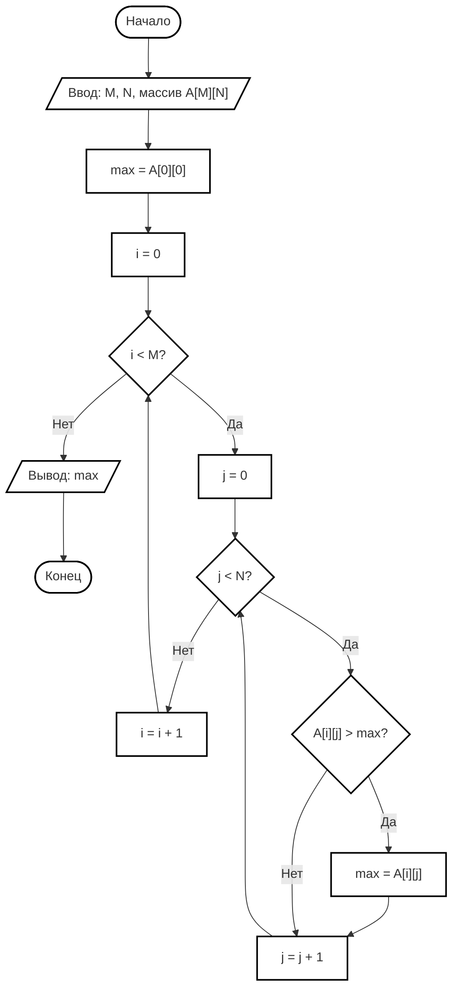
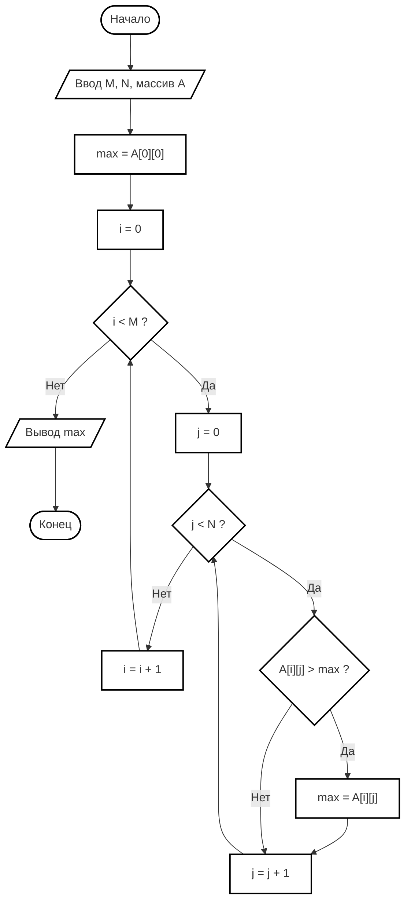

# 📐 Блок-схема по ГОСТ 19.701-90 (ISO 5807-85)  
## «Поиск максимального элемента в двумерном массиве»

---

## 🧾 Расшифровка символов по ГОСТ

| Символ | Название по ГОСТ | Обозначение | Назначение |
|--------|------------------|-------------|------------|
| Терминатор | Пуск/останов | Овал | Начало и конец программы |
| Процесс | Процесс | Прямоугольник | Вычислительное действие |
| Решение | Решение | Ромб | Условный переход (ветвление) |
| Данные | Данные | Параллелограмм | Ввод/вывод данных |
| Предопределённый процесс | Предопределённый процесс | Прямоугольник с вертикальными линиями | Вызов подпрограммы |
| Соединитель | Соединитель | Круг | Переход внутри листа |
| Линия потока | Линия потока | Стрелка | Направление выполнения |

---

## 🔷 Блок-схема (ГОСТ 19.701-70)

---

## 📋 Спецификация символов (по ГОСТ)

| № | Обозначение | Наименование | Пояснение |
|---|-------------|--------------|-----------|
| 1 | Овал | Терминатор | Начало и конец алгоритма |
| 2 | Параллелограмм | Данные | Ввод исходных данных, вывод результата |
| 3 | Прямоугольник | Процесс | Присваивание начальных значений, обновление переменных |
| 4 | Ромб | Решение | Проверка условий (i < M, j < N, сравнение элементов) |
| 5 | Стрелка | Линия потока | Направление передачи управления |

---

## 📐 Вертикальная компоновка (для печати на А4)

---

## 📊 Таблица переменных (по ГОСТ 19.005-85)

| Обозначение | Тип | Назначение |
|-------------|-----|------------|
| M | Целый | Количество строк в массиве |
| N | Целый | Количество столбцов в массиве |
| A | Целый/Вещественный | Двумерный массив |
| i | Целый | Счётчик строк (индекс) |
| j | Целый | Счётчик столбцов (индекс) |
| max | Целый/Вещественный | Максимальный элемент |

---

## 📝 Описание алгоритма (по ГОСТ 19.103-77)

### Входные данные:
- M — количество строк
- N — количество столбцов
- A[M][N] — двумерный массив

### Выходные данные:
- max — максимальный элемент

### Алгоритм:

1. **Начало** алгоритма
2. **Ввод** значений M, N и элементов массива A
3. **Присвоить** max = A[0][0] (первый элемент)
4. **Установить** i = 0
5. **Проверить** условие i < M:
   - Если НЕТ → перейти к шагу 11
   - Если ДА → перейти к шагу 6
6. **Установить** j = 0
7. **Проверить** условие j < N:
   - Если НЕТ → увеличить i на 1, перейти к шагу 5
   - Если ДА → перейти к шагу 8
8. **Проверить** условие A[i][j] > max:
   - Если НЕТ → перейти к шагу 10
   - Если ДА → перейти к шагу 9
9. **Присвоить** max = A[i][j]
10. **Увеличить** j на 1, перейти к шагу 7
11. **Вывести** значение max
12. **Конец** алгоритма

---

## 🖨️ Примечания для оформления по ГОСТ

| Требование | Рекомендация |
|------------|--------------|
| **Формат листа** | А4 (210 × 297 мм) |
| **Ориентация** | Книжная или альбомная |
| **Размер символов** | Высота текста не менее 3.5 мм |
| **Толщина линий** | 0.5–1.0 мм |
| **Шрифт** | Times New Roman (ГОСТ Р 7.0.97-2016) |
| **Межстрочный интервал** | 1.15–1.5 |
| **Цвет** | Чёрно-белый (цвет только для презентаций) |

---

📜 **Лицензия:** CC BY-NC-SA 4.0  
👨‍🏫 **Автор:** Руслан Ринатович Сафиулин  
📅 **Дата:** 29.05.2026
